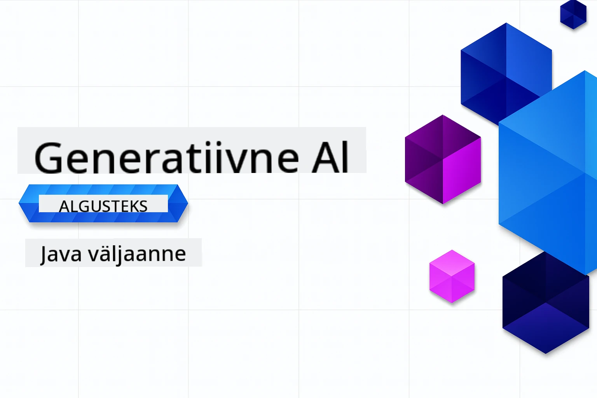

# Generatiivne tehisintellekt algajatele - Java väljaanne
[](https://discord.gg/nTYy5BXMWG)



**Ajakulu**: Kogu töötuba saab lõpule viia veebis ilma kohaliku seadistamiseta. Keskkonna seadistamine võtab 2 minutit, proovitükkidega tutvumine nõuab 1–3 tundi sõltuvalt uurimissügavusest.

> **Kiirstart** 

1. Tehke sellest hoidlast oma GitHubi kontol forkk
2. Klõpsake **Code** → **Codespaces** vahekaart → **...** → **New with options...**
3. Kasutage vaikeseadeid – see valib arenduskonteineri, mis selle kursuse jaoks loodud on
4. Klõpsake **Create codespace**
5. Oodake ~2 minutit, kuni keskkond on valmis
6. Minge otse lehele [Esimene näide](./02-SetupDevEnvironment/README.md#step-2-create-a-github-personal-access-token)

## Mitmekeelne tugi

### Toetatud GitHub Actioni kaudu (automaatselt ja alati ajakohane)

<!-- CO-OP TRANSLATOR LANGUAGES TABLE START -->
[Araabia](../ar/README.md) | [Bengali](../bn/README.md) | [Bulgaaria](../bg/README.md) | [Burma (Myanmar)](../my/README.md) | [Hiina (lihtsustatud)](../zh-CN/README.md) | [Hiina (traditsiooniline, Hongkong)](../zh-HK/README.md) | [Hiina (traditsiooniline, Macao)](../zh-MO/README.md) | [Hiina (traditsiooniline, Taiwan)](../zh-TW/README.md) | [Horvaadi](../hr/README.md) | [Tšehhi](../cs/README.md) | [Taani](../da/README.md) | [Hollandi](../nl/README.md) | [Eesti](./README.md) | [Soome](../fi/README.md) | [Prantsuse](../fr/README.md) | [Saksa](../de/README.md) | [Kreeka](../el/README.md) | [Heebrea](../he/README.md) | [Hindi](../hi/README.md) | [Ungari](../hu/README.md) | [Indoneesia](../id/README.md) | [Itaalia](../it/README.md) | [Jaapani](../ja/README.md) | [Kannada](../kn/README.md) | [Khmeeri](../km/README.md) | [Korea](../ko/README.md) | [Leedu](../lt/README.md) | [Malai](../ms/README.md) | [Malajalami](../ml/README.md) | [Marathi](../mr/README.md) | [Nepali](../ne/README.md) | [Nigeeria pidgin](../pcm/README.md) | [Norra](../no/README.md) | [Pärsia (farsi)](../fa/README.md) | [Poola](../pl/README.md) | [Portugali (Brasiilia)](../pt-BR/README.md) | [Portugali (Portugal)](../pt-PT/README.md) | [Pandžabi (Gurmukhi)](../pa/README.md) | [Rumeenia](../ro/README.md) | [Vene](../ru/README.md) | [Serbia (kirillitsa)](../sr/README.md) | [Slovaki](../sk/README.md) | [Sloveeni](../sl/README.md) | [Hispaania](../es/README.md) | [Suaheli](../sw/README.md) | [Rootsi](../sv/README.md) | [Tagalogi (filipiinide keel)](../tl/README.md) | [Tamili](../ta/README.md) | [Telugu](../te/README.md) | [Tai](../th/README.md) | [Türgi](../tr/README.md) | [Ukraina](../uk/README.md) | [Urdu](../ur/README.md) | [Vietnami](../vi/README.md)

> **Eelistate kloonida lokaalselt?**
>
> See hoidla sisaldab 50+ keele tõlget, mis suurendab oluliselt allalaaditava mahu suurust. Tõlgeteta kloonimiseks kasutage sparsi väljavõtet:
>
> **Bash / macOS / Linux:**
> ```bash
> git clone --filter=blob:none --sparse https://github.com/microsoft/Generative-AI-for-beginners-java.git
> cd Generative-AI-for-beginners-java
> git sparse-checkout set --no-cone '/*' '!translations' '!translated_images'
> ```
>
> **CMD (Windows):**
> ```cmd
> git clone --filter=blob:none --sparse https://github.com/microsoft/Generative-AI-for-beginners-java.git
> cd Generative-AI-for-beginners-java
> git sparse-checkout set --no-cone "/*" "!translations" "!translated_images"
> ```
>
> See annab teile kõik vajaliku kursuse lõpetamiseks palju kiiremalt.
<!-- CO-OP TRANSLATOR LANGUAGES TABLE END -->

## Kursuse ülesehitus ja õppimistee

### **1. peatükk: Sissejuhatus generatiivsesse tehisintellekti**
- **Põhimõisted**: Suurte keelemudelite, tokenite, tähendusesidemete ja tehisintellekti võimaluste mõistmine
- **Java tehisintellekti ökosüsteem**: Ülevaade Spring AI ja OpenAI SDK-dest
- **Mudeli konteksti protokoll**: MCP tutvustus ja selle roll AI agentide suhtluses
- **Praktilised rakendused**: Reaalelulised stsenaariumid, sealhulgas vestlusrobotid ja sisuloomine
- **[→ Alusta 1. peatükki](./01-IntroToGenAI/README.md)**

### **2. peatükk: Arenduskeskkonna seadistamine**
- **Mitme pakkuja konfiguratsioon**: GitHubi mudelite, Azure OpenAI ja OpenAI Java SDK integreerimise seadistamine
- **Spring Boot + Spring AI**: Parimad tavad ettevõtte AI-rakenduste arendamiseks
- **GitHub Mudelid**: Tasuta AI mudelite ligipääs prototüüpimiseks ja õppimiseks (ilma krediitkaardita)
- **Arendusvahendid**: Docker-konteinerid, VS Code ja GitHub Codespaces konfigureerimine
- **[→ Alusta 2. peatükki](./02-SetupDevEnvironment/README.md)**

### **3. peatükk: Generatiivse tehisintellekti põhitehnikad**
- **Prompti inseneritehnika**: Optimaalsete AI mudeli vastuste loomise võtted
- **Tähendusesidemed ja vektorite toimingud**: Semantilise otsingu ja sarnasuse sobitamise rakendamine
- **Andmete täiendusega genereerimine (RAG)**: AI ühendamine oma andmeallikatega
- **Funktsioonikõned**: AI võimaluste laiendamine kohandatud tööriistade ja pluginatega
- **[→ Alusta 3. peatükki](./03-CoreGenerativeAITechniques/README.md)**

### **4. peatükk: Praktilised rakendused ja projektid**
- **Lemmikloomalugude generaator** (`petstory/`): Loov sisuloomine GitHubi mudelitega
- **Foundry kohalik demonstreerimine** (`foundrylocal/`): Kohalik AI mudeli integratsioon OpenAI Java SDK-ga
- **MCP kalkulaatori teenus** (`calculator/`): Mudeli konteksti protokolli põhiteostus Spring AI abil
- **[→ Alusta 4. peatükki](./04-PracticalSamples/README.md)**

### **5. peatükk: Vastutustundlik AI arendus**
- **GitHubi mudelite turvalisus**: Sisseehitatud sisu filtreerimise ja turvamehhanismide testimine (kõvade plokkide ja pehmete keeldude abil)
- **Vastutustundliku AI demoesitlus**: Käed-külge näide, kuidas kaasaegsed AI turvasüsteemid praktikas toimivad
- **Parimad tavad**: Olulised juhised eetiliseks AI arendamiseks ja kasutuselevõtuks
- **[→ Alusta 5. peatükki](./05-ResponsibleGenAI/README.md)**

## Täiendavad ressursid

<!-- CO-OP TRANSLATOR OTHER COURSES START -->
### LangChain
[](https://aka.ms/langchain4j-for-beginners)
[](https://aka.ms/langchainjs-for-beginners?WT.mc_id=m365-94501-dwahlin)
[](https://github.com/microsoft/langchain-for-beginners?WT.mc_id=m365-94501-dwahlin)
---

### Azure / Edge / MCP / Agendid
[](https://github.com/microsoft/AZD-for-beginners?WT.mc_id=academic-105485-koreyst)
[](https://github.com/microsoft/edgeai-for-beginners?WT.mc_id=academic-105485-koreyst)
[](https://github.com/microsoft/mcp-for-beginners?WT.mc_id=academic-105485-koreyst)
[](https://github.com/microsoft/ai-agents-for-beginners?WT.mc_id=academic-105485-koreyst)

---
 
### Generatiivse AI sari
[](https://github.com/microsoft/generative-ai-for-beginners?WT.mc_id=academic-105485-koreyst)
[-9333EA?style=for-the-badge&labelColor=E5E7EB&color=9333EA)](https://github.com/microsoft/Generative-AI-for-beginners-dotnet?WT.mc_id=academic-105485-koreyst)
[-C084FC?style=for-the-badge&labelColor=E5E7EB&color=C084FC)](https://github.com/microsoft/generative-ai-for-beginners-java?WT.mc_id=academic-105485-koreyst)
[-E879F9?style=for-the-badge&labelColor=E5E7EB&color=E879F9)](https://github.com/microsoft/generative-ai-with-javascript?WT.mc_id=academic-105485-koreyst)

---
 
### Põhiõpe
[](https://aka.ms/ml-beginners?WT.mc_id=academic-105485-koreyst)
[](https://aka.ms/datascience-beginners?WT.mc_id=academic-105485-koreyst)
[](https://aka.ms/ai-beginners?WT.mc_id=academic-105485-koreyst)
[](https://github.com/microsoft/Security-101?WT.mc_id=academic-96948-sayoung)
[](https://aka.ms/webdev-beginners?WT.mc_id=academic-105485-koreyst)
[](https://aka.ms/iot-beginners?WT.mc_id=academic-105485-koreyst)
[](https://github.com/microsoft/xr-development-for-beginners?WT.mc_id=academic-105485-koreyst)

---

### Copiloti sari
[](https://aka.ms/GitHubCopilotAI?WT.mc_id=academic-105485-koreyst)
[](https://github.com/microsoft/mastering-github-copilot-for-dotnet-csharp-developers?WT.mc_id=academic-105485-koreyst)
[](https://github.com/microsoft/CopilotAdventures?WT.mc_id=academic-105485-koreyst)
<!-- CO-OP TRANSLATOR OTHER COURSES END -->

## Abi saamine

Kui jääd kinni või sul on küsimusi AI rakenduste loomise kohta, liitu teiste õppijate ja kogenud arendajatega MCP aruteludes. See on toetav kogukond, kus küsimused on oodatud ja teadmisi jagatakse vabalt.

[](https://discord.gg/nTYy5BXMWG)

Kui sul on toodete tagasisidet või ehitamise ajal vigu, külasta:

[](https://aka.ms/foundry/forum)

---

<!-- CO-OP TRANSLATOR DISCLAIMER START -->
**Vastutusest loobumine**:  
See dokument on tõlgitud AI tõlketeenuse [Co-op Translator](https://github.com/Azure/co-op-translator) abil. Kuigi püüame tagada täpsust, palun arvestage, et automatiseeritud tõlked võivad sisaldada vigu või ebatäpsusi. Originaaldokument selle emakeeles tuleks pidada autoriteetseks allikaks. Olulise teabe puhul soovitatakse kasutada professionaalset inimtõlget. Me ei vastuta ühegi arusaamatuse ega valesti mõistmise eest, mis võivad tekkida selle tõlke kasutamisest.
<!-- CO-OP TRANSLATOR DISCLAIMER END -->