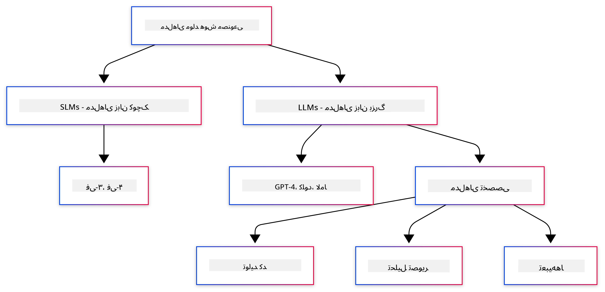
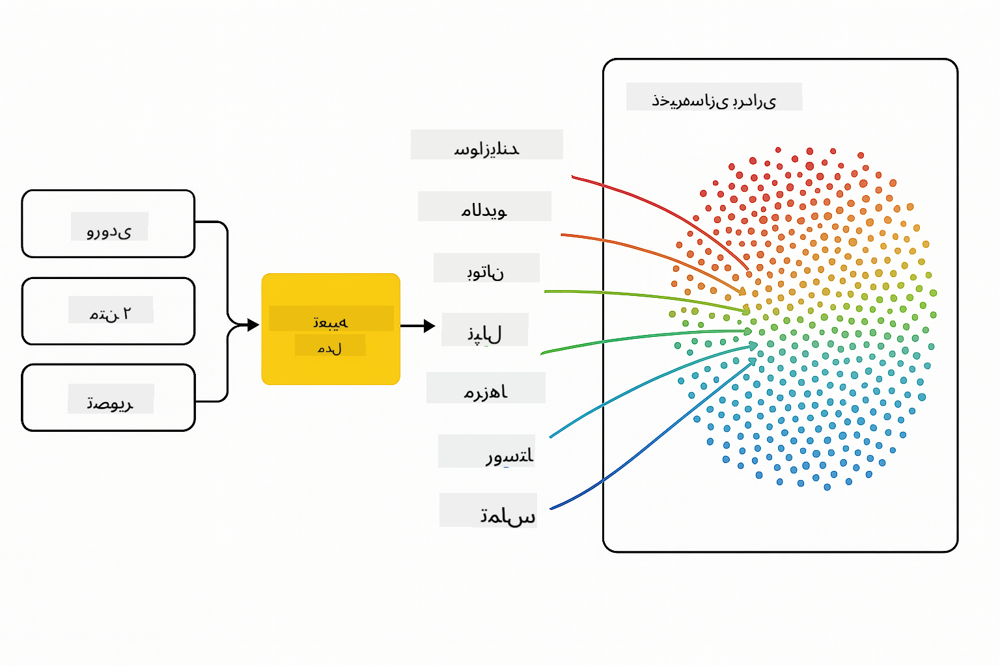
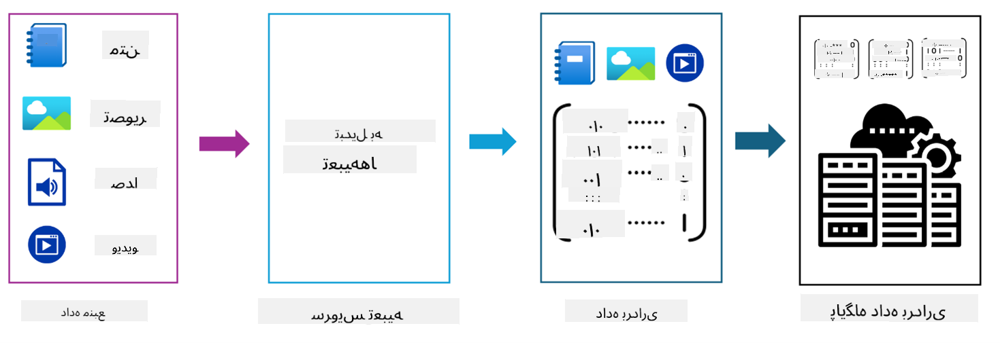

<!--
CO_OP_TRANSLATOR_METADATA:
{
  "original_hash": "6d8b4a0d774dc2a1e97c95859a6d6e4b",
  "translation_date": "2025-07-21T17:02:48+00:00",
  "source_file": "01-IntroToGenAI/README.md",
  "language_code": "fa"
}
-->
# مقدمه‌ای بر هوش مصنوعی مولد - نسخه جاوا

## آنچه خواهید آموخت

- **مبانی هوش مصنوعی مولد** شامل مدل‌های زبان بزرگ (LLMs)، مهندسی درخواست، توکن‌ها، تعبیه‌ها و پایگاه‌های داده برداری
- **مقایسه ابزارهای توسعه هوش مصنوعی در جاوا** شامل Azure OpenAI SDK، Spring AI و OpenAI Java SDK
- **آشنایی با پروتکل زمینه مدل** و نقش آن در ارتباط عوامل هوش مصنوعی

## فهرست مطالب

- [مقدمه](../../../01-IntroToGenAI)
- [مروری سریع بر مفاهیم هوش مصنوعی مولد](../../../01-IntroToGenAI)
- [بررسی مهندسی درخواست](../../../01-IntroToGenAI)
- [توکن‌ها، تعبیه‌ها و عوامل](../../../01-IntroToGenAI)
- [ابزارها و کتابخانه‌های توسعه هوش مصنوعی برای جاوا](../../../01-IntroToGenAI)
  - [OpenAI Java SDK](../../../01-IntroToGenAI)
  - [Spring AI](../../../01-IntroToGenAI)
  - [Azure OpenAI Java SDK](../../../01-IntroToGenAI)
- [خلاصه](../../../01-IntroToGenAI)
- [گام‌های بعدی](../../../01-IntroToGenAI)

## مقدمه

به اولین فصل از دوره هوش مصنوعی مولد برای مبتدیان - نسخه جاوا خوش آمدید! این درس پایه‌ای شما را با مفاهیم اصلی هوش مصنوعی مولد و نحوه کار با آن‌ها با استفاده از جاوا آشنا می‌کند. شما با اجزای اصلی برنامه‌های هوش مصنوعی، شامل مدل‌های زبان بزرگ (LLMs)، توکن‌ها، تعبیه‌ها و عوامل هوش مصنوعی آشنا خواهید شد. همچنین ابزارهای اصلی جاوا که در طول این دوره استفاده خواهید کرد را بررسی خواهیم کرد.

### مروری سریع بر مفاهیم هوش مصنوعی مولد

هوش مصنوعی مولد نوعی از هوش مصنوعی است که محتوای جدیدی مانند متن، تصاویر یا کد را بر اساس الگوها و روابطی که از داده‌ها یاد گرفته است، ایجاد می‌کند. مدل‌های هوش مصنوعی مولد می‌توانند پاسخ‌های مشابه انسان تولید کنند، زمینه را درک کنند و گاهی محتوایی ایجاد کنند که شبیه به انسان به نظر می‌رسد.

هنگام توسعه برنامه‌های هوش مصنوعی جاوا، شما با **مدل‌های هوش مصنوعی مولد** برای ایجاد محتوا کار خواهید کرد. برخی از قابلیت‌های مدل‌های هوش مصنوعی مولد شامل موارد زیر است:

- **تولید متن**: ایجاد متن مشابه انسان برای چت‌بات‌ها، محتوا و تکمیل متن.
- **تولید و تحلیل تصویر**: تولید تصاویر واقعی، بهبود عکس‌ها و شناسایی اشیاء.
- **تولید کد**: نوشتن قطعات کد یا اسکریپت‌ها.

مدل‌های خاصی برای وظایف مختلف بهینه شده‌اند. به عنوان مثال، هم **مدل‌های زبان کوچک (SLMs)** و هم **مدل‌های زبان بزرگ (LLMs)** می‌توانند تولید متن را انجام دهند، با این تفاوت که LLM‌ها معمولاً عملکرد بهتری برای وظایف پیچیده ارائه می‌دهند. برای وظایف مرتبط با تصویر، از مدل‌های تخصصی بینایی یا مدل‌های چند‌وجهی استفاده می‌شود.

البته، پاسخ‌های این مدل‌ها همیشه کامل نیستند. احتمالاً شنیده‌اید که مدل‌ها "توهم" دارند یا اطلاعات نادرستی را به صورت معتبر تولید می‌کنند. اما شما می‌توانید با ارائه دستورالعمل‌ها و زمینه‌های واضح به مدل، به تولید پاسخ‌های بهتر کمک کنید. اینجاست که **مهندسی درخواست** وارد عمل می‌شود.

#### بررسی مهندسی درخواست

مهندسی درخواست، هنر طراحی ورودی‌های مؤثر برای هدایت مدل‌های هوش مصنوعی به سمت خروجی‌های مطلوب است. این شامل موارد زیر می‌شود:

- **وضوح**: واضح و بدون ابهام کردن دستورالعمل‌ها.
- **زمینه**: ارائه اطلاعات پس‌زمینه لازم.
- **محدودیت‌ها**: مشخص کردن هرگونه محدودیت یا قالب.

برخی از بهترین روش‌ها برای مهندسی درخواست شامل طراحی درخواست، دستورالعمل‌های واضح، تقسیم وظایف، یادگیری تک‌نمونه‌ای و چند‌نمونه‌ای، و تنظیم درخواست هستند. آزمایش درخواست‌های مختلف برای یافتن بهترین روش برای مورد استفاده خاص شما ضروری است.

هنگام توسعه برنامه‌ها، شما با انواع مختلف درخواست‌ها کار خواهید کرد:
- **درخواست‌های سیستمی**: قوانین پایه و زمینه رفتار مدل را تنظیم می‌کنند.
- **درخواست‌های کاربر**: داده‌های ورودی از کاربران برنامه شما.
- **درخواست‌های دستیار**: پاسخ‌های مدل بر اساس درخواست‌های سیستمی و کاربر.

> **بیشتر بیاموزید**: اطلاعات بیشتر درباره مهندسی درخواست در [فصل مهندسی درخواست دوره GenAI برای مبتدیان](https://github.com/microsoft/generative-ai-for-beginners/tree/main/04-prompt-engineering-fundamentals)

#### توکن‌ها، تعبیه‌ها و عوامل

هنگام کار با مدل‌های هوش مصنوعی مولد، با اصطلاحاتی مانند **توکن‌ها**، **تعبیه‌ها**، **عوامل** و **پروتکل زمینه مدل (MCP)** مواجه خواهید شد. در اینجا یک مرور کلی از این مفاهیم ارائه شده است:

- **توکن‌ها**: توکن‌ها کوچک‌ترین واحد متن در یک مدل هستند. آن‌ها می‌توانند کلمات، کاراکترها یا زیرکلمات باشند. توکن‌ها برای نمایش داده‌های متنی در قالبی که مدل بتواند درک کند استفاده می‌شوند. به عنوان مثال، جمله "The quick brown fox jumped over the lazy dog" ممکن است به صورت ["The", " quick", " brown", " fox", " jumped", " over", " the", " lazy", " dog"] یا ["The", " qu", "ick", " br", "own", " fox", " jump", "ed", " over", " the", " la", "zy", " dog"] بسته به استراتژی توکن‌سازی تقسیم شود.

توکن‌سازی فرآیند تقسیم متن به این واحدهای کوچک‌تر است. این امر حیاتی است زیرا مدل‌ها بر اساس توکن‌ها عمل می‌کنند نه متن خام. تعداد توکن‌ها در یک درخواست بر طول و کیفیت پاسخ مدل تأثیر می‌گذارد، زیرا مدل‌ها محدودیت توکن برای پنجره زمینه خود دارند (مثلاً 128K توکن برای کل زمینه GPT-4o شامل ورودی و خروجی).

در جاوا، می‌توانید از کتابخانه‌هایی مانند OpenAI SDK برای مدیریت خودکار توکن‌سازی هنگام ارسال درخواست‌ها به مدل‌های هوش مصنوعی استفاده کنید.

- **تعبیه‌ها**: تعبیه‌ها نمایش‌های برداری توکن‌ها هستند که معنای معنایی را ثبت می‌کنند. آن‌ها نمایش‌های عددی (معمولاً آرایه‌هایی از اعداد اعشاری) هستند که به مدل‌ها اجازه می‌دهند روابط بین کلمات را درک کنند و پاسخ‌های مرتبط با زمینه تولید کنند. کلمات مشابه تعبیه‌های مشابهی دارند، که به مدل امکان درک مفاهیمی مانند مترادف‌ها و روابط معنایی را می‌دهد.

در جاوا، می‌توانید تعبیه‌ها را با استفاده از OpenAI SDK یا کتابخانه‌های دیگر که از تولید تعبیه‌ها پشتیبانی می‌کنند، ایجاد کنید. این تعبیه‌ها برای وظایفی مانند جستجوی معنایی ضروری هستند، جایی که می‌خواهید محتوای مشابه را بر اساس معنا پیدا کنید نه تطابق دقیق متن.

- **پایگاه‌های داده برداری**: پایگاه‌های داده برداری سیستم‌های ذخیره‌سازی تخصصی هستند که برای تعبیه‌ها بهینه شده‌اند. آن‌ها امکان جستجوی شباهت کارآمد را فراهم می‌کنند و برای الگوهای تولید مبتنی بر بازیابی (RAG) که نیاز به یافتن اطلاعات مرتبط از مجموعه داده‌های بزرگ بر اساس شباهت معنایی دارند، حیاتی هستند.

> **توجه**: در این دوره، پایگاه‌های داده برداری را پوشش نمی‌دهیم اما فکر می‌کنیم ارزش ذکر دارند زیرا در برنامه‌های واقعی معمولاً استفاده می‌شوند.

- **عوامل و MCP**: اجزای هوش مصنوعی که به طور خودکار با مدل‌ها، ابزارها و سیستم‌های خارجی تعامل دارند. پروتکل زمینه مدل (MCP) راهی استاندارد برای عوامل فراهم می‌کند تا به منابع داده خارجی و ابزارها به صورت امن دسترسی پیدا کنند. اطلاعات بیشتر در دوره [MCP برای مبتدیان](https://github.com/microsoft/mcp-for-beginners) موجود است.

در برنامه‌های هوش مصنوعی جاوا، شما از توکن‌ها برای پردازش متن، تعبیه‌ها برای جستجوی معنایی و RAG، پایگاه‌های داده برداری برای بازیابی داده‌ها، و عوامل با MCP برای ساخت سیستم‌های هوشمند و ابزارمحور استفاده خواهید کرد.

### ابزارها و کتابخانه‌های توسعه هوش مصنوعی برای جاوا

جاوا ابزارهای عالی برای توسعه هوش مصنوعی ارائه می‌دهد. سه کتابخانه اصلی وجود دارد که در طول این دوره بررسی خواهیم کرد - OpenAI Java SDK، Azure OpenAI SDK و Spring AI.

در اینجا یک جدول مرجع سریع نشان می‌دهد که کدام SDK در مثال‌های هر فصل استفاده شده است:

| فصل | نمونه | SDK |
|---------|--------|-----|
| 02-SetupDevEnvironment | src/github-models/ | OpenAI Java SDK |
| 02-SetupDevEnvironment | src/basic-chat-azure/ | Spring AI Azure OpenAI |
| 03-CoreGenerativeAITechniques | examples/ | Azure OpenAI SDK |
| 04-PracticalSamples | petstory/ | OpenAI Java SDK |
| 04-PracticalSamples | foundrylocal/ | OpenAI Java SDK |
| 04-PracticalSamples | mcp/calculator/ | Spring AI MCP SDK + LangChain4j |

**لینک‌های مستندات SDK:**
- [Azure OpenAI Java SDK](https://github.com/Azure/azure-sdk-for-java/tree/azure-ai-openai_1.0.0-beta.16/sdk/openai/azure-ai-openai)
- [Spring AI](https://docs.spring.io/spring-ai/reference/)
- [OpenAI Java SDK](https://github.com/openai/openai-java)
- [LangChain4j](https://docs.langchain4j.dev/)

#### OpenAI Java SDK

OpenAI SDK کتابخانه رسمی جاوا برای API OpenAI است. این کتابخانه یک رابط ساده و سازگار برای تعامل با مدل‌های OpenAI فراهم می‌کند و ادغام قابلیت‌های هوش مصنوعی در برنامه‌های جاوا را آسان می‌کند. مثال GitHub Models در فصل 2، برنامه Pet Story در فصل 4 و مثال Foundry Local روش OpenAI SDK را نشان می‌دهند.

#### Spring AI

Spring AI یک چارچوب جامع است که قابلیت‌های هوش مصنوعی را به برنامه‌های Spring می‌آورد و یک لایه انتزاعی سازگار در میان ارائه‌دهندگان مختلف هوش مصنوعی فراهم می‌کند. این چارچوب به طور یکپارچه با اکوسیستم Spring ادغام می‌شود و انتخاب ایده‌آلی برای برنامه‌های جاوای سازمانی است که به قابلیت‌های هوش مصنوعی نیاز دارند.

قدرت Spring AI در ادغام یکپارچه با اکوسیستم Spring نهفته است، که ساخت برنامه‌های هوش مصنوعی آماده تولید را با الگوهای آشنای Spring مانند تزریق وابستگی، مدیریت پیکربندی و چارچوب‌های تست آسان می‌کند. شما در فصل 2 و 4 از Spring AI برای ساخت برنامه‌هایی که از کتابخانه‌های OpenAI و پروتکل زمینه مدل (MCP) Spring AI استفاده می‌کنند، بهره خواهید برد.

##### پروتکل زمینه مدل (MCP)

[پروتکل زمینه مدل (MCP)](https://modelcontextprotocol.io/) یک استاندارد نوظهور است که به برنامه‌های هوش مصنوعی امکان تعامل امن با منابع داده خارجی و ابزارها را می‌دهد. MCP راهی استاندارد برای مدل‌های هوش مصنوعی فراهم می‌کند تا به اطلاعات زمینه‌ای دسترسی پیدا کنند و اقدامات را در برنامه‌های شما اجرا کنند.

در فصل 4، شما یک سرویس ماشین‌حساب MCP ساده خواهید ساخت که اصول پروتکل زمینه مدل را با Spring AI نشان می‌دهد و نحوه ایجاد ادغام‌های ابزار پایه و معماری‌های خدمات را نشان می‌دهد.

#### Azure OpenAI Java SDK

کتابخانه مشتری Azure OpenAI برای جاوا یک اقتباس از API‌های REST OpenAI است که یک رابط بومی و ادغام با بقیه اکوسیستم Azure SDK فراهم می‌کند. در فصل 3، شما برنامه‌هایی با استفاده از Azure OpenAI SDK خواهید ساخت، از جمله برنامه‌های چت، فراخوانی توابع و الگوهای تولید مبتنی بر بازیابی (RAG).

> توجه: Azure OpenAI SDK نسبت به OpenAI Java SDK از نظر ویژگی‌ها عقب‌تر است، بنابراین برای پروژه‌های آینده، استفاده از OpenAI Java SDK را در نظر بگیرید.

## خلاصه

**تبریک می‌گوییم!** شما با موفقیت:

- **با مبانی هوش مصنوعی مولد آشنا شدید** شامل LLM‌ها، مهندسی درخواست، توکن‌ها، تعبیه‌ها و پایگاه‌های داده برداری
- **ابزارهای توسعه هوش مصنوعی در جاوا را مقایسه کردید** شامل Azure OpenAI SDK، Spring AI و OpenAI Java SDK
- **با پروتکل زمینه مدل آشنا شدید** و نقش آن در ارتباط عوامل هوش مصنوعی

## گام‌های بعدی

[فصل 2: تنظیم محیط توسعه](../02-SetupDevEnvironment/README.md)

**سلب مسئولیت**:  
این سند با استفاده از سرویس ترجمه هوش مصنوعی [Co-op Translator](https://github.com/Azure/co-op-translator) ترجمه شده است. در حالی که ما تلاش می‌کنیم دقت را حفظ کنیم، لطفاً توجه داشته باشید که ترجمه‌های خودکار ممکن است شامل خطاها یا نادرستی‌ها باشند. سند اصلی به زبان اصلی آن باید به عنوان منبع معتبر در نظر گرفته شود. برای اطلاعات حساس، توصیه می‌شود از ترجمه حرفه‌ای انسانی استفاده کنید. ما مسئولیتی در قبال سوء تفاهم‌ها یا تفسیرهای نادرست ناشی از استفاده از این ترجمه نداریم.