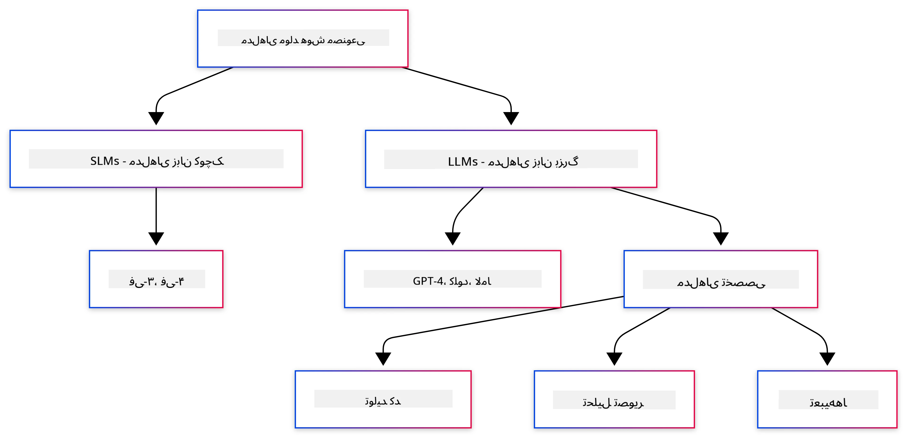
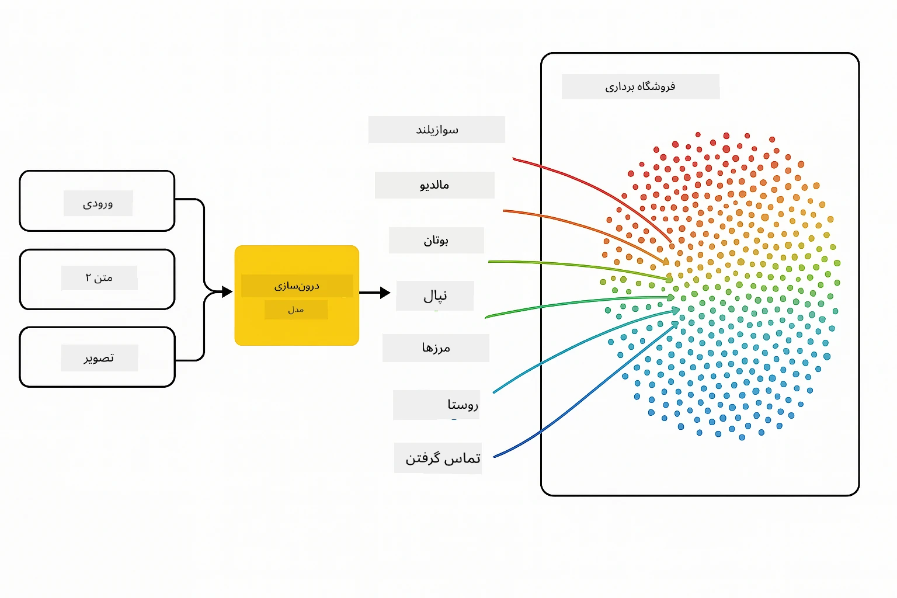
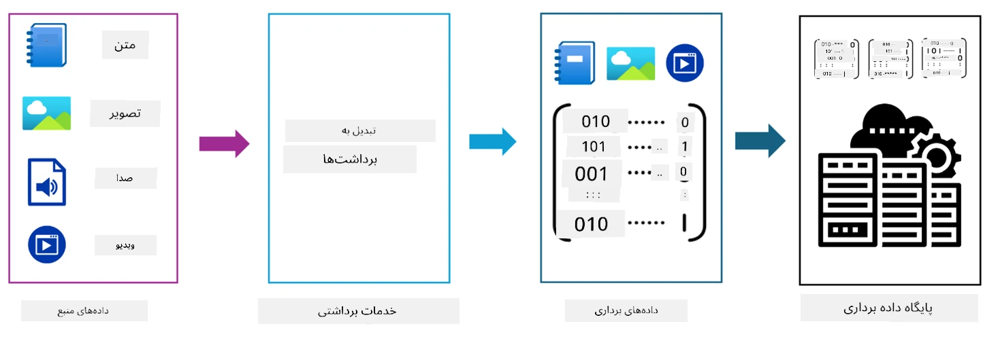
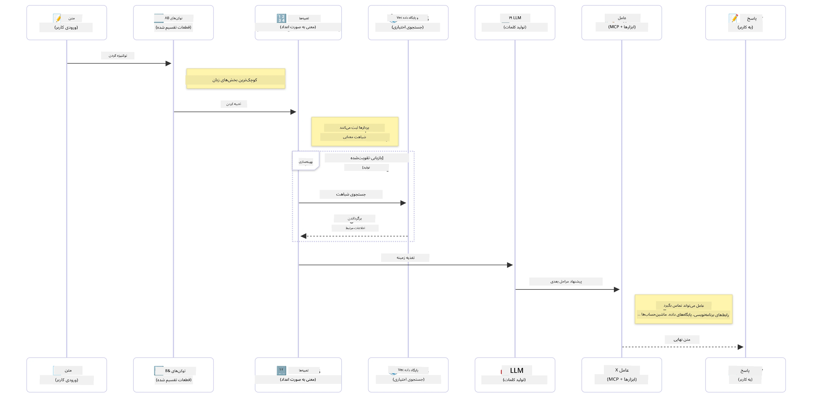

# مقدمه‌ای بر هوش مصنوعی مولد - نسخه جاوا

> **ویدئو**: [ویدئوی مروری برای این درس را در یوتیوب ببینید.](https://www.youtube.com/watch?v=XH46tGp_eSw) همچنین می‌توانید روی تصویر بندانگشتی بالا کلیک کنید.

## آنچه خواهید آموخت

- **مبانی هوش مصنوعی مولد** شامل مدل‌های زبان بزرگ (LLMs)، مهندسی پرامپت، توکن‌ها، جاسازی‌ها و پایگاه‌های داده برداری
- **مقایسه ابزارهای توسعه هوش مصنوعی جاوا** شامل Azure OpenAI SDK، Spring AI و OpenAI Java SDK
- **آشنایی با پروتکل زمینه مدل (Model Context Protocol)** و نقش آن در ارتباط عامل‌های هوش مصنوعی

## فهرست مطالب

- [مقدمه](#مقدمه)
- [مروری سریع بر مفاهیم هوش مصنوعی مولد](#مروری-سریع-بر-مفاهیم-هوش-مصنوعی-مولد)
- [بررسی مهندسی پرامپت](#بررسی-مهندسی-پرامپت)
- [توکن‌ها، جاسازی‌ها و عامل‌ها](#توکن‌ها،-جاسازی‌ها-و-عامل‌ها)
- [ابزارها و کتابخانه‌های توسعه هوش مصنوعی برای جاوا](#ابزارها-و-کتابخانه‌های-توسعه-هوش-مصنوعی-برای-جاوا)
  - [OpenAI Java SDK](#openai-java-sdk)
  - [Spring AI](#spring-ai)
  - [Azure OpenAI Java SDK](#azure-openai-java-sdk)
- [خلاصه](#خلاصه)
- [گام‌های بعدی](#گام‌های-بعدی)

## مقدمه

به اولین فصل دوره هوش مصنوعی مولد برای مبتدیان - نسخه جاوا خوش آمدید! این درس پایه‌ای شما را با مفاهیم اصلی هوش مصنوعی مولد و نحوه استفاده از آن‌ها با جاوا آشنا می‌کند. شما با بلوک‌های ساختمانی ضروری برنامه‌های هوش مصنوعی، از جمله مدل‌های زبان بزرگ (LLMs)، توکن‌ها، جاسازی‌ها و عامل‌های هوش مصنوعی آشنا خواهید شد. همچنین با ابزارهای اصلی جاوایی که در طول این دوره استفاده خواهید کرد، آشنا می‌شویم.

### مروری سریع بر مفاهیم هوش مصنوعی مولد

هوش مصنوعی مولد نوعی از هوش مصنوعی است که محتوای جدیدی مانند متن، تصویر یا کد را بر اساس الگوها و روابط آموخته شده از داده‌ها ایجاد می‌کند. مدل‌های هوش مصنوعی مولد می‌توانند پاسخ‌های شبیه به انسان تولید کنند، بافت را درک کنند و گاهی حتی محتوایی بسازند که ظاهراً مانند محتوای انسانی است.

وقتی برنامه‌های هوش مصنوعی جاوای خود را توسعه می‌دهید، با **مدل‌های هوش مصنوعی مولد** برای تولید محتوا کار خواهید کرد. برخی قابلیت‌های مدل‌های مولد عبارتند از:

- **تولید متن**: ایجاد متنی شبیه انسان برای چت‌بات‌ها، محتوا و تکمیل متن.
- **تولید و تحلیل تصویر**: تولید تصاویر واقعی، بهبود عکس‌ها و شناسایی اشیاء.
- **تولید کد**: نوشتن قطعات کد یا اسکریپت‌ها.

انواع خاصی از مدل‌ها برای وظایف مختلف بهینه شده‌اند. برای مثال، هم **مدل‌های زبان کوچک (SLMs)** و هم **مدل‌های زبان بزرگ (LLMs)** می‌توانند تولید متن انجام دهند، اما LLMها معمولاً برای وظایف پیچیده‌تر عملکرد بهتری دارند. برای وظایف مرتبط با تصویر، معمولاً از مدل‌های تخصصی دیداری یا مدل‌های چندرسانه‌ای استفاده می‌شود.

البته پاسخ‌های این مدل‌ها همیشه کامل نیستند. احتمالاً شنیده‌اید که مدل‌ها اصطلاحاً "توهم می‌زنند" یا اطلاعات نادرست را به صورت authoritative تولید می‌کنند. اما می‌توانید با دادن دستورالعمل‌ها و زمینه واضح به مدل، آن را در تولید پاسخ‌های بهتر راهنمایی کنید. اینجاست که **مهندسی پرامپت** وارد می‌شود.

#### بررسی مهندسی پرامپت

مهندسی پرامپت عبارت است از طراحی ورودی‌های مؤثر برای هدایت مدل‌های هوش مصنوعی به سوی خروجی‌های مطلوب. این کار شامل موارد زیر است:

- **وضوح**: واضح و بدون ابهام بودن دستورالعمل‌ها.
- **زمینه**: ارائه اطلاعات پس‌زمینه ضروری.
- **محدودیت‌ها**: مشخص کردن هرگونه محدودیت یا قالب‌بندی.

برخی بهترین شیوه‌ها در مهندسی پرامپت شامل طراحی پرامپت، دستورالعمل‌های واضح، شکستن کار به بخش‌های کوچکتر، یادگیری یک‌باره و چندباره، و تنظیم پرامپت است. آزمایش پرامپت‌های مختلف برای پیدا کردن بهترین حالت برای کاربرد خاص شما ضروری است.

هنگام توسعه برنامه‌ها، با انواع مختلف پرامپت‌ها کار خواهید کرد:
- **پرامپت‌های سیستم**: قوانین پایه و زمینه رفتار مدل را تعیین می‌کنند
- **پرامپت‌های کاربر**: داده‌های ورودی از کاربران برنامه شما
- **پرامپت‌های دستیار**: پاسخ‌های مدل بر اساس پرامپت‌های سیستم و کاربر

> **بیشتر بدانید**: برای یادگیری بیشتر درباره مهندسی پرامپت به [فصل مهندسی پرامپت در دوره GenAI برای مبتدیان](https://github.com/microsoft/generative-ai-for-beginners/tree/main/04-prompt-engineering-fundamentals) مراجعه کنید.

#### توکن‌ها، جاسازی‌ها و عامل‌ها

در کار با مدل‌های هوش مصنوعی مولد، با اصطلاحاتی مانند **توکن‌ها**، **جاسازی‌ها**، **عامل‌ها** و **پروتکل زمینه مدل (MCP)** مواجه خواهید شد. در اینجا مروری دقیق بر این مفاهیم آمده است:

- **توکن‌ها**: توکن‌ها کوچک‌ترین واحد متن در یک مدل هستند. آن‌ها می‌توانند کلمات، کاراکترها یا زیرکلمات باشند. توکن‌ها برای نمایش داده‌های متنی در قالبی که مدل بتواند درک کند، استفاده می‌شوند. برای مثال، جمله "The quick brown fox jumped over the lazy dog" ممکن است به شکل ["The", " quick", " brown", " fox", " jumped", " over", " the", " lazy", " dog"] یا ["The", " qu", "ick", " br", "own", " fox", " jump", "ed", " over", " the", " la", "zy", " dog"] بسته به استراتژی توکنیزه شدن تقسیم شود.

توکنیزه کردن فرآیند تبدیل متن به این واحدهای کوچک‌تر است. این موضوع حیاتی است زیرا مدل‌ها روی توکن‌ها عمل می‌کنند نه متن خام. تعداد توکن‌ها در یک پرامپت بر طول و کیفیت پاسخ مدل تأثیر می‌گذارد، چرا که مدل‌ها محدودیت توکن برای پنجره زمینه خود دارند (مثلاً برای کل زمینه GPT-4o حدود 128K توکن، شامل ورودی و خروجی).

  در جاوا، می‌توانید از کتابخانه‌هایی مانند OpenAI SDK برای توکنیزه کردن خودکار هنگام ارسال درخواست‌ها به مدل‌های هوش مصنوعی استفاده کنید.

- **جاسازی‌ها**: جاسازی‌ها نمایش‌های برداری از توکن‌ها هستند که معنی معنایی را در بر می‌گیرند. آن‌ها نمایش‌های عددی (معمولاً آرایه‌هایی از اعداد اعشاری) هستند که به مدل اجازه می‌دهند روابط بین کلمات را درک کرده و پاسخ‌های مرتبط با زمینه را تولید کنند. کلمات مشابه دارای جاسازی‌های مشابهی هستند، که به مدل کمک می‌کند مفاهیمی مانند مترادف‌ها و روابط معنایی را درک کند.

  در جاوا، می‌توانید با استفاده از OpenAI SDK یا سایر کتابخانه‌هایی که تولید جاسازی را پشتیبانی می‌کنند، جاسازی تولید کنید. این جاسازی‌ها برای وظایفی مانند جستجوی معنایی بسیار ضروری هستند، جایی که می‌خواهید محتوای مشابه را بر اساس معنی بیابید نه تطابق دقیق متن.

- **پایگاه‌های داده برداری**: پایگاه‌های داده برداری سیستم‌های ذخیره‌سازی تخصصی هستند که برای جاسازی‌ها بهینه شده‌اند. آن‌ها امکان جستجوی شباهت مؤثر را فراهم می‌کنند و برای الگوهای بازیابی تقویت شده با تولید (RAG) مهم هستند، جایی که باید اطلاعات مرتبط را از مجموعه داده‌های بزرگ بر اساس شباهت معنایی پیدا کنید نه تطابق دقیق.

> **تذکر**: در این دوره، پایگاه‌های داده برداری را پوشش نمی‌دهیم اما ارزش ذکر دارند چون در کاربردهای واقعی معمولاً استفاده می‌شوند.

- **عامل‌ها و MCP**: اجزای هوش مصنوعی که به صورت خودکار با مدل‌ها، ابزارها و سیستم‌های خارجی تعامل دارند. پروتکل زمینه مدل (MCP) راهی استاندارد برای دسترسی ایمن عامل‌ها به منابع داده و ابزارهای خارجی فراهم می‌کند. برای اطلاعات بیشتر به دوره [MCP برای مبتدیان](https://github.com/microsoft/mcp-for-beginners) مراجعه کنید.

در برنامه‌های هوش مصنوعی جاوا، از توکن‌ها برای پردازش متن، جاسازی‌ها برای جستجوی معنایی و RAG، پایگاه‌های داده برداری برای بازیابی داده‌ها و عامل‌ها با MCP برای ساخت سیستم‌های هوشمند و استفاده‌کننده از ابزارها بهره خواهید برد.

### ابزارها و کتابخانه‌های توسعه هوش مصنوعی برای جاوا

جاوا ابزارهای عالی برای توسعه هوش مصنوعی دارد. سه کتابخانه اصلی وجود دارند که در طول این دوره بررسی خواهیم کرد - OpenAI Java SDK، Azure OpenAI SDK، و Spring AI.

در اینجا جدول مرجع سریع نشان می‌دهد که در مثال‌های هر فصل کدام SDK استفاده شده است:

| فصل | نمونه | SDK |
|---------|--------|-----|
| 02-SetupDevEnvironment | github-models | OpenAI Java SDK |
| 02-SetupDevEnvironment | basic-chat-azure | Spring AI Azure OpenAI |
| 03-CoreGenerativeAITechniques | examples | Azure OpenAI SDK |
| 04-PracticalSamples | petstory | OpenAI Java SDK |
| 04-PracticalSamples | foundrylocal | OpenAI Java SDK |
| 04-PracticalSamples | calculator | Spring AI MCP SDK + LangChain4j |

**لینک‌های مستندات SDK:**
- [Azure OpenAI Java SDK](https://github.com/Azure/azure-sdk-for-java/tree/azure-ai-openai_1.0.0-beta.16/sdk/openai/azure-ai-openai)
- [Spring AI](https://docs.spring.io/spring-ai/reference/)
- [OpenAI Java SDK](https://github.com/openai/openai-java)
- [LangChain4j](https://docs.langchain4j.dev/)

#### OpenAI Java SDK

OpenAI SDK کتابخانه رسمی جاوا برای API OpenAI است. این کتابخانه رابطی ساده و یکنواخت برای تعامل با مدل‌های OpenAI فراهم می‌کند و ادغام قابلیت‌های هوش مصنوعی در برنامه‌های جاوا را آسان می‌کند. مثال مدل‌های GitHub در فصل ۲، اپلیکیشن Pet Story و مثال Foundry Local در فصل ۴، رویکرد OpenAI SDK را نشان می‌دهند.

#### Spring AI

Spring AI یک فریمورک جامع است که قابلیت‌های هوش مصنوعی را به برنامه‌های Spring می‌آورد و لایه انتزاع یکنواختی برای ارائه‌دهندگان مختلف هوش مصنوعی فراهم می‌کند. این فریمورک به‌طور یکپارچه با اکوسیستم Spring ادغام می‌شود و گزینه ایده‌آل برای برنامه‌های جاوای سازمانی است که نیاز به قابلیت‌های هوش مصنوعی دارند.

نقطه قوت Spring AI در ادغام بی‌وقفه آن با اکوسیستم Spring است، که ساخت برنامه‌های هوش مصنوعی آماده تولید با الگوهای آشنا مانند تزریق وابستگی، مدیریت پیکربندی و چارچوب‌های تست را آسان می‌کند. شما از Spring AI در فصل ۲ و ۴ برای ساخت برنامه‌هایی استفاده خواهید کرد که هر دو کتابخانه OpenAI و Model Context Protocol (MCP) Spring AI را بهره می‌گیرند.

##### پروتکل زمینه مدل (MCP)

[پروتکل زمینه مدل (MCP)](https://modelcontextprotocol.io/) استانداردی نوظهور است که به برنامه‌های هوش مصنوعی امکان می‌دهد به صورت ایمن با منابع داده و ابزارهای خارجی تعامل داشته باشند. MCP راهی استاندارد برای دسترسی مدل‌های هوش مصنوعی به اطلاعات زمینه‌ای و اجرای عملیات در برنامه‌های شما فراهم می‌کند.

در فصل ۴، شما یک سرویس ماشین حساب ساده MCP خواهید ساخت که اصول پروتکل زمینه مدل را با Spring AI نشان می‌دهد و چگونگی ایجاد یکپارچه‌سازی ابزارهای پایه و معماری‌های سرویس را به نمایش می‌گذارد.

#### Azure OpenAI Java SDK

کتابخانه مشتری Azure OpenAI برای جاوا نسخه‌ای از APIهای REST OpenAI است که رابط شعاری و ادغام با بقیه اکوسیستم SDK Azure را فراهم می‌کند. در فصل ۳، شما برنامه‌هایی با استفاده از Azure OpenAI SDK خواهید ساخت که شامل برنامه‌های چت، فراخوانی تابع، و الگوهای RAG (بازیابی تقویت‌ شده با تولید) است.

> تذکر: Azure OpenAI SDK از نظر قابلیت‌ها نسبت به OpenAI Java SDK عقب‌تر است، بنابراین برای پروژه‌های آینده، استفاده از OpenAI Java SDK را در نظر بگیرید.

## خلاصه

پایه‌ها را به اتمام رساندید! اکنون متوجه شدید:

- مفاهیم اصلی پشت هوش مصنوعی مولد - از مدل‌های زبان بزرگ و مهندسی پرامپت تا توکن‌ها، جاسازی‌ها و پایگاه‌های داده برداری
- گزینه‌های工具 توسعه برای هوش مصنوعی جاوا: Azure OpenAI SDK، Spring AI و OpenAI Java SDK
- پروتکل زمینه مدل چیست و چگونه به عامل‌های هوش مصنوعی امکان کار با ابزارهای خارجی را می‌دهد

## گام‌های بعدی

[فصل ۲: راه‌اندازی محیط توسعه](../02-SetupDevEnvironment/README.md)

---

<!-- CO-OP TRANSLATOR DISCLAIMER START -->
**سلب مسئولیت**:  
این سند با استفاده از سرویس ترجمه هوش مصنوعی [Co-op Translator](https://github.com/Azure/co-op-translator) ترجمه شده است. در حالی که ما برای دقت تلاش می‌کنیم، لطفاً توجه داشته باشید که ترجمه‌های خودکار ممکن است حاوی اشتباهات یا نادرستی‌هایی باشند. سند اصلی به زبان بومی خود باید به عنوان منبع معتبر در نظر گرفته شود. برای اطلاعات حیاتی، استفاده از ترجمه حرفه‌ای انسانی توصیه می‌شود. ما مسئول هیچگونه سوءتفاهم یا برداشت نادرستی که ناشی از استفاده از این ترجمه باشد، نیستیم.
<!-- CO-OP TRANSLATOR DISCLAIMER END -->