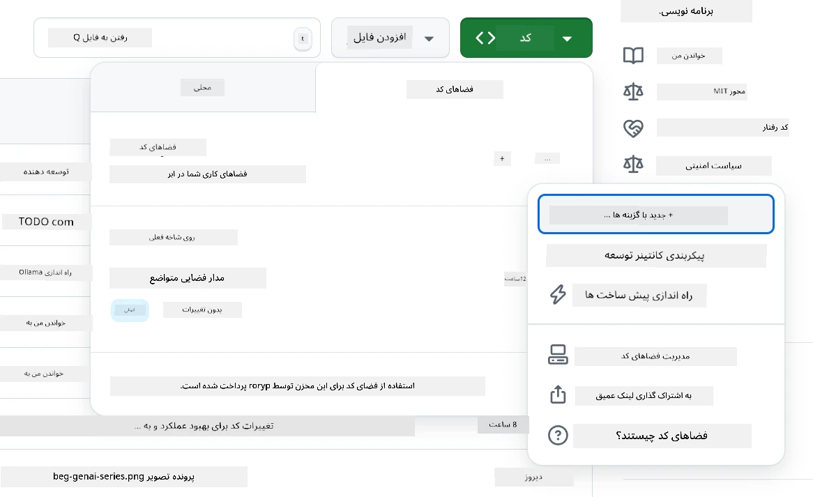
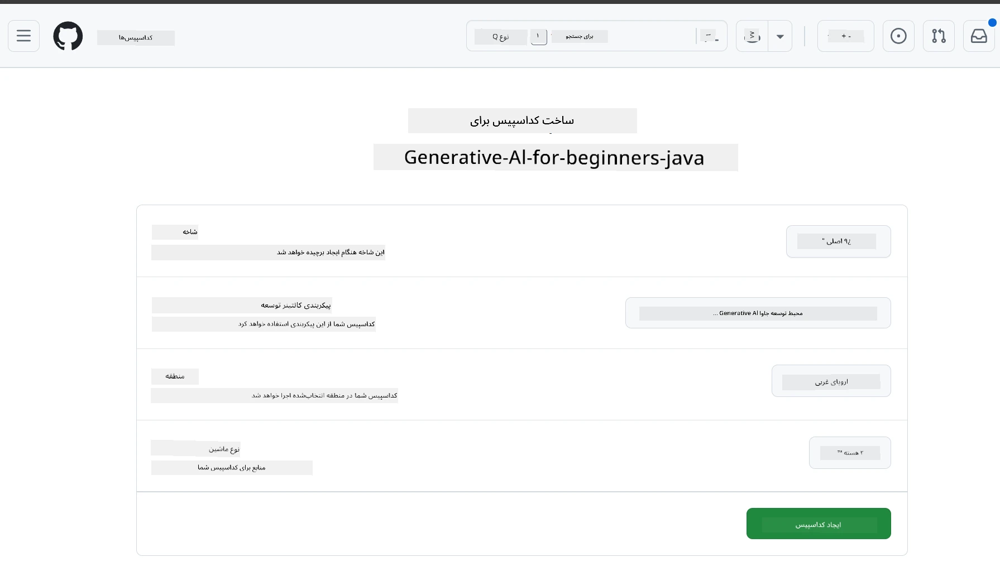
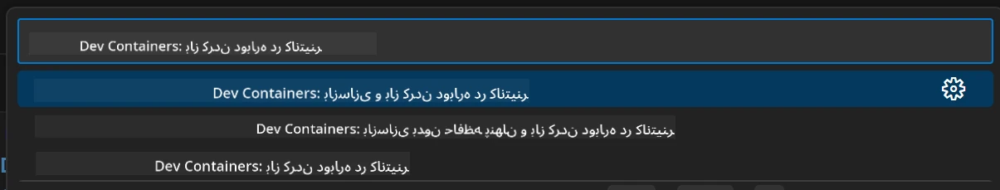
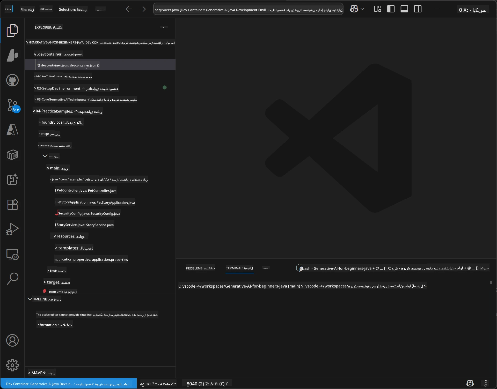
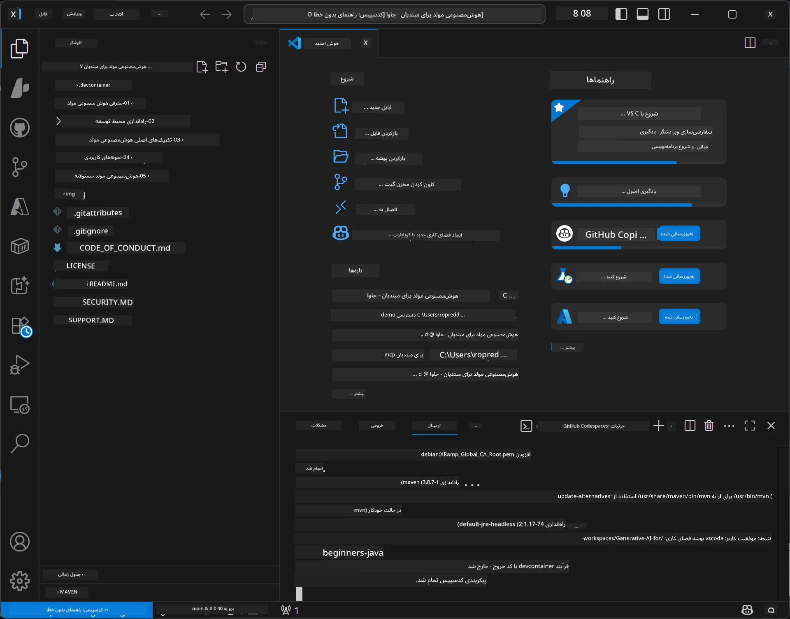

# راه‌اندازی محیط توسعه برای هوش مصنوعی مولد در جاوا

> **شروع سریع**: برنامه‌نویسی در ابر در ۲ دقیقه - به بخش [راه‌اندازی GitHub Codespaces](../../../02-SetupDevEnvironment) بروید - نیازی به نصب محلی نیست و از مدل‌های گیت‌هاب استفاده می‌کند!

> **علاقه‌مند به Azure OpenAI هستید؟**، راهنمای [راه‌اندازی Azure OpenAI](getting-started-azure-openai.md) ما را ببینید که مراحل ایجاد یک منبع جدید Azure OpenAI را توضیح می‌دهد.

## آنچه یاد می‌گیرید

- راه‌اندازی محیط توسعه جاوا برای برنامه‌های هوش مصنوعی
- انتخاب و پیکربندی محیط توسعه دلخواه خود (ابتدا ابری با Codespaces، کانتینر توسعه محلی یا راه‌اندازی کامل محلی)
- تست راه‌اندازی با اتصال به مدل‌های GitHub

## فهرست مطالب

- [آنچه یاد می‌گیرید](../../../02-SetupDevEnvironment)
- [مقدمه](../../../02-SetupDevEnvironment)
- [مرحله ۱: راه‌اندازی محیط توسعه](../../../02-SetupDevEnvironment)
  - [گزینه الف: GitHub Codespaces (توصیه‌شده)](../../../02-SetupDevEnvironment)
  - [گزینه ب: کانتینر توسعه محلی](../../../02-SetupDevEnvironment)
  - [گزینه ج: استفاده از نصب محلی موجود شما](../../../02-SetupDevEnvironment)
- [مرحله ۲: ایجاد توکن دسترسی شخصی GitHub](../../../02-SetupDevEnvironment)
- [مرحله ۳: تست راه‌اندازی با نمونه مدل‌های GitHub](../../../02-SetupDevEnvironment)
- [عیب‌یابی](../../../02-SetupDevEnvironment)
- [خلاصه](../../../02-SetupDevEnvironment)
- [مراحل بعدی](../../../02-SetupDevEnvironment)

## مقدمه

این فصل شما را در راه‌اندازی محیط توسعه راهنمایی می‌کند. ما از **مدل‌های GitHub** به عنوان نمونه اصلی استفاده می‌کنیم زیرا رایگان است، تنها با یک حساب گیت‌هاب به راحتی راه‌اندازی می‌شود، نیازی به کارت اعتباری ندارد و دسترسی به چندین مدل برای آزمایش فراهم می‌کند.

**نیازی به راه‌اندازی محلی نیست!** شما می‌توانید بلافاصله با استفاده از GitHub Codespaces شروع به برنامه‌نویسی کنید که یک محیط توسعه کامل را در مرورگر شما فراهم می‌کند.


ما استفاده از [**مدل‌های GitHub**](https://github.com/marketplace?type=models) را برای این دوره توصیه می‌کنیم زیرا:
- شروع آن **رایگان** است
- با داشتن فقط یک حساب گیت‌هاب **راه‌اندازی آن آسان** است
- **نیازی به کارت اعتباری** ندارد
- **چندین مدل** برای آزمایش در دسترس است

> **توجه**: محدودیت‌های رایگان مدل‌های GitHub که در این آموزش استفاده می‌شوند عبارتند از:
> - ۱۵ درخواست در دقیقه (۱۵۰ درخواست در روز)
> - حدود ۸,۰۰۰ کلمه ورودی و ۴,۰۰۰ کلمه خروجی در هر درخواست
> - ۵ درخواست همزمان
> 
> برای استفاده در تولید، به مدل‌های Azure AI Foundry با حساب Azure خود ارتقاء دهید. نیازی به تغییر در کد شما نیست. مستندات [Azure AI Foundry](https://learn.microsoft.com/azure/ai-foundry/foundry-models/how-to/quickstart-github-models) را ببینید.

## مرحله ۱: راه‌اندازی محیط توسعه

<a name="quick-start-cloud"></a>

ما یک کانتینر توسعه پیش‌پیکربندی شده ایجاد کرده‌ایم تا زمان راه‌اندازی را به حداقل برسانیم و اطمینان حاصل کنیم که همه ابزارهای لازم برای این دوره هوش مصنوعی مولد در جاوا در اختیار دارید. روش توسعه دلخواه خود را انتخاب کنید:

### گزینه‌های راه‌اندازی محیط:

#### گزینه الف: GitHub Codespaces (توصیه‌شده)

**در ۲ دقیقه شروع به کدنویسی کنید - نیازی به راه‌اندازی محلی نیست!**

1. این مخزن را به حساب GitHub خود فورک کنید  
   > **توجه**: اگر می‌خواهید پیکربندی پایه را ویرایش کنید، به [پیکربندی کانتینر توسعه](../../../.devcontainer/devcontainer.json) مراجعه کنید
2. روی **Code** کلیک کنید → تب **Codespaces** → روی **...** کلیک کنید → گزینه **New with options...**
3. تنظیمات پیش‌فرض را استفاده کنید – این گزینه کانتینر توسعه با پیکربندی **محیط توسعه جاوا هوش مصنوعی مولد** را که سفارشی برای این دوره ساخته شده انتخاب می‌کند
4. روی **Create codespace** کلیک کنید
5. حدود ۲ دقیقه صبر کنید تا محیط آماده شود
6. به [مرحله ۲: ایجاد توکن GitHub](../../../02-SetupDevEnvironment) بروید







> **مزایای Codespaces**:
> - نیازی به نصب محلی ندارد
> - روی هر دستگاهی با مرورگر کار می‌کند
> - با همه ابزارها و وابستگی‌ها پیش‌تنظیم شده است
> - ۶۰ ساعت رایگان در ماه برای حساب‌های شخصی
> - محیطی یکنواخت برای همه یادگیرندگان

#### گزینه ب: کانتینر توسعه محلی

**برای توسعه‌دهندگانی که ترجیح می‌دهند به صورت محلی با Docker توسعه دهند**

1. این مخزن را فورک و کلون کنید بر روی رایانه محلی خود  
   > **توجه**: اگر می‌خواهید پیکربندی پایه را ویرایش کنید، به [پیکربندی کانتینر توسعه](../../../.devcontainer/devcontainer.json) مراجعه کنید
2. [Docker Desktop](https://www.docker.com/products/docker-desktop/) و [VS Code](https://code.visualstudio.com/) را نصب کنید
3. افزونه [Dev Containers](https://marketplace.visualstudio.com/items?itemName=ms-vscode-remote.remote-containers) را در VS Code نصب کنید
4. پوشه مخزن را در VS Code باز کنید
5. زمانی که درخواست شد، روی **Reopen in Container** کلیک کنید (یا از `Ctrl+Shift+P` → "Dev Containers: Reopen in Container" استفاده کنید)
6. منتظر بمانید تا کانتینر ساخته شده و شروع به کار کند
7. به [مرحله ۲: ایجاد توکن GitHub](../../../02-SetupDevEnvironment) بروید





#### گزینه ج: استفاده از نصب محلی موجود شما

**برای توسعه‌دهندگانی که محیط جاوای موجود دارند**

پیش‌نیازها:  
- [جاوا ۲۱ یا بالاتر](https://www.oracle.com/java/technologies/javase/jdk21-archive-downloads.html)  
- [مِیون ۳.۹ یا بالاتر](https://maven.apache.org/download.cgi)  
- [VS Code](https://code.visualstudio.com) یا IDE دلخواه شما

مراحل:  
1. این مخزن را روی رایانه محلی خود کلون کنید  
2. پروژه را در IDE خود باز کنید  
3. به [مرحله ۲: ایجاد توکن GitHub](../../../02-SetupDevEnvironment) بروید

> **نکته حرفه‌ای**: اگر دستگاه شما مشخصات پایین دارد ولی می‌خواهید VS Code را محلی استفاده کنید، از GitHub Codespaces استفاده کنید! می‌توانید VS Code محلی خود را به Codespace میزبانی شده در ابر متصل کنید و از بهترین هر دو دنیا بهره‌مند شوید.



## مرحله ۲: ایجاد توکن دسترسی شخصی GitHub

1. به [تنظیمات GitHub](https://github.com/settings/profile) بروید و از منوی پروفایل خود **Settings** را انتخاب کنید.
2. در نوار کناری سمت چپ، روی **Developer settings** کلیک کنید (معمولاً در پایین قرار دارد).
3. زیر بخش **Personal access tokens** روی **Fine-grained tokens** کلیک کنید (یا مستقیم این [لینک](https://github.com/settings/personal-access-tokens) را دنبال کنید).
4. روی **Generate new token** کلیک کنید.
5. در قسمت "Token name"، یک نام توصیفی وارد کنید (مثلاً `GenAI-Java-Course-Token`).
6. یک تاریخ انقضا تعیین کنید (توصیه می‌شود: ۷ روز برای رعایت بهترین شیوه‌های امنیتی).
7. در بخش "Resource owner"، حساب کاربری خود را انتخاب کنید.
8. در بخش "Repository access"، مخازنی که می‌خواهید با مدل‌های GitHub استفاده کنید انتخاب کنید (یا «تمام مخازن» اگر نیاز بود).
9. در بخش "Account permissions"، گزینه **Models** را پیدا کرده و آن را روی **فقط خواندنی** تنظیم کنید.
10. روی **Generate token** کلیک کنید.
11. **توکن خود را همین حالا کپی و ذخیره کنید** — دفعه بعد دیگر نمایش داده نخواهد شد!

> **نکته امنیتی**: حداقل سطح دسترسی لازم و کوتاه‌ترین زمان انقضاء ممکن را برای توکن‌های دسترسی خود انتخاب کنید.

## مرحله ۳: تست راه‌اندازی با نمونه مدل‌های GitHub

پس از آماده شدن محیط توسعه، بیایید یکپارچگی مدل‌های GitHub را با برنامه نمونه در [`02-SetupDevEnvironment/examples/github-models`](../../../02-SetupDevEnvironment/examples/github-models) تست کنیم.

1. ترمینال را در محیط توسعه خود باز کنید.
2. به مسیر نمونه مدل‌های GitHub بروید:  
   ```bash
   cd 02-SetupDevEnvironment/examples/github-models
   ```
  
3. توکن GitHub خود را به عنوان یک متغیر محیطی تنظیم کنید:  
   ```bash
   # مک‌اواس/لینوکس
   export GITHUB_TOKEN=your_token_here
   
   # ویندوز (خط فرمان)
   set GITHUB_TOKEN=your_token_here
   
   # ویندوز (پاورشل)
   $env:GITHUB_TOKEN="your_token_here"
   ```
  
4. برنامه را اجرا کنید:  
   ```bash
   mvn compile exec:java -Dexec.mainClass="com.example.githubmodels.App"
   ```
  
خروجی مشابه زیر باید نمایش داده شود:  
```text
Using model: gpt-4.1-nano
Sending request to GitHub Models...
Response: Hello World!
```
  
### درک کد نمونه

ابتدا بیایید بفهمیم چه کاری انجام دادیم. نمونه در `examples/github-models` از OpenAI Java SDK برای اتصال به مدل‌های GitHub استفاده می‌کند:

**این کد چه می‌کند:**  
- **اتصال** به مدل‌های GitHub با استفاده از توکن دسترسی شخصی شما  
- ارسال پیام ساده "سلام دنیا!" به مدل هوش مصنوعی  
- دریافت و نمایش پاسخ هوش مصنوعی  
- **اعتبارسنجی** اینکه راه‌اندازی شما به درستی کار می‌کند

**وابستگی کلیدی** (در `pom.xml`):  
```xml
<dependency>
    <groupId>com.openai</groupId>
    <artifactId>openai-java</artifactId>
    <version>2.12.0</version>
</dependency>
```
  
**کد اصلی** (`App.java`):  
```java
// اتصال به مدل‌های GitHub با استفاده از OpenAI Java SDK
OpenAIClient client = OpenAIOkHttpClient.builder()
    .apiKey(pat)
    .baseUrl("https://models.inference.ai.azure.com")
    .build();

// ایجاد درخواست تکمیل چت
ChatCompletionCreateParams params = ChatCompletionCreateParams.builder()
    .model(modelId)
    .addSystemMessage("You are a concise assistant.")
    .addUserMessage("Say Hello World!")
    .build();

// دریافت پاسخ هوش مصنوعی
ChatCompletion response = client.chat().completions().create(params);
System.out.println("Response: " + response.choices().get(0).message().content().orElse("No response content"));
```
  
## خلاصه

عالی است! حالا همه چیز را راه‌اندازی کرده‌اید:

- توکن دسترسی شخصی GitHub با مجوزهای مناسب برای دسترسی به مدل‌های AI ساخته‌اید  
- محیط توسعه جاوا خود را راه‌اندازی کرده‌اید (چه Codespaces، کانتینر توسعه یا راه‌اندازی محلی)  
- به مدل‌های GitHub با استفاده از OpenAI Java SDK برای توسعه رایگان هوش مصنوعی متصل شده‌اید  
- با نمونه ساده‌ای که با مدل‌های AI صحبت می‌کند، همه چیز را تست کرده‌اید

## مراحل بعدی

[فصل ۳: تکنیک‌های اصلی هوش مصنوعی مولد](../03-CoreGenerativeAITechniques/README.md)

## عیب‌یابی

مشکلی دارید؟ مسائل و راه‌حل‌های رایج:

- **توکن کار نمی‌کند؟**  
  - مطمئن شوید کل توکن را بدون فاصله اضافی کپی کرده‌اید  
  - بررسی کنید که توکن به درستی به عنوان متغیر محیطی تنظیم شده است  
  - مطمئن شوید توکن مجوزهای درست دارد (Models: فقط خواندنی)

- **Maven پیدا نمی‌شود؟**  
  - اگر از کانتینرهای توسعه یا Codespaces استفاده می‌کنید، Maven باید از قبل نصب شده باشد  
  - برای راه‌اندازی محلی، اطمینان حاصل کنید جاوا ۲۱ و Maven ۳.۹ نصب شده‌اند  
  - اجرای `mvn --version` برای بررسی نصب

- **مشکل اتصال دارید؟**  
  - اتصال اینترنت خود را بررسی کنید  
  - اطمینان حاصل کنید GitHub از شبکه شما قابل دسترس است  
  - مطمئن شوید پشت فایروال نیستید که دسترسی به نقطه پایان مدل‌های GitHub را مسدود کرده باشد

- **کانتینر توسعه راه نمی‌افتد؟**  
  - اطمینان حاصل کنید Docker Desktop (برای توسعه محلی) در حال اجرا است  
  - سعی کنید کانتینر را مجدداً بسازید: `Ctrl+Shift+P` → "Dev Containers: Rebuild Container"

- **خطاهای کامپایل برنامه؟**  
  - مطمئن شوید در دایرکتوری درست هستید: `02-SetupDevEnvironment/examples/github-models`  
  - سعی کنید پاکسازی و ساخت مجدد کنید: `mvn clean compile`

> **نیاز به کمک دارید؟**: هنوز مشکل دارید؟ یک issue در مخزن باز کنید و ما کمکتان خواهیم کرد.

---

<!-- CO-OP TRANSLATOR DISCLAIMER START -->
**سلب مسئولیت**:  
این سند با استفاده از سرویس ترجمه هوش مصنوعی [Co-op Translator](https://github.com/Azure/co-op-translator) ترجمه شده است. در حالی که ما در تلاش برای دقت هستیم، لطفاً توجه داشته باشید که ترجمه‌های خودکار ممکن است دارای خطاها یا نادرستی‌هایی باشند. سند اصلی به زبان مادری‌اش باید به عنوان منبع معتبر در نظر گرفته شود. برای اطلاعات حیاتی، ترجمه حرفه‌ای انسانی توصیه می‌شود. ما مسئول هیچگونه سوء تفاهم یا تفسیر نادرست ناشی از استفاده از این ترجمه نیستیم.
<!-- CO-OP TRANSLATOR DISCLAIMER END -->