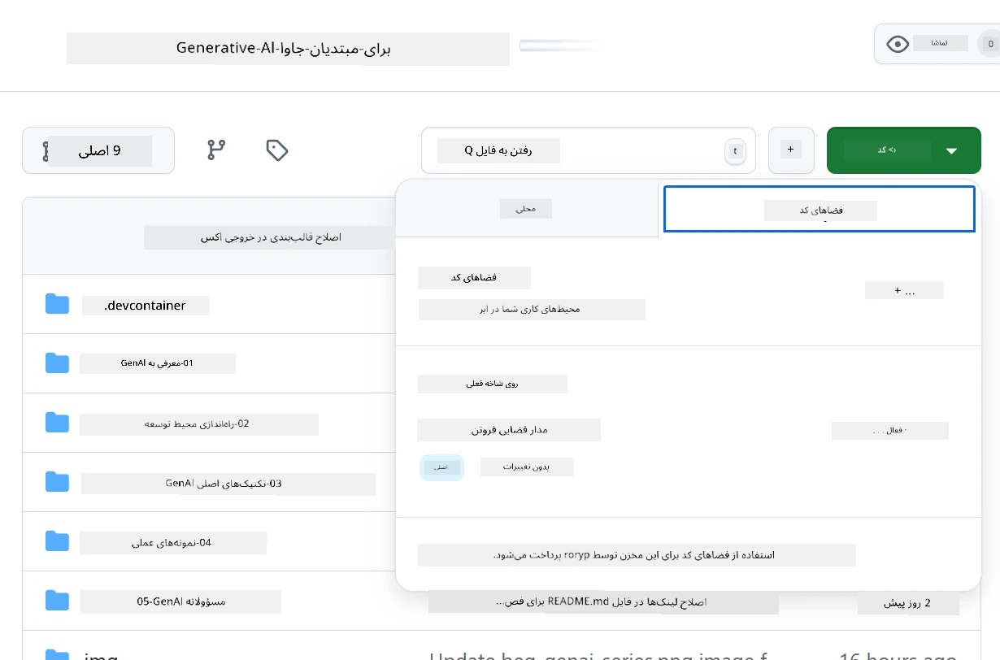

# راه‌اندازی محیط توسعه برای Azure OpenAI

> **شروع سریع**: این راهنما برای تنظیم Azure OpenAI است. برای شروع سریع با مدل‌های رایگان، از [مدل‌های GitHub با Codespaces](./README.md#quick-start-cloud) استفاده کنید.

این راهنما به شما کمک می‌کند مدل‌های Azure AI Foundry را برای اپلیکیشن‌های جاوای هوش مصنوعی در این دوره تنظیم کنید.

## فهرست مطالب

- [نمای کلی تنظیم سریع](../../../02-SetupDevEnvironment)
- [مرحله ۱: ایجاد منابع Azure AI Foundry](../../../02-SetupDevEnvironment)
  - [ایجاد یک هاب و پروژه](../../../02-SetupDevEnvironment)
  - [استقرار مدل GPT-4o-mini](../../../02-SetupDevEnvironment)
- [مرحله ۲: ایجاد Codespace خود](../../../02-SetupDevEnvironment)
- [مرحله ۳: پیکربندی محیط خود](../../../02-SetupDevEnvironment)
- [مرحله ۴: تست تنظیمات شما](../../../02-SetupDevEnvironment)
- [بعد چه؟](../../../02-SetupDevEnvironment)
- [منابع](../../../02-SetupDevEnvironment)
- [منابع اضافی](../../../02-SetupDevEnvironment)

## نمای کلی تنظیم سریع

1. ایجاد منابع Azure AI Foundry (هاب، پروژه، مدل)
2. ایجاد یک Codespace با کانتینر توسعه جاوا
3. پیکربندی فایل .env با اطلاعات Azure OpenAI
4. تست تنظیمات با پروژه نمونه

## مرحله ۱: ایجاد منابع Azure AI Foundry

### ایجاد یک هاب و پروژه

1. به [پورتال Azure AI Foundry](https://ai.azure.com/) بروید و وارد شوید.
2. روی **+ Create** → **New hub** کلیک کنید (یا به **Management** → **All hubs** → **+ New hub** بروید).
3. هاب خود را پیکربندی کنید:
   - **نام هاب**: مثلاً "MyAIHub"
   - **اشتراک**: اشتراک Azure خود را انتخاب کنید
   - **گروه منابع**: جدید ایجاد کنید یا موجود را انتخاب کنید
   - **موقعیت مکانی**: نزدیک‌ترین مکان به خود را انتخاب کنید
   - **حساب ذخیره‌سازی**: از پیش‌فرض استفاده کنید یا سفارشی کنید
   - **Key vault**: از پیش‌فرض استفاده کنید یا سفارشی کنید
   - روی **Next** → **Review + create** → **Create** کلیک کنید.
4. پس از ایجاد، روی **+ New project** کلیک کنید (یا از نمای کلی هاب، **Create project** را انتخاب کنید).
   - **نام پروژه**: مثلاً "GenAIJava"
   - روی **Create** کلیک کنید.

### استقرار مدل GPT-4o-mini

1. در پروژه خود، به **Model catalog** بروید و **gpt-4o-mini** را جستجو کنید.
   - *جایگزین: به **Deployments** → **+ Create deployment** بروید.*
2. روی **Deploy** در کارت مدل gpt-4o-mini کلیک کنید.
3. استقرار را پیکربندی کنید:
   - **نام استقرار**: "gpt-4o-mini"
   - **نسخه مدل**: از آخرین نسخه استفاده کنید
   - **نوع استقرار**: استاندارد
4. روی **Deploy** کلیک کنید.
5. پس از استقرار، به تب **Deployments** بروید و مقادیر زیر را کپی کنید:
   - **نام استقرار** (مثلاً "gpt-4o-mini")
   - **Target URI** (مثلاً `https://your-hub-name.openai.azure.com/`)  
      > **مهم**: فقط URL پایه را کپی کنید (مثلاً `https://myhub.openai.azure.com/`) نه مسیر کامل نقطه پایانی.
   - **کلید** (از بخش Keys and Endpoint)

> **هنوز مشکل دارید؟** به [مستندات رسمی Azure AI Foundry](https://learn.microsoft.com/azure/ai-foundry/how-to/create-projects?tabs=ai-foundry&pivots=hub-project) مراجعه کنید.

## مرحله ۲: ایجاد Codespace خود

1. این مخزن را به حساب GitHub خود فورک کنید.
   > **توجه**: اگر می‌خواهید تنظیمات پایه را ویرایش کنید، به [پیکربندی کانتینر توسعه](../../../.devcontainer/devcontainer.json) نگاهی بیندازید.
2. در مخزن فورک‌شده خود، روی **Code** → تب **Codespaces** کلیک کنید.
3. روی **...** → **New with options...** کلیک کنید.

4. **پیکربندی کانتینر توسعه** را انتخاب کنید: 
   - **محیط توسعه جاوای هوش مصنوعی مولد**
5. روی **Create codespace** کلیک کنید.

## مرحله ۳: پیکربندی محیط خود

پس از آماده شدن Codespace، اطلاعات Azure OpenAI خود را تنظیم کنید:

1. **به پروژه نمونه از ریشه مخزن بروید:**
   ```bash
   cd 02-SetupDevEnvironment/examples/basic-chat-azure
   ```

2. **فایل .env خود را ایجاد کنید:**
   ```bash
   cp .env.example .env
   ```

3. **فایل .env را با اطلاعات Azure OpenAI خود ویرایش کنید:**
   ```bash
   # Your Azure OpenAI API key (from Azure AI Foundry portal)
   AZURE_AI_KEY=your-actual-api-key-here
   
   # Your Azure OpenAI endpoint URL (e.g., https://myhub.openai.azure.com/)
   AZURE_AI_ENDPOINT=https://your-hub-name.openai.azure.com/
   ```

   > **نکته امنیتی**: 
   > - هرگز فایل `.env` خود را به کنترل نسخه متعهد نکنید.
   > - فایل `.env` قبلاً در `.gitignore` گنجانده شده است.
   > - کلیدهای API خود را ایمن نگه دارید و به طور منظم آن‌ها را تغییر دهید.

## مرحله ۴: تست تنظیمات شما

برنامه نمونه را اجرا کنید تا اتصال Azure OpenAI خود را تست کنید:

```bash
mvn clean spring-boot:run
```

باید پاسخی از مدل GPT-4o-mini دریافت کنید!

> **کاربران VS Code**: همچنین می‌توانید با فشار دادن `F5` در VS Code برنامه را اجرا کنید. پیکربندی اجرا قبلاً تنظیم شده است تا فایل `.env` شما را به طور خودکار بارگذاری کند.

> **نمونه کامل**: برای دستورالعمل‌های دقیق و رفع اشکال، به [نمونه کامل Azure OpenAI](./examples/basic-chat-azure/README.md) مراجعه کنید.

## بعد چه؟

**تنظیمات کامل شد!** اکنون شما دارید:
- Azure OpenAI با gpt-4o-mini مستقر شده
- پیکربندی فایل .env محلی
- محیط توسعه جاوا آماده

**ادامه دهید به** [فصل ۳: تکنیک‌های اصلی هوش مصنوعی مولد](../03-CoreGenerativeAITechniques/README.md) برای شروع ساخت اپلیکیشن‌های هوش مصنوعی!

## منابع

- [مستندات Azure AI Foundry](https://learn.microsoft.com/azure/ai-services/)
- [مستندات Spring AI Azure OpenAI](https://docs.spring.io/spring-ai/reference/api/clients/azure-openai-chat.html)
- [Azure OpenAI Java SDK](https://learn.microsoft.com/java/api/overview/azure/ai-openai-readme)

## منابع اضافی

- [دانلود VS Code](https://code.visualstudio.com/Download)
- [دریافت Docker Desktop](https://www.docker.com/products/docker-desktop)
- [پیکربندی کانتینر توسعه](../../../.devcontainer/devcontainer.json)

**سلب مسئولیت**:  
این سند با استفاده از سرویس ترجمه هوش مصنوعی [Co-op Translator](https://github.com/Azure/co-op-translator) ترجمه شده است. در حالی که ما تلاش می‌کنیم دقت را حفظ کنیم، لطفاً توجه داشته باشید که ترجمه‌های خودکار ممکن است حاوی خطاها یا نادرستی‌هایی باشند. سند اصلی به زبان اصلی آن باید به عنوان منبع معتبر در نظر گرفته شود. برای اطلاعات حساس، ترجمه حرفه‌ای انسانی توصیه می‌شود. ما هیچ مسئولیتی در قبال سوءتفاهم‌ها یا تفسیرهای نادرست ناشی از استفاده از این ترجمه نداریم.