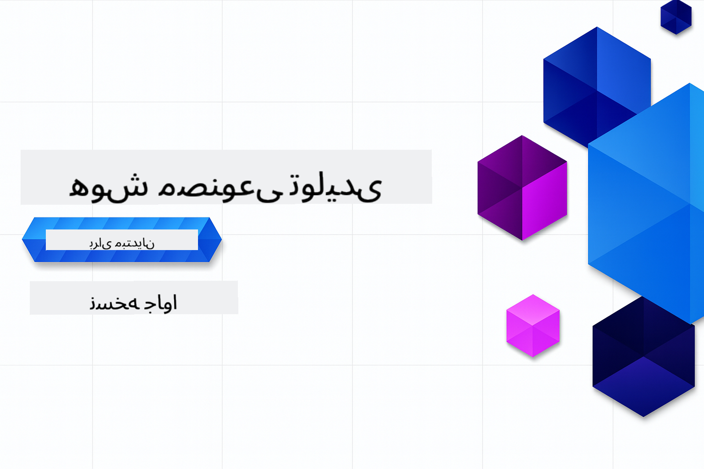

<!--
CO_OP_TRANSLATOR_METADATA:
{
  "original_hash": "4d04ae8088f6a3c3fcbab18cbdfe4002",
  "translation_date": "2025-10-03T08:02:54+00:00",
  "source_file": "README.md",
  "language_code": "fa"
}
-->
# هوش مصنوعی مولد برای مبتدیان - نسخه جاوا

**مدت زمان مورد نیاز**: کل کارگاه به صورت آنلاین و بدون نیاز به تنظیمات محلی قابل انجام است. تنظیم محیط تنها ۲ دقیقه زمان می‌برد و بررسی نمونه‌ها بسته به عمق کاوش بین ۱ تا ۳ ساعت طول می‌کشد.

> **شروع سریع**

1. این مخزن را به حساب GitHub خود فورک کنید
2. روی **Code** → تب **Codespaces** → **...** → **New with options...** کلیک کنید
3. تنظیمات پیش‌فرض را انتخاب کنید – این گزینه کانتینر توسعه‌ای که برای این دوره ایجاد شده است را انتخاب می‌کند
4. روی **Create codespace** کلیک کنید
5. حدود ۲ دقیقه منتظر بمانید تا محیط آماده شود
6. مستقیماً به [اولین مثال](./02-SetupDevEnvironment/README.md#step-2-create-a-github-personal-access-token) بروید

## پشتیبانی چندزبانه

### پشتیبانی از طریق GitHub Action (خودکار و همیشه به‌روز)

[فرانسوی](../fr/README.md) | [اسپانیایی](../es/README.md) | [آلمانی](../de/README.md) | [روسی](../ru/README.md) | [عربی](../ar/README.md) | [فارسی](./README.md) | [اردو](../ur/README.md) | [چینی (ساده‌شده)](../zh/README.md) | [چینی (سنتی، ماکائو)](../mo/README.md) | [چینی (سنتی، هنگ‌کنگ)](../hk/README.md) | [چینی (سنتی، تایوان)](../tw/README.md) | [ژاپنی](../ja/README.md) | [کره‌ای](../ko/README.md) | [هندی](../hi/README.md) | [بنگالی](../bn/README.md) | [مراتی](../mr/README.md) | [نپالی](../ne/README.md) | [پنجابی (گرمکی)](../pa/README.md) | [پرتغالی (پرتغال)](../pt/README.md) | [پرتغالی (برزیل)](../br/README.md) | [ایتالیایی](../it/README.md) | [لهستانی](../pl/README.md) | [ترکی](../tr/README.md) | [یونانی](../el/README.md) | [تایلندی](../th/README.md) | [سوئدی](../sv/README.md) | [دانمارکی](../da/README.md) | [نروژی](../no/README.md) | [فنلاندی](../fi/README.md) | [هلندی](../nl/README.md) | [عبری](../he/README.md) | [ویتنامی](../vi/README.md) | [اندونزیایی](../id/README.md) | [مالایی](../ms/README.md) | [تاگالوگ (فیلیپینی)](../tl/README.md) | [سواحیلی](../sw/README.md) | [مجاری](../hu/README.md) | [چکی](../cs/README.md) | [اسلواکی](../sk/README.md) | [رومانیایی](../ro/README.md) | [بلغاری](../bg/README.md) | [صربی (سیریلیک)](../sr/README.md) | [کرواتی](../hr/README.md) | [اسلوونیایی](../sl/README.md) | [اوکراینی](../uk/README.md) | [برمه‌ای (میانمار)](../my/README.md)

## ساختار دوره و مسیر یادگیری

### **فصل ۱: مقدمه‌ای بر هوش مصنوعی مولد**
- **مفاهیم اصلی**: آشنایی با مدل‌های زبانی بزرگ، توکن‌ها، جاسازی‌ها و قابلیت‌های هوش مصنوعی
- **اکوسیستم هوش مصنوعی جاوا**: مرور Spring AI و OpenAI SDKها
- **پروتکل زمینه مدل**: معرفی MCP و نقش آن در ارتباط عامل‌های هوش مصنوعی
- **کاربردهای عملی**: سناریوهای واقعی شامل چت‌بات‌ها و تولید محتوا
- **[→ شروع فصل ۱](./01-IntroToGenAI/README.md)**

### **فصل ۲: تنظیم محیط توسعه**
- **پیکربندی چند ارائه‌دهنده**: تنظیم ادغام‌های GitHub Models، Azure OpenAI و OpenAI Java SDK
- **Spring Boot + Spring AI**: بهترین روش‌ها برای توسعه برنامه‌های هوش مصنوعی سازمانی
- **مدل‌های GitHub**: دسترسی رایگان به مدل‌های هوش مصنوعی برای نمونه‌سازی و یادگیری (بدون نیاز به کارت اعتباری)
- **ابزارهای توسعه**: پیکربندی کانتینرهای Docker، VS Code و GitHub Codespaces
- **[→ شروع فصل ۲](./02-SetupDevEnvironment/README.md)**

### **فصل ۳: تکنیک‌های اصلی هوش مصنوعی مولد**
- **مهندسی درخواست**: تکنیک‌هایی برای پاسخ‌های بهینه مدل‌های هوش مصنوعی
- **جاسازی‌ها و عملیات برداری**: پیاده‌سازی جستجوی معنایی و تطبیق شباهت
- **تولید تقویت‌شده با بازیابی (RAG)**: ترکیب هوش مصنوعی با منابع داده‌ای خودتان
- **فراخوانی توابع**: گسترش قابلیت‌های هوش مصنوعی با ابزارها و افزونه‌های سفارشی
- **[→ شروع فصل ۳](./03-CoreGenerativeAITechniques/README.md)**

### **فصل ۴: کاربردهای عملی و پروژه‌ها**
- **تولید داستان حیوانات خانگی** (`petstory/`): تولید محتوای خلاقانه با مدل‌های GitHub
- **دموی محلی Foundry** (`foundrylocal/`): ادغام مدل‌های هوش مصنوعی محلی با OpenAI Java SDK
- **سرویس ماشین‌حساب MCP** (`calculator/`): پیاده‌سازی اولیه پروتکل زمینه مدل با Spring AI
- **[→ شروع فصل ۴](./04-PracticalSamples/README.md)**

### **فصل ۵: توسعه مسئولانه هوش مصنوعی**
- **ایمنی مدل‌های GitHub**: آزمایش فیلترهای محتوای داخلی و مکانیزم‌های ایمنی (مسدودسازی سخت و رد نرم)
- **دموی هوش مصنوعی مسئولانه**: مثال عملی نشان‌دهنده نحوه عملکرد سیستم‌های ایمنی مدرن هوش مصنوعی
- **بهترین روش‌ها**: دستورالعمل‌های ضروری برای توسعه و استقرار اخلاقی هوش مصنوعی
- **[→ شروع فصل ۵](./05-ResponsibleGenAI/README.md)**

## منابع اضافی

- [هوش مصنوعی لبه برای مبتدیان](https://github.com/microsoft/edgeai-for-beginners)
- [MCP برای مبتدیان](https://github.com/microsoft/mcp-for-beginners)
- [عامل‌های هوش مصنوعی برای مبتدیان](https://github.com/microsoft/ai-agents-for-beginners)
- [هوش مصنوعی مولد برای مبتدیان با استفاده از .NET](https://github.com/microsoft/Generative-AI-for-beginners-dotnet)
- [هوش مصنوعی مولد برای مبتدیان با استفاده از JavaScript](https://github.com/microsoft/generative-ai-with-javascript)
- [هوش مصنوعی مولد برای مبتدیان](https://github.com/microsoft/generative-ai-for-beginners)
- [یادگیری ماشین برای مبتدیان](https://aka.ms/ml-beginners)
- [علم داده برای مبتدیان](https://aka.ms/datascience-beginners)
- [هوش مصنوعی برای مبتدیان](https://aka.ms/ai-beginners)
- [امنیت سایبری برای مبتدیان](https://github.com/microsoft/Security-101)
- [توسعه وب برای مبتدیان](https://aka.ms/webdev-beginners)
- [اینترنت اشیا برای مبتدیان](https://aka.ms/iot-beginners)
- [توسعه XR برای مبتدیان](https://github.com/microsoft/xr-development-for-beginners)
- [تسلط بر GitHub Copilot برای برنامه‌نویسی جفتی هوش مصنوعی](https://aka.ms/GitHubCopilotAI)
- [تسلط بر GitHub Copilot برای توسعه‌دهندگان C#/.NET](https://github.com/microsoft/mastering-github-copilot-for-dotnet-csharp-developers)
- [ماجراجویی Copilot خود را انتخاب کنید](https://github.com/microsoft/CopilotAdventures)
- [برنامه چت RAG با خدمات هوش مصنوعی Azure](https://github.com/Azure-Samples/azure-search-openai-demo-java)

## دریافت کمک

اگر در ساخت برنامه‌های هوش مصنوعی گیر کردید یا سوالی دارید، به اینجا بپیوندید:

اگر بازخورد محصول دارید یا در هنگام ساخت خطاهایی مشاهده کردید، به اینجا مراجعه کنید:

---

**سلب مسئولیت**:  
این سند با استفاده از سرویس ترجمه هوش مصنوعی [Co-op Translator](https://github.com/Azure/co-op-translator) ترجمه شده است. در حالی که ما تلاش می‌کنیم دقت را حفظ کنیم، لطفاً توجه داشته باشید که ترجمه‌های خودکار ممکن است شامل خطاها یا نادرستی‌ها باشند. سند اصلی به زبان اصلی آن باید به عنوان منبع معتبر در نظر گرفته شود. برای اطلاعات حساس، توصیه می‌شود از ترجمه حرفه‌ای انسانی استفاده کنید. ما هیچ مسئولیتی در قبال سوء تفاهم‌ها یا تفسیرهای نادرست ناشی از استفاده از این ترجمه نداریم.