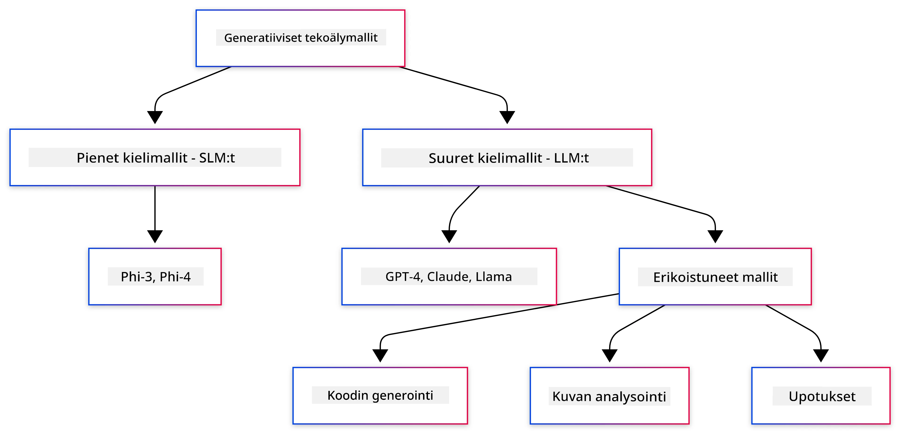
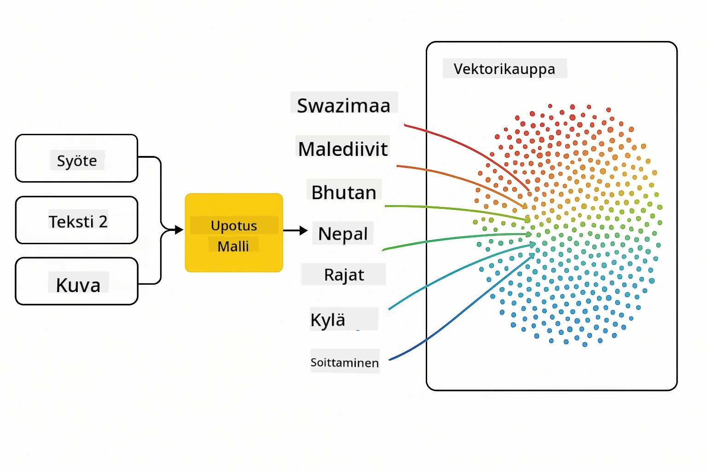
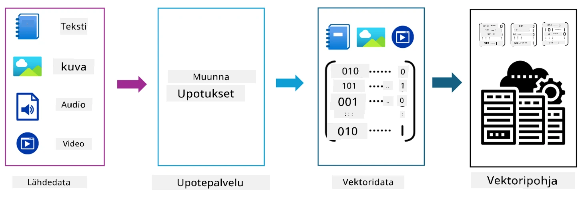
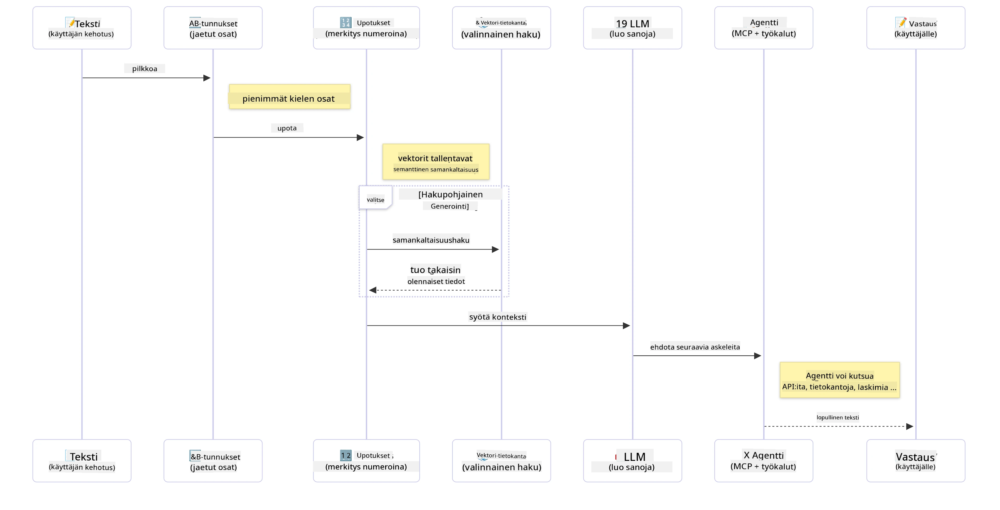

# Johdanto generatiiviseen tekoälyyn - Java-versio

> **Video**: [Katso tämän oppitunnin videoesittely YouTubessa.](https://www.youtube.com/watch?v=XH46tGp_eSw) Voit myös klikata yllä olevaa pikkukuvaa.

## Mitä opit

- **Generatiivisen tekoälyn perusteet**, mukaan lukien LLM:t, prompt-tekniikat, tokenit, embeddings ja vektoritietokannat
- **Java-tekoälykehitystyökalujen vertailu**, sisältäen Azure OpenAI SDK:n, Spring AI:n ja OpenAI Java SDK:n
- **Tutustu Model Context Protocoliin** ja sen rooliin tekoälyagenttien viestinnässä

## Sisällysluettelo

- [Johdanto](#johdanto)
- [Nopea kertausta generatiivisen tekoälyn käsitteistä](#nopea-kertausta-generatiivisen-tekoälyn-käsitteistä)
- [Prompt-tekniikan kertaus](#prompt-tekniikan-kertaus)
- [Tokenit, embeddings ja agentit](#tokenit-embeddings-ja-agentit)
- [Tekoälykehitystyökalut ja kirjastot Javalle](#tekoälykehitystyökalut-ja-kirjastot-javalle)
  - [OpenAI Java SDK](#openai-java-sdk)
  - [Spring AI](#spring-ai)
  - [Azure OpenAI Java SDK](#azure-openai-java-sdk)
- [Yhteenveto](#yhteenveto)
- [Seuraavat askeleet](#seuraavat-askelset)

## Johdanto

Tervetuloa Generatiivisen tekoälyn aloittelijat - Java-versio -kurssin ensimmäiseen lukuun! Tämä perusteellinen oppitunti esittelee sinulle generatiivisen tekoälyn keskeiset käsitteet ja kuinka työskennellä niiden kanssa Javalla. Opit tekoälysovellusten olennaisista rakennuspalikoista, mukaan lukien laajat kielimallit (LLM:t), tokenit, embeddings ja tekoälyagentit. Tutustumme myös tärkeimpiin Java-työkaluihin, joita käytät tämän kurssin aikana.

### Nopea kertausta generatiivisen tekoälyn käsitteistä

Generatiivinen tekoäly on tekoälyn muoto, joka luo uutta sisältöä, kuten tekstiä, kuvia tai koodia, käyttäen datasta opittuja malleja ja yhteyksiä. Generatiiviset mallit pystyvät tuottamaan ihmismäisiä vastauksia, ymmärtämään kontekstin ja joskus jopa luomaan sisältöä, joka vaikuttaa inhimilliseltä.

Kehittäessäsi Java-tekoälysovelluksia työskentelet **generatiivisten tekoälymallien** kanssa sisällön luomiseksi. Joitakin generatiivisten mallien kyvykkyyksiä ovat:

- **Tekstin generointi**: Ihmismäisen tekstin kirjoittaminen chatboteille, sisällöille ja tekstin täydentämiseen.
- **Kuvien luonti ja analysointi**: Realististen kuvien tekeminen, valokuvien parantaminen ja kohteiden tunnistus.
- **Koodin generointi**: Koodinpätkien tai skriptien kirjoittaminen.

On olemassa erilaisia mallityyppejä, jotka on optimoitu eri tehtäviin. Esimerkiksi sekä **pienet kielimallit (SLM:t)** että **suuret kielimallit (LLM:t)** pystyvät käsittelemään tekstin generointia, joista LLM:t tarjoavat tyypillisesti parempaa suorituskykyä monimutkaisissa tehtävissä. Kuvatehtävissä käytetään erikoistuneita näkymämalleja tai monimodaalisia malleja.

Tietysti mallien vastaukset eivät ole aina täydellisiä. Olet todennäköisesti kuullut malleista, jotka "hallusinoivat" eli tuottavat virheellistä tietoa itsevarmalla tavalla. Mutta voit ohjata mallia tuottamaan parempia vastauksia antamalla sille selkeitä ohjeita ja kontekstia. Tässä tulee vastaan **prompt-tekniikka**.

#### Prompt-tekniikan kertaus

Prompt-tekniikka tarkoittaa tehokkaiden syötteiden suunnittelua, joilla ohjataan tekoälymalleja haluttuihin lopputuloksiin. Se sisältää:

- **Selkeys**: Ohjeiden tekeminen selkeiksi ja yksiselitteisiksi.
- **Konteksti**: Tarvittavan taustatiedon antaminen.
- **Rajoitteet**: Mahdollisten rajojen tai muotojen määrittely.

Joihinkin parhaisiin prompt-tekniikoihin kuuluvat promptin suunnittelu, selkeät ohjeet, tehtävän pilkkominen, one-shot- ja few-shot-oppiminen sekä prompt-säätö. Promptien testaaminen on välttämätöntä, jotta löydät parhaan toimivan tavan juuri omaan käyttötapaasi.

Sovelluksia kehitettäessä käytät erilaisia prompt-tyyppejä:
- **Järjestelmäpromptit**: Asettavat mallin käyttäytymisen perustasot ja kontekstin
- **Käyttäjäpromptit**: Sovelluksen käyttäjiltä tuleva syöte
- **Avustajapromptit**: Mallin vastaukset, jotka perustuvat järjestelmä- ja käyttäjäprompteihin

> **Lisätietoa**: Lue lisää prompt-tekniikasta [Prompt Engineering -luvussa GenAI For Beginners -kurssilla](https://github.com/microsoft/generative-ai-for-beginners/tree/main/04-prompt-engineering-fundamentals)

#### Tokenit, embeddings ja agentit

Generatiivisten mallien kanssa työskennellessä tulet törmäämään termeihin kuten **tokenit**, **embeddings**, **agentit** ja **Model Context Protocol (MCP)**. Tässä yksityiskohtainen yleiskatsaus:

- **Tokenit**: Tokenit ovat pienin tekstin yksikkö mallissa. Ne voivat olla sanoja, merkkejä tai osasanoja. Tokenit edustavat tekstidataa mallin ymmärtämässä muodossa. Esimerkkinä lause "The quick brown fox jumped over the lazy dog" saatetaan pilkkoa tokeneihin kuten ["The", " quick", " brown", " fox", " jumped", " over", " the", " lazy", " dog"] tai ["The", " qu", "ick", " br", "own", " fox", " jump", "ed", " over", " the", " la", "zy", " dog"] tokenisointistrategiasta riippuen.

Tokenisointi on prosessi, jossa teksti pilkotaan näihin pienempiin yksiköihin. Tämä on tärkeää, koska mallit toimivat tokeneilla, eivät raakattekstillä. Tokenien määrä promptissa vaikuttaa mallin vastauksen pituuteen ja laatuun, sillä mallit asettavat token-rajoituksia kontekstin ikkunalleen (esim. 128K tokenia GPT-4o:ssa sisältäen syötteen ja vastauksen).

  Javassa voit käyttää kirjastoja kuten OpenAI SDK hoitamaan tokenisoinnin automaattisesti lähetettäessä pyyntöjä tekoälymalleille.

- **Embeddings**: Embeddings ovat tokenien vektoriesityksiä, jotka tallentavat semanttisen merkityksen. Ne ovat numeerisia esityksiä (tyypillisesti liukulukutaulukkoja), jotka antavat mallin ymmärtää sanojen välisiä suhteita ja tuottaa kontekstuaalisesti sopivia vastauksia. Samankaltaisilla sanoilla on samankaltaiset embeddingsit, mikä mahdollistaa synonyymien ja semanttisten suhteiden kuten käsitteen ymmärtämisen.

  Javassa voit luoda embeddingsiä käyttämällä OpenAI SDK:ta tai muita kirjastoja, jotka tukevat embeddingsin generointia. Näitä tarvitaan esimerkiksi semanttiseen hakuun, jossa haluat löytää sisältöä merkityksen perusteella eikä tarkkojen tekstisopivuuksien mukaan.

- **Vektoritietokannat**: Vektoritietokannat ovat erikoistuneita tallennusjärjestelmiä, jotka on optimoitu embeddingsien varastointiin. Ne mahdollistavat tehokkaan samankaltaisuushakemisen ja ovat olennaisia Retrieval-Augmented Generation (RAG) -malleissa, joissa haet asiaankuuluvaa tietoa laajoista aineistoista semanttisen samankaltaisuuden perusteella.

> **Huom:** Tässä kurssissa emme käsittele vektoritietokantoja, mutta niiden mainitseminen on tärkeää, sillä niitä käytetään yleisesti todellisissa sovelluksissa.

- **Agentit & MCP**: Tekoälykomponentteja, jotka itsenäisesti kommunikoivat mallien, työkalujen ja ulkoisten järjestelmien kanssa. Model Context Protocol (MCP) tarjoaa standardoidun tavan agenttien turvalliseen pääsyyn ulkoisiin tietolähteisiin ja työkaluihin. Lisätietoa [MCP for Beginners](https://github.com/microsoft/mcp-for-beginners) -kurssilla.

Java-tekoälysovelluksissa käytät tokeneita tekstinkäsittelyyn, embeddingsiä semanttiseen hakuun ja RAG:iin, vektoritietokantoja tiedonhakuun sekä agentteja MCP:n kanssa älykkäiden työkalujen käyttöjärjestelmien rakentamiseksi.

### Tekoälykehitystyökalut ja kirjastot Javalle

Java tarjoaa erinomaiset työkalut tekoälykehitykseen. Kolme pääkirjastoa, joita tutkimme kurssin aikana ovat OpenAI Java SDK, Azure OpenAI SDK ja Spring AI.

Tässä nopea viitetaulukko, jossa kerrotaan, mitä SDK:ta käytetään kunkin luvun esimerkeissä:

| Luku | Esimerkki | SDK |
|---------|--------|-----|
| 02-SetupDevEnvironment | github-models | OpenAI Java SDK |
| 02-SetupDevEnvironment | basic-chat-azure | Spring AI Azure OpenAI |
| 03-CoreGenerativeAITechniques | examples | Azure OpenAI SDK |
| 04-PracticalSamples | petstory | OpenAI Java SDK |
| 04-PracticalSamples | foundrylocal | OpenAI Java SDK |
| 04-PracticalSamples | calculator | Spring AI MCP SDK + LangChain4j |

**SDK-dokumentaatioiden linkit:**
- [Azure OpenAI Java SDK](https://github.com/Azure/azure-sdk-for-java/tree/azure-ai-openai_1.0.0-beta.16/sdk/openai/azure-ai-openai)
- [Spring AI](https://docs.spring.io/spring-ai/reference/)
- [OpenAI Java SDK](https://github.com/openai/openai-java)
- [LangChain4j](https://docs.langchain4j.dev/)

#### OpenAI Java SDK

OpenAI SDK on virallinen Java-kirjasto OpenAI-rajapinnalle. Se tarjoaa yksinkertaisen ja yhdenmukaisen käyttöliittymän OpenAI:n mallien kanssa työskentelyyn, jolloin tekoälyominaisuuksien integroiminen Java-sovelluksiin on vaivatonta. Luvun 2 GitHub Models -esimerkki, luvun 4 Pet Story -sovellus ja Foundry Local -esimerkki havainnollistavat OpenAI SDK:n käyttöä.

#### Spring AI

Spring AI on kattava kehys, joka tuo tekoälyominaisuudet Spring-sovelluksiin tarjoten yhdenmukaisen abstraktiotason eri tekoälypalvelun tarjoajien yli. Se integroituu saumattomasti Spring-ekosysteemiin, mikä tekee siitä ihanteellisen valinnan yritystason Java-sovelluksille, joissa tarvitaan tekoälytoiminnallisuuksia.

Spring AI:n vahvuus on sen saumattomassa integroinnissa Spring-ekosysteemiin, mikä helpottaa tuotantovalmiiden tekoälysovellusten rakentamista tuttuja Spring-malleja kuten riippuvuuden injektiota, konfiguraation hallintaa ja testauskehyksiä hyödyntäen. Käytät Spring AI:ta luvuissa 2 ja 4 rakentaaksesi sovelluksia, jotka hyödyntävät sekä OpenAI:ta että Model Context Protocol (MCP) Spring AI -kirjastoja.

##### Model Context Protocol (MCP)

[Model Context Protocol (MCP)](https://modelcontextprotocol.io/) on nouseva standardi, joka mahdollistaa tekoälysovellusten turvallisen vuorovaikutuksen ulkoisten tietolähteiden ja työkalujen kanssa. MCP tarjoaa standardoidun tavan tekoälymallien pääsyyn kontekstuaaliseen tietoon ja toimintojen suorittamiseen sovelluksissa.

Luvussa 4 rakennat yksinkertaisen MCP-laskinpalvelun, joka demonstroi Model Context Protocolin perusteita Spring AI:n kanssa näyttäen, kuinka perusin­tegraatiot ja palveluarkkitehtuurit luodaan.

#### Azure OpenAI Java SDK

Azure OpenAI -asiakasrajapinta Javalle on sovellus OpenAI:n REST-rajapinnoista, jonka käyttöliittymä on idiomaattinen ja integroitu Azure SDK -ekosysteemiin. Luvussa 3 rakennat sovelluksia, jotka käyttävät Azure OpenAI SDK:ta mukaan lukien chat-sovellukset, funktiokutsut ja RAG (Retrieval-Augmented Generation) -mallit.

> Huomautus: Azure OpenAI SDK on jäljessä OpenAI Java SDK:ta ominaisuuksien osalta, joten tulevia projekteja varten kannattaa harkita OpenAI Java SDK:n käyttöä.

## Yhteenveto

Nyt olemme käyneet läpi perusteet! Ymmärrät nyt:

- Generatiivisen tekoälyn ydinkäsitteet — LLM:t ja prompt-tekniikat aina tokeneihin, embeddingsiin ja vektoritietokantoihin asti
- Java AI -kehityksen työkaluvaihtoehdot: Azure OpenAI SDK, Spring AI ja OpenAI Java SDK
- Mikä Model Context Protocol on ja miten se mahdollistaa tekoälyagenttien yhteistyön ulkoisten työkalujen kanssa

## Seuraavat askeleet

[Luku 2: Kehitysympäristön asennus](../02-SetupDevEnvironment/README.md)

---

<!-- CO-OP TRANSLATOR DISCLAIMER START -->
**Vastuuvapauslauseke**:  
Tämä asiakirja on käännetty AI-käännöspalvelulla [Co-op Translator](https://github.com/Azure/co-op-translator). Vaikka pyrimme tarkkuuteen, on syytä huomioida, että automaattikäännöksissä voi esiintyä virheitä tai epätarkkuuksia. Alkuperäistä asiakirjaa sen alkuperäiskielellä tulee pitää ensisijaisena lähteenä. Tärkeissä tiedoissa suositellaan ammattilaisten suorittamaa ihmiskäännöstä. Emme vastaa tämän käännöksen käytöstä aiheutuvista väärinkäsityksistä tai virhetulkintojen seurauksista.
<!-- CO-OP TRANSLATOR DISCLAIMER END -->