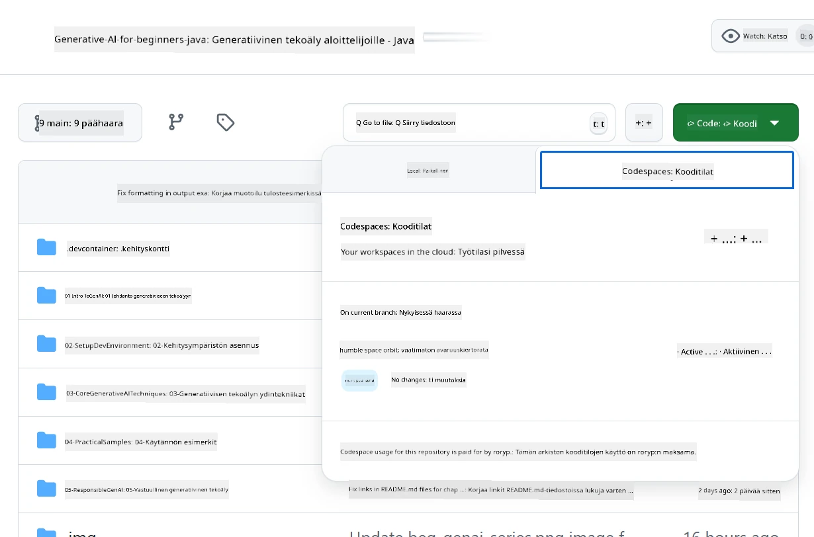
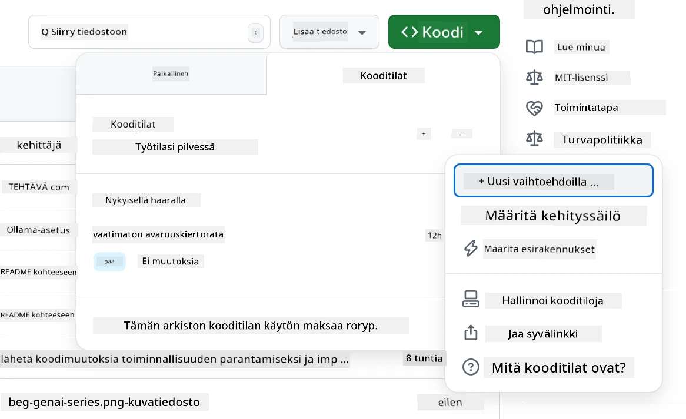
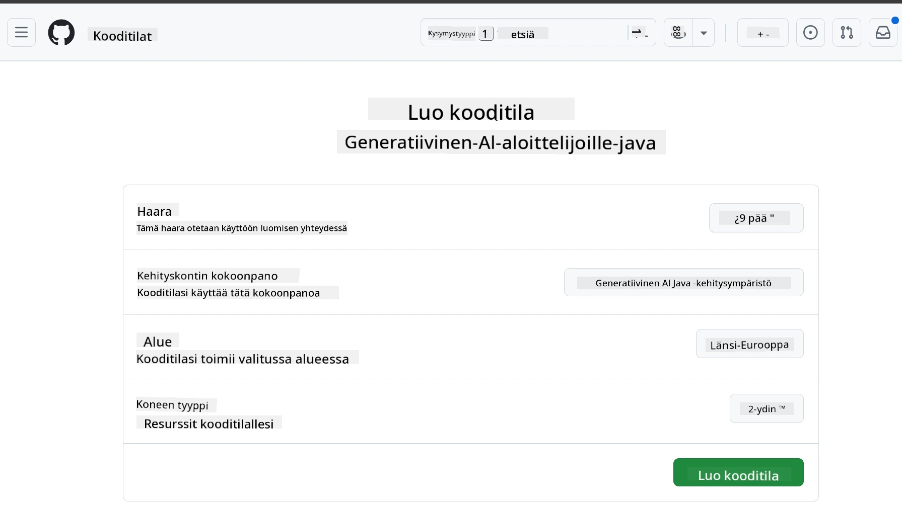
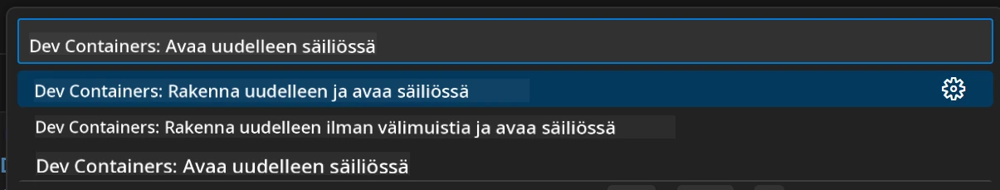
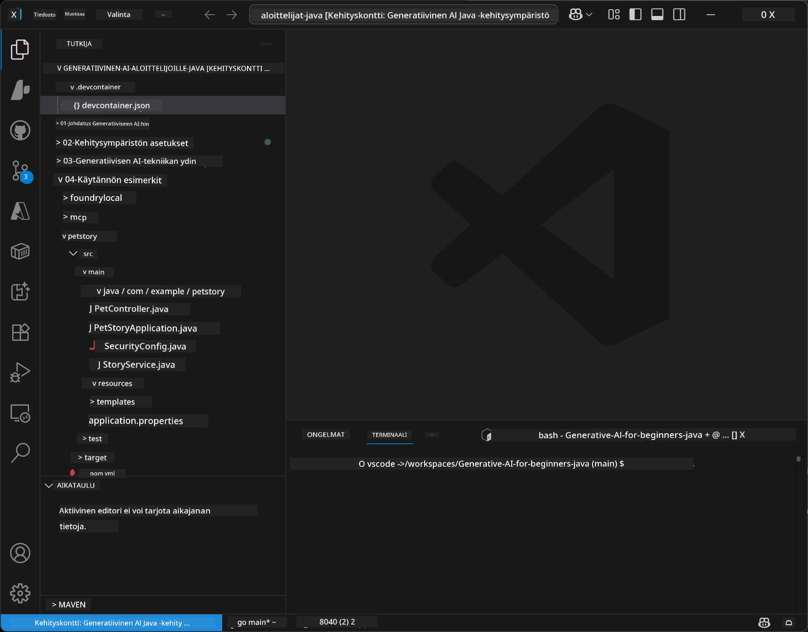
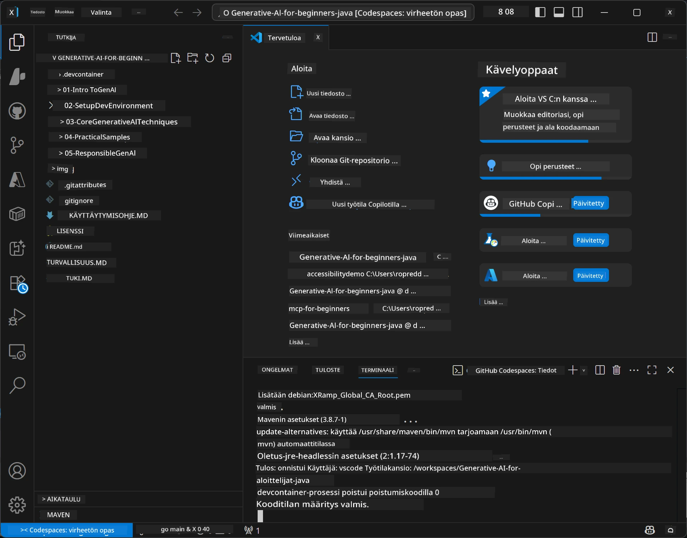

# Kehitysympäristön asentaminen Generative AI:ta varten Javassa

> **Pika-aloitus**: Koodaa pilvessä 2 minuutissa – siirry kohtaan [GitHub Codespaces -asennus](../../../02-SetupDevEnvironment) – ei tarvitse paikallista asennusta ja käyttää GitHub-malleja!

> **Kiinnostaako Azure OpenAI?**, katso [Azure OpenAI -asennusopas](getting-started-azure-openai.md) uusien Azure OpenAI -resurssien luomiseen.

## Mitä opit

- Miten asennat Java-kehitysympäristön tekoälysovelluksia varten
- Kuinka valitset ja konfiguroit haluamasi kehitysympäristön (pilvipainotteinen Codespaces, paikallinen dev container tai täydellinen paikallinen asennus)
- Testaat asennuksesi yhdistämällä GitHub-malleihin

## Sisällysluettelo

- [Mitä opit](../../../02-SetupDevEnvironment)
- [Johdanto](../../../02-SetupDevEnvironment)
- [Vaihe 1: Kehitysympäristön asentaminen](../../../02-SetupDevEnvironment)
  - [Vaihtoehto A: GitHub Codespaces (suositus)](../../../02-SetupDevEnvironment)
  - [Vaihtoehto B: Paikallinen dev container](../../../02-SetupDevEnvironment)
  - [Vaihtoehto C: Käytä olemassa olevaa paikallista asennustasi](../../../02-SetupDevEnvironment)
- [Vaihe 2: GitHub-henkilökohtaisten käyttöoikeustunnusten luominen](../../../02-SetupDevEnvironment)
- [Vaihe 3: Asennuksen testaaminen](../../../02-SetupDevEnvironment)
- [Vianetsintä](../../../02-SetupDevEnvironment)
- [Yhteenveto](../../../02-SetupDevEnvironment)
- [Seuraavat askeleet](../../../02-SetupDevEnvironment)

## Johdanto

Tässä luvussa opastamme sinut läpi kehitysympäristön asentamisen. Käytämme pääesimerkkinä **GitHub-malleja**, koska ne ovat ilmaisia, helppoja ottaa käyttöön pelkällä GitHub-tilillä, eivät vaadi luottokorttia ja tarjoavat useita malleja kokeiltavaksi.

**Paikallista asennusta ei tarvita!** Voit aloittaa koodaamisen heti GitHub Codespacesin avulla, joka antaa täyden kehitysympäristön selaimessasi.


Suosittelemme tämän kurssin käyttämistä yhdessä [**GitHub Models**](https://github.com/marketplace?type=models) kanssa, koska se on:
- **Ilmainen** aloittaa
- **Helppo** ottaa käyttöön pelkällä GitHub-tilillä
- **Ei luottokorttia** vaadita
- **Useita malleja** kokeiltavaksi

> **Huom:** Tässä koulutuksessa käytetyillä GitHub-malleilla on seuraavat ilmaiset rajoitukset:
> - 15 pyyntöä minuutissa (150 päivässä)
> - n. 8 000 sanaa sisään ja n. 4 000 sanaa ulos per pyyntö
> - 5 samanaikaista pyyntöä
> 
> Tuotantokäyttöön suosittelemme päivitystä Azure AI Foundry -malleihin Azure-tililläsi. Koodiasi ei tarvitse muuttaa. Katso [Azure AI Foundry -dokumentaatio](https://learn.microsoft.com/azure/ai-foundry/foundry-models/how-to/quickstart-github-models).

## Vaihe 1: Kehitysympäristön asentaminen

<a name="quick-start-cloud"></a>

Olemme luoneet valmiiksi määritellyn kehityskontainerin, jotta asennusaika minimoidaan ja sinulla on kaikki tarvittavat työkalut Generative AI Java -kurssia varten. Valitse haluamasi kehitystapa:

### Kehitysympäristön asennusvaihtoehdot:

#### Vaihtoehto A: GitHub Codespaces (suositus)

**Aloita koodaaminen 2 minuutissa – paikallista asennusta ei tarvita!**

1. Forkkaa tämä repositorio omaan GitHub-tiliisi
   > **Huom:** Jos haluat muokata peruskonfiguraatiota, katso [Dev Container Configuration](../../../.devcontainer/devcontainer.json)
2. Klikkaa **Code** → **Codespaces** -välilehti → **...** → **New with options...**
3. Käytä oletusasetuksia – tämä valitsee **Dev container configuration**: **Generative AI Java Development Environment** -erikoiskehityskontainerin tälle kurssille
4. Klikkaa **Create codespace**
5. Odota noin 2 minuuttia, että ympäristö on valmis
6. Jatka kohtaan [Vaihe 2: Luo GitHub-tunnus](../../../02-SetupDevEnvironment)







> **Codespacesin edut**:
> - Ei tarvitse paikallista asennusta
> - Toimii millä tahansa laitteella, jossa on selain
> - Esikonfiguroitu kaikilla työkaluilla ja riippuvuuksilla
> - Henkilökohtaisille tileille ilmainen 60 tuntia kuukaudessa
> - Tasalaatuinen ympäristö kaikille oppijoille

#### Vaihtoehto B: Paikallinen dev container

**Kehittäjille, jotka haluavat paikallista Docker-kehitystä**

1. Forkkaa ja kloonaa tämä repositorio paikalliselle koneellesi
   > **Huom:** Jos haluat muokata peruskonfiguraatiota, katso [Dev Container Configuration](../../../.devcontainer/devcontainer.json)
2. Asenna [Docker Desktop](https://www.docker.com/products/docker-desktop/) ja [VS Code](https://code.visualstudio.com/)
3. Asenna [Dev Containers -laajennus](https://marketplace.visualstudio.com/items?itemName=ms-vscode-remote.remote-containers) VS Codeen
4. Avaa repositoriokansio VS Codessa
5. Kun saat kehotteen, klikkaa **Reopen in Container** (tai käytä `Ctrl+Shift+P` → "Dev Containers: Reopen in Container")
6. Odota, että kontaineri rakentuu ja käynnistyy
7. Jatka kohtaan [Vaihe 2: Luo GitHub-tunnus](../../../02-SetupDevEnvironment)





#### Vaihtoehto C: Käytä olemassa olevaa paikallista asennustasi

**Kehittäjille, joilla on jo Java-ympäristö asennettuna**

Esivaatimukset:
- [Java 21+](https://www.oracle.com/java/technologies/javase/jdk21-archive-downloads.html) 
- [Maven 3.9+](https://maven.apache.org/download.cgi)
- [VS Code](https://code.visualstudio.com) tai haluamasi IDE

Vaiheet:
1. Kloonaa tämä repositorio paikalliselle koneellesi
2. Avaa projekti IDE:ssäsi
3. Jatka kohtaan [Vaihe 2: Luo GitHub-tunnus](../../../02-SetupDevEnvironment)

> **Vinkki ammattilaisille**: Jos sinulla on heikkotehoinen kone, mutta haluat VS Coden paikallisesti, käytä GitHub Codespacesia! Voit yhdistää paikallisen VS Codesi pilvipohjaiseen Codespaceen ja saada molempien parhaat puolet.



## Vaihe 2: Luo GitHub-henkilökohtainen käyttöoikeustunnus

1. Mene osoitteeseen [GitHub Asetukset](https://github.com/settings/profile) ja valitse profiilivalikosta **Settings**.
2. Vasemmassa sivupalkissa klikkaa **Developer settings** (yleensä alhaalla).
3. Valitse **Personal access tokens** → **Fine-grained tokens** (tai käytä suoraa [linkkiä](https://github.com/settings/personal-access-tokens)).
4. Klikkaa **Generate new token**.
5. Kirjoita "Token name" -kohtaan kuvaava nimi (esim. `GenAI-Java-Course-Token`).
6. Aseta vanhentumispäivä (suositus: 7 päivää turvallisuuden vuoksi).
7. Valitse "Resource owner":ksi oma käyttäjätilisi.
8. Valitse "Repository access" -kohdasta repositoriot, joita haluat käyttää GitHub-mallien kanssa (tai "All repositories", jos tarpeen).
9. Käy "Account permissions" -kohdassa läpi ja etsi **Models**, aseta se **Read-onlyksi**.
10. Klikkaa **Generate token**.
11. **Kopioi ja tallenna token heti** – et näe sitä enää uudestaan!

> **Turvallisuusvinkki**: Käytä vain välttämättömät käyttöoikeudet ja lyhyintä mahdollisuutta voimassaoloaikaa.

## Vaihe 3: Testaa asennus GitHub Models -esimerkillä

Kun kehitysympäristö on valmis, testataan GitHub-mallien yhdistäminen esimerkkisovelluksella kansiossa [`02-SetupDevEnvironment/examples/github-models`](../../../02-SetupDevEnvironment/examples/github-models).

1. Avaa terminaali kehitysympäristössäsi.
2. Siirry GitHub Models -esimerkkikansioon:
   ```bash
   cd 02-SetupDevEnvironment/examples/github-models
   ```
3. Aseta GitHub-tunnuksesi ympäristömuuttujaksi:
   ```bash
   # macOS/Linux
   export GITHUB_TOKEN=your_token_here
   
   # Windows (Komentokehote)
   set GITHUB_TOKEN=your_token_here
   
   # Windows (PowerShell)
   $env:GITHUB_TOKEN="your_token_here"
   ```

4. Käynnistä sovellus:
   ```bash
   mvn compile exec:java -Dexec.mainClass="com.example.githubmodels.App"
   ```

Sinun pitäisi nähdä tuloste, joka muistuttaa tätä:
```text
Using model: gpt-4.1-nano
Sending request to GitHub Models...
Response: Hello World!
```

### Ymmärrä esimerkkikoodi

Katsotaan ensin mitä ajoimme. `examples/github-models` -kansiossa oleva esimerkki käyttää OpenAI Java SDK:ta yhdistääkseen GitHub-malleihin:

**Mitkä asiat tämä koodi tekee:**
- **Yhdistää** GitHub-malleihin henkilökohtaisen käyttöoikeustunnuksesi avulla
- **Lähettää** yksinkertaisen "Say Hello World!" -viestin AI-mallille
- **Vastaanottaa** ja näyttää AI:n vastauksen
- **Varmistaa**, että asennuksesi toimii oikein

**Tärkeä riippuvuus** (tiedostossa `pom.xml`):
```xml
<dependency>
    <groupId>com.openai</groupId>
    <artifactId>openai-java</artifactId>
    <version>2.12.0</version>
</dependency>
```

**Pääkoodi** (`App.java`):
```java
// Yhdistä GitHub-malleihin OpenAI Java SDK:n avulla
OpenAIClient client = OpenAIOkHttpClient.builder()
    .apiKey(pat)
    .baseUrl("https://models.inference.ai.azure.com")
    .build();

// Luo chat-vastauksen pyyntö
ChatCompletionCreateParams params = ChatCompletionCreateParams.builder()
    .model(modelId)
    .addSystemMessage("You are a concise assistant.")
    .addUserMessage("Say Hello World!")
    .build();

// Hanki tekoälyn vastaus
ChatCompletion response = client.chat().completions().create(params);
System.out.println("Response: " + response.choices().get(0).message().content().orElse("No response content"));
```

## Yhteenveto

Hienoa! Sinulla on nyt kaikki asennettuna:

- Loit GitHub-henkilökohtaisen käyttöoikeustunnuksen AI-mallien käyttöön tarvittavilla oikeuksilla
- Käynnistit Java-kehitysympäristösi (Codespaces, dev container tai paikallinen)
- Yhdistit GitHub-malleihin käyttämällä OpenAI Java SDK:ta ilmaiseen AI-kehitykseen
- Testasit kaiken toimivan yksinkertaisella esimerkillä, joka kommunikoi AI-mallien kanssa

## Seuraavat askeleet

[Luku 3: Keskeiset generatiivisen tekoälyn tekniikat](../03-CoreGenerativeAITechniques/README.md)

## Vianetsintä

Ongelmia? Tässä yleisimmät ongelmat ja ratkaisut:

- **Token ei toimi?**  
  - Varmista, että kopioit tokenin kokonaan, ilman ylimääräisiä välilyöntejä  
  - Tarkista, että token on asetettu oikein ympäristömuuttujaksi  
  - Varmista, että tokenilla on oikeat oikeudet (Models: Read-only)

- **Mavenia ei löydy?**  
  - Käytätkö dev containeria tai Codespacesia? Maven on siellä valmiiksi asennettu  
  - Paikallisessa asennuksessa varmista, että Java 21+ ja Maven 3.9+ on asennettu  
  - Kokeile komentoa `mvn --version` asennuksen tarkistamiseen

- **Yhteysongelmat?**  
  - Tarkista internet-yhteytesi  
  - Varmista, että GitHub on verkostossasi saavutettavissa  
  - Varmista ettei palomuuri estä GitHub Models -päätepistettä

- **Dev container ei käynnisty?**  
  - Tarkista, että Docker Desktop on käynnissä (paikallisessa kehityksessä)  
  - Kokeile uudelleenrakentaa kontaineri: `Ctrl+Shift+P` → "Dev Containers: Rebuild Container"

- **Sovelluksen käännösvirheet?**  
  - Varmista, että olet oikeassa kansiossa: `02-SetupDevEnvironment/examples/github-models`  
  - Kokeile puhdistaa ja kääntää uudelleen: `mvn clean compile`

> **Tarvitsetko apua?**: Jos ongelmat jatkuvat, avaa issue repositorioon, niin autamme.

---

<!-- CO-OP TRANSLATOR DISCLAIMER START -->
**Vastuuvapauslauseke**:
Tämä asiakirja on käännetty käyttämällä tekoälypohjaista käännöspalvelua [Co-op Translator](https://github.com/Azure/co-op-translator). Vaikka pyrimme tarkkuuteen, huomioithan, että automaattikäännöksissä voi esiintyä virheitä tai epätarkkuuksia. Alkuperäinen asiakirja sen alkuperäiskielellä on katsottava viralliseksi lähteeksi. Tärkeissä tiedoissa suositellaan ammattimaista ihmiskäännöstä. Emme ole vastuussa tämän käännöksen käytöstä aiheutuvista väärinkäsityksistä tai tulkinnoista.
<!-- CO-OP TRANSLATOR DISCLAIMER END -->