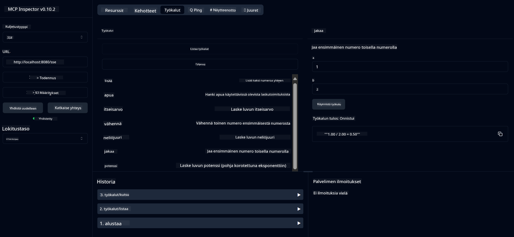

<!--
CO_OP_TRANSLATOR_METADATA:
{
  "original_hash": "5bd7a347d6ed1d706443f9129dd29dd9",
  "translation_date": "2025-07-25T09:42:13+00:00",
  "source_file": "04-PracticalSamples/mcp/calculator/README.md",
  "language_code": "fi"
}
-->
# Peruslaskin MCP-palvelu

>**Huom**: Tämä luku sisältää [**Opetusohjelman**](./TUTORIAL.md), joka opastaa sinut esimerkkien läpi.

Tervetuloa ensimmäiseen käytännön kokemukseesi **Model Context Protocolin (MCP)** parissa! Aiemmissa luvuissa olet oppinut generatiivisen tekoälyn perusteet ja valmistellut kehitysympäristösi. Nyt on aika rakentaa jotain käytännöllistä.

Tämä laskinpalvelu havainnollistaa, kuinka tekoälymallit voivat turvallisesti käyttää ulkoisia työkaluja MCP:n avulla. Sen sijaan, että luottaisimme tekoälymallin toisinaan epäluotettaviin laskentataitoihin, näytämme, kuinka rakentaa vankka järjestelmä, jossa tekoäly voi kutsua erikoistuneita palveluita tarkkojen laskelmien suorittamiseksi.

## Sisällysluettelo

- [Mitä opit](../../../../../04-PracticalSamples/mcp/calculator)
- [Esitietovaatimukset](../../../../../04-PracticalSamples/mcp/calculator)
- [Keskeiset käsitteet](../../../../../04-PracticalSamples/mcp/calculator)
- [Pikakäynnistys](../../../../../04-PracticalSamples/mcp/calculator)
- [Saatavilla olevat laskinoperaatiot](../../../../../04-PracticalSamples/mcp/calculator)
- [Testiasiakkaat](../../../../../04-PracticalSamples/mcp/calculator)
  - [1. Suora MCP-asiakas (SDKClient)](../../../../../04-PracticalSamples/mcp/calculator)
  - [2. Tekoälypohjainen asiakas (LangChain4jClient)](../../../../../04-PracticalSamples/mcp/calculator)
- [MCP Inspector (Web-käyttöliittymä)](../../../../../04-PracticalSamples/mcp/calculator)
  - [Vaiheittaiset ohjeet](../../../../../04-PracticalSamples/mcp/calculator)

## Mitä opit

Tämän esimerkin avulla opit:
- Kuinka luoda MCP-yhteensopivia palveluita Spring Bootilla
- Suoran protokollaviestinnän ja tekoälypohjaisen vuorovaikutuksen erot
- Kuinka tekoälymallit päättävät, milloin ja miten käyttää ulkoisia työkaluja
- Parhaita käytäntöjä työkaluja hyödyntävien tekoälysovellusten rakentamiseen

Täydellinen aloittelijoille, jotka haluavat oppia MCP:n perusteet ja ovat valmiita rakentamaan ensimmäisen tekoälytyökalunsa!

## Esitietovaatimukset

- Java 21+
- Maven 3.6+
- **GitHub Token**: Tarvitaan tekoälypohjaista asiakasta varten. Jos et ole vielä asettanut tätä, katso [Luku 2: Kehitysympäristön asennus](../../../02-SetupDevEnvironment/README.md) ohjeita.

## Keskeiset käsitteet

**Model Context Protocol (MCP)** on standardoitu tapa, jolla tekoälysovellukset voivat turvallisesti yhdistyä ulkoisiin työkaluihin. Voit ajatella sitä "siltana", joka mahdollistaa tekoälymallien ulkoisten palveluiden, kuten laskimen, käytön. Sen sijaan, että tekoälymalli yrittäisi itse laskea (mikä voi olla epäluotettavaa), se voi kutsua laskinpalveluamme saadakseen tarkkoja tuloksia. MCP varmistaa, että tämä viestintä tapahtuu turvallisesti ja johdonmukaisesti.

**Server-Sent Events (SSE)** mahdollistaa reaaliaikaisen viestinnän palvelimen ja asiakkaiden välillä. Toisin kuin perinteiset HTTP-pyynnöt, joissa odotetaan vastausta, SSE mahdollistaa palvelimen jatkuvan päivitysten lähettämisen asiakkaalle. Tämä on täydellinen tekoälysovelluksille, joissa vastaukset voivat olla suoratoistettuja tai kestää aikaa.

**Tekoälytyökalut ja funktiokutsut** antavat tekoälymalleille mahdollisuuden automaattisesti valita ja käyttää ulkoisia toimintoja (kuten laskinoperaatioita) käyttäjän pyyntöjen perusteella. Kun kysyt "Mikä on 15 + 27?", tekoälymalli ymmärtää, että haluat yhteenlaskun, kutsuu automaattisesti `add`-työkalua oikeilla parametreilla (15, 27) ja palauttaa tuloksen luonnollisella kielellä. Tekoäly toimii älykkäänä koordinaattorina, joka tietää, milloin ja miten käyttää kutakin työkalua.

## Pikakäynnistys

### 1. Siirry laskinsovelluksen hakemistoon
```bash
cd Generative-AI-for-beginners-java/04-PracticalSamples/mcp/calculator
```

### 2. Rakenna ja suorita
```bash
mvn clean install -DskipTests
java -jar target/calculator-server-0.0.1-SNAPSHOT.jar
```

### 3. Testaa asiakkailla
- **SDKClient**: Suora MCP-protokollan käyttö
- **LangChain4jClient**: Tekoälypohjainen luonnollisen kielen vuorovaikutus (vaatii GitHub-tokenin)

## Saatavilla olevat laskinoperaatiot

- `add(a, b)`, `subtract(a, b)`, `multiply(a, b)`, `divide(a, b)`
- `power(base, exponent)`, `squareRoot(number)`, `absolute(number)`
- `modulus(a, b)`, `help()`

## Testiasiakkaat

### 1. Suora MCP-asiakas (SDKClient)
Testaa raakaa MCP-protokollaviestintää. Suorita:
```bash
mvn test-compile exec:java -Dexec.mainClass="com.microsoft.mcp.sample.client.SDKClient" -Dexec.classpathScope=test
```

### 2. Tekoälypohjainen asiakas (LangChain4jClient)
Havainnollistaa luonnollisen kielen vuorovaikutusta GitHub-mallien kanssa. Vaatii GitHub-tokenin (katso [Esitietovaatimukset](../../../../../04-PracticalSamples/mcp/calculator)).

**Suorita:**
```bash
mvn test-compile exec:java -Dexec.mainClass="com.microsoft.mcp.sample.client.LangChain4jClient" -Dexec.classpathScope=test
```

## MCP Inspector (Web-käyttöliittymä)

MCP Inspector tarjoaa visuaalisen verkkokäyttöliittymän MCP-palvelusi testaamiseen ilman koodausta. Täydellinen aloittelijoille MCP:n toiminnan ymmärtämiseen!

### Vaiheittaiset ohjeet:

1. **Käynnistä laskinpalvelin** (jos se ei ole jo käynnissä):
   ```bash
   java -jar target/calculator-server-0.0.1-SNAPSHOT.jar
   ```

2. **Asenna ja suorita MCP Inspector** uudessa terminaalissa:
   ```bash
   npx @modelcontextprotocol/inspector
   ```

3. **Avaa verkkokäyttöliittymä**:
   - Etsi viesti, kuten "Inspector running at http://localhost:6274"
   - Avaa kyseinen URL selaimessasi

4. **Yhdistä laskinpalveluusi**:
   - Verkkokäyttöliittymässä aseta kuljetustyypiksi "SSE"
   - Aseta URL:ksi: `http://localhost:8080/sse`
   - Klikkaa "Connect"-painiketta

5. **Tutki saatavilla olevia työkaluja**:
   - Klikkaa "List Tools" nähdäksesi kaikki laskinoperaatiot
   - Näet toimintoja, kuten `add`, `subtract`, `multiply`, jne.

6. **Testaa laskinoperaatiota**:
   - Valitse työkalu (esim. "add")
   - Syötä parametrit (esim. `a: 15`, `b: 27`)
   - Klikkaa "Run Tool"
   - Näe MCP-palvelusi palauttama tulos!

Tämä visuaalinen lähestymistapa auttaa sinua ymmärtämään tarkasti, kuinka MCP-viestintä toimii ennen omien asiakkaiden rakentamista.



---
**Viite:** [MCP Server Boot Starter -dokumentaatio](https://docs.spring.io/spring-ai/reference/api/mcp/mcp-server-boot-starter-docs.html)

**Vastuuvapauslauseke**:  
Tämä asiakirja on käännetty käyttämällä tekoälypohjaista käännöspalvelua [Co-op Translator](https://github.com/Azure/co-op-translator). Vaikka pyrimme tarkkuuteen, huomioithan, että automaattiset käännökset voivat sisältää virheitä tai epätarkkuuksia. Alkuperäinen asiakirja sen alkuperäisellä kielellä tulisi pitää ensisijaisena lähteenä. Kriittisen tiedon osalta suositellaan ammattimaista ihmiskäännöstä. Emme ole vastuussa väärinkäsityksistä tai virhetulkinnoista, jotka johtuvat tämän käännöksen käytöstä.