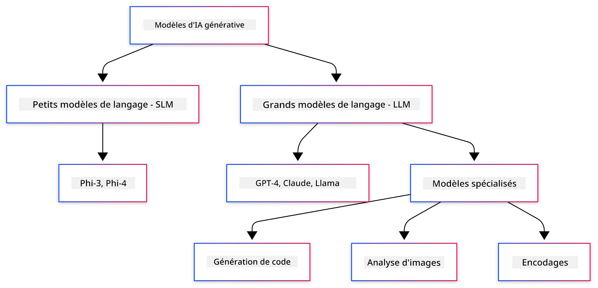
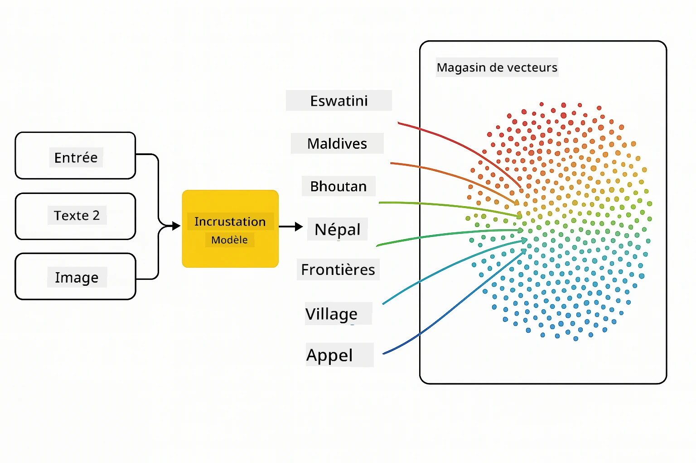
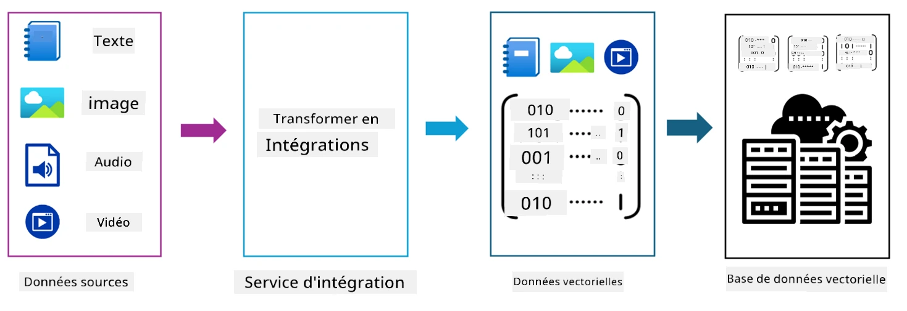
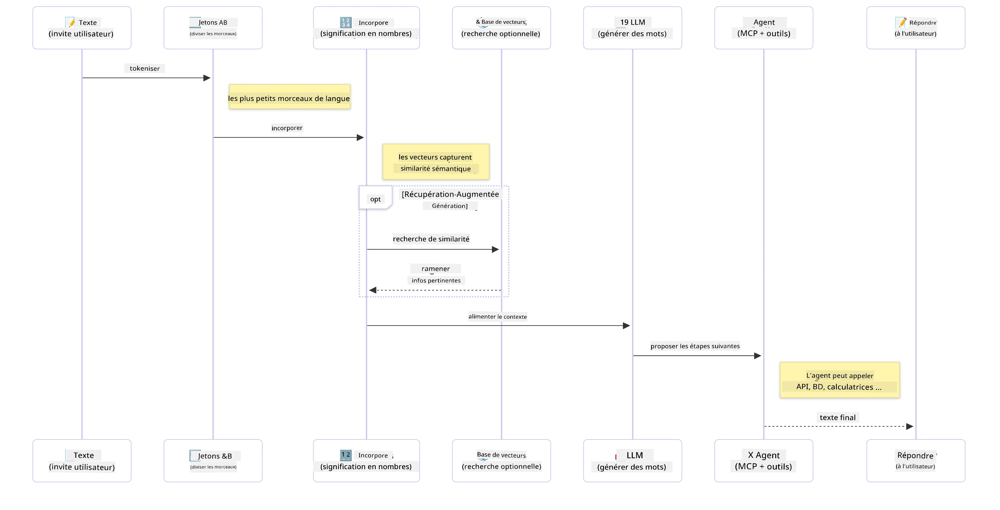

<!--
CO_OP_TRANSLATOR_METADATA:
{
  "original_hash": "75bfb080ca725e8a9aa9c80cae25fba1",
  "translation_date": "2025-07-29T07:56:34+00:00",
  "source_file": "01-IntroToGenAI/README.md",
  "language_code": "fr"
}
-->
# Introduction à l'IA Générative - Édition Java

## Ce que vous apprendrez

- **Les fondamentaux de l'IA générative**, y compris les LLMs, l'ingénierie des prompts, les tokens, les embeddings et les bases de données vectorielles
- **Comparer les outils de développement IA en Java**, notamment Azure OpenAI SDK, Spring AI et OpenAI Java SDK
- **Découvrir le protocole Model Context (MCP)** et son rôle dans la communication des agents IA

## Table des matières

- [Introduction](../../../01-IntroToGenAI)
- [Un rappel rapide sur les concepts de l'IA générative](../../../01-IntroToGenAI)
- [Revue de l'ingénierie des prompts](../../../01-IntroToGenAI)
- [Tokens, embeddings et agents](../../../01-IntroToGenAI)
- [Outils et bibliothèques de développement IA pour Java](../../../01-IntroToGenAI)
  - [OpenAI Java SDK](../../../01-IntroToGenAI)
  - [Spring AI](../../../01-IntroToGenAI)
  - [Azure OpenAI Java SDK](../../../01-IntroToGenAI)
- [Résumé](../../../01-IntroToGenAI)
- [Prochaines étapes](../../../01-IntroToGenAI)

## Introduction

Bienvenue dans le premier chapitre de "L'IA Générative pour les Débutants - Édition Java" ! Cette leçon fondamentale vous introduit aux concepts clés de l'IA générative et à leur utilisation avec Java. Vous apprendrez les éléments essentiels des applications d'IA, notamment les modèles de langage de grande taille (LLMs), les tokens, les embeddings et les agents IA. Nous explorerons également les principaux outils Java que vous utiliserez tout au long de ce cours.

### Un rappel rapide sur les concepts de l'IA générative

L'IA générative est un type d'intelligence artificielle qui crée du contenu nouveau, comme du texte, des images ou du code, en se basant sur des motifs et des relations appris à partir de données. Les modèles d'IA générative peuvent produire des réponses semblables à celles des humains, comprendre le contexte et parfois même créer du contenu qui semble humain.

En développant vos applications IA en Java, vous travaillerez avec des **modèles d'IA générative** pour créer du contenu. Voici quelques capacités des modèles d'IA générative :

- **Génération de texte** : Rédaction de textes semblables à ceux des humains pour des chatbots, du contenu ou des complétions de texte.
- **Génération et analyse d'images** : Création d'images réalistes, amélioration de photos et détection d'objets.
- **Génération de code** : Écriture de fragments de code ou de scripts.

Il existe des types spécifiques de modèles optimisés pour différentes tâches. Par exemple, les **modèles de langage de petite taille (SLMs)** et les **modèles de langage de grande taille (LLMs)** peuvent gérer la génération de texte, les LLMs offrant généralement de meilleures performances pour les tâches complexes. Pour les tâches liées aux images, vous utiliserez des modèles de vision spécialisés ou des modèles multimodaux.

Bien sûr, les réponses de ces modèles ne sont pas toujours parfaites. Vous avez probablement entendu parler de modèles qui "hallucinent" ou génèrent des informations incorrectes de manière convaincante. Mais vous pouvez guider le modèle pour produire de meilleures réponses en lui fournissant des instructions et un contexte clairs. C'est là qu'intervient **l'ingénierie des prompts**.

#### Revue de l'ingénierie des prompts

L'ingénierie des prompts consiste à concevoir des entrées efficaces pour guider les modèles d'IA vers les résultats souhaités. Cela implique :

- **Clarté** : Rendre les instructions claires et non ambiguës.
- **Contexte** : Fournir les informations de base nécessaires.
- **Contraintes** : Spécifier les limitations ou les formats.

Quelques bonnes pratiques pour l'ingénierie des prompts incluent la conception des prompts, des instructions claires, la décomposition des tâches, l'apprentissage en un ou quelques exemples, et l'ajustement des prompts. Tester différents prompts est essentiel pour trouver ce qui fonctionne le mieux pour votre cas d'utilisation spécifique.

Lorsque vous développez des applications, vous travaillerez avec différents types de prompts :
- **Prompts système** : Définissent les règles de base et le contexte pour le comportement du modèle
- **Prompts utilisateur** : Les données d'entrée provenant des utilisateurs de votre application
- **Prompts assistant** : Les réponses du modèle basées sur les prompts système et utilisateur

> **En savoir plus** : Apprenez-en davantage sur l'ingénierie des prompts dans le [chapitre sur l'ingénierie des prompts du cours GenAI pour les débutants](https://github.com/microsoft/generative-ai-for-beginners/tree/main/04-prompt-engineering-fundamentals)

#### Tokens, embeddings et agents

Lorsque vous travaillez avec des modèles d'IA générative, vous rencontrerez des termes comme **tokens**, **embeddings**, **agents** et **Model Context Protocol (MCP)**. Voici un aperçu détaillé de ces concepts :

- **Tokens** : Les tokens sont les plus petites unités de texte dans un modèle. Ils peuvent être des mots, des caractères ou des sous-mots. Les tokens sont utilisés pour représenter les données textuelles dans un format compréhensible par le modèle. Par exemple, la phrase "The quick brown fox jumped over the lazy dog" pourrait être tokenisée comme ["The", " quick", " brown", " fox", " jumped", " over", " the", " lazy", " dog"] ou ["The", " qu", "ick", " br", "own", " fox", " jump", "ed", " over", " the", " la", "zy", " dog"] selon la stratégie de tokenisation.

La tokenisation est le processus de décomposition du texte en ces unités plus petites. Cela est crucial car les modèles fonctionnent sur les tokens plutôt que sur le texte brut. Le nombre de tokens dans un prompt affecte la longueur et la qualité de la réponse du modèle, car les modèles ont des limites de tokens pour leur fenêtre de contexte (par exemple, 128K tokens pour le contexte total de GPT-4o, incluant à la fois l'entrée et la sortie).

  En Java, vous pouvez utiliser des bibliothèques comme OpenAI SDK pour gérer automatiquement la tokenisation lors de l'envoi de requêtes aux modèles d'IA.

- **Embeddings** : Les embeddings sont des représentations vectorielles des tokens qui capturent leur signification sémantique. Ce sont des représentations numériques (généralement des tableaux de nombres à virgule flottante) qui permettent aux modèles de comprendre les relations entre les mots et de générer des réponses contextuellement pertinentes. Les mots similaires ont des embeddings similaires, ce qui permet au modèle de comprendre des concepts comme les synonymes et les relations sémantiques.

  En Java, vous pouvez générer des embeddings à l'aide de l'OpenAI SDK ou d'autres bibliothèques prenant en charge la génération d'embeddings. Ces embeddings sont essentiels pour des tâches comme la recherche sémantique, où vous souhaitez trouver un contenu similaire basé sur la signification plutôt que sur des correspondances exactes de texte.

- **Bases de données vectorielles** : Les bases de données vectorielles sont des systèmes de stockage spécialisés optimisés pour les embeddings. Elles permettent une recherche par similarité efficace et sont cruciales pour les modèles de génération augmentée par récupération (RAG), où vous devez trouver des informations pertinentes dans de grands ensembles de données en fonction de la similarité sémantique plutôt que des correspondances exactes.

> **Note** : Dans ce cours, nous ne couvrirons pas les bases de données vectorielles, mais elles méritent d'être mentionnées car elles sont couramment utilisées dans les applications réelles.

- **Agents & MCP** : Composants d'IA qui interagissent de manière autonome avec des modèles, des outils et des systèmes externes. Le protocole Model Context (MCP) fournit une méthode standardisée pour que les agents accèdent de manière sécurisée à des sources de données externes et à des outils. Apprenez-en davantage dans notre [cours MCP pour les débutants](https://github.com/microsoft/mcp-for-beginners).

Dans les applications IA en Java, vous utiliserez les tokens pour le traitement du texte, les embeddings pour la recherche sémantique et les modèles RAG, les bases de données vectorielles pour la récupération de données, et les agents avec MCP pour construire des systèmes intelligents utilisant des outils.

### Outils et bibliothèques de développement IA pour Java

Java offre d'excellents outils pour le développement IA. Il existe trois principales bibliothèques que nous explorerons tout au long de ce cours : OpenAI Java SDK, Azure OpenAI SDK et Spring AI.

Voici un tableau récapitulatif montrant quel SDK est utilisé dans les exemples de chaque chapitre :

| Chapitre | Exemple | SDK |
|----------|---------|-----|
| 02-SetupDevEnvironment | github-models | OpenAI Java SDK |
| 02-SetupDevEnvironment | basic-chat-azure | Spring AI Azure OpenAI |
| 03-CoreGenerativeAITechniques | exemples | Azure OpenAI SDK |
| 04-PracticalSamples | petstory | OpenAI Java SDK |
| 04-PracticalSamples | foundrylocal | OpenAI Java SDK |
| 04-PracticalSamples | calculator | Spring AI MCP SDK + LangChain4j |

**Liens vers la documentation des SDK :**
- [Azure OpenAI Java SDK](https://github.com/Azure/azure-sdk-for-java/tree/azure-ai-openai_1.0.0-beta.16/sdk/openai/azure-ai-openai)
- [Spring AI](https://docs.spring.io/spring-ai/reference/)
- [OpenAI Java SDK](https://github.com/openai/openai-java)
- [LangChain4j](https://docs.langchain4j.dev/)

#### OpenAI Java SDK

Le SDK OpenAI est la bibliothèque Java officielle pour l'API OpenAI. Il fournit une interface simple et cohérente pour interagir avec les modèles OpenAI, facilitant l'intégration des capacités d'IA dans les applications Java. L'exemple GitHub Models du chapitre 2, ainsi que les applications Pet Story et Foundry Local du chapitre 4, démontrent l'approche avec le SDK OpenAI.

#### Spring AI

Spring AI est un framework complet qui apporte des capacités d'IA aux applications Spring, en fournissant une couche d'abstraction cohérente entre différents fournisseurs d'IA. Il s'intègre parfaitement à l'écosystème Spring, ce qui en fait un choix idéal pour les applications Java d'entreprise nécessitant des capacités d'IA.

La force de Spring AI réside dans son intégration fluide avec l'écosystème Spring, facilitant la création d'applications IA prêtes pour la production avec des modèles Spring familiers comme l'injection de dépendances, la gestion de la configuration et les frameworks de test. Vous utiliserez Spring AI dans les chapitres 2 et 4 pour construire des applications exploitant à la fois OpenAI et les bibliothèques Spring AI du protocole Model Context (MCP).

##### Protocole Model Context (MCP)

Le [protocole Model Context (MCP)](https://modelcontextprotocol.io/) est une norme émergente qui permet aux applications d'IA d'interagir de manière sécurisée avec des sources de données externes et des outils. MCP fournit une méthode standardisée pour que les modèles d'IA accèdent à des informations contextuelles et exécutent des actions dans vos applications.

Dans le chapitre 4, vous construirez un service de calculatrice MCP simple qui démontre les fondamentaux du protocole Model Context avec Spring AI, montrant comment créer des intégrations d'outils de base et des architectures de services.

#### Azure OpenAI Java SDK

La bibliothèque cliente Azure OpenAI pour Java est une adaptation des API REST d'OpenAI qui fournit une interface idiomatique et une intégration avec le reste de l'écosystème Azure SDK. Dans le chapitre 3, vous construirez des applications utilisant le SDK Azure OpenAI, y compris des applications de chat, des appels de fonctions et des modèles RAG (génération augmentée par récupération).

> Note : Le SDK Azure OpenAI est en retard par rapport au SDK OpenAI Java en termes de fonctionnalités, donc pour les projets futurs, envisagez d'utiliser le SDK OpenAI Java.

## Résumé

Cela conclut les bases ! Vous comprenez maintenant :

- Les concepts clés derrière l'IA générative - des LLMs et de l'ingénierie des prompts aux tokens, embeddings et bases de données vectorielles
- Vos options d'outils pour le développement IA en Java : Azure OpenAI SDK, Spring AI et OpenAI Java SDK
- Ce qu'est le protocole Model Context et comment il permet aux agents IA de travailler avec des outils externes

## Prochaines étapes

[Chapitre 2 : Configuration de l'environnement de développement](../02-SetupDevEnvironment/README.md)

**Avertissement** :  
Ce document a été traduit à l'aide du service de traduction automatique [Co-op Translator](https://github.com/Azure/co-op-translator). Bien que nous nous efforcions d'assurer l'exactitude, veuillez noter que les traductions automatisées peuvent contenir des erreurs ou des inexactitudes. Le document original dans sa langue d'origine doit être considéré comme la source faisant autorité. Pour des informations critiques, il est recommandé de faire appel à une traduction humaine professionnelle. Nous déclinons toute responsabilité en cas de malentendus ou d'interprétations erronées résultant de l'utilisation de cette traduction.