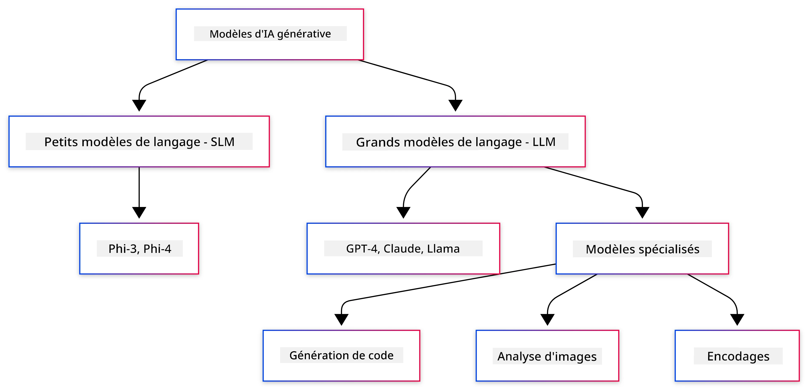
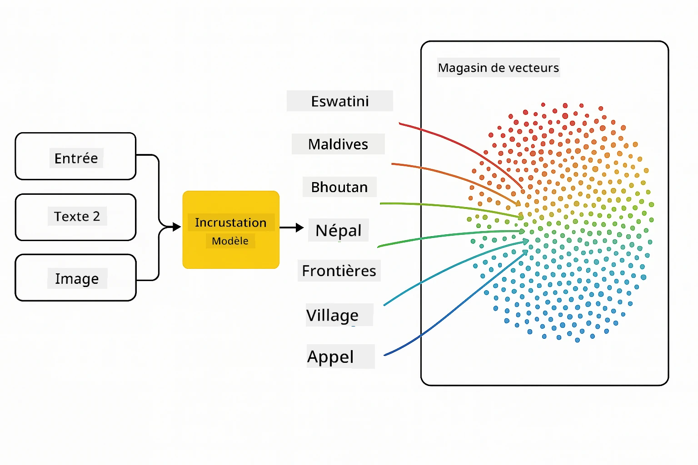
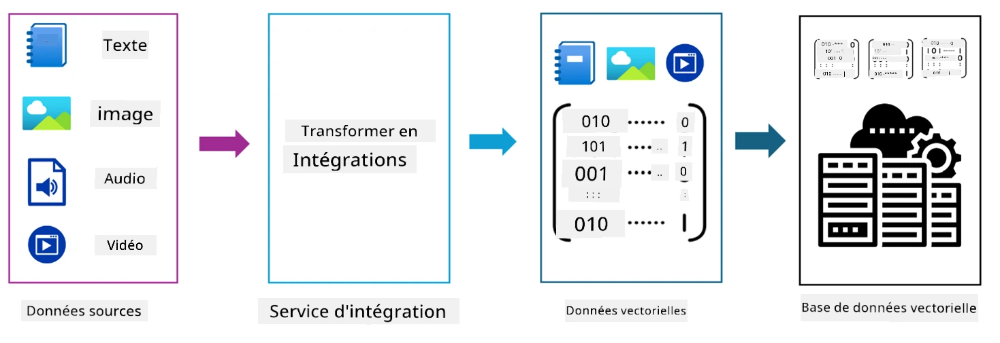
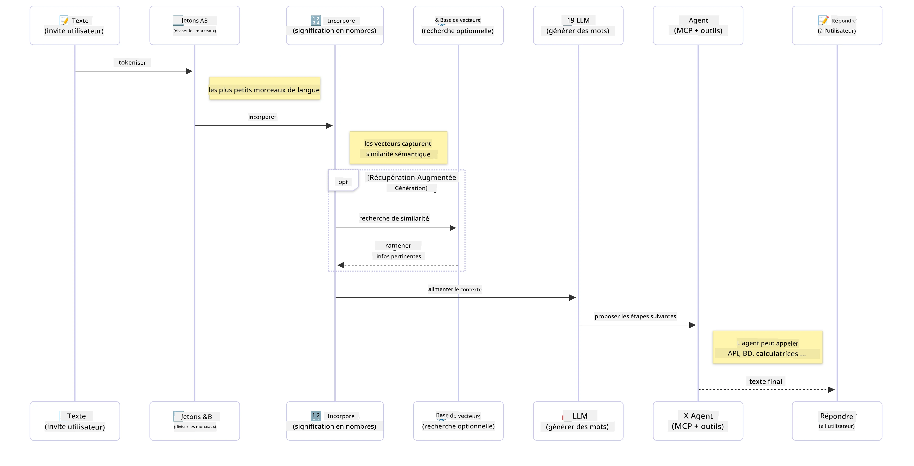

# Introduction à l'IA Générative - Édition Java

> **Vidéo** : [Regardez la vidéo de présentation de cette leçon sur YouTube.](https://www.youtube.com/watch?v=XH46tGp_eSw) Vous pouvez aussi cliquer sur l'image miniature ci-dessus.

## Ce que vous apprendrez

- **Les fondamentaux de l'IA générative** incluant les LLM, l'ingénierie des prompts, les tokens, les embeddings, et les bases de données vectorielles  
- **Comparer les outils de développement IA Java** incluant Azure OpenAI SDK, Spring AI, et OpenAI Java SDK  
- **Découvrir le Model Context Protocol** et son rôle dans la communication des agents IA  

## Table des matières

- [Introduction](#introduction)  
- [Un rappel rapide sur les concepts de l’IA générative](#un-rappel-rapide-sur-les-concepts-de-l’ia-générative)  
- [Revue de l’ingénierie des prompts](#revue-de-l’ingénierie-des-prompts)  
- [Tokens, embeddings et agents](#tokens-embeddings-et-agents)  
- [Outils et bibliothèques de développement IA pour Java](#outils-et-bibliothèques-de-développement-ia-pour-java)  
  - [OpenAI Java SDK](#openai-java-sdk)  
  - [Spring AI](#spring-ai)  
  - [Azure OpenAI Java SDK](#azure-openai-java-sdk)  
- [Résumé](#résumé)  
- [Étapes suivantes](#étapes-suivantes)  

## Introduction

Bienvenue dans le premier chapitre de l’IA Générative pour Débutants - Édition Java ! Cette leçon fondamentale vous introduit aux concepts clés de l’IA générative et à la façon de travailler avec ceux-ci en utilisant Java. Vous apprendrez les blocs de construction essentiels des applications IA, incluant les Large Language Models (LLM), les tokens, les embeddings et les agents IA. Nous explorerons également les principaux outils Java que vous utiliserez tout au long de ce cours.

### Un rappel rapide sur les concepts de l’IA générative

L’IA générative est un type d’intelligence artificielle qui crée du contenu nouveau, tel que du texte, des images ou du code, basé sur des modèles et des relations apprises à partir de données. Les modèles d’IA générative peuvent produire des réponses ressemblant à celles d’un humain, comprendre le contexte et parfois même créer du contenu qui semble humain.

En développant vos applications IA Java, vous travaillerez avec des **modèles d’IA générative** pour créer du contenu. Certaines capacités des modèles d’IA générative incluent :

- **Génération de texte** : Création de texte ressemblant à un humain pour des chatbots, du contenu, et la complétion de texte.  
- **Génération et analyse d’images** : Production d’images réalistes, amélioration des photos, et détection d’objets.  
- **Génération de code** : Écriture de fragments de code ou de scripts.  

Il existe des types spécifiques de modèles optimisés pour différentes tâches. Par exemple, les **Small Language Models (SLM)** et les **Large Language Models (LLM)** peuvent gérer la génération de texte, les LLM offrant généralement de meilleures performances pour des tâches complexes. Pour les tâches relatives aux images, vous utiliseriez des modèles spécialisés en vision ou des modèles multi-modaux.

Bien sûr, les réponses de ces modèles ne sont pas toujours parfaites. Vous avez probablement entendu parler de modèles qui « hallucinent » ou génèrent des informations incorrectes de manière catégorique. Mais vous pouvez guider le modèle pour produire de meilleures réponses en lui fournissant des instructions et un contexte clairs. C’est là qu’intervient **l’ingénierie des prompts**.

#### Revue de l’ingénierie des prompts

L’ingénierie des prompts consiste à concevoir des entrées efficaces pour orienter les modèles IA vers les sorties souhaitées. Elle implique :

- **Clarté** : Rendre les instructions claires et sans ambiguïtés.  
- **Contexte** : Fournir les informations de fond nécessaires.  
- **Contraintes** : Spécifier toute limitation ou format.  

Quelques bonnes pratiques d’ingénierie des prompts incluent la conception des prompts, des instructions claires, la décomposition des tâches, l’apprentissage one-shot et few-shot, et l’ajustement des prompts. Tester différents prompts est essentiel pour trouver ce qui fonctionne le mieux pour votre cas d’usage spécifique.

Lors du développement d’applications, vous travaillerez avec différents types de prompts :  
- **Prompts système** : Définissent les règles de base et le contexte du comportement du modèle  
- **Prompts utilisateur** : Les données d’entrée fournies par vos utilisateurs  
- **Prompts assistant** : Les réponses du modèle basées sur les prompts système et utilisateur  

> **En savoir plus** : En savoir plus sur l’ingénierie des prompts dans [le chapitre Prompt Engineering du cours GenAI for Beginners](https://github.com/microsoft/generative-ai-for-beginners/tree/main/04-prompt-engineering-fundamentals)

#### Tokens, embeddings et agents

Lorsque vous travaillez avec des modèles d’IA générative, vous rencontrerez des termes comme **tokens**, **embeddings**, **agents**, et **Model Context Protocol (MCP)**. Voici un aperçu détaillé de ces concepts :

- **Tokens** : Les tokens sont la plus petite unité de texte dans un modèle. Ils peuvent être des mots, des caractères ou des sous-mots. Les tokens sont utilisés pour représenter les données textuelles dans un format que le modèle peut comprendre. Par exemple, la phrase « The quick brown fox jumped over the lazy dog » peut être tokenisée en ["The", " quick", " brown", " fox", " jumped", " over", " the", " lazy", " dog"] ou ["The", " qu", "ick", " br", "own", " fox", " jump", "ed", " over", " the", " la", "zy", " dog"] selon la stratégie de tokenisation choisie.

La tokenisation est le processus qui consiste à décomposer le texte en ces petites unités. Cela est crucial car les modèles opèrent sur des tokens plutôt que sur du texte brut. Le nombre de tokens dans un prompt influence la longueur et la qualité de la réponse, les modèles ayant des limites de tokens pour leur fenêtre de contexte (ex. : 128K tokens pour le contexte total de GPT-4o, incluant entrée et sortie).

  En Java, vous pouvez utiliser des bibliothèques comme l’OpenAI SDK pour gérer automatiquement la tokenisation lors de l’envoi de requêtes aux modèles IA.

- **Embeddings** : Les embeddings sont des représentations vectorielles des tokens qui capturent la signification sémantique. Ce sont des représentations numériques (typiquement des tableaux de nombres à virgule flottante) qui permettent aux modèles de comprendre les relations entre les mots et de générer des réponses contextuellement pertinentes. Des mots similaires ont des embeddings similaires, ce qui permet au modèle de saisir des concepts comme les synonymes et les relations sémantiques.

  En Java, vous pouvez générer des embeddings en utilisant l’OpenAI SDK ou d’autres bibliothèques qui supportent la génération d’embeddings. Ces embeddings sont essentiels pour des tâches comme la recherche sémantique, où vous souhaitez trouver du contenu similaire basé sur le sens plutôt que sur une correspondance textuelle exacte.

- **Bases de données vectorielles** : Les bases de données vectorielles sont des systèmes de stockage spécialisés optimisés pour les embeddings. Elles permettent une recherche efficace de similarité et sont cruciales pour les schémas Retrieval-Augmented Generation (RAG), où il est nécessaire de trouver des informations pertinentes dans de grands ensembles de données basées sur la similarité sémantique plutôt que sur des correspondances exactes.

> **Note** : Dans ce cours, nous ne couvrirons pas les bases de données vectorielles mais pensons qu’il est utile de les mentionner car elles sont couramment utilisées dans les applications réelles.

- **Agents & MCP** : Composants IA qui interagissent de manière autonome avec des modèles, outils et systèmes externes. Le Model Context Protocol (MCP) fournit un moyen standardisé aux agents d’accéder en toute sécurité à des sources de données et outils externes. Découvrez-en plus dans notre cours [MCP for Beginners](https://github.com/microsoft/mcp-for-beginners).

Dans les applications IA Java, vous utiliserez les tokens pour le traitement du texte, les embeddings pour la recherche sémantique et RAG, les bases de données vectorielles pour la récupération de données, et les agents avec MCP pour construire des systèmes intelligents utilisant des outils. 

### Outils et bibliothèques de développement IA pour Java

Java offre d’excellents outils pour le développement IA. Il existe trois bibliothèques principales que nous explorerons tout au long de ce cours - OpenAI Java SDK, Azure OpenAI SDK et Spring AI.

Voici un tableau récapitulatif rapide montrant quel SDK est utilisé dans les exemples de chaque chapitre :

| Chapitre | Exemple | SDK |
|---------|--------|-----|
| 02-SetupDevEnvironment | github-models | OpenAI Java SDK |
| 02-SetupDevEnvironment | basic-chat-azure | Spring AI Azure OpenAI |
| 03-CoreGenerativeAITechniques | examples | Azure OpenAI SDK |
| 04-PracticalSamples | petstory | OpenAI Java SDK |
| 04-PracticalSamples | foundrylocal | OpenAI Java SDK |
| 04-PracticalSamples | calculator | Spring AI MCP SDK + LangChain4j |

**Liens de documentation des SDK :**  
- [Azure OpenAI Java SDK](https://github.com/Azure/azure-sdk-for-java/tree/azure-ai-openai_1.0.0-beta.16/sdk/openai/azure-ai-openai)  
- [Spring AI](https://docs.spring.io/spring-ai/reference/)  
- [OpenAI Java SDK](https://github.com/openai/openai-java)  
- [LangChain4j](https://docs.langchain4j.dev/)  

#### OpenAI Java SDK

L’OpenAI SDK est la bibliothèque Java officielle pour l’API OpenAI. Elle offre une interface simple et cohérente pour interagir avec les modèles OpenAI, facilitant ainsi l’intégration des capacités IA dans les applications Java. Les exemples GitHub Models du Chapitre 2, l’application Pet Story et l’exemple Foundry Local du Chapitre 4 démontrent l’approche OpenAI SDK.

#### Spring AI

Spring AI est un cadre complet qui apporte les capacités IA aux applications Spring, offrant une couche d’abstraction cohérente entre différents fournisseurs d’IA. Il s’intègre parfaitement à l’écosystème Spring, ce qui en fait le choix idéal pour les applications Java d’entreprise ayant besoin de fonctionnalités IA.

La force de Spring AI réside dans son intégration transparente avec l’écosystème Spring, ce qui facilite la construction d’applications IA prêtes pour la production avec des patterns Spring familiers tels que l’injection de dépendances, la gestion de configuration et les frameworks de test. Vous utiliserez Spring AI dans les Chapitres 2 et 4 pour construire des applications qui tirent parti à la fois d’OpenAI et du Model Context Protocol (MCP) via les bibliothèques Spring AI.

##### Model Context Protocol (MCP)

Le [Model Context Protocol (MCP)](https://modelcontextprotocol.io/) est une norme émergente qui permet aux applications IA d’interagir de manière sécurisée avec des sources de données et outils externes. MCP offre un moyen standardisé pour que les modèles IA accèdent à des informations contextuelles et exécutent des actions dans vos applications.

Dans le Chapitre 4, vous construirez un service calculateur MCP simple qui démontre les fondamentaux du Model Context Protocol avec Spring AI, montrant comment créer des intégrations d’outils basiques et des architectures de services.

#### Azure OpenAI Java SDK

La bibliothèque cliente Azure OpenAI pour Java est une adaptation des API REST d’OpenAI qui fournit une interface idiomatique et une intégration avec l’ensemble de l’écosystème Azure SDK. Dans le Chapitre 3, vous développerez des applications utilisant l’Azure OpenAI SDK, incluant des applications de chat, l’appel de fonctions, et les patrons RAG (Retrieval-Augmented Generation).

> Note : L’Azure OpenAI SDK accuse un retard fonctionnel par rapport à l’OpenAI Java SDK, donc pour les projets futurs, envisagez d’utiliser l’OpenAI Java SDK.

## Résumé

Cela conclut les bases ! Vous comprenez désormais :

- Les concepts fondamentaux derrière l’IA générative - des LLM et de l’ingénierie des prompts aux tokens, embeddings et bases de données vectorielles  
- Vos options d’outils pour le développement IA en Java : Azure OpenAI SDK, Spring AI, et OpenAI Java SDK  
- Ce qu’est le Model Context Protocol et comment il permet aux agents IA de travailler avec des outils externes  

## Étapes suivantes

[Chapitre 2 : Mise en place de l’environnement de développement](../02-SetupDevEnvironment/README.md)

---

<!-- CO-OP TRANSLATOR DISCLAIMER START -->
**Avertissement** :  
Ce document a été traduit à l’aide du service de traduction automatique [Co-op Translator](https://github.com/Azure/co-op-translator). Bien que nous nous efforcions d’assurer l’exactitude, veuillez noter que les traductions automatiques peuvent contenir des erreurs ou des inexactitudes. Le document original dans sa langue native doit être considéré comme la source faisant foi. Pour les informations critiques, une traduction professionnelle réalisée par un humain est recommandée. Nous ne sommes pas responsables des malentendus ou des interprétations erronées résultant de l’utilisation de cette traduction.
<!-- CO-OP TRANSLATOR DISCLAIMER END -->