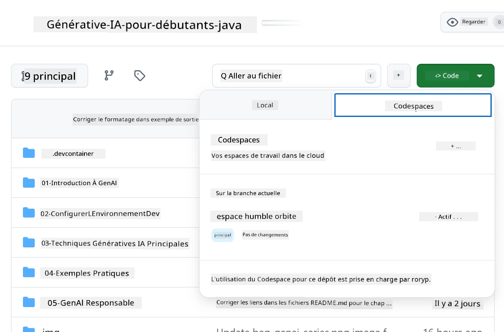
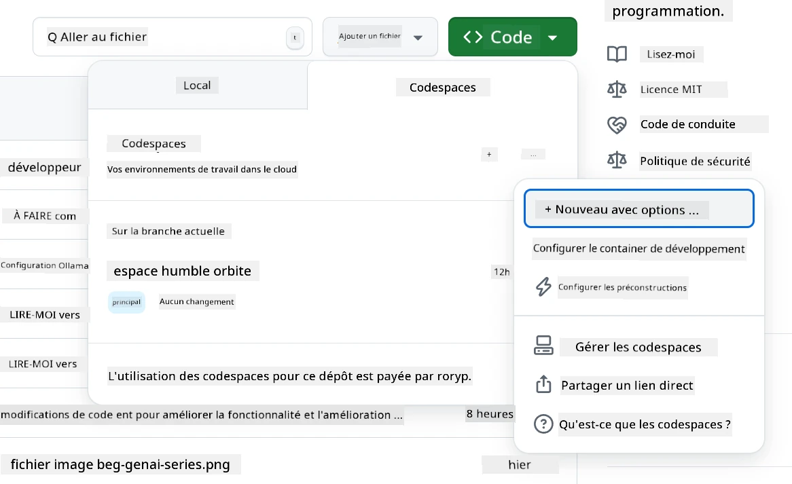
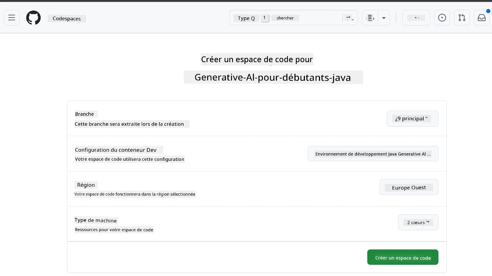
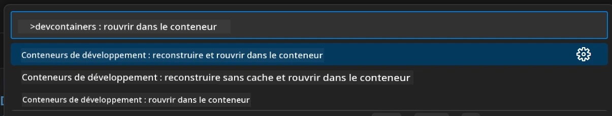
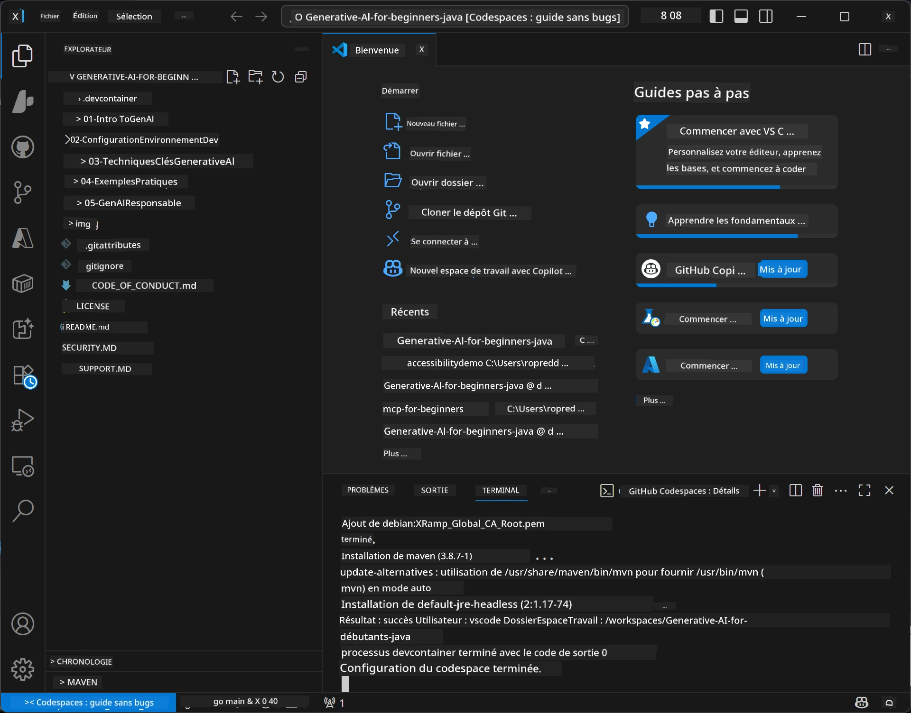

<!--
CO_OP_TRANSLATOR_METADATA:
{
  "original_hash": "96a30d42b9751a3d4e4b20e28d29d459",
  "translation_date": "2026-01-28T04:34:58+00:00",
  "source_file": "02-SetupDevEnvironment/README.md",
  "language_code": "fr"
}
-->
# Configuration de l'environnement de développement pour Generative AI for Java

> **Démarrage rapide** : Codez dans le cloud en 2 minutes - Passez à [Configuration GitHub Codespaces](../../../02-SetupDevEnvironment) - aucune installation locale requise et utilise les modèles GitHub !

> **Intéressé par Azure OpenAI ?**, consultez notre [Guide de configuration Azure OpenAI](getting-started-azure-openai.md) avec les étapes pour créer une nouvelle ressource Azure OpenAI.

## Ce que vous apprendrez

- Configurer un environnement de développement Java pour les applications d'IA
- Choisir et configurer votre environnement de développement préféré (cloud-first avec Codespaces, conteneur dev local, ou installation locale complète)
- Tester votre configuration en vous connectant aux modèles GitHub

## Table des matières

- [Ce que vous apprendrez](../../../02-SetupDevEnvironment)
- [Introduction](../../../02-SetupDevEnvironment)
- [Étape 1 : Configurez votre environnement de développement](../../../02-SetupDevEnvironment)
  - [Option A : GitHub Codespaces (recommandé)](../../../02-SetupDevEnvironment)
  - [Option B : Conteneur dev local](../../../02-SetupDevEnvironment)
  - [Option C : Utilisez votre installation locale existante](../../../02-SetupDevEnvironment)
- [Étape 2 : Créez un token d'accès personnel GitHub](../../../02-SetupDevEnvironment)
- [Étape 3 : Testez votre configuration](../../../02-SetupDevEnvironment)
- [Dépannage](../../../02-SetupDevEnvironment)
- [Résumé](../../../02-SetupDevEnvironment)
- [Étapes suivantes](../../../02-SetupDevEnvironment)

## Introduction

Ce chapitre vous guidera dans la configuration d'un environnement de développement. Nous utiliserons **GitHub Models** comme exemple principal car il est gratuit, facile à configurer avec juste un compte GitHub, ne nécessite pas de carte de crédit, et offre l'accès à plusieurs modèles pour expérimenter.

**Aucune configuration locale requise !** Vous pouvez commencer à coder immédiatement en utilisant GitHub Codespaces, qui fournit un environnement de développement complet dans votre navigateur.


Nous recommandons d'utiliser [**GitHub Models**](https://github.com/marketplace?type=models) pour ce cours car il est :
- **Gratuit** pour commencer
- **Facile** à configurer avec un simple compte GitHub
- **Pas de carte bancaire** requise
- **Plusieurs modèles** disponibles pour l'expérimentation

> **Note** : Les modèles GitHub utilisés dans cette formation ont ces limites gratuites :  
> - 15 requêtes par minute (150 par jour)  
> - ~8 000 mots en entrée, ~4 000 mots en sortie par requête  
> - 5 requêtes simultanées  
>  
> Pour une utilisation en production, passez aux modèles Azure AI Foundry avec votre compte Azure. Votre code n’a pas besoin d’être modifié. Voir la [documentation Azure AI Foundry](https://learn.microsoft.com/azure/ai-foundry/foundry-models/how-to/quickstart-github-models).


## Étape 1 : Configurez votre environnement de développement

<a name="quick-start-cloud"></a>

Nous avons créé un conteneur de développement préconfiguré pour minimiser le temps d’installation et garantir que vous disposiez de tous les outils nécessaires pour ce cours Generative AI for Java. Choisissez votre approche de développement préférée :

### Options de configuration de l'environnement :

#### Option A : GitHub Codespaces (recommandé)

**Commencez à coder en 2 minutes - aucune configuration locale requise !**

1. Forkez ce dépôt sur votre compte GitHub  
   > **Note** : Si vous souhaitez modifier la configuration de base, veuillez consulter la [Configuration du Dev Container](../../../.devcontainer/devcontainer.json)  
2. Cliquez sur **Code** → onglet **Codespaces** → **...** → **Nouveau avec options...**  
3. Utilisez les valeurs par défaut – cela sélectionnera la **configuration du dev container** : **Environnement de développement Java pour Generative AI** conteneur personnalisé créé pour ce cours  
4. Cliquez sur **Créer codespace**  
5. Attendez ~2 minutes que l’environnement soit prêt  
6. Passez à [Étape 2 : Créer un token GitHub](../../../02-SetupDevEnvironment)








> **Avantages de Codespaces** :  
> - Aucune installation locale requise  
> - Fonctionne sur n'importe quel appareil avec un navigateur  
> - Pré-configuré avec tous les outils et dépendances  
> - 60 heures gratuites par mois pour les comptes personnels  
> - Environnement cohérent pour tous les apprenants

#### Option B : Conteneur Dev local

**Pour les développeurs préférant un développement local avec Docker**

1. Forkez et clonez ce dépôt sur votre machine locale  
   > **Note** : Si vous souhaitez modifier la configuration de base, veuillez consulter la [Configuration du Dev Container](../../../.devcontainer/devcontainer.json)  
2. Installez [Docker Desktop](https://www.docker.com/products/docker-desktop/) et [VS Code](https://code.visualstudio.com/)  
3. Installez l’[extension Dev Containers](https://marketplace.visualstudio.com/items?itemName=ms-vscode-remote.remote-containers) dans VS Code  
4. Ouvrez le dossier du dépôt dans VS Code  
5. Lorsque vous y êtes invité, cliquez sur **Réouvrir dans le conteneur** (ou utilisez `Ctrl+Shift+P` → "Dev Containers : Réouvrir dans le conteneur")  
6. Attendez que le conteneur soit construit et démarré  
7. Passez à [Étape 2 : Créer un token GitHub](../../../02-SetupDevEnvironment)




#### Option C : Utilisez votre installation locale existante

**Pour les développeurs avec un environnement Java existant**

Prérequis :  
- [Java 21+](https://www.oracle.com/java/technologies/javase/jdk21-archive-downloads.html)  
- [Maven 3.9+](https://maven.apache.org/download.cgi)  
- [VS Code](https://code.visualstudio.com) ou votre IDE préféré

Étapes :  
1. Clonez ce dépôt sur votre machine locale  
2. Ouvrez le projet dans votre IDE  
3. Passez à [Étape 2 : Créer un token GitHub](../../../02-SetupDevEnvironment)

> **Astuce Pro** : Si vous avez une machine peu puissante mais souhaitez VS Code en local, utilisez GitHub Codespaces ! Vous pouvez connecter votre VS Code local à un Codespace hébergé dans le cloud pour profiter du meilleur des deux mondes.




## Étape 2 : Créez un token d'accès personnel GitHub

1. Rendez-vous dans [Paramètres GitHub](https://github.com/settings/profile) et sélectionnez **Paramètres** dans votre menu profil.  
2. Dans la barre latérale gauche, cliquez sur **Paramètres développeur** (généralement en bas).  
3. Sous **Tokens d'accès personnel**, cliquez sur **Tokens à granularité fine** (ou suivez ce [lien direct](https://github.com/settings/personal-access-tokens)).  
4. Cliquez sur **Générer un nouveau token**.  
5. Sous "Nom du token", donnez un nom descriptif (ex. : `GenAI-Java-Course-Token`).  
6. Définissez une date d'expiration (recommandé : 7 jours pour les bonnes pratiques de sécurité).  
7. Sous "Propriétaire de la ressource", sélectionnez votre compte utilisateur.  
8. Sous "Accès aux dépôts", sélectionnez les dépôts que vous souhaitez utiliser avec GitHub Models (ou "Tous les dépôts" si nécessaire).  
9. Sous "Autorisations du compte", trouvez **Models** et définissez-le en **Lecture seule**.  
10. Cliquez sur **Générer le token**.  
11. **Copiez et sauvegardez votre token maintenant** – vous ne le verrez plus après !

> **Conseil de sécurité** : Utilisez la portée minimale requise et la durée d’expiration la plus courte possible pour vos tokens d’accès.

## Étape 3 : Testez votre configuration avec l’exemple GitHub Models

Une fois votre environnement de développement prêt, testons l’intégration des GitHub Models avec notre application exemple dans [`02-SetupDevEnvironment/examples/github-models`](../../../02-SetupDevEnvironment/examples/github-models).

1. Ouvrez le terminal dans votre environnement de développement.  
2. Naviguez vers l’exemple GitHub Models :  
   ```bash
   cd 02-SetupDevEnvironment/examples/github-models
   ```
3. Définissez votre token GitHub comme variable d’environnement :  
   ```bash
   # macOS/Linux
   export GITHUB_TOKEN=your_token_here
   
   # Windows (Invite de commandes)
   set GITHUB_TOKEN=your_token_here
   
   # Windows (PowerShell)
   $env:GITHUB_TOKEN="your_token_here"
   ```
  
4. Lancez l’application :  
   ```bash
   mvn compile exec:java -Dexec.mainClass="com.example.githubmodels.App"
   ```
  
Vous devriez voir une sortie similaire à :  
```text
Using model: gpt-4.1-nano
Sending request to GitHub Models...
Response: Hello World!
```
  
### Comprendre le code exemple

Commençons par comprendre ce que nous venons d’exécuter. L’exemple sous `examples/github-models` utilise le SDK OpenAI Java pour se connecter aux GitHub Models :

**Ce que ce code fait :**  
- **Se connecte** aux GitHub Models en utilisant votre token d'accès personnel  
- **Envoie** un message simple "Say Hello World!" au modèle d’IA  
- **Reçoit** et affiche la réponse de l’IA  
- **Valide** que votre configuration fonctionne correctement  

**Dépendance clé** (dans `pom.xml`) :  
```xml
<dependency>
    <groupId>com.openai</groupId>
    <artifactId>openai-java</artifactId>
    <version>2.12.0</version>
</dependency>
```
  
**Code principal** (`App.java`) :  
```java
// Se connecter aux modèles GitHub en utilisant le SDK Java OpenAI
OpenAIClient client = OpenAIOkHttpClient.builder()
    .apiKey(pat)
    .baseUrl("https://models.inference.ai.azure.com")
    .build();

// Créer une requête de complétion de chat
ChatCompletionCreateParams params = ChatCompletionCreateParams.builder()
    .model(modelId)
    .addSystemMessage("You are a concise assistant.")
    .addUserMessage("Say Hello World!")
    .build();

// Obtenir la réponse de l'IA
ChatCompletion response = client.chat().completions().create(params);
System.out.println("Response: " + response.choices().get(0).message().content().orElse("No response content"));
```
  
## Résumé

Super ! Vous avez maintenant tout configuré :

- Créé un token d’accès personnel GitHub avec les bonnes permissions pour accéder aux modèles IA  
- Mis en place votre environnement de développement Java (que ce soit Codespaces, conteneurs dev ou local)  
- Connecté aux GitHub Models en utilisant le SDK OpenAI Java pour un développement IA gratuit  
- Testé que tout fonctionne avec un exemple simple qui dialogue avec les modèles IA

## Étapes suivantes

[Chapitre 3 : Techniques principales de Generative AI](../03-CoreGenerativeAITechniques/README.md)

## Dépannage

Vous rencontrez des problèmes ? Voici les problèmes courants et leurs solutions :

- **Le token ne fonctionne pas ?**  
  - Assurez-vous d’avoir copié le token en entier sans espaces supplémentaires  
  - Vérifiez que le token est bien défini comme variable d’environnement  
  - Vérifiez que votre token a les bonnes permissions (Models : Lecture seule)

- **Maven introuvable ?**  
  - Si vous utilisez dev containers/Codespaces, Maven est normalement préinstallé  
  - Pour une installation locale, assurez-vous que Java 21+ et Maven 3.9+ sont installés  
  - Essayez `mvn --version` pour vérifier l’installation

- **Problèmes de connexion ?**  
  - Vérifiez votre connexion internet  
  - Assurez-vous que GitHub est accessible depuis votre réseau  
  - Vérifiez que vous n’êtes pas derrière un pare-feu bloquant l’endpoint GitHub Models

- **Le conteneur dev ne démarre pas ?**  
  - Assurez-vous que Docker Desktop est bien lancé (pour le développement local)  
  - Essayez de reconstruire le conteneur : `Ctrl+Shift+P` → "Dev Containers : Rebuild Container"

- **Erreurs de compilation de l'application ?**  
  - Assurez-vous d’être dans le bon répertoire : `02-SetupDevEnvironment/examples/github-models`  
  - Essayez de nettoyer et reconstruire : `mvn clean compile`

> **Besoin d’aide ?** : Toujours des problèmes ? Ouvrez une issue dans le dépôt et nous vous aiderons.

---

<!-- CO-OP TRANSLATOR DISCLAIMER START -->
**Avertissement** :  
Ce document a été traduit à l’aide du service de traduction automatique [Co-op Translator](https://github.com/Azure/co-op-translator). Bien que nous nous efforcions d’assurer l’exactitude, veuillez noter que les traductions automatiques peuvent comporter des erreurs ou des inexactitudes. Le document original dans sa langue d’origine doit être considéré comme la source faisant autorité. Pour les informations critiques, une traduction humaine professionnelle est recommandée. Nous déclinons toute responsabilité en cas de malentendus ou de mauvaises interprétations résultant de l’utilisation de cette traduction.
<!-- CO-OP TRANSLATOR DISCLAIMER END -->