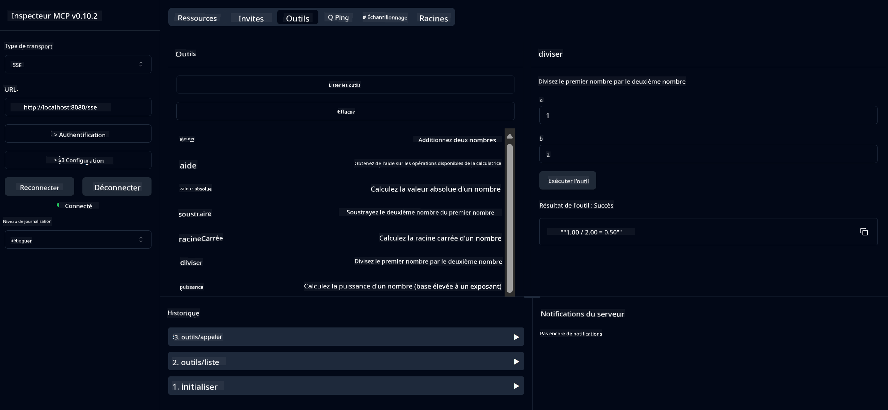

<!--
CO_OP_TRANSLATOR_METADATA:
{
  "original_hash": "5bd7a347d6ed1d706443f9129dd29dd9",
  "translation_date": "2025-07-25T08:41:03+00:00",
  "source_file": "04-PracticalSamples/mcp/calculator/README.md",
  "language_code": "fr"
}
-->
# Service de Calculatrice de Base MCP

>**Note** : Ce chapitre inclut un [**Tutoriel**](./TUTORIAL.md) qui vous guide à travers les exemples.

Bienvenue dans votre première expérience pratique avec le **Model Context Protocol (MCP)** ! Dans les chapitres précédents, vous avez appris les bases de l'IA générative et configuré votre environnement de développement. Il est maintenant temps de construire quelque chose de concret.

Ce service de calculatrice démontre comment les modèles d'IA peuvent interagir de manière sécurisée avec des outils externes en utilisant MCP. Plutôt que de s'appuyer sur les capacités parfois peu fiables des modèles d'IA en mathématiques, nous allons vous montrer comment créer un système robuste où l'IA peut appeler des services spécialisés pour des calculs précis.

## Table des Matières

- [Ce que Vous Apprendrez](../../../../../04-PracticalSamples/mcp/calculator)
- [Prérequis](../../../../../04-PracticalSamples/mcp/calculator)
- [Concepts Clés](../../../../../04-PracticalSamples/mcp/calculator)
- [Démarrage Rapide](../../../../../04-PracticalSamples/mcp/calculator)
- [Opérations Disponibles de la Calculatrice](../../../../../04-PracticalSamples/mcp/calculator)
- [Clients de Test](../../../../../04-PracticalSamples/mcp/calculator)
  - [1. Client MCP Direct (SDKClient)](../../../../../04-PracticalSamples/mcp/calculator)
  - [2. Client Alimenté par l'IA (LangChain4jClient)](../../../../../04-PracticalSamples/mcp/calculator)
- [Inspecteur MCP (Interface Web)](../../../../../04-PracticalSamples/mcp/calculator)
  - [Instructions Étape par Étape](../../../../../04-PracticalSamples/mcp/calculator)

## Ce que Vous Apprendrez

En travaillant sur cet exemple, vous comprendrez :
- Comment créer des services compatibles MCP avec Spring Boot
- La différence entre la communication directe via le protocole et l'interaction alimentée par l'IA
- Comment les modèles d'IA décident quand et comment utiliser des outils externes
- Les meilleures pratiques pour construire des applications d'IA intégrant des outils

Parfait pour les débutants qui découvrent les concepts MCP et souhaitent créer leur première intégration d'outils IA !

## Prérequis

- Java 21+
- Maven 3.6+
- **Jeton GitHub** : Nécessaire pour le client alimenté par l'IA. Si vous ne l'avez pas encore configuré, consultez [Chapitre 2 : Configuration de votre environnement de développement](../../../02-SetupDevEnvironment/README.md) pour les instructions.

## Concepts Clés

**Model Context Protocol (MCP)** est une méthode standardisée permettant aux applications d'IA de se connecter de manière sécurisée à des outils externes. Pensez-y comme un "pont" qui permet aux modèles d'IA d'utiliser des services externes comme notre calculatrice. Plutôt que de tenter de faire les calculs eux-mêmes (ce qui peut être peu fiable), les modèles d'IA peuvent appeler notre service de calculatrice pour obtenir des résultats précis. MCP garantit que cette communication se fait de manière sûre et cohérente.

**Server-Sent Events (SSE)** permet une communication en temps réel entre le serveur et les clients. Contrairement aux requêtes HTTP traditionnelles où vous demandez et attendez une réponse, SSE permet au serveur d'envoyer continuellement des mises à jour au client. Cela est idéal pour les applications d'IA où les réponses peuvent être diffusées ou nécessiter du temps pour être traitées.

**Outils d'IA & Appels de Fonctions** permettent aux modèles d'IA de choisir et d'utiliser automatiquement des fonctions externes (comme les opérations de calculatrice) en fonction des demandes des utilisateurs. Par exemple, si vous demandez "Quel est le résultat de 15 + 27 ?", le modèle d'IA comprend que vous voulez une addition, appelle automatiquement notre outil `add` avec les bons paramètres (15, 27), et retourne le résultat en langage naturel. L'IA agit comme un coordinateur intelligent qui sait quand et comment utiliser chaque outil.

## Démarrage Rapide

### 1. Accédez au répertoire de l'application calculatrice
```bash
cd Generative-AI-for-beginners-java/04-PracticalSamples/mcp/calculator
```

### 2. Construisez et Lancez
```bash
mvn clean install -DskipTests
java -jar target/calculator-server-0.0.1-SNAPSHOT.jar
```

### 3. Testez avec les Clients
- **SDKClient** : Interaction directe avec le protocole MCP
- **LangChain4jClient** : Interaction en langage naturel alimentée par l'IA (nécessite un jeton GitHub)

## Opérations Disponibles de la Calculatrice

- `add(a, b)`, `subtract(a, b)`, `multiply(a, b)`, `divide(a, b)`
- `power(base, exponent)`, `squareRoot(number)`, `absolute(number)`
- `modulus(a, b)`, `help()`

## Clients de Test

### 1. Client MCP Direct (SDKClient)
Teste la communication brute via le protocole MCP. Lancez avec :
```bash
mvn test-compile exec:java -Dexec.mainClass="com.microsoft.mcp.sample.client.SDKClient" -Dexec.classpathScope=test
```

### 2. Client Alimenté par l'IA (LangChain4jClient)
Démontre une interaction en langage naturel avec les modèles GitHub. Nécessite un jeton GitHub (voir [Prérequis](../../../../../04-PracticalSamples/mcp/calculator)).

**Lancez :**
```bash
mvn test-compile exec:java -Dexec.mainClass="com.microsoft.mcp.sample.client.LangChain4jClient" -Dexec.classpathScope=test
```

## Inspecteur MCP (Interface Web)

L'Inspecteur MCP fournit une interface web visuelle pour tester votre service MCP sans écrire de code. Parfait pour les débutants souhaitant comprendre le fonctionnement de MCP !

### Instructions Étape par Étape :

1. **Démarrez le serveur de calculatrice** (si ce n'est pas déjà fait) :
   ```bash
   java -jar target/calculator-server-0.0.1-SNAPSHOT.jar
   ```

2. **Installez et lancez l'Inspecteur MCP** dans un nouveau terminal :
   ```bash
   npx @modelcontextprotocol/inspector
   ```

3. **Ouvrez l'interface web** :
   - Recherchez un message comme "Inspector running at http://localhost:6274"
   - Ouvrez cette URL dans votre navigateur web

4. **Connectez-vous à votre service de calculatrice** :
   - Dans l'interface web, définissez le type de transport sur "SSE"
   - Définissez l'URL sur : `http://localhost:8080/sse`
   - Cliquez sur le bouton "Connect"

5. **Explorez les outils disponibles** :
   - Cliquez sur "List Tools" pour voir toutes les opérations de la calculatrice
   - Vous verrez des fonctions comme `add`, `subtract`, `multiply`, etc.

6. **Testez une opération de calculatrice** :
   - Sélectionnez un outil (par exemple, "add")
   - Entrez les paramètres (par exemple, `a: 15`, `b: 27`)
   - Cliquez sur "Run Tool"
   - Observez le résultat retourné par votre service MCP !

Cette approche visuelle vous aide à comprendre exactement comment fonctionne la communication MCP avant de créer vos propres clients.



---
**Référence :** [MCP Server Boot Starter Docs](https://docs.spring.io/spring-ai/reference/api/mcp/mcp-server-boot-starter-docs.html)

**Avertissement** :  
Ce document a été traduit à l'aide du service de traduction automatique [Co-op Translator](https://github.com/Azure/co-op-translator). Bien que nous nous efforcions d'assurer l'exactitude, veuillez noter que les traductions automatisées peuvent contenir des erreurs ou des inexactitudes. Le document original dans sa langue d'origine doit être considéré comme la source faisant autorité. Pour des informations critiques, il est recommandé de recourir à une traduction professionnelle réalisée par un humain. Nous déclinons toute responsabilité en cas de malentendus ou d'interprétations erronées résultant de l'utilisation de cette traduction.