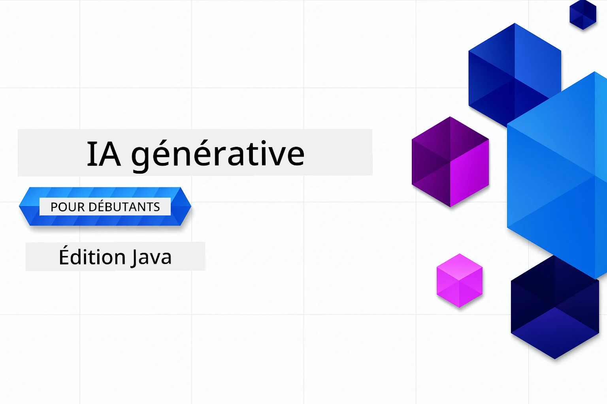

# IA Générative pour Débutants - Édition Java
[](https://discord.gg/nTYy5BXMWG)



**Temps d'engagement** : L'atelier complet peut être réalisé en ligne sans configuration locale. La mise en place de l'environnement prend 2 minutes, l'exploration des exemples nécessite 1 à 3 heures selon la profondeur de l'exploration.

> **Démarrage rapide** 

1. Forkez ce dépôt sur votre compte GitHub
2. Cliquez sur **Code** → onglet **Codespaces** → **...** → **Nouveau avec options...**
3. Utilisez les paramètres par défaut – cela sélectionnera le conteneur de développement créé pour ce cours
4. Cliquez sur **Créer un codespace**
5. Patientez environ 2 minutes pour que l'environnement soit prêt
6. Passez directement à [Le premier exemple](./02-SetupDevEnvironment/README.md#step-2-create-a-github-personal-access-token)

## Support Multilingue

### Pris en charge via GitHub Action (Automatisé & Toujours à jour)

<!-- CO-OP TRANSLATOR LANGUAGES TABLE START -->
[Arabe](../ar/README.md) | [Bengali](../bn/README.md) | [Bulgare](../bg/README.md) | [Birman (Myanmar)](../my/README.md) | [Chinois (Simplifié)](../zh-CN/README.md) | [Chinois (Traditionnel, Hong Kong)](../zh-HK/README.md) | [Chinois (Traditionnel, Macao)](../zh-MO/README.md) | [Chinois (Traditionnel, Taïwan)](../zh-TW/README.md) | [Croate](../hr/README.md) | [Tchèque](../cs/README.md) | [Danois](../da/README.md) | [Néerlandais](../nl/README.md) | [Estonien](../et/README.md) | [Finnois](../fi/README.md) | [Français](./README.md) | [Allemand](../de/README.md) | [Grec](../el/README.md) | [Hébreu](../he/README.md) | [Hindi](../hi/README.md) | [Hongrois](../hu/README.md) | [Indonésien](../id/README.md) | [Italien](../it/README.md) | [Japonais](../ja/README.md) | [Kannada](../kn/README.md) | [Coréen](../ko/README.md) | [Lituanien](../lt/README.md) | [Malais](../ms/README.md) | [Malayalam](../ml/README.md) | [Marathi](../mr/README.md) | [Népalais](../ne/README.md) | [Pidgin nigérian](../pcm/README.md) | [Norvégien](../no/README.md) | [Persan (Farsi)](../fa/README.md) | [Polonais](../pl/README.md) | [Portugais (Brésil)](../pt-BR/README.md) | [Portugais (Portugal)](../pt-PT/README.md) | [Pendjabi (Gurmukhi)](../pa/README.md) | [Roumain](../ro/README.md) | [Russe](../ru/README.md) | [Serbe (Cyrillique)](../sr/README.md) | [Slovaque](../sk/README.md) | [Slovène](../sl/README.md) | [Espagnol](../es/README.md) | [Swahili](../sw/README.md) | [Suédois](../sv/README.md) | [Tagalog (Philippin)](../tl/README.md) | [Tamoul](../ta/README.md) | [Telugu](../te/README.md) | [Thaïlandais](../th/README.md) | [Turc](../tr/README.md) | [Ukrainien](../uk/README.md) | [Ourdou](../ur/README.md) | [Vietnamien](../vi/README.md)

> **Préférez cloner localement ?**
>
> Ce dépôt inclut plus de 50 traductions de langues ce qui augmente significativement la taille du téléchargement. Pour cloner sans les traductions, utilisez le sparse checkout :
>
> **Bash / macOS / Linux :**
> ```bash
> git clone --filter=blob:none --sparse https://github.com/microsoft/Generative-AI-for-beginners-java.git
> cd Generative-AI-for-beginners-java
> git sparse-checkout set --no-cone '/*' '!translations' '!translated_images'
> ```
>
> **CMD (Windows) :**
> ```cmd
> git clone --filter=blob:none --sparse https://github.com/microsoft/Generative-AI-for-beginners-java.git
> cd Generative-AI-for-beginners-java
> git sparse-checkout set --no-cone "/*" "!translations" "!translated_images"
> ```
>
> Cela vous fournit tout ce dont vous avez besoin pour compléter le cours avec un téléchargement beaucoup plus rapide.
<!-- CO-OP TRANSLATOR LANGUAGES TABLE END -->

## Structure du cours & Parcours d'apprentissage

### **Chapitre 1 : Introduction à l’IA Générative**
- **Concepts clés** : Comprendre les grands modèles de langage, les tokens, les embeddings et les capacités de l'IA
- **Écosystème Java IA** : Aperçu de Spring AI et des SDK OpenAI
- **Protocole de Contexte du Modèle** : Introduction au MCP et son rôle dans la communication des agents IA
- **Applications Pratiques** : Scénarios réels incluant chatbots et génération de contenu
- **[→ Commencer le Chapitre 1](./01-IntroToGenAI/README.md)**

### **Chapitre 2 : Configuration de l’Environnement de Développement**
- **Configuration Multi-Fournisseur** : Mettre en place GitHub Models, Azure OpenAI, et OpenAI Java SDK
- **Spring Boot + Spring AI** : Meilleures pratiques pour le développement d'applications IA en entreprise
- **GitHub Models** : Accès gratuit aux modèles IA pour prototypage et apprentissage (pas de carte bancaire requise)
- **Outils de Développement** : Conteneurs Docker, VS Code et configuration GitHub Codespaces
- **[→ Commencer le Chapitre 2](./02-SetupDevEnvironment/README.md)**

### **Chapitre 3 : Techniques Clés de l’IA Générative**
- **Ingénierie des Prompts** : Techniques pour des réponses optimales du modèle IA
- **Embeddings & Opérations Vectorielles** : Implémenter recherche sémantique et appariement de similarité
- **Génération Augmentée par Recherche (RAG)** : Combiner l’IA avec vos propres sources de données
- **Appel de Fonction** : Étendre les capacités IA avec des outils et plugins personnalisés
- **[→ Commencer le Chapitre 3](./03-CoreGenerativeAITechniques/README.md)**

### **Chapitre 4 : Applications Pratiques & Projets**
- **Générateur d’histoires pour animaux** (`petstory/`) : Création de contenu créatif avec GitHub Models
- **Démo locale Foundry** (`foundrylocal/`) : Intégration locale de modèles IA avec OpenAI Java SDK
- **Service Calculateur MCP** (`calculator/`) : Implémentation basique du protocole MCP avec Spring AI
- **[→ Commencer le Chapitre 4](./04-PracticalSamples/README.md)**

### **Chapitre 5 : Développement Responsable de l’IA**
- **Sécurité des GitHub Models** : Tester le filtrage intégré de contenu et les mécanismes de sécurité (blocs fermes et refus souples)
- **Démonstration IA Responsable** : Exemple pratique montrant le fonctionnement des systèmes de sécurité IA modernes
- **Bonnes Pratiques** : Directives essentielles pour un développement et un déploiement éthique de l’IA
- **[→ Commencer le Chapitre 5](./05-ResponsibleGenAI/README.md)**

## Ressources supplémentaires

<!-- CO-OP TRANSLATOR OTHER COURSES START -->
### LangChain
[](https://aka.ms/langchain4j-for-beginners)
[](https://aka.ms/langchainjs-for-beginners?WT.mc_id=m365-94501-dwahlin)
[](https://github.com/microsoft/langchain-for-beginners?WT.mc_id=m365-94501-dwahlin)
---

### Azure / Edge / MCP / Agents
[](https://github.com/microsoft/AZD-for-beginners?WT.mc_id=academic-105485-koreyst)
[](https://github.com/microsoft/edgeai-for-beginners?WT.mc_id=academic-105485-koreyst)
[](https://github.com/microsoft/mcp-for-beginners?WT.mc_id=academic-105485-koreyst)
[](https://github.com/microsoft/ai-agents-for-beginners?WT.mc_id=academic-105485-koreyst)

---
 
### Série IA Générative
[](https://github.com/microsoft/generative-ai-for-beginners?WT.mc_id=academic-105485-koreyst)
[-9333EA?style=for-the-badge&labelColor=E5E7EB&color=9333EA)](https://github.com/microsoft/Generative-AI-for-beginners-dotnet?WT.mc_id=academic-105485-koreyst)
[-C084FC?style=for-the-badge&labelColor=E5E7EB&color=C084FC)](https://github.com/microsoft/generative-ai-for-beginners-java?WT.mc_id=academic-105485-koreyst)
[-E879F9?style=for-the-badge&labelColor=E5E7EB&color=E879F9)](https://github.com/microsoft/generative-ai-with-javascript?WT.mc_id=academic-105485-koreyst)

---
 
### Apprentissage Fondamental
[](https://aka.ms/ml-beginners?WT.mc_id=academic-105485-koreyst)
[](https://aka.ms/datascience-beginners?WT.mc_id=academic-105485-koreyst)
[](https://aka.ms/ai-beginners?WT.mc_id=academic-105485-koreyst)
[](https://github.com/microsoft/Security-101?WT.mc_id=academic-96948-sayoung)

[](https://aka.ms/webdev-beginners?WT.mc_id=academic-105485-koreyst)
[](https://aka.ms/iot-beginners?WT.mc_id=academic-105485-koreyst)
[](https://github.com/microsoft/xr-development-for-beginners?WT.mc_id=academic-105485-koreyst)

---
 
### Série Copilot
[](https://aka.ms/GitHubCopilotAI?WT.mc_id=academic-105485-koreyst)
[](https://github.com/microsoft/mastering-github-copilot-for-dotnet-csharp-developers?WT.mc_id=academic-105485-koreyst)
[](https://github.com/microsoft/CopilotAdventures?WT.mc_id=academic-105485-koreyst)
<!-- CO-OP TRANSLATOR OTHER COURSES END -->

## Obtenir de l'aide

Si vous êtes bloqué ou avez des questions concernant la création d'applications IA, rejoignez d'autres apprenants et développeurs expérimentés dans les discussions autour de MCP. C'est une communauté bienveillante où les questions sont les bienvenues et le savoir est partagé librement.

[](https://discord.gg/nTYy5BXMWG)

Si vous avez des retours sur le produit ou des erreurs lors de la création, visitez :

[](https://aka.ms/foundry/forum)

---

<!-- CO-OP TRANSLATOR DISCLAIMER START -->
**Avertissement** :  
Ce document a été traduit à l'aide du service de traduction automatique [Co-op Translator](https://github.com/Azure/co-op-translator). Bien que nous nous efforcions d'assurer l'exactitude, veuillez noter que les traductions automatiques peuvent contenir des erreurs ou des inexactitudes. Le document original dans sa langue d'origine doit être considéré comme la source faisant autorité. Pour les informations critiques, il est recommandé de recourir à une traduction professionnelle humaine. Nous déclinons toute responsabilité en cas de malentendus ou de mauvaises interprétations résultant de l'utilisation de cette traduction.
<!-- CO-OP TRANSLATOR DISCLAIMER END -->