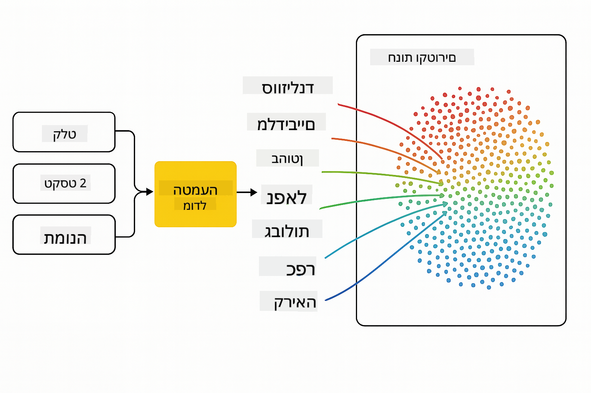
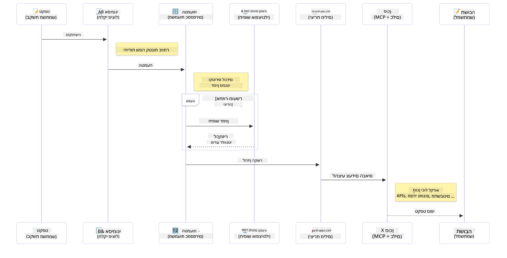

<!--
CO_OP_TRANSLATOR_METADATA:
{
  "original_hash": "75bfb080ca725e8a9aa9c80cae25fba1",
  "translation_date": "2025-07-29T09:39:40+00:00",
  "source_file": "01-IntroToGenAI/README.md",
  "language_code": "he"
}
-->
# מבוא ל-AI גנרטיבי - מהדורת Java

## מה תלמדו

- **יסודות AI גנרטיבי** כולל LLMs, הנדסת הנחיות, טוקנים, הטמעות ומאגרי נתונים וקטוריים  
- **השוואת כלי פיתוח AI ב-Java** כולל Azure OpenAI SDK, Spring AI ו-OpenAI Java SDK  
- **גילוי פרוטוקול הקשר מודל** ותפקידו בתקשורת סוכני AI  

## תוכן עניינים

- [מבוא](../../../01-IntroToGenAI)  
- [רענון מהיר על מושגי AI גנרטיבי](../../../01-IntroToGenAI)  
- [סקירת הנדסת הנחיות](../../../01-IntroToGenAI)  
- [טוקנים, הטמעות וסוכנים](../../../01-IntroToGenAI)  
- [כלי פיתוח וספריות AI ל-Java](../../../01-IntroToGenAI)  
  - [OpenAI Java SDK](../../../01-IntroToGenAI)  
  - [Spring AI](../../../01-IntroToGenAI)  
  - [Azure OpenAI Java SDK](../../../01-IntroToGenAI)  
- [סיכום](../../../01-IntroToGenAI)  
- [השלבים הבאים](../../../01-IntroToGenAI)  

## מבוא

ברוכים הבאים לפרק הראשון של AI גנרטיבי למתחילים - מהדורת Java! שיעור יסודי זה מציג את המושגים המרכזיים של AI גנרטיבי וכיצד לעבוד איתם באמצעות Java. תלמדו על אבני הבניין החיוניות של יישומי AI, כולל מודלים שפתיים גדולים (LLMs), טוקנים, הטמעות וסוכני AI. בנוסף, נחקור את כלי הפיתוח המרכזיים ב-Java שתשתמשו בהם לאורך הקורס.

### רענון מהיר על מושגי AI גנרטיבי

AI גנרטיבי הוא סוג של בינה מלאכותית שיוצרת תוכן חדש, כמו טקסט, תמונות או קוד, בהתבסס על דפוסים וקשרים שנלמדו מנתונים. מודלים של AI גנרטיבי יכולים לייצר תגובות דמויות אדם, להבין הקשר ולעיתים אף ליצור תוכן שנראה אנושי.

בזמן פיתוח יישומי AI ב-Java, תעבדו עם **מודלים גנרטיביים** ליצירת תוכן. כמה יכולות של מודלים גנרטיביים כוללות:

- **יצירת טקסט**: יצירת טקסט דמוי אדם עבור צ'אטבוטים, תוכן והשלמת טקסט.  
- **יצירת תמונות וניתוחן**: יצירת תמונות מציאותיות, שיפור תמונות וזיהוי אובייקטים.  
- **יצירת קוד**: כתיבת קטעי קוד או סקריפטים.  

ישנם סוגי מודלים ספציפיים שמותאמים למשימות שונות. לדוגמה, גם **מודלים שפתיים קטנים (SLMs)** וגם **מודלים שפתיים גדולים (LLMs)** יכולים להתמודד עם יצירת טקסט, כאשר LLMs בדרך כלל מציעים ביצועים טובים יותר למשימות מורכבות. למשימות הקשורות לתמונות, תשתמשו במודלים חזותיים מיוחדים או מודלים רב-מודאליים.

כמובן, התגובות של מודלים אלו אינן מושלמות תמיד. ייתכן ששמעתם על מודלים "מדמיינים" או יוצרים מידע שגוי באופן סמכותי. אך ניתן להנחות את המודל לייצר תגובות טובות יותר על ידי מתן הוראות ברורות והקשר. כאן נכנסת לתמונה **הנדסת הנחיות**.

#### סקירת הנדסת הנחיות

הנדסת הנחיות היא הפרקטיקה של עיצוב קלטים אפקטיביים כדי להנחות מודלים AI לתוצאות רצויות. היא כוללת:

- **בהירות**: הפיכת ההוראות לברורות וחד משמעיות.  
- **הקשר**: מתן מידע רקע נחוץ.  
- **מגבלות**: ציון מגבלות או פורמטים.  

כמה שיטות עבודה מומלצות להנדסת הנחיות כוללות עיצוב הנחיות, הוראות ברורות, פירוק משימות, למידה חד-פעמית ולמידה מועטה, וכיוונון הנחיות. בדיקת הנחיות שונות חיונית למציאת מה שעובד הכי טוב עבור המקרה הספציפי שלכם.

בזמן פיתוח יישומים, תעבדו עם סוגי הנחיות שונים:  
- **הנחיות מערכת**: קובעות את הכללים וההקשר הבסיסיים להתנהגות המודל  
- **הנחיות משתמש**: נתוני הקלט ממשתמשי היישום שלכם  
- **הנחיות עוזר**: תגובות המודל המבוססות על הנחיות מערכת ומשתמש  

> **למידע נוסף**: למדו עוד על הנדסת הנחיות בפרק [הנדסת הנחיות בקורס GenAI למתחילים](https://github.com/microsoft/generative-ai-for-beginners/tree/main/04-prompt-engineering-fundamentals)

#### טוקנים, הטמעות וסוכנים

בזמן עבודה עם מודלים גנרטיביים, תיתקלו במונחים כמו **טוקנים**, **הטמעות**, **סוכנים** ו-**Model Context Protocol (MCP)**. הנה סקירה מפורטת של מושגים אלו:

- **טוקנים**: טוקנים הם היחידה הקטנה ביותר של טקסט במודל. הם יכולים להיות מילים, תווים או תת-מילים. טוקנים משמשים לייצוג נתוני טקסט בפורמט שהמודל יכול להבין. לדוגמה, המשפט "The quick brown fox jumped over the lazy dog" עשוי להיות מחולק לטוקנים כמו ["The", " quick", " brown", " fox", " jumped", " over", " the", " lazy", " dog"] או ["The", " qu", "ick", " br", "own", " fox", " jump", "ed", " over", " the", " la", "zy", " dog"] בהתאם לאסטרטגיית הטוקניזציה.

טוקניזציה היא תהליך פירוק הטקסט ליחידות קטנות אלו. זה קריטי מכיוון שמודלים פועלים על טוקנים ולא על טקסט גולמי. מספר הטוקנים בהנחיה משפיע על אורך ואיכות תגובת המודל, שכן למודלים יש מגבלות טוקנים לחלון ההקשר שלהם (למשל, 128K טוקנים עבור ההקשר הכולל של GPT-4o, כולל קלט ופלט).

ב-Java, ניתן להשתמש בספריות כמו OpenAI SDK כדי לטפל בטוקניזציה באופן אוטומטי בעת שליחת בקשות למודלים AI.

- **הטמעות**: הטמעות הן ייצוגים וקטוריים של טוקנים שמכילים משמעות סמנטית. הן ייצוגים מספריים (בדרך כלל מערכים של מספרים עשרוניים) שמאפשרים למודלים להבין קשרים בין מילים ולייצר תגובות רלוונטיות מבחינה הקשרית. מילים דומות יש להן הטמעות דומות, מה שמאפשר למודל להבין מושגים כמו מילים נרדפות וקשרים סמנטיים.

ב-Java, ניתן ליצור הטמעות באמצעות OpenAI SDK או ספריות אחרות שתומכות ביצירת הטמעות. הטמעות אלו חיוניות למשימות כמו חיפוש סמנטי, שבו רוצים למצוא תוכן דומה על בסיס משמעות ולא התאמות טקסט מדויקות.

- **מאגרי נתונים וקטוריים**: מאגרי נתונים וקטוריים הם מערכות אחסון מיוחדות שמותאמות להטמעות. הם מאפשרים חיפוש דמיון יעיל וחיוניים לדפוסי RAG (יצירה מוגברת על ידי אחזור) שבהם צריך למצוא מידע רלוונטי ממאגרי נתונים גדולים על בסיס דמיון סמנטי ולא התאמות מדויקות.

> **הערה**: בקורס זה לא נעסוק במאגרי נתונים וקטוריים, אך חשוב להזכיר אותם מכיוון שהם נפוצים ביישומים בעולם האמיתי.

- **סוכנים ו-MCP**: רכיבי AI שמתקשרים באופן עצמאי עם מודלים, כלים ומערכות חיצוניות. פרוטוקול הקשר מודל (MCP) מספק דרך סטנדרטית לסוכנים לגשת בצורה מאובטחת למקורות נתונים וכלים חיצוניים. למדו עוד בקורס [MCP למתחילים](https://github.com/microsoft/mcp-for-beginners).

ביישומי AI ב-Java, תשתמשו בטוקנים לעיבוד טקסט, הטמעות לחיפוש סמנטי ו-RAG, מאגרי נתונים וקטוריים לאחזור נתונים, וסוכנים עם MCP לבניית מערכות חכמות שמשתמשות בכלים.

### כלי פיתוח וספריות AI ל-Java

Java מציעה כלי פיתוח מצוינים ל-AI. ישנן שלוש ספריות עיקריות שנחקור לאורך הקורס - OpenAI Java SDK, Azure OpenAI SDK ו-Spring AI.

להלן טבלת התייחסות מהירה שמראה איזה SDK משמש בדוגמאות של כל פרק:

| פרק | דוגמה | SDK |  
|---------|--------|-----|  
| 02-SetupDevEnvironment | github-models | OpenAI Java SDK |  
| 02-SetupDevEnvironment | basic-chat-azure | Spring AI Azure OpenAI |  
| 03-CoreGenerativeAITechniques | examples | Azure OpenAI SDK |  
| 04-PracticalSamples | petstory | OpenAI Java SDK |  
| 04-PracticalSamples | foundrylocal | OpenAI Java SDK |  
| 04-PracticalSamples | calculator | Spring AI MCP SDK + LangChain4j |  

**קישורים לתיעוד SDK:**  
- [Azure OpenAI Java SDK](https://github.com/Azure/azure-sdk-for-java/tree/azure-ai-openai_1.0.0-beta.16/sdk/openai/azure-ai-openai)  
- [Spring AI](https://docs.spring.io/spring-ai/reference/)  
- [OpenAI Java SDK](https://github.com/openai/openai-java)  
- [LangChain4j](https://docs.langchain4j.dev/)  

#### OpenAI Java SDK

ה-SDK של OpenAI הוא ספריית Java רשמית ל-API של OpenAI. הוא מספק ממשק פשוט ועקבי לאינטראקציה עם מודלים של OpenAI, מה שמקל על שילוב יכולות AI ביישומי Java. דוגמת GitHub Models בפרק 2, יישום Pet Story בפרק 4 ודוגמת Foundry Local מדגימים את הגישה של OpenAI SDK.

#### Spring AI

Spring AI הוא מסגרת מקיפה שמביאה יכולות AI ליישומי Spring, ומספקת שכבת הפשטה עקבית בין ספקי AI שונים. הוא משתלב בצורה חלקה עם מערכת Spring, מה שהופך אותו לבחירה אידיאלית ליישומי Java ארגוניים שזקוקים ליכולות AI.

החוזק של Spring AI טמון בשילובו החלק עם מערכת Spring, מה שמקל על בניית יישומי AI מוכנים לייצור עם דפוסי Spring מוכרים כמו הזרקת תלות, ניהול תצורה ומסגרות בדיקה. תשתמשו ב-Spring AI בפרק 2 ו-4 לבניית יישומים שמנצלים את ספריות OpenAI ו-MCP של Spring AI.

##### פרוטוקול הקשר מודל (MCP)

[פרוטוקול הקשר מודל (MCP)](https://modelcontextprotocol.io/) הוא תקן מתפתח שמאפשר ליישומי AI לתקשר בצורה מאובטחת עם מקורות נתונים וכלים חיצוניים. MCP מספק דרך סטנדרטית למודלים AI לגשת למידע הקשרי ולבצע פעולות ביישומים שלכם.

בפרק 4, תבנו שירות מחשבון MCP פשוט שמדגים את יסודות פרוטוקול הקשר מודל עם Spring AI, ומראה כיצד ליצור אינטגרציות כלים בסיסיות וארכיטקטורות שירות.

#### Azure OpenAI Java SDK

ספריית הלקוח של Azure OpenAI ל-Java היא התאמה של APIs REST של OpenAI שמספקת ממשק אידיומטי ואינטגרציה עם שאר מערכת Azure SDK. בפרק 3, תבנו יישומים באמצעות Azure OpenAI SDK, כולל יישומי צ'אט, קריאת פונקציות ודפוסי RAG (יצירה מוגברת על ידי אחזור).

> הערה: Azure OpenAI SDK מפגר מאחורי OpenAI Java SDK מבחינת תכונות, ולכן לפרויקטים עתידיים, שקלו להשתמש ב-OpenAI Java SDK.

## סיכום

זה מסכם את היסודות! עכשיו אתם מבינים:

- את המושגים המרכזיים מאחורי AI גנרטיבי - מ-LLMs והנדסת הנחיות ועד טוקנים, הטמעות ומאגרי נתונים וקטוריים  
- את אפשרויות הכלים שלכם לפיתוח AI ב-Java: Azure OpenAI SDK, Spring AI ו-OpenAI Java SDK  
- מהו פרוטוקול הקשר מודל וכיצד הוא מאפשר לסוכני AI לעבוד עם כלים חיצוניים  

## השלבים הבאים

[פרק 2: הגדרת סביבת הפיתוח](../02-SetupDevEnvironment/README.md)  

**כתב ויתור**:  
מסמך זה תורגם באמצעות שירות תרגום מבוסס בינה מלאכותית [Co-op Translator](https://github.com/Azure/co-op-translator). למרות שאנו שואפים לדיוק, יש לקחת בחשבון שתרגומים אוטומטיים עשויים להכיל שגיאות או אי-דיוקים. המסמך המקורי בשפתו המקורית נחשב למקור הסמכותי. למידע קריטי, מומלץ להשתמש בתרגום מקצועי על ידי בני אדם. איננו נושאים באחריות לכל אי-הבנה או פרשנות שגויה הנובעת משימוש בתרגום זה.