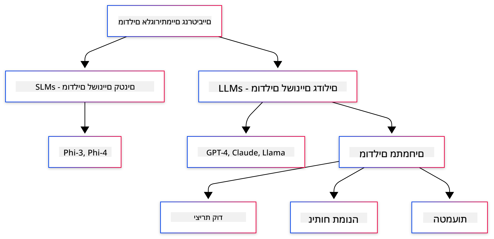

<!--
CO_OP_TRANSLATOR_METADATA:
{
  "original_hash": "6d8b4a0d774dc2a1e97c95859a6d6e4b",
  "translation_date": "2025-07-21T20:17:06+00:00",
  "source_file": "01-IntroToGenAI/README.md",
  "language_code": "he"
}
-->
# מבוא ל-AI גנרטיבי - מהדורת Java

## מה תלמדו

- **יסודות AI גנרטיבי** כולל LLMs, הנדסת פרומפטים, טוקנים, אמבדינגים ומאגרי נתונים וקטוריים  
- **השוואת כלים לפיתוח AI ב-Java** כולל Azure OpenAI SDK, Spring AI ו-OpenAI Java SDK  
- **גילוי פרוטוקול Model Context** ותפקידו בתקשורת סוכני AI  

## תוכן העניינים

- [מבוא](../../../01-IntroToGenAI)  
- [רענון מהיר על מושגי AI גנרטיבי](../../../01-IntroToGenAI)  
- [סקירת הנדסת פרומפטים](../../../01-IntroToGenAI)  
- [טוקנים, אמבדינגים וסוכנים](../../../01-IntroToGenAI)  
- [כלי פיתוח וספריות AI ל-Java](../../../01-IntroToGenAI)  
  - [OpenAI Java SDK](../../../01-IntroToGenAI)  
  - [Spring AI](../../../01-IntroToGenAI)  
  - [Azure OpenAI Java SDK](../../../01-IntroToGenAI)  
- [סיכום](../../../01-IntroToGenAI)  
- [השלבים הבאים](../../../01-IntroToGenAI)  

## מבוא

ברוכים הבאים לפרק הראשון של AI גנרטיבי למתחילים - מהדורת Java! שיעור בסיסי זה יכיר לכם את המושגים המרכזיים של AI גנרטיבי וכיצד לעבוד איתם באמצעות Java. תלמדו על אבני הבניין החיוניות של יישומי AI, כולל מודלים שפתיים גדולים (LLMs), טוקנים, אמבדינגים וסוכני AI. בנוסף, נחקור את הכלים המרכזיים של Java בהם תשתמשו לאורך הקורס.

### רענון מהיר על מושגי AI גנרטיבי

AI גנרטיבי הוא סוג של בינה מלאכותית שיוצר תוכן חדש, כמו טקסט, תמונות או קוד, בהתבסס על דפוסים וקשרים שנלמדו מנתונים. מודלים של AI גנרטיבי יכולים לייצר תגובות דמויות-אדם, להבין הקשר, ולעיתים אף ליצור תוכן שנראה אנושי.

במהלך פיתוח יישומי AI ב-Java, תעבדו עם **מודלים גנרטיביים** ליצירת תוכן. יכולות מסוימות של מודלים גנרטיביים כוללות:

- **יצירת טקסט**: יצירת טקסט דמוי-אדם לצ'אטבוטים, תוכן והשלמת טקסט.  
- **יצירת תמונות וניתוחן**: יצירת תמונות ריאליסטיות, שיפור תמונות וזיהוי אובייקטים.  
- **יצירת קוד**: כתיבת קטעי קוד או סקריפטים.  

ישנם סוגי מודלים מסוימים המותאמים למשימות שונות. לדוגמה, גם **מודלים שפתיים קטנים (SLMs)** וגם **מודלים שפתיים גדולים (LLMs)** יכולים להתמודד עם יצירת טקסט, כאשר LLMs מציעים בדרך כלל ביצועים טובים יותר למשימות מורכבות. למשימות הקשורות לתמונות, תשתמשו במודלים חזותיים ייעודיים או מודלים רב-מודאליים.

כמובן, התגובות של המודלים הללו אינן תמיד מושלמות. ייתכן ששמעתם על מודלים "הוזים" או מייצרים מידע שגוי באופן סמכותי. אך ניתן להנחות את המודל לייצר תגובות טובות יותר על ידי מתן הוראות ברורות והקשר. כאן נכנסת לתמונה **הנדסת פרומפטים**.

#### סקירת הנדסת פרומפטים

הנדסת פרומפטים היא הפרקטיקה של עיצוב קלטים יעילים כדי להנחות מודלים של AI לתוצאות הרצויות. היא כוללת:

- **בהירות**: הפיכת ההוראות לברורות ולא מעורפלות.  
- **הקשר**: מתן מידע רקע נחוץ.  
- **מגבלות**: ציון מגבלות או פורמטים.  

כמה שיטות עבודה מומלצות להנדסת פרומפטים כוללות עיצוב פרומפטים, הוראות ברורות, פירוק משימות, למידה חד-פעמית ורב-פעמית, וכיוונון פרומפטים. בדיקת פרומפטים שונים חיונית למציאת מה שעובד הכי טוב עבור המקרה הספציפי שלכם.

בעת פיתוח יישומים, תעבדו עם סוגי פרומפטים שונים:
- **פרומפטים מערכתיים**: קובעים את הכללים וההקשר הבסיסיים להתנהגות המודל.  
- **פרומפטים של משתמש**: נתוני הקלט ממשתמשי היישום שלכם.  
- **פרומפטים של עוזר**: תגובות המודל המבוססות על פרומפטים מערכתיים ומשתמשים.  

> **למידע נוסף**: למדו עוד על הנדסת פרומפטים בפרק [Prompt Engineering בקורס GenAI למתחילים](https://github.com/microsoft/generative-ai-for-beginners/tree/main/04-prompt-engineering-fundamentals)

#### טוקנים, אמבדינגים וסוכנים

בעת עבודה עם מודלים גנרטיביים, תיתקלו במונחים כמו **טוקנים**, **אמבדינגים**, **סוכנים** ו-**Model Context Protocol (MCP)**. הנה סקירה מפורטת של מושגים אלו:

- **טוקנים**: טוקנים הם היחידה הקטנה ביותר של טקסט במודל. הם יכולים להיות מילים, תווים או תת-מילים. טוקנים משמשים לייצוג נתוני טקסט בפורמט שהמודל יכול להבין. לדוגמה, המשפט "The quick brown fox jumped over the lazy dog" עשוי להיות מחולק לטוקנים כמו ["The", " quick", " brown", " fox", " jumped", " over", " the", " lazy", " dog"] או ["The", " qu", "ick", " br", "own", " fox", " jump", "ed", " over", " the", " la", "zy", " dog"] בהתאם לאסטרטגיית הטוקניזציה.

תהליך הטוקניזציה הוא פירוק הטקסט ליחידות קטנות אלו. זה קריטי מכיוון שמודלים פועלים על טוקנים ולא על טקסט גולמי. מספר הטוקנים בפרומפט משפיע על אורך ואיכות תגובת המודל, שכן למודלים יש מגבלות טוקנים לחלון ההקשר שלהם (לדוגמה, 128K טוקנים עבור ההקשר הכולל של GPT-4o, כולל קלט ופלט).

  ב-Java, ניתן להשתמש בספריות כמו OpenAI SDK כדי לטפל בטוקניזציה באופן אוטומטי בעת שליחת בקשות למודלי AI.

- **אמבדינגים**: אמבדינגים הם ייצוגים וקטוריים של טוקנים הלוכדים משמעות סמנטית. הם ייצוגים מספריים (בדרך כלל מערכים של מספרים עשרוניים) המאפשרים למודלים להבין קשרים בין מילים ולייצר תגובות רלוונטיות להקשר. מילים דומות יהיו בעלות אמבדינגים דומים, מה שמאפשר למודל להבין מושגים כמו מילים נרדפות וקשרים סמנטיים.

  ב-Java, ניתן ליצור אמבדינגים באמצעות OpenAI SDK או ספריות אחרות התומכות ביצירת אמבדינגים. אמבדינגים אלו חיוניים למשימות כמו חיפוש סמנטי, שבו רוצים למצוא תוכן דומה בהתבסס על משמעות ולא על התאמות טקסט מדויקות.

- **מאגרי נתונים וקטוריים**: מאגרי נתונים וקטוריים הם מערכות אחסון ייעודיות המותאמות לאמבדינגים. הם מאפשרים חיפוש דמיון יעיל וחיוניים לדפוסי RAG (יצירת תוכן מוגברת על ידי אחזור), שבהם יש צורך למצוא מידע רלוונטי ממאגרי נתונים גדולים בהתבסס על דמיון סמנטי ולא על התאמות מדויקות.

> **הערה**: בקורס זה לא נעסוק במאגרי נתונים וקטוריים, אך חשוב לציין שהם נפוצים ביישומים בעולם האמיתי.

- **סוכנים ו-MCP**: רכיבי AI הפועלים באופן עצמאי ומתקשרים עם מודלים, כלים ומערכות חיצוניות. פרוטוקול Model Context (MCP) מספק דרך סטנדרטית לסוכנים לגשת בצורה מאובטחת למקורות נתונים חיצוניים וכלים. למדו עוד בקורס [MCP למתחילים](https://github.com/microsoft/mcp-for-beginners).

ביישומי AI ב-Java, תשתמשו בטוקנים לעיבוד טקסט, אמבדינגים לחיפוש סמנטי ו-RAG, מאגרי נתונים וקטוריים לאחזור נתונים, וסוכנים עם MCP לבניית מערכות חכמות המשתמשות בכלים.

### כלים וספריות לפיתוח AI ב-Java

Java מציעה כלים מצוינים לפיתוח AI. ישנן שלוש ספריות עיקריות שנחקור במהלך הקורס - OpenAI Java SDK, Azure OpenAI SDK ו-Spring AI.

הנה טבלת ייחוס מהירה המראה באיזה SDK משתמשים בדוגמאות של כל פרק:

| פרק | דוגמה | SDK |
|---------|--------|-----|
| 02-SetupDevEnvironment | src/github-models/ | OpenAI Java SDK |
| 02-SetupDevEnvironment | src/basic-chat-azure/ | Spring AI Azure OpenAI |
| 03-CoreGenerativeAITechniques | examples/ | Azure OpenAI SDK |
| 04-PracticalSamples | petstory/ | OpenAI Java SDK |
| 04-PracticalSamples | foundrylocal/ | OpenAI Java SDK |
| 04-PracticalSamples | mcp/calculator/ | Spring AI MCP SDK + LangChain4j |

**קישורים לתיעוד SDK:**
- [Azure OpenAI Java SDK](https://github.com/Azure/azure-sdk-for-java/tree/azure-ai-openai_1.0.0-beta.16/sdk/openai/azure-ai-openai)  
- [Spring AI](https://docs.spring.io/spring-ai/reference/)  
- [OpenAI Java SDK](https://github.com/openai/openai-java)  
- [LangChain4j](https://docs.langchain4j.dev/)  

#### OpenAI Java SDK

ה-SDK של OpenAI הוא הספרייה הרשמית של Java עבור OpenAI API. הוא מספק ממשק פשוט ועקבי לאינטראקציה עם המודלים של OpenAI, מה שהופך את שילוב יכולות ה-AI ביישומי Java לקל. דוגמת GitHub Models בפרק 2, יישום Pet Story בפרק 4 ודוגמת Foundry Local מדגימים את הגישה של OpenAI SDK.

#### Spring AI

Spring AI הוא מסגרת מקיפה שמביאה יכולות AI ליישומי Spring, ומספקת שכבת הפשטה עקבית בין ספקי AI שונים. היא משתלבת בצורה חלקה עם אקוסיסטם Spring, מה שהופך אותה לבחירה אידיאלית ליישומי Java ארגוניים הזקוקים ליכולות AI.

החוזק של Spring AI טמון בשילוב החלק שלה עם אקוסיסטם Spring, מה שהופך את בניית יישומי AI מוכנים לייצור לקלה עם תבניות Spring מוכרות כמו הזרקת תלות, ניהול תצורה ומסגרות בדיקה. תשתמשו ב-Spring AI בפרקים 2 ו-4 לבניית יישומים הממנפים את ספריות OpenAI ו-MCP של Spring AI.

##### פרוטוקול Model Context (MCP)

[פרוטוקול Model Context (MCP)](https://modelcontextprotocol.io/) הוא תקן מתהווה המאפשר ליישומי AI לתקשר בצורה מאובטחת עם מקורות נתונים וכלים חיצוניים. MCP מספק דרך סטנדרטית למודלי AI לגשת למידע הקשרי ולבצע פעולות ביישומים שלכם.

בפרק 4, תבנו שירות מחשבון MCP פשוט שמדגים את יסודות פרוטוקול Model Context עם Spring AI, ותראו כיצד ליצור אינטגרציות כלים בסיסיות וארכיטקטורות שירות.

#### Azure OpenAI Java SDK

ספריית הלקוח של Azure OpenAI עבור Java היא התאמה של OpenAI REST APIs המספקת ממשק אידיומטי ואינטגרציה עם שאר אקוסיסטם Azure SDK. בפרק 3, תבנו יישומים באמצעות Azure OpenAI SDK, כולל יישומי צ'אט, קריאת פונקציות ודפוסי RAG (יצירת תוכן מוגברת על ידי אחזור).

> הערה: Azure OpenAI SDK מפגר מאחורי OpenAI Java SDK מבחינת תכונות, ולכן לפרויקטים עתידיים, שקלו להשתמש ב-OpenAI Java SDK.

## סיכום

**ברכות!** למדתם בהצלחה:

- **יסודות AI גנרטיבי** כולל LLMs, הנדסת פרומפטים, טוקנים, אמבדינגים ומאגרי נתונים וקטוריים  
- **השוואת כלים לפיתוח AI ב-Java** כולל Azure OpenAI SDK, Spring AI ו-OpenAI Java SDK  
- **גילוי פרוטוקול Model Context** ותפקידו בתקשורת סוכני AI  

## השלבים הבאים

[פרק 2: הגדרת סביבת הפיתוח](../02-SetupDevEnvironment/README.md)  

**כתב ויתור**:  
מסמך זה תורגם באמצעות שירות תרגום מבוסס בינה מלאכותית [Co-op Translator](https://github.com/Azure/co-op-translator). למרות שאנו שואפים לדיוק, יש לקחת בחשבון שתרגומים אוטומטיים עשויים להכיל שגיאות או אי דיוקים. המסמך המקורי בשפתו המקורית צריך להיחשב כמקור הסמכותי. עבור מידע קריטי, מומלץ להשתמש בתרגום מקצועי על ידי אדם. איננו נושאים באחריות לאי הבנות או לפרשנויות שגויות הנובעות משימוש בתרגום זה.