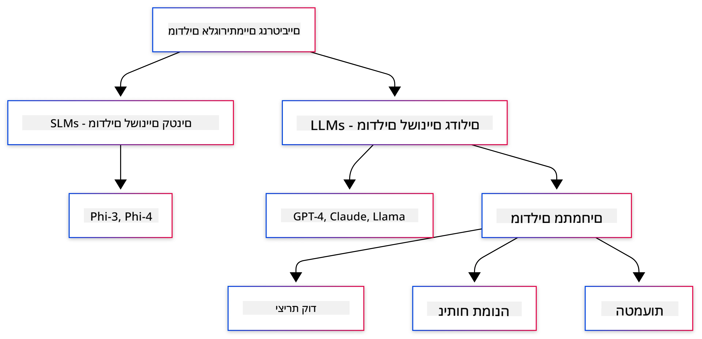
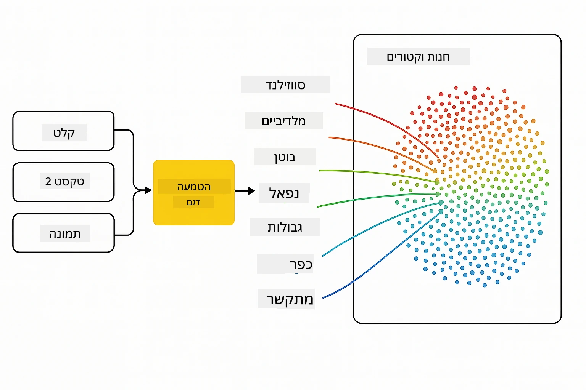
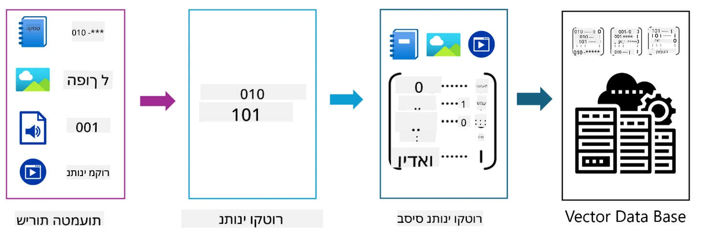
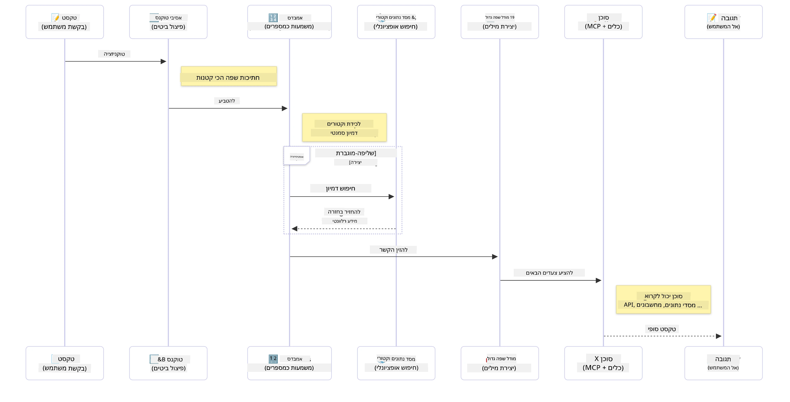

# הקדמה לבינה מלאכותית גנרטיבית - מהדורת Java

> **וידאו**: [צפו בסקירה הווידאו של השיעור הזה ב-YouTube.](https://www.youtube.com/watch?v=XH46tGp_eSw) אתם יכולים גם ללחוץ על תמונת התצוגה המקדימה למעלה.

## מה תלמדו

- **יסודות הבינה המלאכותית הגנרטיבית** כולל LLMs, הנדסת פרומפט, טוקנים, אמבדינגים, ומאגרי וקטורים
- **השוואת כלי פיתוח בינה מלאכותית ב-Java** כולל Azure OpenAI SDK, Spring AI, ו-OpenAI Java SDK
- **גילוי פרוטוקול הקשר המודל (Model Context Protocol)** ותפקידו בתקשורת סוכני בינה מלאכותית

## תוכן עניינים

- [הקדמה](#הקדמה)
- [ריענון מהיר של מושגי בינה מלאכותית גנרטיבית](#ריענון-מהיר-של-מושגי-בינה-מלאכותית-גנרטיבית)
- [סקירת הנדסת פרומפט](#סקירת-הנדסת-פרומפט)
- [טוקנים, אמבדינגים, וסוכנים](#טוקנים-אמבדינגים-וסוכנים)
- [כלי פיתוח וספריות לבינה מלאכותית ב-Java](#כלי-פיתוח-וספריות-לבינה-מלאכותית-ב-java)
  - [OpenAI Java SDK](#openai-java-sdk)
  - [Spring AI](#spring-ai)
  - [Azure OpenAI Java SDK](#azure-openai-java-sdk)
- [סיכום](#סיכום)
- [השלבים הבאים](#השלבים-הבאים)

## הקדמה

ברוכים הבאים לפרק הראשון של בינה מלאכותית גנרטיבית למתחילים - מהדורת Java! שיעור יסוד זה מציג לכם את המושגים המרכזיים של בינה מלאכותית גנרטיבית ואיך לעבוד איתם באמצעות Java. תלמדו על אבני הבניין החיוניות ליישומי AI, כולל מודלי שפה גדולים (LLMs), טוקנים, אמבדינגים, וסוכני בינה מלאכותית. נחקור גם את כלי הפיתוח המרכזיים ב-Java שתשתמשו בהם לאורך הקורס.

### ריענון מהיר של מושגי בינה מלאכותית גנרטיבית

בינה מלאכותית גנרטיבית היא סוג של בינה מלאכותית שיוצרת תוכן חדש, כמו טקסט, תמונות, או קוד, על בסיס דפוסים ויחסים שנלמדו מהנתונים. מודלי בינה מלאכותית גנרטיבית מסוגלים לייצר תגובות דמויות-בן-אדם, להבין הקשר, ולפעמים אף ליצור תוכן שנראה אנושי.

כאשר אתם מפתחים את יישומי הבינה המלאכותית שלכם ב-Java, תעבדו עם **מודלי בינה מלאכותית גנרטיבית** ליצירת תוכן. כמה מהיכולות של מודלים אלו כוללות:

- **יצירת טקסט**: יצירת טקסט דמוי-אנושי לצ'אטבוטים, תוכן והשלמת טקסט.
- **יצירת וניתוח תמונות**: הפקת תמונות ריאליסטיות, שיפור תמונות, וזיהוי אובייקטים.
- **יצירת קוד**: כתיבת קטעי קוד או סקריפטים.

קיימים סוגים ספציפיים של מודלים המותאמים למשימות שונות. לדוגמה, גם **מודלי שפה קטנים (SLMs)** וגם **מודלי שפה גדולים (LLMs)** מסוגלים לטפל ביצירת טקסט, כאשר ל-LLMs בדרך כלל ביצועים טובים יותר למשימות מורכבות. למשימות שקשורות לתמונות, תשתמשו במודלי ראייה ייעודיים או במודלי רב-מודאליים.

כמובן, התגובות מהמודלים האלה אינן תמיד מושלמות. כנראה שמעתם על מודלים שמייצרים "הלוצינציות" או מידע לא נכון באופן סמכותי. אבל אתם יכולים להנחות את המודל לייצר תגובות טובות יותר על ידי מתן הוראות והקשר ברורים. כאן נכנסת הנדסת הפרומפט לפעולה.

#### סקירת הנדסת פרומפט

הנדסת פרומפט היא הפרקטיקה של עיצוב קלטים יעילים כדי להנחות מודלי AI לעבר תוצאות רצויות. היא כוללת:

- **בהירות**: הבהרת ההוראות בצורה ברורה וללא רב-משמעות.
- **הקשר**: מתן מידע רקע נחוץ.
- **מגבלות**: ציון מגבלות או פורמטים מסוימים.

כמה מהשיטות הטובות ביותר להנדסת פרומפט כוללות עיצוב פרומפט, הוראות ברורות, פירוק המשימה, למידה בחד-פעם ומספר-פעמים, וכיוונון הפרומפט. חשוב לבדוק פרומפטים שונים כדי למצוא את המתאים ביותר למקרה השימוש שלכם.

בעת פיתוח יישומים, תעבדו עם סוגי פרומפטים שונים:
- **פרומפטים של מערכת**: מגדירים את הכללים הבסיסיים וההקשר להתנהגות המודל
- **פרומפטים של משתמש**: נתוני הקלט ממשתמשי היישום שלכם
- **פרומפטים של עוזר**: תגובות המודל על פי פרומפטי המערכת והמשתמש

> **למידע נוסף**: למדו עוד על הנדסת פרומפט ב[פרק הנדסת פרומפט בקורס GenAI למתחילים](https://github.com/microsoft/generative-ai-for-beginners/tree/main/04-prompt-engineering-fundamentals)

#### טוקנים, אמבדינגים, וסוכנים

כשעובדים עם מודלי בינה מלאכותית גנרטיבית, תיתקלו במונחים כמו **טוקנים**, **אמבדינגים**, **סוכנים**, ו-**פרוטוקול הקשר המודל (MCP)**. הנה סקירה מפורטת של מושגים אלה:

- **טוקנים**: טוקנים הם יחידת הטקסט הקטנה ביותר במודל. הם יכולים להיות מילים, תווים, או תת-מילים. משתמשים בטוקנים כדי לייצג נתוני טקסט בפורמט שהמודל יכול להבין. למשל, המשפט "The quick brown fox jumped over the lazy dog" עשוי להיות מפוצל ל-["The", " quick", " brown", " fox", " jumped", " over", " the", " lazy", " dog"] או ל-["The", " qu", "ick", " br", "own", " fox", " jump", "ed", " over", " the", " la", "zy", " dog"] בהתאם לאסטרטגיית הטוקניזציה.

טוקניזציה היא תהליך פיצול הטקסט ליחידות קטנות אלו. זה חיוני מכיוון שהמודלים פועלים על טוקנים במקום על טקסט גולמי. מספר הטוקנים בפרומפט משפיע על אורך ואיכות תגובת המודל, מכיוון למודלים יש גבול טוקנים לחלון ההקשר שלהם (למשל, 128K טוקנים לסך הכול של ההקשר של GPT-4o, כולל קלט ופלט).

  ב-Java ניתן להשתמש בספריות כמו OpenAI SDK לטיפול אוטומטי בטוקניזציה בעת שליחת בקשות למודלי AI.

- **אמבדינגים**: אמבדינגים הם ייצוגים וקטוריים של טוקנים הלוכדים משמעות סמנטית. הם ייצוגים מספריים (רובם מערכים של מספרים עשרוניים) שמאפשרים למודלים להבין קשרים בין מילים ולייצר תגובות הקשורות להקשר. מילים דומות מחזיקות אמבדינגים דומים, מה שמאפשר למודל להבין מושגים כמו מילים נרדפות וקשרים סמנטיים.

  ב-Java, ניתן ליצור אמבדינגים באמצעות OpenAI SDK או ספריות אחרות התומכות ביצירת אמבדינגים. אמבדינגים אלה חיוניים למשימות כמו חיפוש סמנטי, כשאתם רוצים למצוא תוכן דומה על בסיס משמעות ולא התאמה מדויקת של טקסט.

- **מאגרי וקטורים**: מאגרי וקטורים הם מערכות אחסון ממוקדות ומותאמות לאחסון אמבדינגים. הם מאפשרים חיפוש יעיל של דמיון והם חיוניים לדפוסי Retrieval-Augmented Generation (RAG), שבהם צריך למצוא מידע רלוונטי מתוך קבוצות נתונים גדולות בהתבסס על דמיון סמנטי במקום התאמות מדויקות.

> **הערה**: בקורס זה לא נעסוק במאגרי וקטורים, אך הם שווים אזכור כי משתמשים בהם בדרך כלל ביישומים בעולם האמיתי.

- **סוכנים ו-MCP**: רכיבי בינה מלאכותית שפועלים באופן אוטונומי באינטראקציה עם מודלים, כלים ומערכות חיצוניות. פרוטוקול הקשר המודל (MCP) מספק דרך אחידה לסוכנים לגשת בצורה מאובטחת למקורות נתונים וכלים חיצוניים. למדו עוד בקורס [MCP למתחילים](https://github.com/microsoft/mcp-for-beginners).

ביישומי בינה מלאכותית ב-Java, תשתמשו בטוקנים לעיבוד טקסט, אמבדינגים לחיפוש סמנטי ו-RAG, מאגרי וקטורים לשליפת נתונים, וסוכנים עם MCP לבניית מערכות חכמות המשתמשות בכלים.

### כלי פיתוח וספריות לבינה מלאכותית ב-Java

ל-Java יש כלי פיתוח מעולים לפיתוח בינה מלאכותית. ישנן שלוש ספריות עיקריות שנחקור לאורך הקורס - OpenAI Java SDK, Azure OpenAI SDK, ו-Spring AI.

הנה טבלת עזר מהירה המציגה איזו SDK משמשת בדוגמאות של כל פרק:

| פרק | דוגמה | SDK |
|---------|--------|-----|
| 02-SetupDevEnvironment | github-models | OpenAI Java SDK |
| 02-SetupDevEnvironment | basic-chat-azure | Spring AI Azure OpenAI |
| 03-CoreGenerativeAITechniques | examples | Azure OpenAI SDK |
| 04-PracticalSamples | petstory | OpenAI Java SDK |
| 04-PracticalSamples | foundrylocal | OpenAI Java SDK |
| 04-PracticalSamples | calculator | Spring AI MCP SDK + LangChain4j |

**קישורים לתיעוד ה-SDK:**
- [Azure OpenAI Java SDK](https://github.com/Azure/azure-sdk-for-java/tree/azure-ai-openai_1.0.0-beta.16/sdk/openai/azure-ai-openai)
- [Spring AI](https://docs.spring.io/spring-ai/reference/)
- [OpenAI Java SDK](https://github.com/openai/openai-java)
- [LangChain4j](https://docs.langchain4j.dev/)

#### OpenAI Java SDK

OpenAI SDK היא ספריית ה-Java הרשמית ל-API של OpenAI. היא מספקת ממשק פשוט ועקבי לאינטראקציה עם מודלי OpenAI, מה שמקל על שילוב יכולות AI ביישומי Java. דוגמאות לפרק 2 עם GitHub Models, לפרק 4 עם יישום Pet Story ודוגמת Foundry Local מציגות את גישת OpenAI SDK.

#### Spring AI

Spring AI הוא מסגרת מקיפה שמביאה יכולות AI ליישומי Spring, ומספקת שכבת אבסטרקציה עקבית בין ספקי AI שונים. היא משתלבת בהרמוניה עם אקוסיסטם Spring, מה שהופך אותה לבחירה אידיאלית ליישומי Java ארגוניים הזקוקים ליכולות AI.

חוזקה של Spring AI הוא בשילוב האינטגרלי שלה עם אקוסיסטם Spring, מה שמקל על בניית יישומי AI מוכנים לייצור עם דפוסי Spring מוכרים כמו הזרקת תלויות, ניהול תצורה, ופריימוורקי בדיקות. תשתמשו ב-Spring AI בפרקים 2 ו-4 לבניית יישומים שמנצלים הן את OpenAI והן את ספריות Model Context Protocol (MCP) של Spring AI.

##### פרוטוקול הקשר המודל (MCP)

[פרוטוקול הקשר המודל (MCP)](https://modelcontextprotocol.io/) הוא תקן מתהווה שמאפשר ליישומי AI לפעול בצורה מאובטחת עם מקורות נתונים וכלים חיצוניים. MCP מספק דרך אחידה למודלי AI לגשת למידע קונטקסטואלי ולבצע פעולות ביישומים שלכם.

בפרק 4, תבנו שירות מחשבון MCP פשוט שמדגים את היסודות של פרוטוקול הקשר המודל ב-Spring AI, ומציג כיצד ליצור אינטגרציות כלים בסיסיות ואדריכלות שירותים.

#### Azure OpenAI Java SDK

ספריית הלקוח של Azure OpenAI ל-Java היא עיבוד של ממשקי REST של OpenAI, שמספקת ממשק אידיומטי ואינטגרציה עם יתר אקוסיסטם ה-SDK של Azure. בפרק 3 תבנו יישומים שמשתמשים ב-Azure OpenAI SDK, כולל יישומי צ'אט, קריאות לפונקציות, ודפוסי RAG (Retrieval-Augmented Generation).

> הערה: Azure OpenAI SDK מאחר מאחורי OpenAI Java SDK מבחינת התכונות, לכן לפרויקטים עתידיים שקלו להשתמש ב-OpenAI Java SDK.

## סיכום

כעת סיימתם את היסודות! אתם מבינים כעת:

- המושגים המרכזיים מאחורי בינה מלאכותית גנרטיבית - מ-LLMs והנדסת פרומפט ועד טוקנים, אמבדינגים, ומאגרי וקטורים
- אפשרויות ערכת הכלים שלכם לפיתוח בינה מלאכותית ב-Java: Azure OpenAI SDK, Spring AI, ו-OpenAI Java SDK
- מהו פרוטוקול הקשר המודל וכיצד הוא מאפשר לסוכני AI לעבוד עם כלים חיצוניים

## השלבים הבאים

[פרק 2: הגדרת סביבת הפיתוח](../02-SetupDevEnvironment/README.md)

---

<!-- CO-OP TRANSLATOR DISCLAIMER START -->
**כתב ידיעה**:
מסמך זה תורגם באמצעות שירות תרגום בינה מלאכותית [Co-op Translator](https://github.com/Azure/co-op-translator). בעוד שאנו שואפים לדיוק, נא להבין כי תרגומים אוטומטיים עלולים להכיל שגיאות או אי דיוקים. המסמך המקורי בשפת המקור צריך להיחשב כמקור המהימן. למידע קריטי, מומלץ תרגום מקצועי על ידי אדם. אנו לא נושאים באחריות לכל אי הבנה או פרשנות שגויה הנובעת משימוש בתרגום זה.
<!-- CO-OP TRANSLATOR DISCLAIMER END -->