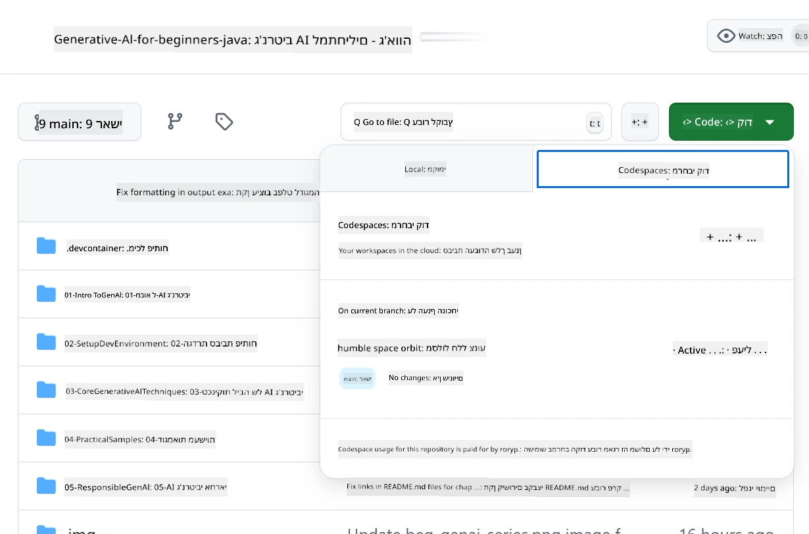
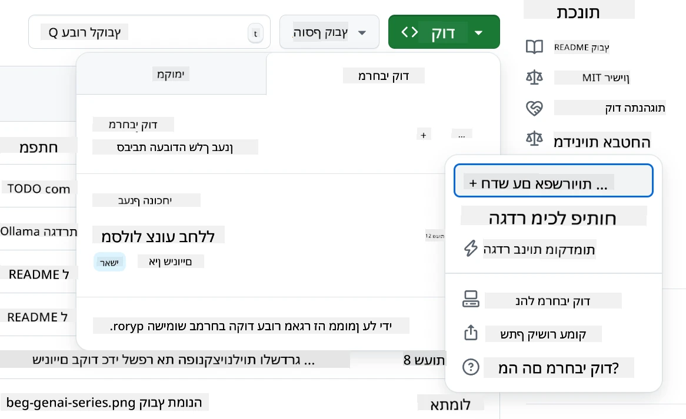
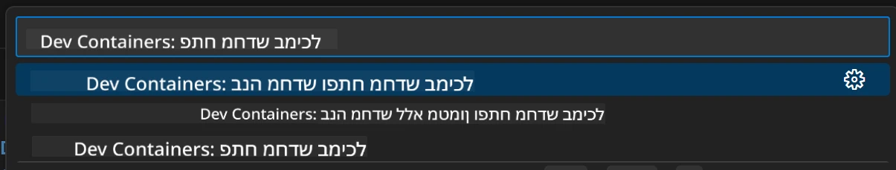
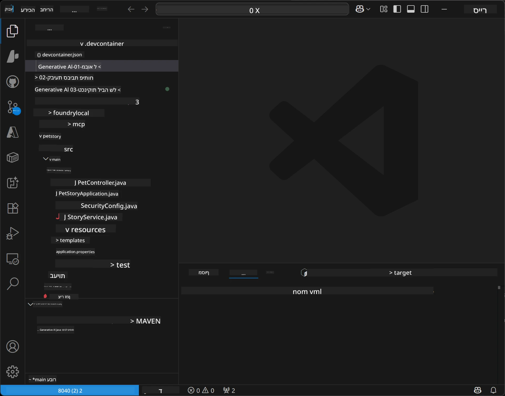
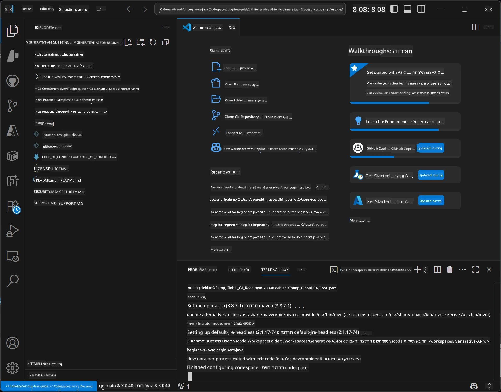

<!--
CO_OP_TRANSLATOR_METADATA:
{
  "original_hash": "96a30d42b9751a3d4e4b20e28d29d459",
  "translation_date": "2026-01-28T05:08:45+00:00",
  "source_file": "02-SetupDevEnvironment/README.md",
  "language_code": "he"
}
-->
# הקמת סביבת הפיתוח ל-AI גנרטיבי עבור Java

> **התחלה מהירה**: כתבו קוד בענן תוך 2 דקות - עברו ל-[הגדרת GitHub Codespaces](../../../02-SetupDevEnvironment) - אין צורך בהתקנה מקומית ומשתמש בדגמי github!

> **מעוניינים ב-Azure OpenAI?**, ראו את [מדריך ההגדרה של Azure OpenAI](getting-started-azure-openai.md) עם צעדים ליצירת משאב Azure OpenAI חדש.

## מה תלמדו

- הקמת סביבת פיתוח Java ליישומי AI
- בחירת והגדרת סביבת הפיתוח המועדפת עליכם (cloud-first עם Codespaces, מכולת פיתוח מקומית, או התקנה מקומית מלאה)
- בדיקת ההגדרה שלכם על ידי חיבור לדגמי GitHub

## תוכן העניינים

- [מה תלמדו](../../../02-SetupDevEnvironment)
- [מבוא](../../../02-SetupDevEnvironment)
- [שלב 1: הקמת סביבת הפיתוח שלכם](../../../02-SetupDevEnvironment)
  - [אפשרות א: GitHub Codespaces (מומלץ)](../../../02-SetupDevEnvironment)
  - [אפשרות ב: מכולת פיתוח מקומית](../../../02-SetupDevEnvironment)
  - [אפשרות ג: השתמשו בהתקנה מקומית קיימת](../../../02-SetupDevEnvironment)
- [שלב 2: יצירת אסימון גישה אישי GitHub](../../../02-SetupDevEnvironment)
- [שלב 3: בדיקת ההגדרה שלכם](../../../02-SetupDevEnvironment)
- [פתרון בעיות](../../../02-SetupDevEnvironment)
- [סיכום](../../../02-SetupDevEnvironment)
- [השלבים הבאים](../../../02-SetupDevEnvironment)

## מבוא

פרק זה ינחה אתכם בהקמת סביבת פיתוח. נשתמש ב**דגמי GitHub** כדוגמה העיקרית כי הם חינמיים, קלים להגדרה עם חשבון GitHub בלבד, לא דורשים כרטיס אשראי, ומציעים גישה למספר דגמים לניסויים.

**אין צורך בהתקנה מקומית!** אתם יכולים להתחיל לכתוב קוד מיד באמצעות GitHub Codespaces, שמספק סביבת פיתוח מלאה בדפדפן שלכם.


ממליצים להשתמש ב-[**דגמי GitHub**](https://github.com/marketplace?type=models) לקורס זה מפני שהם:
- **חינם** להתחלה
- **קלים** להגדרה עם חשבון GitHub בלבד
- **בלי צורך בכרטיס אשראי**
- **מספר דגמים** זמינים לניסויים

> **הערה**: לדגמי GitHub בהם משתמשים באימון זה יש הגבלות חינמיות כאלה:
> - 15 בקשות לדקה (150 ביום)
> - כ-8,000 מילים כניסה, כ-4,000 מילים יציאה לכל בקשה
> - 5 בקשות במקביל
> 
> לשימוש בביצוע, שדרגו ל-Azure AI Foundry Models עם חשבון Azure שלכם. הקוד שלכם לא יצטרך להשתנות. ראה את [תיעוד Azure AI Foundry](https://learn.microsoft.com/azure/ai-foundry/foundry-models/how-to/quickstart-github-models).


## שלב 1: הקמת סביבת הפיתוח שלכם

<a name="quick-start-cloud"></a>

יצרנו מכולת פיתוח קונפיגורציה מראש כדי לצמצם זמן הקמה ולהבטיח שיש לכם את כל הכלים הנחוצים לקורס AI גנרטיבי עבור Java. בחרו את גישת הפיתוח המועדפת עליכם:

### אפשרויות הגדרת סביבה:

#### אפשרות א: GitHub Codespaces (מומלץ)

**התחילו לכתוב קוד תוך 2 דקות - אין צורך בהתקנה מקומית!**

1. צרו Fork למאגר זה לחשבון ה-GitHub שלכם  
   > **הערה**: במידה ואתם רוצים לערוך את ההגדרה הבסיסית, עיינו ב-[Dev Container Configuration](../../../.devcontainer/devcontainer.json)
2. לחצו על **Code** → לשונית **Codespaces** → **...** → **חדש עם אפשרויות...**
3. השתמשו בהגדרות ברירת המחדל – זה יבחר את **Dev container configuration**: **Generative AI Java Development Environment** מכולת הפיתוח המותאמת לקורס זה
4. לחצו על **Create codespace**
5. המתינו כ-2 דקות לסיום ההכנה של הסביבה
6. המשיכו ל[שלב 2: יצירת אסימון GitHub](../../../02-SetupDevEnvironment)






> **יתרונות Codespaces**:  
> - אין צורך בהתקנה מקומית  
> - פועל בכל מכשיר עם דפדפן  
> - מוגדר מראש עם כל הכלים וההתלויות  
> - 60 שעות חינם בחודש לחשבונות אישיים  
> - סביבה עקבית לכל הלומדים

#### אפשרות ב: מכולת פיתוח מקומית

**למפתחים שמעדיפים פיתוח מקומי עם Docker**

1. צרו Fork ו-clone למאגר זה למחשב המקומי שלכם  
   > **הערה**: במידה ואתם רוצים לערוך את ההגדרה הבסיסית, עיינו ב-[Dev Container Configuration](../../../.devcontainer/devcontainer.json)
2. התקינו את [Docker Desktop](https://www.docker.com/products/docker-desktop/) ו-[VS Code](https://code.visualstudio.com/)
3. התקינו את [הרחבת Dev Containers](https://marketplace.visualstudio.com/items?itemName=ms-vscode-remote.remote-containers) ב-VS Code
4. פתחו את תיקיית המאגר ב-VS Code
5. כאשר תתבקשו, לחצו **Reopen in Container** (או הקישו `Ctrl+Shift+P` → "Dev Containers: Reopen in Container")
6. המתינו שהמכולה תיבנה ותתחיל
7. המשיכו ל[שלב 2: יצירת אסימון GitHub](../../../02-SetupDevEnvironment)





#### אפשרות ג: השתמשו בהתקנה מקומית קיימת

**למפתחים עם סביבות Java קיימות**

דרישות מוקדמות:  
- [Java 21+](https://www.oracle.com/java/technologies/javase/jdk21-archive-downloads.html)  
- [Maven 3.9+](https://maven.apache.org/download.cgi)  
- [VS Code](https://code.visualstudio.com) או סביבת הפיתוח המועדפת עליכם

צעדים:  
1. העתיקו את המאגר למחשב המקומי שלכם  
2. פתחו את הפרויקט ב-IDE שלכם  
3. המשיכו ל[שלב 2: יצירת אסימון GitHub](../../../02-SetupDevEnvironment)

> **טיפ מקצועי**: אם יש לכם מכשיר חלש, אבל רוצים VS Code מקומית, השתמשו ב-GitHub Codespaces! ניתן לחבר את VS Code המקומי שלכם ל-Codespace בענן ולקבל את הטוב משני העולמות.




## שלב 2: יצירת אסימון גישה אישי GitHub

1. עברו אל [הגדרות GitHub](https://github.com/settings/profile) ובחרו **Settings** מתפריט הפרופיל שלכם.
2. בסרגל הצד השמאלי, לחצו על **Developer settings** (לרוב בתחתית).
3. תחת **Personal access tokens**, לחצו על **Fine-grained tokens** (או גשו ישירות עם [קישור](https://github.com/settings/personal-access-tokens)).
4. לחצו על **Generate new token**.
5. תחת "Token name", כתבו שם מתאר (למשל, `GenAI-Java-Course-Token`).
6. הגדירו תאריך תפוגה (מומלץ: 7 ימים כדי לשמור על בטיחות).
7. תחת "Resource owner", בחרו את חשבון המשתמש שלכם.
8. תחת "Repository access", בחרו את המאגר/ים שברצונכם להשתמש עימם עם דגמי GitHub (או "כל המאגר/ים" במידת הצורך).
9. תחת "Account permissions", מצאו **Models** והגדרו ל**קריאה בלבד**.
10. לחצו על **Generate token**.
11. **העתיקו ושמרו את האסימון עכשיו** – לא תראו אותו שוב!

> **טיפ ביטחון**: השתמשו בטווח ההרשאות המזערי הדרוש ובזמן תפוגה קצר ככל האפשר לאסימוני הגישה שלכם.

## שלב 3: בדיקת ההגדרה שלכם עם דוגמת דגמי GitHub

לאחר שסביבת הפיתוח שלכם מוכנה, בואו נבדוק את האינטגרציה עם דגמי GitHub באמצעות אפליקציית הדוגמה ב-[`02-SetupDevEnvironment/examples/github-models`](../../../02-SetupDevEnvironment/examples/github-models).

1. פותחים טרמינל בסביבת הפיתוח שלכם.
2. עוברים אל דוגמת דגמי GitHub:  
   ```bash
   cd 02-SetupDevEnvironment/examples/github-models
   ```
3. הגדירו את אסימון GitHub שלכם כמשתנה סביבה:  
   ```bash
   # macOS/Linux
   export GITHUB_TOKEN=your_token_here
   
   # Windows (שורת הפקודה)
   set GITHUB_TOKEN=your_token_here
   
   # Windows (PowerShell)
   $env:GITHUB_TOKEN="your_token_here"
   ```
  
4. הריצו את האפליקציה:  
   ```bash
   mvn compile exec:java -Dexec.mainClass="com.example.githubmodels.App"
   ```
  
תראו פלט דומה ל:  
```text
Using model: gpt-4.1-nano
Sending request to GitHub Models...
Response: Hello World!
```
  
### הבנת קוד הדוגמה

קודם כל, נבין מה הרצנו עכשיו. הדוגמה תחת `examples/github-models` משתמשת ב-SDK של OpenAI ל-Java כדי להתחבר לדגמי GitHub:

**מה הקוד הזה עושה:**  
- **מתחבר** לדגמי GitHub באמצעות אסימון הגישה האישי שלכם  
- **שולח** הודעה פשוטה "Say Hello World!" למודל ה-AI  
- **מקבל** ומציג את התגובה של ה-AI  
- **מאמת** שההגדרה שלכם פועלת כראוי

**תלות עיקרית** (ב-`pom.xml`):  
```xml
<dependency>
    <groupId>com.openai</groupId>
    <artifactId>openai-java</artifactId>
    <version>2.12.0</version>
</dependency>
```
  
**קוד ראשי** (`App.java`):  
```java
// התחבר למודלים של GitHub באמצעות OpenAI Java SDK
OpenAIClient client = OpenAIOkHttpClient.builder()
    .apiKey(pat)
    .baseUrl("https://models.inference.ai.azure.com")
    .build();

// צור בקשת השלמת שיחה
ChatCompletionCreateParams params = ChatCompletionCreateParams.builder()
    .model(modelId)
    .addSystemMessage("You are a concise assistant.")
    .addUserMessage("Say Hello World!")
    .build();

// קבל תגובת בינה מלאכותית
ChatCompletion response = client.chat().completions().create(params);
System.out.println("Response: " + response.choices().get(0).message().content().orElse("No response content"));
```
  
## סיכום

מעולה! עכשיו הכל מוכן:

- יצרתם אסימון גישה אישי ל-GitHub עם ההרשאות הנכונות לגישה לדגמי AI
- הפעלתם את סביבת הפיתוח Java שלכם (בין אם Codespaces, מכולת פיתוח, או מקומית)
- התחברתם לדגמי GitHub באמצעות ה-SDK של OpenAI ל-Java לפיתוח AI חינמי
- בדקתם שהכל עובד עם דוגמה פשוטה שמתקשרת עם דגמי AI

## השלבים הבאים

[פרק 3: טכניקות ליבה של AI גנרטיבי](../03-CoreGenerativeAITechniques/README.md)

## פתרון בעיות

נתקלתם בבעיות? הנה בעיות נפוצות ופתרונות:

- **האסימון לא עובד?**  
  - ודאו שהעתקתם את כל האסימון ללא רווחים מיותרים  
  - וודאו שהאסימון מוגדר נכון כמשתנה סביבה  
  - בדקו שלאסימון יש את ההרשאות הנכונות (Models: קריאה בלבד)

- **Maven לא נמצא?**  
  - אם אתם משתמשים במכולות/Codespaces, Maven מותקן מראש  
  - בהתקנה מקומית, ודאו ש-Java 21+ ו-Maven 3.9+ מותקנים  
  - נסו `mvn --version` לוודא התקנה

- **בעיות חיבור?**  
  - בדקו את חיבור האינטרנט שלכם  
  - וודאו ש-GitHub נגיש מהרשת שלכם  
  - ודאו שאינכם מאחורי חומת אש החוסמת את נקודת הקצה של דגמי GitHub

- **מכולת פיתוח לא מתחילה?**  
  - ודאו ש-Docker Desktop פועל (לפיתוח מקומי)  
  - נסו לבנות מחדש את המכולה: `Ctrl+Shift+P` → "Dev Containers: Rebuild Container"

- **שגיאות קומפילציה של האפליקציה?**  
  - וודאו שאתם בתיקייה הנכונה: `02-SetupDevEnvironment/examples/github-models`  
  - נסו לנקות ולבנות מחדש: `mvn clean compile`

> **צריכים עזרה?**: עדיין יש בעיות? פתחו בעיה במאגר ונעזור לכם.

---

<!-- CO-OP TRANSLATOR DISCLAIMER START -->
**כתב ויתור**:  
מסמך זה תורגם בשירות תרגום מבוסס בינה מלאכותית [Co-op Translator](https://github.com/Azure/co-op-translator). למרות שאנו שואפים לדיוק, יש לקחת בחשבון כי תרגומים אוטומטיים עלולים להכיל טעויות או אי-דיוקים. המסמך המקורי בשפתו המקורית נחשב למקור הסמכותי. למידע קריטי מומלץ להיעזר בתרגום מקצועי של אדם. איננו אחראים לכל אי הבנה או פרשנות שגויה הנובעת משימוש בתרגום זה.
<!-- CO-OP TRANSLATOR DISCLAIMER END -->