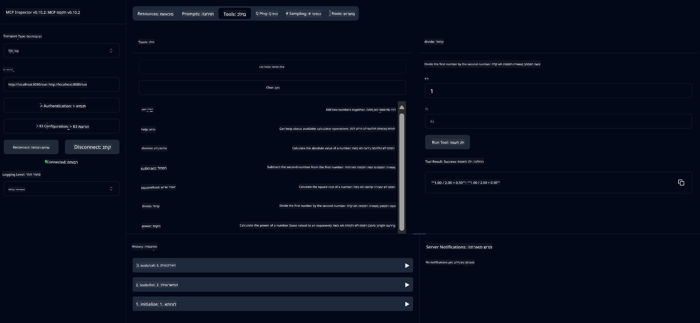

<!--
CO_OP_TRANSLATOR_METADATA:
{
  "original_hash": "5bd7a347d6ed1d706443f9129dd29dd9",
  "translation_date": "2025-07-25T09:46:47+00:00",
  "source_file": "04-PracticalSamples/mcp/calculator/README.md",
  "language_code": "he"
}
-->
# שירות מחשבון בסיסי MCP

>**Note**: פרק זה כולל [**מדריך**](./TUTORIAL.md) שמנחה אותך דרך הדוגמאות.

ברוך הבא לחוויה המעשית הראשונה שלך עם **Model Context Protocol (MCP)**! בפרקים הקודמים, למדת על יסודות AI גנרטיבי והגדרת את סביבת הפיתוח שלך. עכשיו הגיע הזמן לבנות משהו מעשי.

שירות המחשבון הזה מדגים כיצד מודלים של AI יכולים לתקשר בצורה מאובטחת עם כלים חיצוניים באמצעות MCP. במקום להסתמך על יכולות המתמטיקה הלא תמיד מדויקות של מודל ה-AI, נראה כיצד לבנות מערכת חזקה שבה ה-AI יכול לקרוא לשירותים מתמחים לחישובים מדויקים.

## תוכן עניינים

- [מה תלמד](../../../../../04-PracticalSamples/mcp/calculator)
- [דרישות מקדימות](../../../../../04-PracticalSamples/mcp/calculator)
- [מושגים מרכזיים](../../../../../04-PracticalSamples/mcp/calculator)
- [התחלה מהירה](../../../../../04-PracticalSamples/mcp/calculator)
- [פעולות מחשבון זמינות](../../../../../04-PracticalSamples/mcp/calculator)
- [לקוחות בדיקה](../../../../../04-PracticalSamples/mcp/calculator)
  - [1. לקוח MCP ישיר (SDKClient)](../../../../../04-PracticalSamples/mcp/calculator)
  - [2. לקוח מבוסס AI (LangChain4jClient)](../../../../../04-PracticalSamples/mcp/calculator)
- [מפקח MCP (ממשק אינטרנט)](../../../../../04-PracticalSamples/mcp/calculator)
  - [הוראות שלב-אחר-שלב](../../../../../04-PracticalSamples/mcp/calculator)

## מה תלמד

על ידי עבודה דרך הדוגמה הזו, תבין:
- כיצד ליצור שירותים תואמי MCP באמצעות Spring Boot
- ההבדל בין תקשורת פרוטוקול ישירה לבין אינטראקציה מבוססת AI
- כיצד מודלים של AI מחליטים מתי וכיצד להשתמש בכלים חיצוניים
- שיטות עבודה מומלצות לבניית אפליקציות AI עם כלים משולבים

מושלם למתחילים שלומדים את מושגי MCP ומוכנים לבנות את האינטגרציה הראשונה שלהם עם כלי AI!

## דרישות מקדימות

- Java 21+
- Maven 3.6+
- **אסימון GitHub**: נדרש עבור הלקוח מבוסס ה-AI. אם עדיין לא הגדרת זאת, ראה [פרק 2: הגדרת סביבת הפיתוח שלך](../../../02-SetupDevEnvironment/README.md) להוראות.

## מושגים מרכזיים

**Model Context Protocol (MCP)** הוא דרך סטנדרטית עבור אפליקציות AI להתחבר בצורה מאובטחת לכלים חיצוניים. חשבו על זה כ"גשר" שמאפשר למודלים של AI להשתמש בשירותים חיצוניים כמו המחשבון שלנו. במקום שהמודל ינסה לבצע חישובים בעצמו (מה שיכול להיות לא אמין), הוא יכול לקרוא לשירות המחשבון שלנו כדי לקבל תוצאות מדויקות. MCP מבטיח שהתקשורת הזו תתבצע בצורה בטוחה ועקבית.

**Server-Sent Events (SSE)** מאפשרים תקשורת בזמן אמת בין השרת ללקוחות. בניגוד לבקשות HTTP מסורתיות שבהן אתה שואל וממתין לתשובה, SSE מאפשר לשרת לשלוח עדכונים באופן רציף ללקוח. זה מושלם עבור אפליקציות AI שבהן התשובות עשויות להיות מוזרמות או לקחת זמן לעיבוד.

**כלי AI וקריאת פונקציות** מאפשרים למודלים של AI לבחור ולהשתמש באופן אוטומטי בפונקציות חיצוניות (כמו פעולות מחשבון) בהתבסס על בקשות משתמש. כשאתה שואל "מה זה 15 + 27?", מודל ה-AI מבין שאתה רוצה חיבור, קורא באופן אוטומטי לכלי `add` עם הפרמטרים הנכונים (15, 27), ומחזיר את התוצאה בשפה טבעית. ה-AI פועל כמתאם חכם שיודע מתי וכיצד להשתמש בכל כלי.

## התחלה מהירה

### 1. נווט לתיקיית אפליקציית המחשבון
```bash
cd Generative-AI-for-beginners-java/04-PracticalSamples/mcp/calculator
```

### 2. בנה והפעל
```bash
mvn clean install -DskipTests
java -jar target/calculator-server-0.0.1-SNAPSHOT.jar
```

### 3. בדוק עם לקוחות
- **SDKClient**: אינטראקציה ישירה עם פרוטוקול MCP
- **LangChain4jClient**: אינטראקציה בשפה טבעית מבוססת AI (דורש אסימון GitHub)

## פעולות מחשבון זמינות

- `add(a, b)`, `subtract(a, b)`, `multiply(a, b)`, `divide(a, b)`
- `power(base, exponent)`, `squareRoot(number)`, `absolute(number)`
- `modulus(a, b)`, `help()`

## לקוחות בדיקה

### 1. לקוח MCP ישיר (SDKClient)
בודק תקשורת פרוטוקול MCP גולמית. הפעל עם:
```bash
mvn test-compile exec:java -Dexec.mainClass="com.microsoft.mcp.sample.client.SDKClient" -Dexec.classpathScope=test
```

### 2. לקוח מבוסס AI (LangChain4jClient)
מדגים אינטראקציה בשפה טבעית עם מודלים של GitHub. דורש אסימון GitHub (ראה [דרישות מקדימות](../../../../../04-PracticalSamples/mcp/calculator)).

**הפעל:**
```bash
mvn test-compile exec:java -Dexec.mainClass="com.microsoft.mcp.sample.client.LangChain4jClient" -Dexec.classpathScope=test
```

## מפקח MCP (ממשק אינטרנט)

מפקח MCP מספק ממשק אינטרנט חזותי לבדיקת שירות MCP שלך ללא צורך בכתיבת קוד. מושלם למתחילים שרוצים להבין כיצד MCP עובד!

### הוראות שלב-אחר-שלב:

1. **הפעל את שרת המחשבון** (אם עדיין לא פועל):
   ```bash
   java -jar target/calculator-server-0.0.1-SNAPSHOT.jar
   ```

2. **התקן והפעל את מפקח MCP** בחלון טרמינל חדש:
   ```bash
   npx @modelcontextprotocol/inspector
   ```

3. **פתח את ממשק האינטרנט**:
   - חפש הודעה כמו "Inspector running at http://localhost:6274"
   - פתח את ה-URL הזה בדפדפן שלך

4. **התחבר לשירות המחשבון שלך**:
   - בממשק האינטרנט, הגדר את סוג התעבורה ל-"SSE"
   - הגדר את ה-URL ל: `http://localhost:8080/sse`
   - לחץ על כפתור "Connect"

5. **חקור כלים זמינים**:
   - לחץ על "List Tools" כדי לראות את כל פעולות המחשבון
   - תראה פונקציות כמו `add`, `subtract`, `multiply`, וכו'.

6. **בדוק פעולה של מחשבון**:
   - בחר כלי (לדוגמה, "add")
   - הזן פרמטרים (לדוגמה, `a: 15`, `b: 27`)
   - לחץ על "Run Tool"
   - ראה את התוצאה שהוחזרה על ידי שירות MCP שלך!

גישה חזותית זו עוזרת לך להבין בדיוק כיצד תקשורת MCP עובדת לפני שתבנה לקוחות משלך.



---
**Reference:** [MCP Server Boot Starter Docs](https://docs.spring.io/spring-ai/reference/api/mcp/mcp-server-boot-starter-docs.html)

**כתב ויתור**:  
מסמך זה תורגם באמצעות שירות תרגום מבוסס בינה מלאכותית [Co-op Translator](https://github.com/Azure/co-op-translator). למרות שאנו שואפים לדיוק, יש לקחת בחשבון שתרגומים אוטומטיים עשויים להכיל שגיאות או אי דיוקים. המסמך המקורי בשפתו המקורית צריך להיחשב כמקור סמכותי. עבור מידע קריטי, מומלץ להשתמש בתרגום מקצועי על ידי אדם. איננו נושאים באחריות לאי הבנות או לפרשנויות שגויות הנובעות משימוש בתרגום זה.