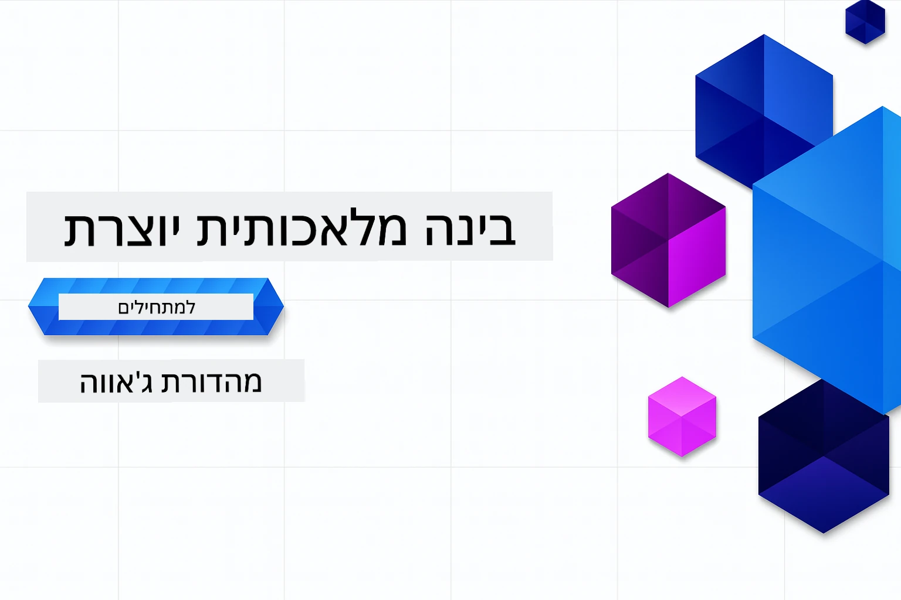

# בינה מלאכותית מחוללת למתחילים - מהדורת ג'אווה
[](https://discord.gg/nTYy5BXMWG)



**זמן התחייבות**: כל הסדנה ניתנת להשלמה באופן מקוון ללא התקנה מקומית. ההתקנה של הסביבה לוקחת 2 דקות, עם חקר הדוגמאות שדורש 1-3 שעות בהתאם לעומק החקר.

> **התחלה מהירה**

1. פצל את המאגר הזה לחשבון GitHub שלך  
2. לחץ על **Code** → לשונית **Codespaces** → **...** → **חדש עם אפשרויות...**  
3. השתמש בהגדרות ברירת המחדל – זה יבחר את מכולת הפיתוח שנוצרה עבור הקורס הזה  
4. לחץ על **Create codespace**  
5. המתן כ-2 דקות עד שהסביבה תהיה מוכנה  
6. דלג ישר ל-[הדוגמה הראשונה](./02-SetupDevEnvironment/README.md#step-2-create-a-github-personal-access-token)

> **מעדיף לשכפל מקומית?**
>
> מאגר זה כולל יותר מ-50 תרגומים לשפות שמגדילים משמעותית את גודל ההורדה. כדי לשכפל ללא תרגומים, השתמש בבדיקה מדוללת (sparse checkout):  
>
> **Linux / macOS (Bash)**  
> ```bash
> git clone --filter=blob:none --sparse https://github.com/microsoft/Generative-AI-for-beginners-java.git
> cd Generative-AI-for-beginners-java
> git sparse-checkout set --no-cone '/*' '!translations' '!translated_images'
> ```
>  
> **Windows (PowerShell)**  
> ```powershell
> git clone --filter=blob:none --sparse https://github.com/microsoft/Generative-AI-for-beginners-java.git
> cd Generative-AI-for-beginners-java
> git sparse-checkout set --no-cone "/*" "!translations" "!translated_images"
> ```
> זה נותן לך את כל מה שצריך כדי להשלים את הקורס עם הורדה הרבה יותר מהירה.


## תמיכה מרובת שפות

### נתמך באמצעות GitHub Action (אוטומטי ותמיד מעודכן)

<!-- CO-OP TRANSLATOR LANGUAGES TABLE START -->
[ערבית](../ar/README.md) | [בנגלית](../bn/README.md) | [בולגרית](../bg/README.md) | [בורמזית (מיאנמר)](../my/README.md) | [סינית (מפושטת)](../zh-CN/README.md) | [סינית (מסורתית, הונג קונג)](../zh-HK/README.md) | [סינית (מסורתית, מקאו)](../zh-MO/README.md) | [סינית (מסורתית, טייוואן)](../zh-TW/README.md) | [קרואטית](../hr/README.md) | [צ'כית](../cs/README.md) | [דנית](../da/README.md) | [הולנדית](../nl/README.md) | [אסטונית](../et/README.md) | [פינית](../fi/README.md) | [צרפתית](../fr/README.md) | [גרמנית](../de/README.md) | [יוונית](../el/README.md) | [עברית](./README.md) | [הינדי](../hi/README.md) | [הונגרית](../hu/README.md) | [אינדונזית](../id/README.md) | [איטלקית](../it/README.md) | [יפנית](../ja/README.md) | [קנדה](../kn/README.md) | [קוריאנית](../ko/README.md) | [ליטאית](../lt/README.md) | [מלאית](../ms/README.md) | [מלאיאלאם](../ml/README.md) | [מרטהי](../mr/README.md) | [נפאלית](../ne/README.md) | [פידג'ין ניגרי](../pcm/README.md) | [נורווגית](../no/README.md) | [פרסית (פרסי)](../fa/README.md) | [פולנית](../pl/README.md) | [פורטוגזית (ברזיל)](../pt-BR/README.md) | [פורטוגזית (פורטוגל)](../pt-PT/README.md) | [פונג'בית (גורמוקי)](../pa/README.md) | [רומנית](../ro/README.md) | [רוסית](../ru/README.md) | [סרבית (קירילית)](../sr/README.md) | [סלובקית](../sk/README.md) | [סלובנית](../sl/README.md) | [ספרדית](../es/README.md) | [סווהילית](../sw/README.md) | [שוודית](../sv/README.md) | [טגלוג (פיליפינית)](../tl/README.md) | [טמילית](../ta/README.md) | [טלוגו](../te/README.md) | [תאית](../th/README.md) | [טורקית](../tr/README.md) | [אוקראינית](../uk/README.md) | [אורדו](../ur/README.md) | [וייטנאמית](../vi/README.md)

## מבנה הקורס & מסלול הלמידה

### **פרק 1: מבוא לבינה מלאכותית מחוללת**
- **מושגים מרכזיים**: הבנת מודלי שפה גדולים, טוקנים, הטמעות ויכולות AI  
- **מערכת האקולוגית של AI בג'אווה**: סקירה כללית של Spring AI ו-SDK של OpenAI  
- **פרוטוקול הקשר מודל**: הכרות עם MCP ותפקידו בתקשורת סוכני AI  
- **יישומים מעשיים**: תרחישים מהחיים האמיתיים כולל צ'אטבוטים ויצירת תוכן  
- **[→ התחלת פרק 1](./01-IntroToGenAI/README.md)**

### **פרק 2: הגדרת סביבת פיתוח**
- **קונפיגורציית ספקים מרובים**: הקמת מודלים של GitHub, Azure OpenAI ושילובי OpenAI Java SDK  
- **Spring Boot + Spring AI**: שיטות עבודה מומלצות לפיתוח אפליקציות AI ארגוניות  
- **מודלים של GitHub**: גישה חופשית למודלי AI ללמידה ופרוטוטייפינג (ללא צורך בכרטיס אשראי)  
- **כלי פיתוח**: מכולות Docker, VS Code, וקונפיגורציית GitHub Codespaces  
- **[→ התחלת פרק 2](./02-SetupDevEnvironment/README.md)**

### **פרק 3: טכניקות מרכזיות בבינה מלאכותית מחוללת**
- **הנדסת פרומפטים**: טכניקות לקבלת תגובות מיטביות מהמודל  
- **הטמעות ואופרטורים וקטוריים**: יישום חיפוש סמנטי והתאמות דמיון  
- **יצירה מוגברת בשחזור (RAG)**: שילוב AI עם מקורות הנתונים שלך  
- **קריאת פונקציות**: הרחבת יכולות ה-AI עם כלים ותוספים מותאמים  
- **[→ התחלת פרק 3](./03-CoreGenerativeAITechniques/README.md)**

### **פרק 4: יישומים מעשיים ופרויקטים**
- **מחולל סיפורי חיות מחמד** (`petstory/`): יצירת תוכן יצירתי עם מודלים של GitHub  
- **הדגמה מקומית של Foundry** (`foundrylocal/`): אינטגרציה מקומית של מודל AI עם OpenAI Java SDK  
- **שירות מחשבון MCP** (`calculator/`): מימוש בסיסי של פרוטוקול הקשר מודל עם Spring AI  
- **[→ התחלת פרק 4](./04-PracticalSamples/README.md)**

### **פרק 5: פיתוח AI אחראי**
- **בטיחות במודלים של GitHub**: בדיקת סינון תוכן מובנה ומנגנוני בטיחות (חסימות קשוחות וסירובים רכים)  
- **הדגמת AI אחראי**: דוגמה חווייתית המציגה כיצד מערכות בטיחות מודרניות עובדות בפועל  
- **שיטות עבודה מומלצות**: קווים מנחים חיוניים לפיתוח ופריסה אתית של AI  
- **[→ התחלת פרק 5](./05-ResponsibleGenAI/README.md)**

## משאבים נוספים

<!-- CO-OP TRANSLATOR OTHER COURSES START -->
### LangChain
[](https://aka.ms/langchain4j-for-beginners)
[](https://aka.ms/langchainjs-for-beginners?WT.mc_id=m365-94501-dwahlin)
[](https://github.com/microsoft/langchain-for-beginners?WT.mc_id=m365-94501-dwahlin)
---

### Azure / Edge / MCP / סוכנים
[](https://github.com/microsoft/AZD-for-beginners?WT.mc_id=academic-105485-koreyst)
[](https://github.com/microsoft/edgeai-for-beginners?WT.mc_id=academic-105485-koreyst)
[](https://github.com/microsoft/mcp-for-beginners?WT.mc_id=academic-105485-koreyst)
[](https://github.com/microsoft/ai-agents-for-beginners?WT.mc_id=academic-105485-koreyst)

---
 
### סדרת בינה מלאכותית מחוללת
[](https://github.com/microsoft/generative-ai-for-beginners?WT.mc_id=academic-105485-koreyst)
[-9333EA?style=for-the-badge&labelColor=E5E7EB&color=9333EA)](https://github.com/microsoft/Generative-AI-for-beginners-dotnet?WT.mc_id=academic-105485-koreyst)
[-C084FC?style=for-the-badge&labelColor=E5E7EB&color=C084FC)](https://github.com/microsoft/generative-ai-for-beginners-java?WT.mc_id=academic-105485-koreyst)
[-E879F9?style=for-the-badge&labelColor=E5E7EB&color=E879F9)](https://github.com/microsoft/generative-ai-with-javascript?WT.mc_id=academic-105485-koreyst)

---
 
### למידה בסיסית
[](https://aka.ms/ml-beginners?WT.mc_id=academic-105485-koreyst)
[](https://aka.ms/datascience-beginners?WT.mc_id=academic-105485-koreyst)
[](https://aka.ms/ai-beginners?WT.mc_id=academic-105485-koreyst)
[](https://github.com/microsoft/Security-101?WT.mc_id=academic-96948-sayoung)
[](https://aka.ms/webdev-beginners?WT.mc_id=academic-105485-koreyst)
[](https://aka.ms/iot-beginners?WT.mc_id=academic-105485-koreyst)
[](https://github.com/microsoft/xr-development-for-beginners?WT.mc_id=academic-105485-koreyst)

---
 
### סדרת קופיילוט
[](https://aka.ms/GitHubCopilotAI?WT.mc_id=academic-105485-koreyst)
[](https://github.com/microsoft/mastering-github-copilot-for-dotnet-csharp-developers?WT.mc_id=academic-105485-koreyst)
[](https://github.com/microsoft/CopilotAdventures?WT.mc_id=academic-105485-koreyst)
<!-- CO-OP TRANSLATOR OTHER COURSES END -->

## לקבלת עזרה

אם נתקעת או יש לך שאלות לגבי בניית אפליקציות AI, הצטרף ללומדים אחרים ומפתחים מנוסים בדיונים על MCP. זו קהילה תומכת שבה שאלות מתקבלות בברכה והידע משותף בחופשיות.

[](https://discord.gg/nTYy5BXMWG)

אם יש לך משוב על המוצר או שגיאות במהלך הפיתוח, בקר ב:

[](https://aka.ms/foundry/forum)

---

<!-- CO-OP TRANSLATOR DISCLAIMER START -->
**כתב התראה**:  
מסמך זה תורגם באמצעות שירות תרגום מבוסס בינה מלאכותית [Co-op Translator](https://github.com/Azure/co-op-translator). למרות שאנו שואפים לדיוק, יש לקחת בחשבון כי תרגומים אוטומטיים עלולים להכיל שגיאות או אי-דיוקים. מסמך המקור בשפתו המקורית נחשב למקור הסמכותי. למידע קריטי, מומלץ לבצע תרגום מקצועי על ידי מתרגם אנושי. אנו לא אחראים לכל אי-הבנה או פרשנות לא נכונה הנובעות מהשימוש בתרגום זה.
<!-- CO-OP TRANSLATOR DISCLAIMER END -->