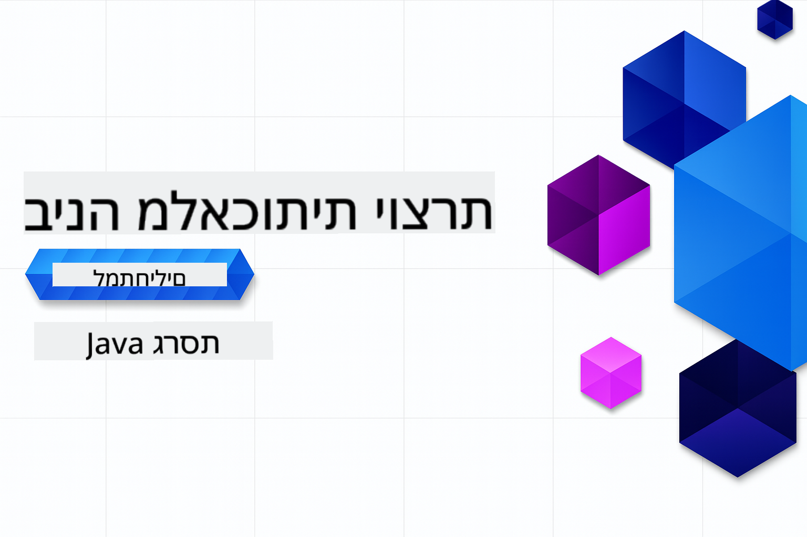

<!--
CO_OP_TRANSLATOR_METADATA:
{
  "original_hash": "0efa90a880213da0aeb35e43ec717e98",
  "translation_date": "2025-12-01T08:44:14+00:00",
  "source_file": "README.md",
  "language_code": "he"
}
-->
# בינה מלאכותית יוצרת למתחילים - מהדורת Java

**זמן נדרש**: הסדנה כולה ניתנת להשלמה באופן מקוון ללא צורך בהתקנה מקומית. הגדרת הסביבה אורכת 2 דקות, והדוגמאות דורשות 1-3 שעות, תלוי בעומק החקירה.

> **התחלה מהירה**

1. בצעו Fork למאגר זה לחשבון ה-GitHub שלכם
2. לחצו על **Code** → **Codespaces** → **...** → **New with options...**
3. השתמשו בברירות המחדל – זה יבחר את מיכל הפיתוח שנוצר עבור הקורס הזה
4. לחצו על **Create codespace**
5. המתינו כ-2 דקות עד שהסביבה תהיה מוכנה
6. עברו ישירות ל-[הדוגמה הראשונה](./02-SetupDevEnvironment/README.md#step-2-create-a-github-personal-access-token)

## תמיכה בריבוי שפות

### נתמך באמצעות GitHub Action (אוטומטי ותמיד מעודכן)

<!-- CO-OP TRANSLATOR LANGUAGES TABLE START -->
[ערבית](../ar/README.md) | [בנגלית](../bn/README.md) | [בולגרית](../bg/README.md) | [בורמזית (מיאנמר)](../my/README.md) | [סינית (פשוטה)](../zh/README.md) | [סינית (מסורתית, הונג קונג)](../hk/README.md) | [סינית (מסורתית, מקאו)](../mo/README.md) | [סינית (מסורתית, טייוואן)](../tw/README.md) | [קרואטית](../hr/README.md) | [צ'כית](../cs/README.md) | [דנית](../da/README.md) | [הולנדית](../nl/README.md) | [אסטונית](../et/README.md) | [פינית](../fi/README.md) | [צרפתית](../fr/README.md) | [גרמנית](../de/README.md) | [יוונית](../el/README.md) | [עברית](./README.md) | [הינדית](../hi/README.md) | [הונגרית](../hu/README.md) | [אינדונזית](../id/README.md) | [איטלקית](../it/README.md) | [יפנית](../ja/README.md) | [קנאדה](../kn/README.md) | [קוריאנית](../ko/README.md) | [ליטאית](../lt/README.md) | [מלאית](../ms/README.md) | [מלאיאלאם](../ml/README.md) | [מראטהי](../mr/README.md) | [נפאלית](../ne/README.md) | [ניגרית פידג'ין](../pcm/README.md) | [נורווגית](../no/README.md) | [פרסית (פרסית)](../fa/README.md) | [פולנית](../pl/README.md) | [פורטוגזית (ברזיל)](../br/README.md) | [פורטוגזית (פורטוגל)](../pt/README.md) | [פנג'אבית (גורמוקי)](../pa/README.md) | [רומנית](../ro/README.md) | [רוסית](../ru/README.md) | [סרבית (קירילית)](../sr/README.md) | [סלובקית](../sk/README.md) | [סלובנית](../sl/README.md) | [ספרדית](../es/README.md) | [סוואהילית](../sw/README.md) | [שוודית](../sv/README.md) | [טאגאלוג (פיליפינית)](../tl/README.md) | [טמילית](../ta/README.md) | [טלוגו](../te/README.md) | [תאית](../th/README.md) | [טורקית](../tr/README.md) | [אוקראינית](../uk/README.md) | [אורדו](../ur/README.md) | [וייטנאמית](../vi/README.md)
<!-- CO-OP TRANSLATOR LANGUAGES TABLE END -->

## מבנה הקורס ומסלול הלמידה

### **פרק 1: מבוא לבינה מלאכותית יוצרת**
- **מושגי יסוד**: הבנת מודלים שפתיים גדולים, טוקנים, הטמעות ויכולות AI
- **מערכת AI ב-Java**: סקירה של Spring AI ו-SDKs של OpenAI
- **פרוטוקול הקשר של מודלים**: מבוא ל-MCP ותפקידו בתקשורת סוכני AI
- **יישומים מעשיים**: תרחישים בעולם האמיתי כמו צ'אטבוטים ויצירת תוכן
- **[→ התחילו פרק 1](./01-IntroToGenAI/README.md)**

### **פרק 2: הגדרת סביבת פיתוח**
- **הגדרת ספקים מרובים**: הגדרת מודלים של GitHub, Azure OpenAI ו-SDK של OpenAI ל-Java
- **Spring Boot + Spring AI**: שיטות עבודה מומלצות לפיתוח יישומי AI ארגוניים
- **מודלים של GitHub**: גישה חינמית למודלי AI לצורך פרוטוטייפ ולמידה (ללא צורך בכרטיס אשראי)
- **כלי פיתוח**: מיכלי Docker, VS Code והגדרת GitHub Codespaces
- **[→ התחילו פרק 2](./02-SetupDevEnvironment/README.md)**

### **פרק 3: טכניקות ליבה של בינה מלאכותית יוצרת**
- **הנדסת פרומפטים**: טכניקות לתגובות מיטביות ממודלי AI
- **הטמעות ופעולות וקטוריות**: יישום חיפוש סמנטי והתאמת דמיון
- **יצירה מוגברת על ידי אחזור (RAG)**: שילוב AI עם מקורות נתונים משלכם
- **קריאת פונקציות**: הרחבת יכולות AI עם כלים ותוספים מותאמים אישית
- **[→ התחילו פרק 3](./03-CoreGenerativeAITechniques/README.md)**

### **פרק 4: יישומים מעשיים ופרויקטים**
- **מחולל סיפורי חיות מחמד** (`petstory/`): יצירת תוכן יצירתי עם מודלים של GitHub
- **דמו מקומי של Foundry** (`foundrylocal/`): שילוב מודל AI מקומי עם SDK של OpenAI ל-Java
- **שירות מחשבון MCP** (`calculator/`): יישום בסיסי של פרוטוקול הקשר של מודלים עם Spring AI
- **[→ התחילו פרק 4](./04-PracticalSamples/README.md)**

### **פרק 5: פיתוח AI אחראי**
- **בטיחות מודלים של GitHub**: בדיקת סינון תוכן מובנה ומנגנוני בטיחות (חסימות קשות וסירובים רכים)
- **דמו AI אחראי**: דוגמה מעשית שמראה כיצד מערכות בטיחות AI מודרניות פועלות בפועל
- **שיטות עבודה מומלצות**: הנחיות חיוניות לפיתוח והפצה אתית של AI
- **[→ התחילו פרק 5](./05-ResponsibleGenAI/README.md)**

## משאבים נוספים

<!-- CO-OP TRANSLATOR OTHER COURSES START -->
### Azure / Edge / MCP / סוכנים

---

### סדרת בינה מלאכותית יוצרת

[-9333EA?style=for-the-badge&labelColor=E5E7EB&color=9333EA)](https://github.com/microsoft/Generative-AI-for-beginners-dotnet?WT.mc_id=academic-105485-koreyst)
[-C084FC?style=for-the-badge&labelColor=E5E7EB&color=C084FC)](https://github.com/microsoft/generative-ai-for-beginners-java?WT.mc_id=academic-105485-koreyst)
[-E879F9?style=for-the-badge&labelColor=E5E7EB&color=E879F9)](https://github.com/microsoft/generative-ai-with-javascript?WT.mc_id=academic-105485-koreyst)

---

### למידה ליבה

---

### סדרת Copilot

  
  
<!-- CO-OP TRANSLATOR OTHER COURSES END -->

## קבלת עזרה

אם אתם נתקעים או יש לכם שאלות על בניית אפליקציות AI, הצטרפו ללומדים אחרים ולמפתחים מנוסים לדיונים על MCP. זו קהילה תומכת שבה שאלות מתקבלות בברכה וידע משותף בחופשיות.

אם יש לכם משוב על המוצר או נתקלתם בשגיאות במהלך הבנייה, בקרו ב:

---

<!-- CO-OP TRANSLATOR DISCLAIMER START -->
**כתב ויתור**:  
מסמך זה תורגם באמצעות שירות תרגום AI [Co-op Translator](https://github.com/Azure/co-op-translator). למרות שאנו שואפים לדיוק, יש להיות מודעים לכך שתרגומים אוטומטיים עשויים להכיל שגיאות או אי דיוקים. המסמך המקורי בשפתו המקורית צריך להיחשב כמקור סמכותי. עבור מידע קריטי, מומלץ להשתמש בתרגום מקצועי אנושי. איננו אחראים לאי הבנות או לפרשנויות שגויות הנובעות משימוש בתרגום זה.
<!-- CO-OP TRANSLATOR DISCLAIMER END -->