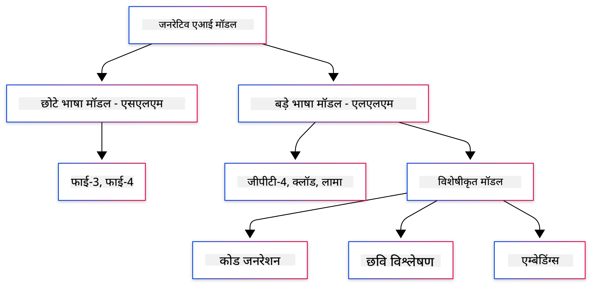
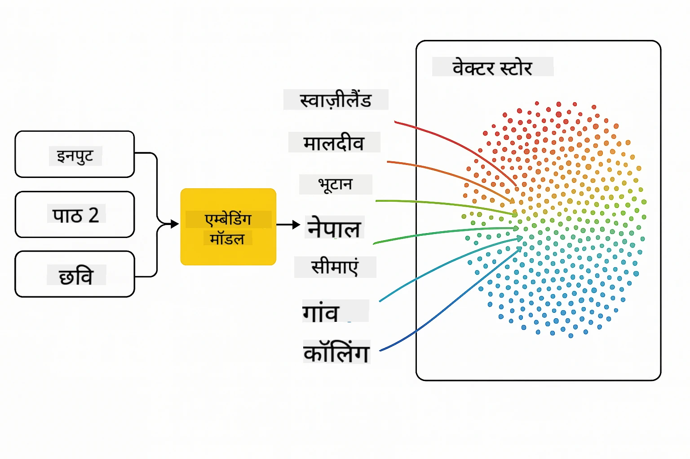
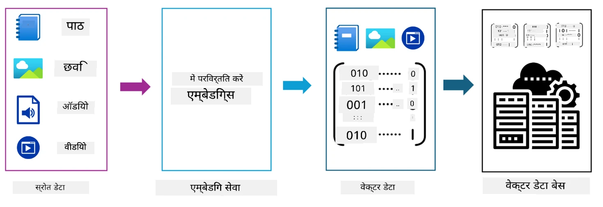
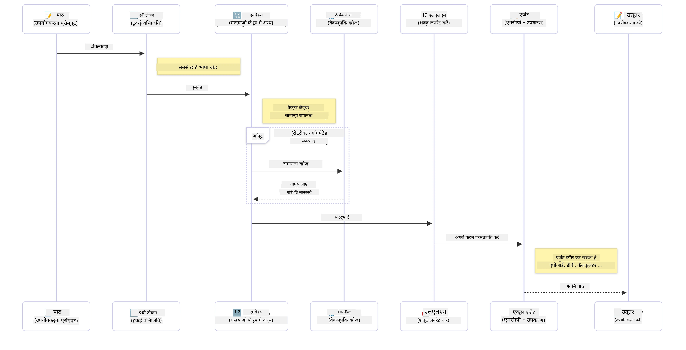

# जेनरेटिव एआई - जावा संस्करण का परिचय

> **वीडियो**: [YouTube पर इस पाठ के लिए वीडियो अवलोकन देखें।](https://www.youtube.com/watch?v=XH46tGp_eSw) आप ऊपर दिए गए थंबनेल चित्र पर भी क्लिक कर सकते हैं।

## आप क्या सीखेंगे

- **जेनरेटिव एआई के मूल सिद्धांत** जिनमें LLMs, प्रॉम्प्ट इंजीनियरिंग, टोकन, एम्बेडिंग्स, और वेक्टर डाटाबेस शामिल हैं
- **जावा एआई विकास उपकरणों की तुलना** जिनमें Azure OpenAI SDK, Spring AI, और OpenAI Java SDK शामिल हैं
- **मॉडल कॉन्टेक्स्ट प्रोटोकॉल जानें** और इसका एआई एजेंट संचार में क्या भूमिका है

## विषय सूची

- [परिचय](#परिचय)
- [जेनरेटिव एआई अवधारणाओं का एक त्वरित पुनरीक्षण](#जेनरेटिव-एआई-अवधारणाओं-का-एक-त्वरित-पुनरीक्षण)
- [प्रॉम्प्ट इंजीनियरिंग की समीक्षा](#प्रॉम्प्ट-इंजीनियरिंग-की-समीक्षा)
- [टोकन, एम्बेडिंग्स, और एजेंट्स](#टोकन-एम्बेडिंग्स-और-एजेंट्स)
- [जावा के लिए AI विकास उपकरण और पुस्तकालय](#जावा-के-लिए-ai-विकास-उपकरण-और-पुस्तकालय)
  - [OpenAI Java SDK](#openai-java-sdk)
  - [Spring AI](#spring-ai)
  - [Azure OpenAI Java SDK](#azure-openai-java-sdk)
- [सारांश](#सारांश)
- [अगले चरण](#अगले-चरण)

## परिचय

जेनरेटिव एआई फॉर बिगिनर्स - जावा संस्करण के पहले अध्याय में आपका स्वागत है! यह आधारभूत पाठ आपको जेनरेटिव एआई की मूल अवधारणाओं से परिचित कराता है और बताता है कि जावा का उपयोग करके इनके साथ कैसे काम किया जाता है। आप AI अनुप्रयोगों के आवश्यक निर्माण खंडों के बारे में जानेंगे, जिनमें Large Language Models (LLMs), टोकन, एम्बेडिंग्स, और AI एजेंट शामिल हैं। साथ ही, हम उस प्रमुख जावा टूलिंग को भी देखेंगे जिसका आप पूरे कोर्स में उपयोग करेंगे।

### जेनरेटिव एआई अवधारणाओं का एक त्वरित पुनरीक्षण

जेनरेटिव एआई एक ऐसी कृत्रिम बुद्धिमत्ता का प्रकार है जो डेटा से सीखे गए पैटर्न और संबंधों के आधार पर नया कंटेंट, जैसे कि टेक्स्ट, छवियां, या कोड बनाता है। जेनरेटिव AI मॉडल मानव-सा जवाब दे सकते हैं, संदर्भ समझ सकते हैं, और कभी-कभी ऐसा कंटेंट भी बना सकते हैं जो मानव जैसा प्रतीत होता है।

जब आप अपने जावा AI अनुप्रयोग विकसित करते हैं, तो आप **जेनरेटिव AI मॉडलों** के साथ कंटेंट बनाएंगे। जेनरेटिव AI मॉडलों की कुछ क्षमताएं इस प्रकार हैं:

- **टेक्स्ट जनरेशन**: चैटबॉट्स, कंटेंट, और टेक्स्ट पूर्णता के लिए मानव जैसा टेक्स्ट बनाना।
- **छवि जनरेशन और विश्लेषण**: वास्तविक दिखने वाली छवियां बनाना, फ़ोटो बढ़ाना, और वस्तुओं का पता लगाना।
- **कोड जनरेशन**: कोड स्निपेट्स या स्क्रिप्ट लिखना।

कुछ विशेष प्रकार के मॉडल होते हैं जो विभिन्न कार्यों के लिए अनुकूलित होते हैं। उदाहरण के लिए, **Small Language Models (SLMs)** और **Large Language Models (LLMs)** दोनों टेक्स्ट जनरेशन संभाल सकते हैं, जिसमें LLMs आमतौर पर जटिल कार्यों के लिए बेहतर प्रदर्शन करते हैं। छवि-संबंधित कार्यों के लिए, आप विशेष दृष्टि मॉडल या मल्टी-मॉडल मॉडल का उपयोग करेंगे।

बेशक, इन मॉडलों की प्रतिक्रियाएँ हर समय परिपूर्ण नहीं होतीं। आपने शायद सुना होगा कि मॉडल "हैलुसिनेट" करते हैं या अधिकारिक ढंग से गलत जानकारी उत्पन्न करते हैं। लेकिन आप मॉडल को बेहतर प्रतिक्रियाएँ उत्पन्न करने के लिए स्पष्ट निर्देश और संदर्भ प्रदान करके मार्गदर्शन कर सकते हैं। यही वह जगह है जहां **प्रॉम्प्ट इंजीनियरिंग** आती है।

#### प्रॉम्प्ट इंजीनियरिंग की समीक्षा

प्रॉम्प्ट इंजीनियरिंग प्रभावी इनपुट डिज़ाइन का अभ्यास है जिससे AI मॉडल को इच्छित आउटपुट की ओर निर्देशित किया जा सके। इसमें शामिल हैं:

- **स्पष्टता**: निर्देशों को स्पष्ट और स्पष्ट बनाना।
- **संदर्भ**: आवश्यक पृष्ठभूमि जानकारी प्रदान करना।
- **सीमाएँ**: किसी भी प्रतिबंध या स्वरूपों को निर्दिष्ट करना।

प्रॉम्प्ट इंजीनियरिंग के कुछ सर्वोत्तम अभ्यासों में प्रॉम्प्ट डिजाइन, स्पष्ट निर्देश, कार्य विभाजन, एक-शॉट और फ्यू-शॉट लर्निंग, और प्रॉम्प्ट ट्यूनिंग शामिल हैं। विभिन्न प्रॉम्प्टों का परीक्षण करना आवश्यक है ताकि आपके विशेष उपयोग केस के लिए सबसे अच्छा पता चल सके।

जब आप अनुप्रयोग विकसित कर रहे होंगे, तो आप विभिन्न प्रॉम्प्ट प्रकारों के साथ काम करेंगे:
- **सिस्टम प्रॉम्प्ट्स**: मॉडल के व्यवहार के लिए आधार नियम और संदर्भ निर्धारित करते हैं
- **यूज़र प्रॉम्प्ट्स**: आपके एप्लिकेशन उपयोगकर्ताओं से इनपुट डेटा
- **असिस्टेंट प्रॉम्प्ट्स**: सिस्टम और यूज़र प्रॉम्प्ट्स के आधार पर मॉडल की प्रतिक्रियाएँ

> **अधिक जानें**: [Prompt Engineering अध्याय में अधिक जानें - GenAI for Beginners कोर्स](https://github.com/microsoft/generative-ai-for-beginners/tree/main/04-prompt-engineering-fundamentals)

#### टोकन, एम्बेडिंग्स, और एजेंट्स

जब आप जेनरेटिव AI मॉडलों के साथ काम करते हैं, तो आप **टोकन**, **एम्बेडिंग्स**, **एजेंट्स**, और **Model Context Protocol (MCP)** जैसे शब्दों से परिचित होंगे। यहां इन अवधारणाओं का विस्तृत अवलोकन है:

- **टोकन**: टोकन मॉडल में टेक्स्ट की सबसे छोटी इकाई हैं। ये शब्द, वर्ण, या सबवर्ड हो सकते हैं। टोकन का उपयोग टेक्स्ट डेटा को ऐसे प्रारूप में प्रस्तुत करने के लिए किया जाता है जिसे मॉडल समझ सके। उदाहरण के लिए, वाक्य "The quick brown fox jumped over the lazy dog" को टोकनाइज़ किया जा सकता है जैसे ["The", " quick", " brown", " fox", " jumped", " over", " the", " lazy", " dog"] या ["The", " qu", "ick", " br", "own", " fox", " jump", "ed", " over", " the", " la", "zy", " dog"] टोकनाइज़ेशन रणनीति के आधार पर।

टोकनाइज़ेशन वह प्रक्रिया है जिसमें टेक्स्ट को इन छोटे इकाइयों में विभाजित किया जाता है। यह आवश्यक है क्योंकि मॉडल कच्चे टेक्स्ट के बजाय टोकन पर काम करते हैं। किसी प्रॉम्प्ट में टोकन की संख्या मॉडल की प्रतिक्रिया की लंबाई और गुणवत्ता को प्रभावित करती है, क्योंकि मॉडलों के लिए उनकी कंटेक्स्ट विंडो (जैसे GPT-4o के लिए कुल 128K टोकन, इनपुट और आउटपुट दोनों सहित) में टोकन की सीमा होती है।

  जावा में, आप OpenAI SDK जैसी लाइब्रेरी का उपयोग करके AI मॉडलों को अनुरोध भेजते समय टोकनाइज़ेशन को स्वचालित रूप से संभाल सकते हैं।

- **एम्बेडिंग्स**: एम्बेडिंग्स टोकन के वेक्टर प्रतिनिधित्व हैं जो अर्थपूर्ण जानकारी को कैप्चर करते हैं। ये संख्यात्मक प्रतिनिधित्व (अक्सर फ्लोटिंग-पॉइंट नंबरों की ऐरे) होते हैं जो मॉडलों को शब्दों के बीच संबंध समझने और संदर्भानुसार प्रासंगिक प्रतिक्रियाएं उत्पन्न करने की अनुमति देते हैं। समान शब्दों की एम्बेडिंग्स भी समान होती हैं, जिससे मॉडल पर्यायवाची और सांसारिक संबंध जैसी अवधारणाओं को समझ पाता है।

  जावा में, आप OpenAI SDK या अन्य लाइब्रेरीज़ का उपयोग करके एम्बेडिंग्स उत्पन्न कर सकते हैं जो एम्बेडिंग जेनरेशन का समर्थन करती हैं। ये एम्बेडिंग्स उन कार्यों के लिए आवश्यक हैं जैसे कि सेमैटिक खोज, जहां आप अर्थ के आधार पर समान सामग्री खोजना चाहते हैं, न कि केवल ठीक-ठीक टेक्स्ट मेल।

- **वेक्टर डाटाबेस**: वेक्टर डाटाबेस विशेष प्रकार के भंडारण प्रणालियाँ हैं जो एम्बेडिंग्स के लिए अनुकूलित हैं। वे कुशल समानता खोज को सक्षम बनाती हैं और RAG (Retrieval-Augmented Generation) पैटर्न के लिए महत्वपूर्ण हैं, जहां आपको बड़े डेटा सेट से अर्थानुसार संबंधित जानकारी खोजनी होती है, न कि केवल ठीक टाइप की मिली।

> **नोट**: इस कोर्स में हमने वेक्टर डाटाबेस को कवर नहीं किया है, लेकिन उन्हें उल्लेखनीय माना क्योंकि वे वास्तविक दुनिया के अनुप्रयोगों में आमतौर पर उपयोग होते हैं।

- **एजेंट्स और MCP**: AI के ऐसे घटक जो स्वायत्त रूप से मॉडल, उपकरणों, और बाहरी प्रणालियों के साथ इंटरैक्ट करते हैं। मॉडल कॉन्टेक्स्ट प्रोटोकॉल (MCP) एजेंट्स को सुरक्षित रूप से बाहरी डेटा स्रोतों और उपकरणों तक पहुंच प्रदान करने का एक मानकीकृत तरीका देता है। हमारे [MCP for Beginners](https://github.com/microsoft/mcp-for-beginners) कोर्स में और जानें।

जावा AI अनुप्रयोगों में, आप टेक्स्ट प्रसंस्करण के लिए टोकन, सेमैटिक खोज और RAG के लिए एम्बेडिंग्स, डाटा पुनर्प्राप्ति के लिए वेक्टर डाटाबेस, और बुद्धिमान, उपकरण-उपयोग प्रणाली बनाने के लिए MCP के साथ एजेंट्स का उपयोग करेंगे।

### जावा के लिए AI विकास उपकरण और पुस्तकालय

जावा AI विकास के लिए उत्कृष्ट टूलिंग प्रदान करता है। इस कोर्स में हम तीन प्रमुख पुस्तकालयों की समीक्षा करेंगे - OpenAI Java SDK, Azure OpenAI SDK, और Spring AI।

यहां एक त्वरित संदर्भ तालिका है जो दिखाती है कि किस अध्याय के उदाहरणों में कौन सा SDK उपयोग किया जाता है:

| अध्याय | नमूना | SDK |
|---------|--------|-----|
| 02-SetupDevEnvironment | github-models | OpenAI Java SDK |
| 02-SetupDevEnvironment | basic-chat-azure | Spring AI Azure OpenAI |
| 03-CoreGenerativeAITechniques | examples | Azure OpenAI SDK |
| 04-PracticalSamples | petstory | OpenAI Java SDK |
| 04-PracticalSamples | foundrylocal | OpenAI Java SDK |
| 04-PracticalSamples | calculator | Spring AI MCP SDK + LangChain4j |

**SDK डोक्यूमेंटेशन लिंक:**
- [Azure OpenAI Java SDK](https://github.com/Azure/azure-sdk-for-java/tree/azure-ai-openai_1.0.0-beta.16/sdk/openai/azure-ai-openai)
- [Spring AI](https://docs.spring.io/spring-ai/reference/)
- [OpenAI Java SDK](https://github.com/openai/openai-java)
- [LangChain4j](https://docs.langchain4j.dev/)

#### OpenAI Java SDK

OpenAI SDK OpenAI API के लिए आधिकारिक जावा लाइब्रेरी है। यह OpenAI के मॉडलों के साथ इंटरैक्ट करने के लिए एक सरल और सुसंगत इंटरफ़ेस प्रदान करता है, जिससे जावा अनुप्रयोगों में AI क्षमताओं को एकीकृत करना आसान हो जाता है। अध्याय 2 के GitHub Models उदाहरण, अध्याय 4 के Pet Story एप्लिकेशन और Foundry Local उदाहरण OpenAI SDK दृष्टिकोण को प्रदर्शित करते हैं।

#### Spring AI

Spring AI एक व्यापक फ्रेमवर्क है जो Spring अनुप्रयोगों में AI क्षमताओं को लाता है, विभिन्न AI प्रदाताओं के लिए एक सुसंगत अमूर्त स्तर प्रदान करता है। यह Spring पारिस्थितिकी तंत्र के साथ सहजता से एकीकृत होता है, जिससे यह उन एंटरप्राइज़ जावा अनुप्रयोगों के लिए आदर्श विकल्प बनता है जिन्हें AI क्षमताओं की आवश्यकता होती है।

Spring AI की ताकत इसकी seamless इंटिग्रेशन में है, जिससे परिचित Spring पैटर्न जैसे dependency injection, configuration management, और testing frameworks के साथ उत्पादन-तैयार AI अनुप्रयोग बनाना आसान हो जाता है। आप अध्याय 2 और 4 में OpenAI और मॉडल कॉन्टेक्स्ट प्रोटोकॉल (MCP) Spring AI लाइब्रेरीज़ दोनों का उपयोग करके एप्लिकेशन बनाएंगे।

##### मॉडल कॉन्टेक्स्ट प्रोटोकॉल (MCP)

[Model Context Protocol (MCP)](https://modelcontextprotocol.io/) एक उभरता हुआ मानक है जो AI अनुप्रयोगों को बाहरी डेटा स्रोतों और उपकरणों के साथ सुरक्षित रूप से इंटरैक्ट करने में सक्षम बनाता है। MCP AI मॉडलों के लिए संदर्भ जानकारी तक पहुँचना और आपके अनुप्रयोगों में क्रियाएं निष्पादित करने का एक मानकीकृत तरीका प्रदान करता है।

अध्याय 4 में, आप एक सरल MCP कैलकुलेटर सेवा बनाएंगे जो Spring AI के साथ मॉडल कॉन्टेक्स्ट प्रोटोकॉल की बुनियादी बातें दर्शाती है, जिसमें आपको बुनियादी टूल इंटीग्रेशन और सेवा वास्तुकला बनाना दिखाया जाएगा।

#### Azure OpenAI Java SDK

Azure OpenAI क्लाइंट लाइब्रेरी जावा के लिए OpenAI के REST APIs का एक रूपांतरण है जो एक आदर्श इंटरफ़ेस और बाकी Azure SDK पारिस्थितिकी तंत्र के साथ एकीकरण प्रदान करता है। अध्याय 3 में, आप Azure OpenAI SDK का उपयोग करके एप्लिकेशन बनाएंगे, जिनमें चैट अनुप्रयोग, फंक्शन कॉलिंग, और RAG (Retrieval-Augmented Generation) पैटर्न शामिल हैं।

> नोट: Azure OpenAI SDK फीचर्स के मामले में OpenAI Java SDK से पीछे है, इसलिए भविष्य की परियोजनाओं के लिए OpenAI Java SDK का उपयोग करना विचार करें।

## सारांश

इतना पर्याप्त है! अब आप समझते हैं:

- जेनरेटिव AI के मूल सिद्धांत - LLMs और प्रॉम्प्ट इंजीनियरिंग से लेकर टोकन, एम्बेडिंग्स, और वेक्टर डाटाबेस तक
- जावा AI विकास के लिए आपके टूलकिट विकल्प: Azure OpenAI SDK, Spring AI, और OpenAI Java SDK
- मॉडल कॉन्टेक्स्ट प्रोटोकॉल क्या है और यह कैसे AI एजेंट्स को बाहरी उपकरणों के साथ काम करने में सक्षम बनाता है

## अगले चरण

[अध्याय 2: विकास पर्यावरण सेटअप](../02-SetupDevEnvironment/README.md)

---

<!-- CO-OP TRANSLATOR DISCLAIMER START -->
**अस्वीकरण**:  
इस दस्तावेज़ का अनुवाद एआई अनुवाद सेवा [Co-op Translator](https://github.com/Azure/co-op-translator) का उपयोग करके किया गया है। हम सटीकता के लिए प्रयासरत हैं, कृपया ध्यान दें कि स्वचालित अनुवाद में त्रुटियां या अशुद्धियां हो सकती हैं। मूल दस्तावेज़ अपनी मूल भाषा में प्रामाणिक स्रोत माना जाना चाहिए। महत्वपूर्ण जानकारी के लिए, पेशेवर मानव अनुवाद की सलाह दी जाती है। इस अनुवाद के उपयोग से उत्पन्न किसी भी गलतफहमी या गलत व्याख्या के लिए हम ज़िम्मेदार नहीं हैं।
<!-- CO-OP TRANSLATOR DISCLAIMER END -->