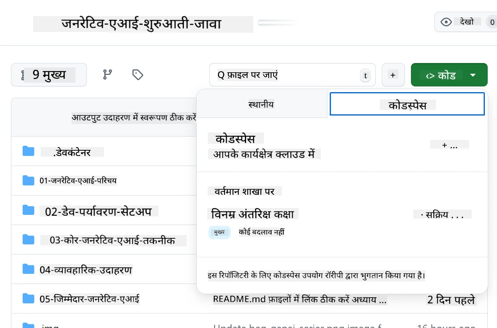
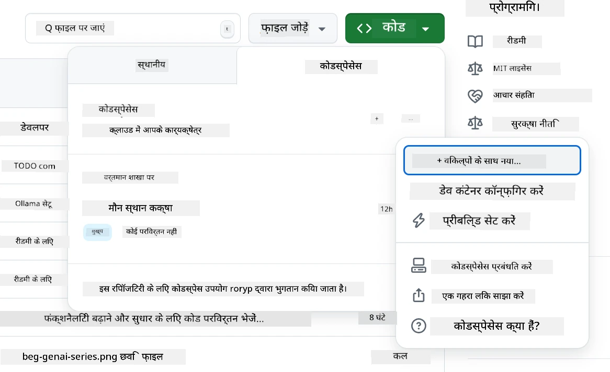
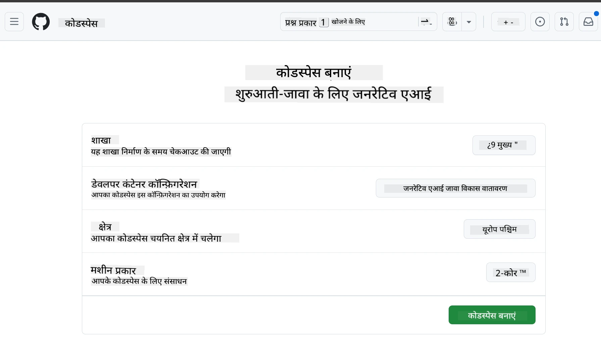
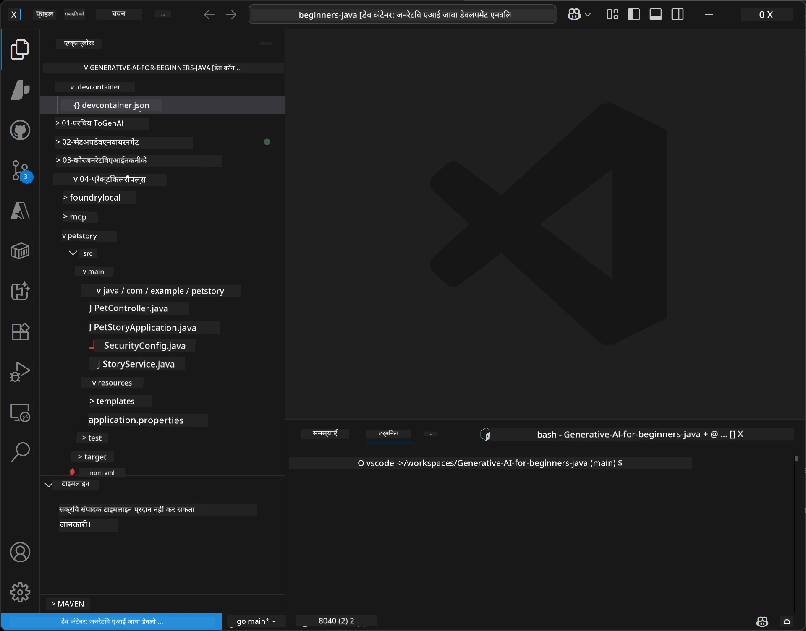
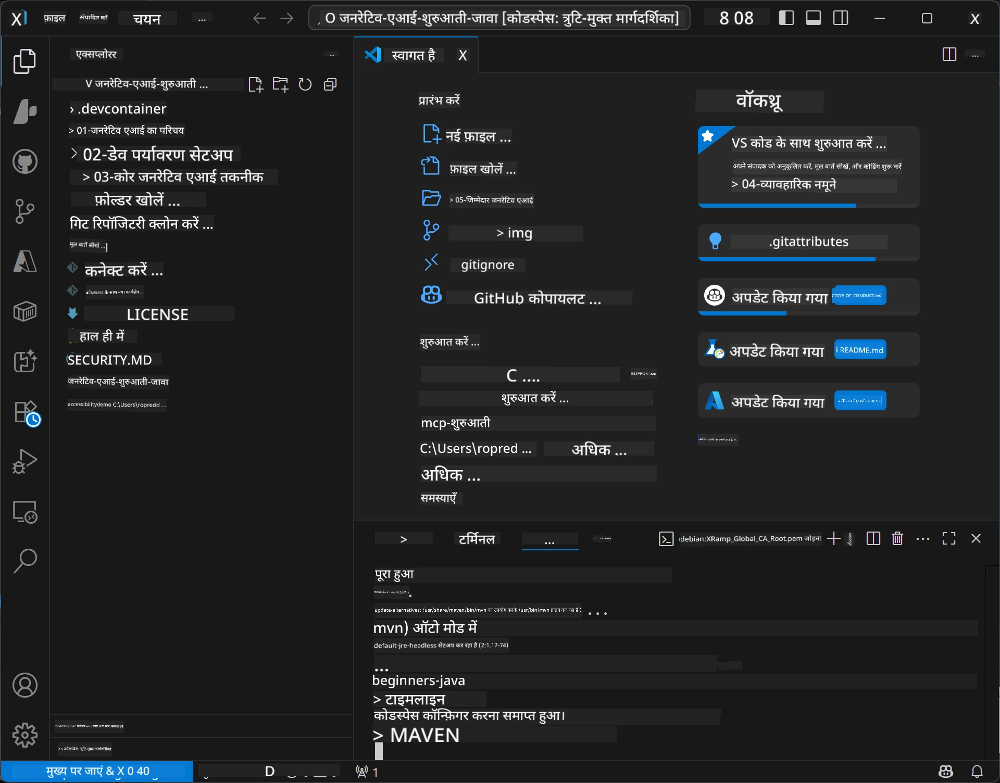

<!--
CO_OP_TRANSLATOR_METADATA:
{
  "original_hash": "96a30d42b9751a3d4e4b20e28d29d459",
  "translation_date": "2026-01-28T04:49:06+00:00",
  "source_file": "02-SetupDevEnvironment/README.md",
  "language_code": "hi"
}
-->
# जेनरेटिव AI के लिए जावा के विकास वातावरण की स्थापना

> **त्वरित प्रारंभ**: 2 मिनट में क्लाउड में कोड करें - [GitHub Codespaces सेटअप](../../../02-SetupDevEnvironment) पर जाएं - किसी स्थानीय स्थापना की आवश्यकता नहीं है और गिटहब मॉडल का उपयोग करता है!

> **Azure OpenAI में रुचि है?**, देखें हमारा [Azure OpenAI सेटअप गाइड](getting-started-azure-openai.md) जिसमें नया Azure OpenAI रिसोर्स बनाने के चरण हैं।

## आप क्या सीखेंगे

- AI एप्लिकेशन के लिए जावा विकास वातावरण सेट करना
- अपनी पसंद के विकास वातावरण का चयन और कॉन्फ़िगरेशन करना (Codespaces के साथ क्लाउड-प्रथम, स्थानीय डेव कंटेनर, या पूर्ण स्थानीय सेटअप)
- GitHub मॉडल से जुड़कर अपनी सेटअप का परीक्षण करना

## सामग्री सूची

- [आप क्या सीखेंगे](../../../02-SetupDevEnvironment)
- [परिचय](../../../02-SetupDevEnvironment)
- [चरण 1: अपना विकास वातावरण सेट करें](../../../02-SetupDevEnvironment)
  - [विकल्प A: GitHub Codespaces (सिफारिश की गई)](../../../02-SetupDevEnvironment)
  - [विकल्प B: स्थानीय डेव कंटेनर](../../../02-SetupDevEnvironment)
  - [विकल्प C: अपनी मौजूदा स्थानीय स्थापना का उपयोग करें](../../../02-SetupDevEnvironment)
- [चरण 2: GitHub व्यक्तिगत प्रवेश टोकन बनाएं](../../../02-SetupDevEnvironment)
- [चरण 3: अपनी सेटअप का परीक्षण करें](../../../02-SetupDevEnvironment)
- [समस्याओं का निवारण](../../../02-SetupDevEnvironment)
- [सारांश](../../../02-SetupDevEnvironment)
- [अगले कदम](../../../02-SetupDevEnvironment)

## परिचय

यह अध्याय आपको विकास वातावरण सेट करने में मार्गदर्शन करेगा। हम **GitHub मॉडल** का मुख्य उदाहरण के रूप में उपयोग करेंगे क्योंकि यह मुफ्त है, केवल एक GitHub खाते के साथ सेट करना आसान है, किसी क्रेडिट कार्ड की जरूरत नहीं है, और प्रयोग के लिए कई मॉडल उपलब्ध कराता है।

**कोई स्थानीय सेटअप आवश्यक नहीं!** आप तुरंत ब्राउज़र में GitHub Codespaces का उपयोग कर कोडिंग शुरू कर सकते हैं, जो एक पूर्ण विकास वातावरण प्रदान करता है।


हम इस कोर्स के लिए [**GitHub मॉडल**](https://github.com/marketplace?type=models) का उपयोग करने की सलाह देते हैं क्योंकि यह:
- शुरू करने के लिए **मुफ्त** है
- केवल एक GitHub खाते के साथ सेट करना **आसान** है
- **क्रेडिट कार्ड की आवश्यकता नहीं**
- **प्रयोग के लिए कई मॉडल** उपलब्ध हैं

> **ध्यान दें**: इस प्रशिक्षण में उपयोग किए गए GitHub मॉडल के ये मुफ्त सीमाएं हैं:
> - प्रति मिनट 15 अनुरोध (प्रति दिन 150)
> - प्रत्येक अनुरोध में लगभग 8,000 शब्द इनपुट, लगभग 4,000 शब्द आउटपुट
> - 5 समवर्ती अनुरोध
> 
> उत्पादन उपयोग के लिए, अपने Azure खाते से Azure AI Foundry मॉडल में अपग्रेड करें। आपका कोड बदलने की आवश्यकता नहीं है। देखें [Azure AI Foundry दस्तावेज़](https://learn.microsoft.com/azure/ai-foundry/foundry-models/how-to/quickstart-github-models)।

## चरण 1: अपना विकास वातावरण सेट करें

<a name="quick-start-cloud"></a>

हमने इस जेनरेटिव AI जावा कोर्स के लिए एक पूर्व कॉन्फ़िगर किया गया विकास कंटेनर बनाया है ताकि सेटअप समय कम हो और आपके पास सभी आवश्यक उपकरण उपलब्ध हों। अपनी पसंद के विकास विधि का चयन करें:

### वातावरण सेटअप विकल्प:

#### विकल्प A: GitHub Codespaces (सिफारिश की गई)

**2 मिनट में कोडिंग शुरू करें - कोई स्थानीय सेटअप आवश्यक नहीं!**

1. इस रिपोजिटरी को अपने GitHub खाते में फोर्क करें
   > **ध्यान दें**: यदि आप मूल कॉन्फ़िग संपादित करना चाहते हैं तो कृपया [Dev Container Configuration](../../../.devcontainer/devcontainer.json) देखें
2. **Code** → **Codespaces** टैब → **...** → **New with options...** पर क्लिक करें
3. डिफ़ॉल्ट सेटिंग्स का उपयोग करें – यह चयन करेगा **Dev container configuration**: इस कोर्स के लिए बनाया गया **Generative AI Java Development Environment** कस्टम devcontainer
4. **Create codespace** पर क्लिक करें
5. वातावरण के तैयार होने के लिए लगभग 2 मिनट प्रतीक्षा करें
6. [चरण 2: GitHub टोकन बनाएं](../../../02-SetupDevEnvironment) पर जाएं








> **Codespaces के लाभ**:
> - कोई स्थानीय इंस्टॉलेशन आवश्यक नहीं
> - किसी भी ब्राउज़र वाले डिवाइस पर काम करता है
> - सभी टूल्स और निर्भरताओं के साथ पूर्व-कॉन्फ़िगर किया गया
> - व्यक्तिगत खातों के लिए प्रति माह मुफ्त 60 घंटे
> - सभी शिक्षार्थियों के लिए एकसमान वातावरण

#### विकल्प B: स्थानीय डेव कंटेनर

**विकासकों के लिए जो स्थानीय विकास के लिए Docker पसंद करते हैं**

1. इस रिपोजिटरी को अपने स्थानीय मशीन पर फोर्क और क्लोन करें
   > **ध्यान दें**: यदि आप मूल कॉन्फ़िग संपादित करना चाहते हैं तो कृपया [Dev Container Configuration](../../../.devcontainer/devcontainer.json) देखें
2. [Docker Desktop](https://www.docker.com/products/docker-desktop/) और [VS Code](https://code.visualstudio.com/) इंस्टॉल करें
3. VS Code में [Dev Containers extension](https://marketplace.visualstudio.com/items?itemName=ms-vscode-remote.remote-containers) इंस्टॉल करें
4. VS Code में रिपोजिटरी फोल्डर खोलें
5. जब पूछा जाए, तो **Reopen in Container** पर क्लिक करें (या `Ctrl+Shift+P` → "Dev Containers: Reopen in Container" उपयोग करें)
6. कंटेनर बनने और शुरू होने के लिए प्रतीक्षा करें
7. [चरण 2: GitHub टोकन बनाएं](../../../02-SetupDevEnvironment) पर जाएं




#### विकल्प C: अपनी मौजूदा स्थानीय स्थापना का उपयोग करें

**उन विकासकों के लिए जिनके पास मौजूदा जावा वातावरण है**

पूर्वापेक्षाएँ:
- [Java 21+](https://www.oracle.com/java/technologies/javase/jdk21-archive-downloads.html)
- [Maven 3.9+](https://maven.apache.org/download.cgi)
- [VS Code](https://code.visualstudio.com) या आपकी पसंद का IDE

चरण:
1. इस रिपोजिटरी को स्थानीय मशीन पर क्लोन करें
2. IDE में प्रोजेक्ट खोलें
3. [चरण 2: GitHub टोकन बनाएं](../../../02-SetupDevEnvironment) पर जाएं

> **प्रो टिप**: यदि आपके पास कम संसाधन वाली मशीन है लेकिन आप स्थानीय VS Code चाहते हैं, तो GitHub Codespaces का उपयोग करें! आप अपने स्थानीय VS Code को क्लाउड-होस्ट किए गए Codespace से जोड़ सकते हैं जिससे दोनों का सर्वश्रेष्ठ लाभ मिले।




## चरण 2: GitHub व्यक्तिगत प्रवेश टोकन बनाएं

1. [GitHub सेटिंग्स](https://github.com/settings/profile) पर जाएं और अपने प्रोफ़ाइल मेनू से **Settings** चुनें।
2. बाएं साइडबार में, **Developer settings** पर क्लिक करें (आमतौर पर नीचे होता है)।
3. **Personal access tokens** के अंतर्गत, **Fine-grained tokens** पर क्लिक करें (या सीधे इस [लिंक](https://github.com/settings/personal-access-tokens) का पालन करें)।
4. **Generate new token** पर क्लिक करें।
5. "Token name" के तहत एक वर्णनात्मक नाम दें (जैसे `GenAI-Java-Course-Token`)।
6. समाप्ति तिथि सेट करें (सिफारिश: सुरक्षा सर्वोत्तम अभ्यास के लिए 7 दिन)।
7. "Resource owner" के तहत अपना उपयोगकर्ता खाता चुनें।
8. "Repository access" के तहत उन रिपोजिटरीज़ का चयन करें जिनमें आप GitHub मॉडल का उपयोग करना चाहते हैं (या "सभी रिपोजिटरी" यदि आवश्यक हो)।
9. "Account permissions" के तहत **Models** ढूंढें और इसे **Read-only** सेट करें।
10. **Generate token** पर क्लिक करें।
11. **अपना टोकन अभी कॉपी और सुरक्षित करें** – आप इसे फिर से नहीं देख पाएंगे!

> **सुरक्षा सुझाव**: अपने एक्सेस टोकन के लिए न्यूनतम आवश्यक स्कोप और यथासंभव कम समाप्ति समय का उपयोग करें।

## चरण 3: GitHub मॉडल उदाहरण के साथ अपनी सेटअप का परीक्षण करें

एक बार आपका विकास वातावरण तैयार हो जाने पर, चलिए हमारे उदाहरण एप्लिकेशन [`02-SetupDevEnvironment/examples/github-models`](../../../02-SetupDevEnvironment/examples/github-models) में GitHub मॉडल एकीकरण का परीक्षण करते हैं।

1. अपने विकास वातावरण में टर्मिनल खोलें।
2. GitHub मॉडल उदाहरण फ़ोल्डर में जाएं:
   ```bash
   cd 02-SetupDevEnvironment/examples/github-models
   ```
3. अपनी GitHub टोकन को पर्यावरण चर के रूप में सेट करें:
   ```bash
   # मैकओएस/लिनक्स
   export GITHUB_TOKEN=your_token_here
   
   # विंडोज (कमांड प्रॉम्प्ट)
   set GITHUB_TOKEN=your_token_here
   
   # विंडोज (पावरशेल)
   $env:GITHUB_TOKEN="your_token_here"
   ```

4. एप्लिकेशन चलाएं:
   ```bash
   mvn compile exec:java -Dexec.mainClass="com.example.githubmodels.App"
   ```

आपको ऐसा आउटपुट दिखाई देगा:
```text
Using model: gpt-4.1-nano
Sending request to GitHub Models...
Response: Hello World!
```

### उदाहरण कोड को समझना

पहले, चलिए समझते हैं कि हमने क्या चलाया है। `examples/github-models` के तहत उदाहरण OpenAI Java SDK का उपयोग करके GitHub मॉडल से जुड़ता है:

**यह कोड क्या करता है:**
- आपके व्यक्तिगत एक्सेस टोकन का उपयोग करके GitHub मॉडल से **कनेक्ट** होता है
- AI मॉडल को एक सरल "Say Hello World!" संदेश **भेजता** है
- AI के उत्तर को प्राप्त करता और प्रदर्शित करता है
- आपकी सेटअप सही से काम कर रही है यह **सत्यापित** करता है

**मुख्य निर्भरता** (`pom.xml` में):
```xml
<dependency>
    <groupId>com.openai</groupId>
    <artifactId>openai-java</artifactId>
    <version>2.12.0</version>
</dependency>
```

**मुख्य कोड** (`App.java`):
```java
// OpenAI Java SDK का उपयोग करके GitHub मॉडल से कनेक्ट करें
OpenAIClient client = OpenAIOkHttpClient.builder()
    .apiKey(pat)
    .baseUrl("https://models.inference.ai.azure.com")
    .build();

// चैट पूर्णता अनुरोध बनाएँ
ChatCompletionCreateParams params = ChatCompletionCreateParams.builder()
    .model(modelId)
    .addSystemMessage("You are a concise assistant.")
    .addUserMessage("Say Hello World!")
    .build();

// AI प्रतिक्रिया प्राप्त करें
ChatCompletion response = client.chat().completions().create(params);
System.out.println("Response: " + response.choices().get(0).message().content().orElse("No response content"));
```

## सारांश

शानदार! अब आपके पास सब कुछ सेट अप है:

- AI मॉडल एक्सेस के लिए सही अनुमतियों वाला GitHub व्यक्तिगत एक्सेस टोकन बनाया
- अपना जावा विकास वातावरण चला लिया (चाहे Codespaces हो, डेव कंटेनर हो, या स्थानीय)
- OpenAI Java SDK के साथ GitHub मॉडल से जुड़ा मुफ्त AI विकास के लिए
- एक सरल उदाहरण की मदद से सब कुछ परीक्षण किया जो AI मॉडल से बात करता है

## अगले कदम

[अध्याय 3: कोर जेनरेटिव AI तकनीकें](../03-CoreGenerativeAITechniques/README.md)

## समस्याओं का निवारण

समस्याएँ हो रही हैं? यहाँ सामान्य समस्याएं और समाधान हैं:

- **टोकन काम नहीं कर रहा?**
  - सुनिश्चित करें कि आपने पूरा टोकन बिना किसी अतिरिक्त जगह के कॉपी किया है
  - जाँचें कि टोकन पर्यावरण चर के रूप में सही सेट है
  - देखें कि आपके टोकन के पास सही अनुमतियाँ हैं (Models: Read-only)

- **Maven नहीं मिला?**
  - यदि आप डेव कंटेनर/Codespaces का उपयोग कर रहे हैं, तो Maven पहले से इंस्टॉल होना चाहिए
  - स्थानीय सेटअप के लिए, सुनिश्चित करें कि Java 21+ और Maven 3.9+ इंस्टॉल हैं
  - इंस्टॉलेशन सत्यापित करने के लिए `mvn --version` चलाएँ

- **कनेक्शन समस्याएं?**
  - अपनी इंटरनेट कनेक्शन जांचें
  - सत्यापित करें कि GitHub आपके नेटवर्क से सुलभ है
  - जांचें कि आप किसी फ़ायरवॉल के पीछे नहीं हैं जो GitHub मॉडल्स के एंडपॉइंट को ब्लॉक कर रहा हो

- **डेव कंटेनर शुरू नहीं हो रहा?**
  - सुनिश्चित करें कि Docker Desktop चल रहा है (स्थानीय विकास के लिए)
  - कंटेनर फिर से बनाने का प्रयास करें: `Ctrl+Shift+P` → "Dev Containers: Rebuild Container"

- **एप्लिकेशन संग्रहीत त्रुटियाँ?**
  - सुनिश्चित करें कि आप सही डायरेक्टरी में हैं: `02-SetupDevEnvironment/examples/github-models`
  - साफ़ और पुनर्निर्माण करने का प्रयास करें: `mvn clean compile`

> **मदद चाहिए?**: अभी भी समस्या है? रिपोजिटरी में एक मुद्दा खोलें और हम आपकी मदद करेंगे।

---

<!-- CO-OP TRANSLATOR DISCLAIMER START -->
**अस्वीकरण**:  
यह दस्तावेज़ AI अनुवाद सेवा [Co-op Translator](https://github.com/Azure/co-op-translator) का उपयोग करके अनूदित किया गया है। जबकि हम सटीकता के लिए प्रयासरत हैं, कृपया ध्यान दें कि स्वचालित अनुवादों में त्रुटियाँ या अशुद्धियाँ हो सकती हैं। मूल भाषा में दस्तावेज़ को आधिकारिक स्रोत माना जाना चाहिए। महत्वपूर्ण जानकारी के लिए, पेशेवर मानव अनुवाद की सलाह दी जाती है। इस अनुवाद के उपयोग से उत्पन्न किसी भी गलतफहमी या गलत व्याख्या के लिए हम जिम्मेदार नहीं हैं।
<!-- CO-OP TRANSLATOR DISCLAIMER END -->