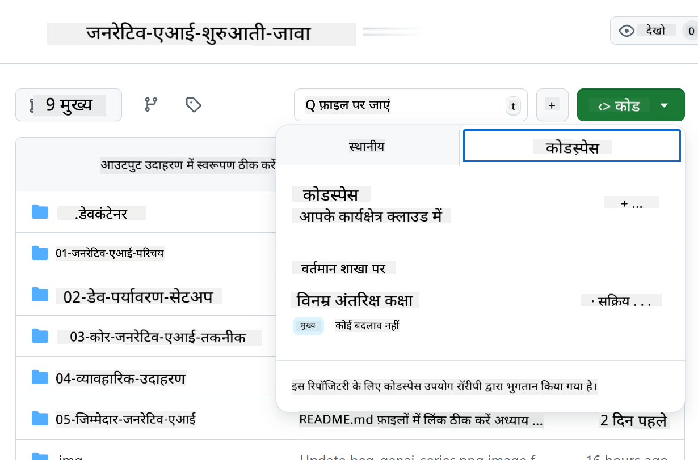

<!--
CO_OP_TRANSLATOR_METADATA:
{
  "original_hash": "bfdb4b4eadbee3a59ef742439f58326a",
  "translation_date": "2025-07-27T13:00:09+00:00",
  "source_file": "02-SetupDevEnvironment/getting-started-azure-openai.md",
  "language_code": "hi"
}
-->
# Azure OpenAI के लिए डेवलपमेंट एनवायरनमेंट सेटअप करना

> **त्वरित शुरुआत**: यह गाइड Azure OpenAI सेटअप के लिए है। मुफ्त मॉडल्स के साथ तुरंत शुरुआत करने के लिए [GitHub Models with Codespaces](./README.md#quick-start-cloud) का उपयोग करें।

यह गाइड आपको इस कोर्स में आपके Java AI ऐप्स के लिए Azure AI Foundry मॉडल्स सेटअप करने में मदद करेगा।

## सामग्री सूची

- [त्वरित सेटअप अवलोकन](../../../02-SetupDevEnvironment)
- [चरण 1: Azure AI Foundry संसाधन बनाएं](../../../02-SetupDevEnvironment)
  - [हब और प्रोजेक्ट बनाएं](../../../02-SetupDevEnvironment)
  - [GPT-4o-mini मॉडल तैनात करें](../../../02-SetupDevEnvironment)
- [चरण 2: अपना Codespace बनाएं](../../../02-SetupDevEnvironment)
- [चरण 3: अपना एनवायरनमेंट कॉन्फ़िगर करें](../../../02-SetupDevEnvironment)
- [चरण 4: अपना सेटअप टेस्ट करें](../../../02-SetupDevEnvironment)
- [आगे क्या?](../../../02-SetupDevEnvironment)
- [संसाधन](../../../02-SetupDevEnvironment)
- [अतिरिक्त संसाधन](../../../02-SetupDevEnvironment)

## त्वरित सेटअप अवलोकन

1. Azure AI Foundry संसाधन बनाएं (हब, प्रोजेक्ट, मॉडल)
2. Java डेवलपमेंट कंटेनर के साथ Codespace बनाएं
3. Azure OpenAI क्रेडेंशियल्स के साथ अपनी .env फ़ाइल कॉन्फ़िगर करें
4. उदाहरण प्रोजेक्ट के साथ अपना सेटअप टेस्ट करें

## चरण 1: Azure AI Foundry संसाधन बनाएं

### हब और प्रोजेक्ट बनाएं

1. [Azure AI Foundry Portal](https://ai.azure.com/) पर जाएं और साइन इन करें
2. **+ Create** → **New hub** पर क्लिक करें (या **Management** → **All hubs** → **+ New hub** पर जाएं)
3. अपना हब कॉन्फ़िगर करें:
   - **हब का नाम**: जैसे, "MyAIHub"
   - **सब्सक्रिप्शन**: अपना Azure सब्सक्रिप्शन चुनें
   - **रिसोर्स ग्रुप**: नया बनाएं या मौजूदा चुनें
   - **स्थान**: अपने निकटतम स्थान चुनें
   - **स्टोरेज अकाउंट**: डिफ़ॉल्ट का उपयोग करें या कस्टम कॉन्फ़िगर करें
   - **की वॉल्ट**: डिफ़ॉल्ट का उपयोग करें या कस्टम कॉन्फ़िगर करें
   - **Next** → **Review + create** → **Create** पर क्लिक करें
4. हब बनने के बाद, **+ New project** पर क्लिक करें (या हब ओवरव्यू से **Create project** चुनें)
   - **प्रोजेक्ट का नाम**: जैसे, "GenAIJava"
   - **Create** पर क्लिक करें

### GPT-4o-mini मॉडल तैनात करें

1. अपने प्रोजेक्ट में, **Model catalog** पर जाएं और **gpt-4o-mini** खोजें
   - *वैकल्पिक: **Deployments** → **+ Create deployment** पर जाएं*
2. gpt-4o-mini मॉडल कार्ड पर **Deploy** पर क्लिक करें
3. तैनाती कॉन्फ़िगर करें:
   - **तैनाती का नाम**: "gpt-4o-mini"
   - **मॉडल संस्करण**: नवीनतम का उपयोग करें
   - **तैनाती प्रकार**: Standard
4. **Deploy** पर क्लिक करें
5. तैनात होने के बाद, **Deployments** टैब पर जाएं और निम्न मान कॉपी करें:
   - **तैनाती का नाम** (जैसे, "gpt-4o-mini")
   - **Target URI** (जैसे, `https://your-hub-name.openai.azure.com/`) 
      > **महत्वपूर्ण**: केवल बेस URL कॉपी करें (जैसे, `https://myhub.openai.azure.com/`) न कि पूरा एंडपॉइंट पथ।
   - **Key** (Keys और Endpoint सेक्शन से)

> **अभी भी समस्या हो रही है?** आधिकारिक [Azure AI Foundry Documentation](https://learn.microsoft.com/azure/ai-foundry/how-to/create-projects?tabs=ai-foundry&pivots=hub-project) पर जाएं

## चरण 2: अपना Codespace बनाएं

1. इस रिपॉजिटरी को अपने GitHub अकाउंट में फोर्क करें
   > **नोट**: यदि आप बेसिक कॉन्फ़िगरेशन को एडिट करना चाहते हैं, तो [Dev Container Configuration](../../../.devcontainer/devcontainer.json) देखें
2. अपनी फोर्क की गई रिपॉजिटरी में, **Code** → **Codespaces** टैब पर क्लिक करें
3. **...** → **New with options...** पर क्लिक करें

4. **Dev container configuration** चुनें: 
   - **Generative AI Java Development Environment**
5. **Create codespace** पर क्लिक करें

## चरण 3: अपना एनवायरनमेंट कॉन्फ़िगर करें

जब आपका Codespace तैयार हो जाए, तो अपने Azure OpenAI क्रेडेंशियल्स सेट करें:

1. **रिपॉजिटरी रूट से उदाहरण प्रोजेक्ट पर जाएं:**
   ```bash
   cd 02-SetupDevEnvironment/examples/basic-chat-azure
   ```

2. **अपनी .env फ़ाइल बनाएं:**
   ```bash
   cp .env.example .env
   ```

3. **अपनी .env फ़ाइल को Azure OpenAI क्रेडेंशियल्स के साथ एडिट करें:**
   ```bash
   # Your Azure OpenAI API key (from Azure AI Foundry portal)
   AZURE_AI_KEY=your-actual-api-key-here
   
   # Your Azure OpenAI endpoint URL (e.g., https://myhub.openai.azure.com/)
   AZURE_AI_ENDPOINT=https://your-hub-name.openai.azure.com/
   ```

   > **सुरक्षा नोट**: 
   > - अपनी `.env` फ़ाइल को वर्जन कंट्रोल में कभी कमिट न करें
   > - `.env` फ़ाइल पहले से ही `.gitignore` में शामिल है
   > - अपने API कीज़ को सुरक्षित रखें और नियमित रूप से रोटेट करें

## चरण 4: अपना सेटअप टेस्ट करें

Azure OpenAI कनेक्शन को टेस्ट करने के लिए उदाहरण एप्लिकेशन चलाएं:

```bash
mvn clean spring-boot:run
```

आपको GPT-4o-mini मॉडल से प्रतिक्रिया दिखाई देनी चाहिए!

> **VS Code उपयोगकर्ता**: आप एप्लिकेशन चलाने के लिए VS Code में `F5` भी दबा सकते हैं। लॉन्च कॉन्फ़िगरेशन पहले से ही आपकी `.env` फ़ाइल को स्वचालित रूप से लोड करने के लिए सेट है।

> **पूरा उदाहरण**: विस्तृत निर्देश और समस्या निवारण के लिए [End-to-End Azure OpenAI Example](./examples/basic-chat-azure/README.md) देखें।

## आगे क्या?

**सेटअप पूरा!** अब आपके पास है:
- gpt-4o-mini के साथ Azure OpenAI तैनात
- स्थानीय .env फ़ाइल कॉन्फ़िगरेशन
- Java डेवलपमेंट एनवायरनमेंट तैयार

**आगे बढ़ें** [Chapter 3: Core Generative AI Techniques](../03-CoreGenerativeAITechniques/README.md) पर और AI एप्लिकेशन बनाना शुरू करें!

## संसाधन

- [Azure AI Foundry Documentation](https://learn.microsoft.com/azure/ai-services/)
- [Spring AI Azure OpenAI Documentation](https://docs.spring.io/spring-ai/reference/api/clients/azure-openai-chat.html)
- [Azure OpenAI Java SDK](https://learn.microsoft.com/java/api/overview/azure/ai-openai-readme)

## अतिरिक्त संसाधन

- [VS Code डाउनलोड करें](https://code.visualstudio.com/Download)
- [Docker Desktop प्राप्त करें](https://www.docker.com/products/docker-desktop)
- [Dev Container Configuration](../../../.devcontainer/devcontainer.json)

**अस्वीकरण**:  
यह दस्तावेज़ AI अनुवाद सेवा [Co-op Translator](https://github.com/Azure/co-op-translator) का उपयोग करके अनुवादित किया गया है। जबकि हम सटीकता सुनिश्चित करने का प्रयास करते हैं, कृपया ध्यान दें कि स्वचालित अनुवाद में त्रुटियां या अशुद्धियां हो सकती हैं। मूल भाषा में उपलब्ध मूल दस्तावेज़ को प्रामाणिक स्रोत माना जाना चाहिए। महत्वपूर्ण जानकारी के लिए, पेशेवर मानव अनुवाद की सिफारिश की जाती है। इस अनुवाद के उपयोग से उत्पन्न किसी भी गलतफहमी या गलत व्याख्या के लिए हम उत्तरदायी नहीं हैं।