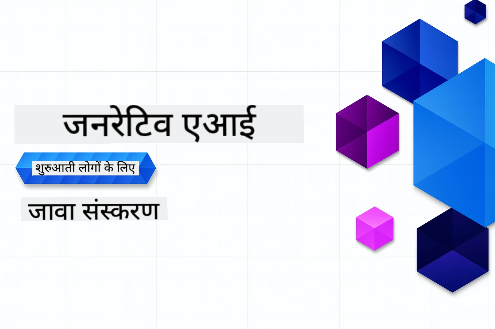

# शुरुआती लोगों के लिए जनरेटिव AI - जावा संस्करण
[](https://discord.gg/nTYy5BXMWG)



**समय प्रतिबद्धता**: पूरा कार्यशाला ऑनलाइन पूरा किया जा सकता है बिना लोकल सेटअप के। वातावरण सेटअप में 2 मिनट लगते हैं, नमूनों को एक्सप्लोर करने में 1-3 घंटे लग सकते हैं, खोज की गहराई पर निर्भर करता है।

> **त्वरित शुरुआत**

1. इस रिपॉजिटरी को अपने GitHub खाते में फोर्क करें
2. क्लिक करें **Code** → **Codespaces** टैब → **...** → **New with options...**
3. डिफॉल्ट्स का उपयोग करें – यह इस कोर्स के लिए बनाए गए Development container को चुनेगा
4. क्लिक करें **Create codespace**
5. इंतजार करें लगभग 2 मिनट तक जब तक वातावरण तैयार न हो जाए
6. सीधे कूदें [पहले उदाहरण पर](./02-SetupDevEnvironment/README.md#step-2-create-a-github-personal-access-token)

> **लोकल क्लोन करना पसंद है?**
>
> इस रिपॉजिटरी में 50+ भाषा अनुवाद शामिल हैं जो डाउनलोड आकार को काफी बढ़ाते हैं। अनुवादों के बिना क्लोन करने के लिए sparse checkout का उपयोग करें:
> ```bash
> git clone --filter=blob:none --sparse https://github.com/microsoft/Generative-AI-for-beginners-java.git
> cd Generative-AI-for-beginners-java
> git sparse-checkout set --no-cone '/*' '!translations' '!translated_images'
> ```
> यह आपको कोर्स पूरा करने के लिए आवश्यक सभी कुछ बहुत तेज डाउनलोड के साथ देगा।


## बहुभाषी समर्थन

### GitHub Action के माध्यम से समर्थन (स्वचालित और हमेशा अपडेटेड)

<!-- CO-OP TRANSLATOR LANGUAGES TABLE START -->
[अरबी](../ar/README.md) | [बंगाली](../bn/README.md) | [बुल्गेरियाई](../bg/README.md) | [बर्मा (म्यांमार)](../my/README.md) | [चीनी (सरलीकृत)](../zh-CN/README.md) | [चीनी (पारंपरिक, हांगकांग)](../zh-HK/README.md) | [चीनी (पारंपरिक, मकाउ)](../zh-MO/README.md) | [चीनी (पारंपरिक, ताइवान)](../zh-TW/README.md) | [क्रोएशियाई](../hr/README.md) | [चेक](../cs/README.md) | [डेनिश](../da/README.md) | [डच](../nl/README.md) | [एस्टोनियाई](../et/README.md) | [फिनिश](../fi/README.md) | [फ्रेंच](../fr/README.md) | [जर्मन](../de/README.md) | [ग्रीक](../el/README.md) | [हिब्रू](../he/README.md) | [हिंदी](./README.md) | [हंगेरियन](../hu/README.md) | [इंडोनेशियाई](../id/README.md) | [इतालवी](../it/README.md) | [जापानी](../ja/README.md) | [कन्नड़](../kn/README.md) | [कोरियाई](../ko/README.md) | [लिथुआनियाई](../lt/README.md) | [मलय](../ms/README.md) | [मलयालम](../ml/README.md) | [मराठी](../mr/README.md) | [नेपाली](../ne/README.md) | [नाइजीरियाई पिजिन](../pcm/README.md) | [नार्वेजियन](../no/README.md) | [फ़ारसी (फ़ारसी)](../fa/README.md) | [पोलिश](../pl/README.md) | [पुर्तगाली (ब्राजील)](../pt-BR/README.md) | [पुर्तगाली (पुर्तगाल)](../pt-PT/README.md) | [पंजाबी (गुरमुखी)](../pa/README.md) | [रोमानियाई](../ro/README.md) | [रूसी](../ru/README.md) | [सर्बियाई (सिरिलिक)](../sr/README.md) | [स्लोवाक](../sk/README.md) | [स्लोवेनियाई](../sl/README.md) | [स्पैनिश](../es/README.md) | [स्वाहिली](../sw/README.md) | [स्वीडिश](../sv/README.md) | [टगलॉग (फिलिपिनो)](../tl/README.md) | [तमिल](../ta/README.md) | [तेलुगु](../te/README.md) | [थाई](../th/README.md) | [तुर्की](../tr/README.md) | [यूक्रेनी](../uk/README.md) | [उर्दू](../ur/README.md) | [वियतनामी](../vi/README.md)

## कोर्स संरचना और सीखने का मार्ग

### **अध्याय 1: जनरेटिव AI का परिचय**
- **कोर अवधारणाएं**: बड़े भाषा मॉडल, टोकन, एम्बेडिंग्स, और AI क्षमताओं को समझना
- **जावा AI इकोसिस्टम**: Spring AI और OpenAI SDKs का अवलोकन
- **मॉडल संदर्भ प्रोटोकॉल**: MCP और AI एजेंट संचार में इसकी भूमिका का परिचय
- **व्यावहारिक अनुप्रयोग**: चैटबॉट और सामग्री उत्पादन सहित वास्तविक दुनिया के परिदृश्य
- **[→ अध्याय 1 शुरू करें](./01-IntroToGenAI/README.md)**

### **अध्याय 2: विकास पर्यावरण सेटअप**
- **मल्टी-प्रोवाइडर कॉन्फ़िगरेशन**: GitHub Models, Azure OpenAI, और OpenAI Java SDK इंटीग्रेशन सेट करें
- **Spring Boot + Spring AI**: एंटरप्राइज AI एप्लिकेशन विकास के लिए सर्वोत्तम प्रथाएं
- **GitHub Models**: प्रोटोटाइपिंग और सीखने के लिए मुफ्त AI मॉडल एक्सेस (क्रेडिट कार्ड की जरूरत नहीं)
- **विकास उपकरण**: Docker कंटेनर, VS कोड, और GitHub Codespaces कॉन्फ़िगरेशन
- **[→ अध्याय 2 शुरू करें](./02-SetupDevEnvironment/README.md)**

### **अध्याय 3: कोर जनरेटिव AI तकनीकें**
- **प्रॉम्प्ट इंजीनियरिंग**: AI मॉडल के सर्वोत्तम उत्तर के लिए तकनीकें
- **एम्बेडिंग्स और वेक्टर ऑपरेशन्स**: सेमांटिक सर्च और समानता मिलान लागू करना
- **रिकवरी-अगमेंटेड जनरेशन (RAG)**: AI को अपने डेटा स्रोतों के साथ संयोजित करें
- **फंक्शन कॉलिंग**: कस्टम टूल और प्लगइन्स के साथ AI क्षमताओं का विस्तार करें
- **[→ अध्याय 3 शुरू करें](./03-CoreGenerativeAITechniques/README.md)**

### **अध्याय 4: व्यावहारिक अनुप्रयोग और प्रोजेक्ट**
- **पेट स्टोरी जनरेटर** (`petstory/`): GitHub Models के साथ रचनात्मक सामग्री निर्माण
- **फाउंड्री लोकल डेमो** (`foundrylocal/`): OpenAI Java SDK के साथ लोकल AI मॉडल इंटीग्रेशन
- **MCP कैलकुलेटर सेवा** (`calculator/`): Spring AI के साथ बेसिक मॉडल संदर्भ प्रोटोकॉल कार्यान्वयन
- **[→ अध्याय 4 शुरू करें](./04-PracticalSamples/README.md)**

### **अध्याय 5: उत्तरदायी AI विकास**
- **GitHub Models सुरक्षा**: इन-बिल्ट सामग्री फ़िल्टरिंग और सुरक्षा तंत्रों का परीक्षण (हार्ड ब्लॉक्स और सॉफ्ट इनकार)
- **उत्तरदायी AI डेमो**: आधुनिक AI सुरक्षा प्रणाली कैसे काम करती है इसका व्यावहारिक उदाहरण
- **सर्वोत्तम अभ्यास**: नैतिक AI विकास और परिनियोजन के लिए आवश्यक दिशानिर्देश
- **[→ अध्याय 5 शुरू करें](./05-ResponsibleGenAI/README.md)**

## अतिरिक्त संसाधन

<!-- CO-OP TRANSLATOR OTHER COURSES START -->
### LangChain
[](https://aka.ms/langchain4j-for-beginners)
[](https://aka.ms/langchainjs-for-beginners?WT.mc_id=m365-94501-dwahlin)

---

### Azure / Edge / MCP / एजेंट्स
[](https://github.com/microsoft/AZD-for-beginners?WT.mc_id=academic-105485-koreyst)
[](https://github.com/microsoft/edgeai-for-beginners?WT.mc_id=academic-105485-koreyst)
[](https://github.com/microsoft/mcp-for-beginners?WT.mc_id=academic-105485-koreyst)
[](https://github.com/microsoft/ai-agents-for-beginners?WT.mc_id=academic-105485-koreyst)

---
 
### जनरेटिव AI श्रृंखला
[](https://github.com/microsoft/generative-ai-for-beginners?WT.mc_id=academic-105485-koreyst)
[-9333EA?style=for-the-badge&labelColor=E5E7EB&color=9333EA)](https://github.com/microsoft/Generative-AI-for-beginners-dotnet?WT.mc_id=academic-105485-koreyst)
[-C084FC?style=for-the-badge&labelColor=E5E7EB&color=C084FC)](https://github.com/microsoft/generative-ai-for-beginners-java?WT.mc_id=academic-105485-koreyst)
[-E879F9?style=for-the-badge&labelColor=E5E7EB&color=E879F9)](https://github.com/microsoft/generative-ai-with-javascript?WT.mc_id=academic-105485-koreyst)

---
 
### कोर लर्निंग
[](https://aka.ms/ml-beginners?WT.mc_id=academic-105485-koreyst)
[](https://aka.ms/datascience-beginners?WT.mc_id=academic-105485-koreyst)
[](https://aka.ms/ai-beginners?WT.mc_id=academic-105485-koreyst)
[](https://github.com/microsoft/Security-101?WT.mc_id=academic-96948-sayoung)
[](https://aka.ms/webdev-beginners?WT.mc_id=academic-105485-koreyst)
[](https://aka.ms/iot-beginners?WT.mc_id=academic-105485-koreyst)
[](https://github.com/microsoft/xr-development-for-beginners?WT.mc_id=academic-105485-koreyst)

---
 
### कॉपिलॉट श्रृंखला
[](https://aka.ms/GitHubCopilotAI?WT.mc_id=academic-105485-koreyst)
[](https://github.com/microsoft/mastering-github-copilot-for-dotnet-csharp-developers?WT.mc_id=academic-105485-koreyst)
[](https://github.com/microsoft/CopilotAdventures?WT.mc_id=academic-105485-koreyst)
<!-- CO-OP TRANSLATOR OTHER COURSES END -->

## सहायता प्राप्त करें

यदि आप फंस जाते हैं या AI ऐप बनाने के बारे में कोई प्रश्न है। MCP के बारे में चर्चा में साथी शिक्षार्थियों और अनुभवी डेवलपर्स से जुड़ें। यह एक सहायक समुदाय है जहाँ प्रश्न स्वागत योग्य हैं और ज्ञान खुले तौर पर साझा किया जाता है।

[](https://discord.gg/nTYy5BXMWG)

यदि आपके पास उत्पाद फीडबैक या निर्माण करते समय त्रुटियाँ हैं, तो यहाँ जाएँ:

[](https://aka.ms/foundry/forum)

---

<!-- CO-OP TRANSLATOR DISCLAIMER START -->
**अस्वीकरण**:  
इस दस्तावेज़ का अनुवाद AI अनुवाद सेवा [Co-op Translator](https://github.com/Azure/co-op-translator) का उपयोग करके किया गया है। जबकि हम सटीकता के लिए प्रयासरत हैं, कृपया ध्यान दें कि स्वचालित अनुवाद में त्रुटियां या गलतियाँ हो सकती हैं। मूल दस्तावेज़ अपनी मूल भाषा में अधिकारिक स्रोत माना जाना चाहिए। महत्वपूर्ण जानकारी के लिए पेशेवर मानव अनुवाद की सिफारिश की जाती है। इस अनुवाद के उपयोग से होने वाली किसी भी गलतफहमी या गलत व्याख्या के लिए हम ज़िम्मेदार नहीं हैं।
<!-- CO-OP TRANSLATOR DISCLAIMER END -->