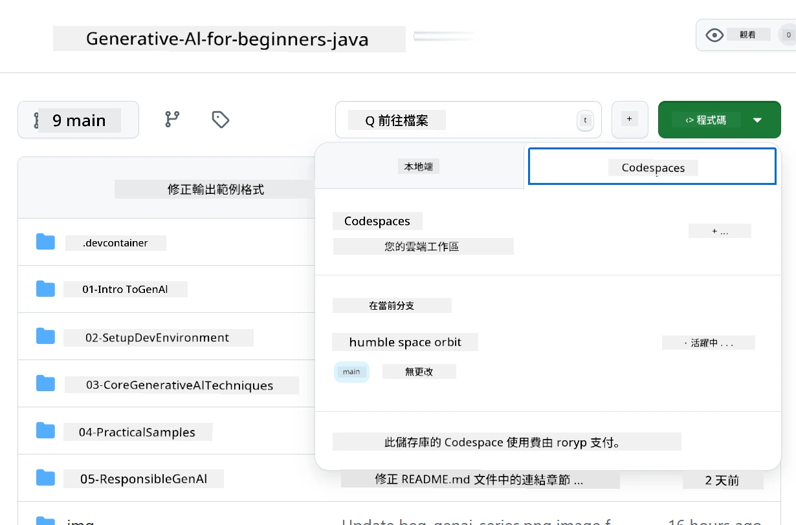
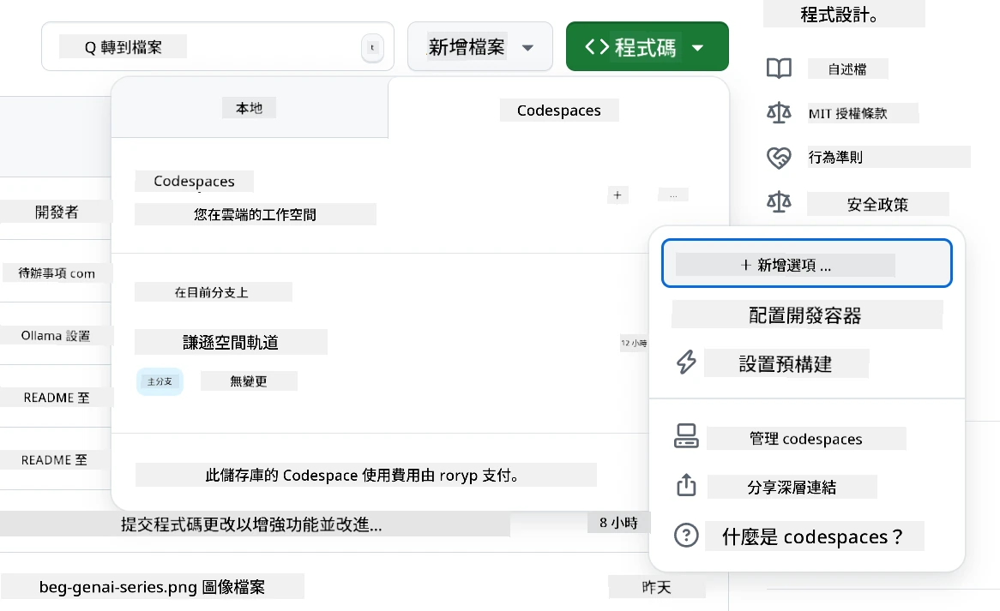
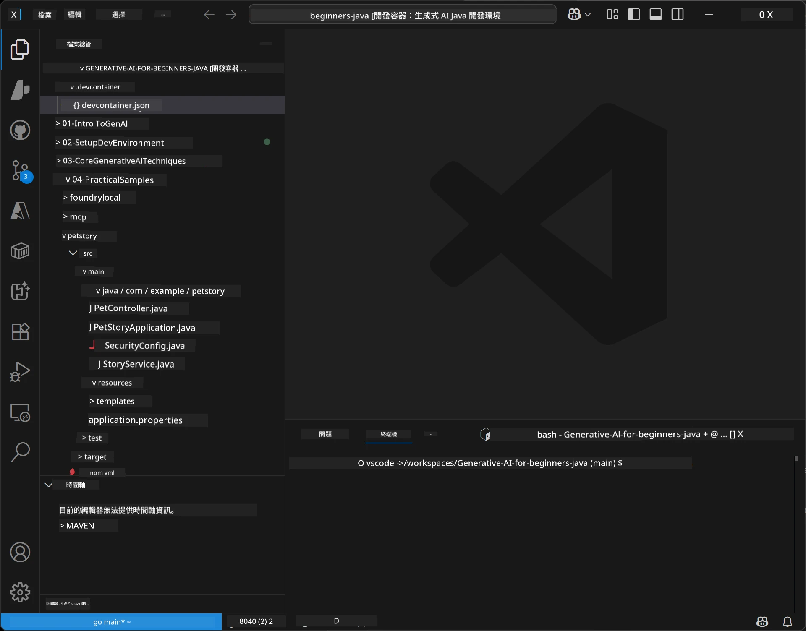

<!--
CO_OP_TRANSLATOR_METADATA:
{
  "original_hash": "96a30d42b9751a3d4e4b20e28d29d459",
  "translation_date": "2026-01-28T04:44:01+00:00",
  "source_file": "02-SetupDevEnvironment/README.md",
  "language_code": "hk"
}
-->
# 針對 Java 的生成式 AI 設置開發環境

> **快速開始**：在雲端 2 分鐘即可編碼 - 跳至 [GitHub Codespaces 設置](../../../02-SetupDevEnvironment) - 無需本地安裝，並使用 github 模型！

> **有興趣使用 Azure OpenAI？**，請參見我們的 [Azure OpenAI 設置指南](getting-started-azure-openai.md) ，內含建立新的 Azure OpenAI 資源的步驟。

## 你將學到什麼

- 設置 AI 應用的 Java 開發環境
- 選擇及配置你偏好的開發環境（優先使用 Codespaces 雲端、當地開發容器或完整本地設置）
- 透過連接 GitHub 模型來測試你的設置

## 目錄

- [你將學到什麼](../../../02-SetupDevEnvironment)
- [介紹](../../../02-SetupDevEnvironment)
- [步驟 1：設置你的開發環境](../../../02-SetupDevEnvironment)
  - [選項 A：GitHub Codespaces（推薦）](../../../02-SetupDevEnvironment)
  - [選項 B：本地開發容器](../../../02-SetupDevEnvironment)
  - [選項 C：使用你現有的本地安裝](../../../02-SetupDevEnvironment)
- [步驟 2：建立 GitHub 個人存取權杖](../../../02-SetupDevEnvironment)
- [步驟 3：用 GitHub 模型範例測試你的設定](../../../02-SetupDevEnvironment)
- [疑難排解](../../../02-SetupDevEnvironment)
- [總結](../../../02-SetupDevEnvironment)
- [下一步](../../../02-SetupDevEnvironment)

## 介紹

本章將引導你設置開發環境。我們將以 **GitHub 模型** 作為主要範例，因為它免費，只需一個 GitHub 帳戶即可輕鬆設置，無需信用卡，並提供多種模型供您實驗。

**無需本地安裝！** 你可以立即使用 GitHub Codespaces 在瀏覽器中開始編碼，該服務提供完整的開發環境。


本課程推薦使用 [**GitHub 模型**](https://github.com/marketplace?type=models) ，因為它：
- **免費** 起步
- 只需 GitHub 帳戶即可 **輕鬆** 設置
- **無需信用卡**
- 提供多個模型供實驗

> **注意**：本課程所使用的 GitHub 模型有以下免費限制：
> - 每分鐘 15 次請求（每天 150 次）
> - 每次請求約輸入 8,000 字，輸出約 4,000 字
> - 5 個併發請求
> 
> 若用於生產環境，請使用你的 Azure 帳戶升級到 Azure AI Foundry 模型。你的程式碼不需更改。詳見 [Azure AI Foundry 文件](https://learn.microsoft.com/azure/ai-foundry/foundry-models/how-to/quickstart-github-models)。


## 步驟 1：設置你的開發環境

<a name="quick-start-cloud"></a>

我們已建立一個預配置的開發容器，以將設定時間降至最低，並確保你擁有此生成式 AI for Java 課程所需的所有工具。請選擇你偏好的開發方式：

### 環境設置選項：

#### 選項 A：GitHub Codespaces（推薦）

**2 分鐘開始編碼 - 無需本地安裝！**

1. 將此儲存庫分叉到你的 GitHub 帳戶
   > **注意**：如果你想修改基本配置，請查看 [Dev Container 配置](../../../.devcontainer/devcontainer.json)
2. 點擊 **Code** → **Codespaces** 分頁 → **...** → **New with options...**
3. 使用預設設定 — 這會選擇為本課程建立的 **Dev container 配置**：**生成式 AI Java 開發環境** 客製 devcontainer
4. 點擊 **Create codespace**
5. 等待約 2 分鐘，環境即準備完成
6. 繼續進行 [步驟 2：建立 GitHub 權杖](../../../02-SetupDevEnvironment)






> **Codespaces 的優點**：
> - 無需本地安裝
> - 支援任何有瀏覽器的裝置
> - 預先配置所有工具與依賴
> - 個人帳戶每月免費 60 小時
> - 為所有學習者提供一致的環境

#### 選項 B：本地開發容器

**適合偏好使用 Docker 本地開發的開發者**

1. 將此儲存庫分叉並克隆到本地機器
   > **注意**：如果你想修改基本配置，請查看 [Dev Container 配置](../../../.devcontainer/devcontainer.json)
2. 安裝 [Docker Desktop](https://www.docker.com/products/docker-desktop/) 與 [VS Code](https://code.visualstudio.com/)
3. 在 VS Code 裝置 [Dev Containers 擴充](https://marketplace.visualstudio.com/items?itemName=ms-vscode-remote.remote-containers)
4. 在 VS Code 開啟儲存庫資料夾
5. 當被提示時，點選 **Reopen in Container**（或使用 `Ctrl+Shift+P` → "Dev Containers: Reopen in Container"）
6. 等待容器完成建置並啟動
7. 繼續進行 [步驟 2：建立 GitHub 權杖](../../../02-SetupDevEnvironment)




#### 選項 C：使用你現有的本地安裝

**適合已有 Java 環境的開發者**

先決條件：
- [Java 21+](https://www.oracle.com/java/technologies/javase/jdk21-archive-downloads.html)
- [Maven 3.9+](https://maven.apache.org/download.cgi)
- [VS Code](https://code.visualstudio.com) 或你喜歡的 IDE

步驟：
1. 克隆此儲存庫到本地機器
2. 在 IDE 中開啟專案
3. 繼續進行 [步驟 2：建立 GitHub 權杖](../../../02-SetupDevEnvironment)

> **專家提示**：如果你的機器規格偏低但想使用 VS Code 本地版本，請使用 GitHub Codespaces！你可以將本地的 VS Code 連接到雲端託管的 Codespace，兩者兼得。


## 步驟 2：建立 GitHub 個人存取權杖

1. 前往 [GitHub 設定](https://github.com/settings/profile)，並從你的個人選單選擇 **Settings**。
2. 在左側邊欄點擊 **Developer settings**（通常在靠下的位置）。
3. 在 **Personal access tokens** 下，點選 **Fine-grained tokens**（或使用此直接 [連結](https://github.com/settings/personal-access-tokens)）。
4. 點擊 **Generate new token**。
5. 在「Token name」欄輸入描述性名稱（例如 `GenAI-Java-Course-Token`）。
6. 設定過期時間（建議：7 天以符合安全最佳實踐）。
7. 在「Resource owner」選擇你的使用者帳戶。
8. 在「Repository access」選擇想用於 GitHub 模型的儲存庫（或全部儲存庫）。
9. 在「Account permissions」找到 **Models**，設為 **Read-only**。
10. 點擊 **Generate token**。
11. **立即複製並保存你的權杖** — 之後無法再見到！

> **安全提示**：為你的存取權杖使用最低所需範圍，以及最短實用期限。

## 步驟 3：用 GitHub 模型範例測試你的設定

當你的開發環境就緒後，讓我們用位於 [`02-SetupDevEnvironment/examples/github-models`](../../../02-SetupDevEnvironment/examples/github-models) 的範例應用來測試 GitHub 模型整合。

1. 在你的開發環境中打開終端機。
2. 切換到 GitHub 模型範例目錄：
   ```bash
   cd 02-SetupDevEnvironment/examples/github-models
   ```
3. 設定你的 GitHub 權杖為環境變數：
   ```bash
   # macOS/Linux
   export GITHUB_TOKEN=your_token_here
   
   # Windows（命令提示字元）
   set GITHUB_TOKEN=your_token_here
   
   # Windows（PowerShell）
   $env:GITHUB_TOKEN="your_token_here"
   ```

4. 執行應用：
   ```bash
   mvn compile exec:java -Dexec.mainClass="com.example.githubmodels.App"
   ```

你應該會看到類似以下的輸出：
```text
Using model: gpt-4.1-nano
Sending request to GitHub Models...
Response: Hello World!
```

### 理解範例程式碼

首先，我們了解剛執行的程式碼。`examples/github-models` 中的範例使用 OpenAI Java SDK 連接 GitHub 模型：

**此程式碼的功能：**
- **連接** 使用你的個人存取權杖的 GitHub 模型
- **傳送** 簡單的 “Say Hello World!” 訊息給 AI 模型
- **接收** 並顯示 AI 的回應
- **驗證** 你的設定是否正常運作

**主要依賴**（在 `pom.xml` 中）：
```xml
<dependency>
    <groupId>com.openai</groupId>
    <artifactId>openai-java</artifactId>
    <version>2.12.0</version>
</dependency>
```

**主要程式碼** (`App.java`)：
```java
// 使用 OpenAI Java SDK 連接到 GitHub 模型
OpenAIClient client = OpenAIOkHttpClient.builder()
    .apiKey(pat)
    .baseUrl("https://models.inference.ai.azure.com")
    .build();

// 創建聊天完成請求
ChatCompletionCreateParams params = ChatCompletionCreateParams.builder()
    .model(modelId)
    .addSystemMessage("You are a concise assistant.")
    .addUserMessage("Say Hello World!")
    .build();

// 獲取 AI 回應
ChatCompletion response = client.chat().completions().create(params);
System.out.println("Response: " + response.choices().get(0).message().content().orElse("No response content"));
```

## 總結

太好了！你現在已完成設定：

- 建立具備 AI 模型存取權限的 GitHub 個人存取權杖
- 讓你的 Java 開發環境運行（無論是 Codespaces、開發容器還是本地）
- 使用 OpenAI Java SDK 連接 GitHub 模型，實現免費 AI 開發
- 用簡單範例測試一切運作正常，與 AI 模型對話

## 下一步

[第 3 章：核心生成式 AI 技術](../03-CoreGenerativeAITechniques/README.md)

## 疑難排解

遇到問題？這裡是常見問題與解決方案：

- **權杖無效？** 
  - 確認你已完整複製權杖，無多餘空格
  - 驗證權杖已正確設為環境變數
  - 檢查權杖權限是否正確（Models：唯讀）

- **找不到 Maven？** 
  - 使用開發容器或 Codespaces，Maven 應預裝
  - 本地設置確保安裝 Java 21+ 和 Maven 3.9+
  - 執行 `mvn --version` 檢查是否安裝正確

- **連線問題？** 
  - 檢查網際網路連線
  - 驗證能否從網路連至 GitHub
  - 確認沒有防火牆阻擋 GitHub 模型端點

- **開發容器無法啟動？** 
  - 確保 Docker Desktop 正在運行（本地開發）
  - 嘗試重建容器：`Ctrl+Shift+P` → "Dev Containers: Rebuild Container"

- **應用編譯錯誤？**
  - 確保你在正確目錄：`02-SetupDevEnvironment/examples/github-models`
  - 嘗試清理並重建：`mvn clean compile`

> **需要幫助？**：仍有問題？請在儲存庫開啟 Issues，我們會協助你解決。

---

<!-- CO-OP TRANSLATOR DISCLAIMER START -->
**免責聲明**：  
本文件是使用 AI 翻譯服務 [Co-op Translator](https://github.com/Azure/co-op-translator) 進行翻譯。儘管我們致力於確保準確性，但請注意，自動翻譯可能包含錯誤或不準確之處。原始語言文件應被視為權威來源。對於重要資訊，建議採用專業人工翻譯。我們不對因使用本翻譯而引起的任何誤解或誤譯承擔責任。
<!-- CO-OP TRANSLATOR DISCLAIMER END -->