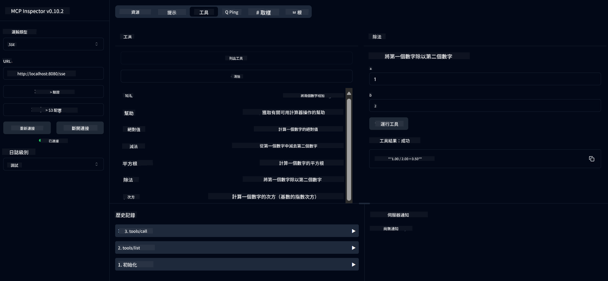

<!--
CO_OP_TRANSLATOR_METADATA:
{
  "original_hash": "7bf9a4a832911269a8bd0decb97ff36c",
  "translation_date": "2025-07-21T16:43:08+00:00",
  "source_file": "04-PracticalSamples/mcp/calculator/README.md",
  "language_code": "hk"
}
-->
# 基本計算機 MCP 服務

>**注意**：本章包含一個[**教程**](./TUTORIAL.md)，指導您如何運行完成的範例。

歡迎來到您的第一次 **模型上下文協議 (MCP)** 實操體驗！在之前的章節中，您已學習了生成式 AI 的基礎知識並設置了開發環境。現在是時候構建一些實用的東西了。

這個計算機服務展示了 AI 模型如何使用 MCP 安全地與外部工具互動。我們不依賴 AI 模型有時不可靠的數學能力，而是展示如何構建一個穩健的系統，讓 AI 可以調用專門的服務進行精確計算。

## 目錄

- [您將學到什麼](../../../../../04-PracticalSamples/mcp/calculator)
- [先決條件](../../../../../04-PracticalSamples/mcp/calculator)
- [關鍵概念](../../../../../04-PracticalSamples/mcp/calculator)
- [快速開始](../../../../../04-PracticalSamples/mcp/calculator)
- [可用的計算機操作](../../../../../04-PracticalSamples/mcp/calculator)
- [測試客戶端](../../../../../04-PracticalSamples/mcp/calculator)
  - [1. 直接 MCP 客戶端 (SDKClient)](../../../../../04-PracticalSamples/mcp/calculator)
  - [2. AI 驅動的客戶端 (LangChain4jClient)](../../../../../04-PracticalSamples/mcp/calculator)
- [MCP Inspector (Web UI)](../../../../../04-PracticalSamples/mcp/calculator)
  - [逐步指導](../../../../../04-PracticalSamples/mcp/calculator)

## 您將學到什麼

通過完成此範例，您將了解：
- 如何使用 Spring Boot 創建與 MCP 兼容的服務
- 直接協議通信與 AI 驅動交互的區別
- AI 模型如何決定何時以及如何使用外部工具
- 構建工具驅動的 AI 應用的最佳實踐

非常適合初學者學習 MCP 概念並準備構建他們的第一個 AI 工具集成！

## 先決條件

- Java 21+
- Maven 3.6+
- **GitHub Token**：AI 驅動的客戶端所需。如果您尚未設置，請參閱[第 2 章：設置您的開發環境](../../../02-SetupDevEnvironment/README.md)以獲取指導。

## 關鍵概念

**模型上下文協議 (MCP)** 是一種標準化方式，讓 AI 應用安全地連接到外部工具。可以將其視為一座“橋樑”，使 AI 模型能夠使用外部服務，例如我們的計算機。與其讓 AI 模型自己嘗試進行數學運算（可能不可靠），它可以調用我們的計算機服務以獲得準確的結果。MCP 確保此通信安全且一致。

**伺服器推送事件 (SSE)** 使伺服器和客戶端之間的實時通信成為可能。與傳統的 HTTP 請求不同，您需要等待伺服器的響應，而 SSE 允許伺服器持續向客戶端發送更新。這非常適合 AI 應用，其中響應可能是流式的或需要時間處理。

**AI 工具與函數調用**使 AI 模型能夠根據用戶請求自動選擇並使用外部函數（例如計算機操作）。當您詢問“15 + 27 是多少？”時，AI 模型理解您需要進行加法，並自動調用我們的 `add` 工具，傳入正確的參數（15, 27），然後以自然語言返回結果。AI 充當智能協調者，知道何時以及如何使用每個工具。

## 快速開始

### 1. 進入計算機應用目錄
```bash
cd Generative-AI-for-beginners-java/04-PracticalSamples/mcp/calculator
```

### 2. 構建並運行
```bash
mvn clean install -DskipTests
java -jar target/calculator-server-0.0.1-SNAPSHOT.jar
```

### 3. 使用客戶端進行測試
- **SDKClient**：直接 MCP 協議交互
- **LangChain4jClient**：AI 驅動的自然語言交互（需要 GitHub Token）

## 可用的計算機操作

- `add(a, b)`、`subtract(a, b)`、`multiply(a, b)`、`divide(a, b)`
- `power(base, exponent)`、`squareRoot(number)`、`absolute(number)`
- `modulus(a, b)`、`help()`

## 測試客戶端

### 1. 直接 MCP 客戶端 (SDKClient)
測試原始 MCP 協議通信。運行：
```bash
mvn test-compile exec:java -Dexec.mainClass="com.microsoft.mcp.sample.client.SDKClient" -Dexec.classpathScope=test
```

### 2. AI 驅動的客戶端 (LangChain4jClient)
展示與 GitHub 模型的自然語言交互。需要 GitHub Token（請參閱[先決條件](../../../../../04-PracticalSamples/mcp/calculator)）。

**運行：**
```bash
mvn test-compile exec:java -Dexec.mainClass="com.microsoft.mcp.sample.client.LangChain4jClient" -Dexec.classpathScope=test
```

## MCP Inspector (Web UI)

MCP Inspector 提供了一個可視化的網頁界面，讓您可以在不編寫代碼的情況下測試您的 MCP 服務。非常適合初學者理解 MCP 的工作原理！

### 逐步指導：

1. **啟動計算機伺服器**（如果尚未運行）：
   ```bash
   java -jar target/calculator-server-0.0.1-SNAPSHOT.jar
   ```

2. **在新終端中安裝並運行 MCP Inspector**：
   ```bash
   npx @modelcontextprotocol/inspector
   ```

3. **打開網頁界面**：
   - 查找類似“Inspector running at http://localhost:6274”的消息
   - 在瀏覽器中打開該 URL

4. **連接到您的計算機服務**：
   - 在網頁界面中，將傳輸類型設置為“SSE”
   - 將 URL 設置為：`http://localhost:8080/sse`
   - 點擊“Connect”按鈕

5. **探索可用工具**：
   - 點擊“List Tools”查看所有計算機操作
   - 您將看到像 `add`、`subtract`、`multiply` 等函數

6. **測試計算機操作**：
   - 選擇一個工具（例如“add”）
   - 輸入參數（例如 `a: 15`，`b: 27`）
   - 點擊“Run Tool”
   - 查看您的 MCP 服務返回的結果！

這種可視化方法幫助您在構建自己的客戶端之前，完全理解 MCP 通信的工作原理。



---
**參考資料：** [MCP Server Boot Starter Docs](https://docs.spring.io/spring-ai/reference/api/mcp/mcp-server-boot-starter-docs.html)

**免責聲明**：  
本文件已使用人工智能翻譯服務 [Co-op Translator](https://github.com/Azure/co-op-translator) 進行翻譯。儘管我們致力於提供準確的翻譯，但請注意，自動翻譯可能包含錯誤或不準確之處。原始語言的文件應被視為具權威性的來源。對於重要信息，建議使用專業人工翻譯。我們對因使用此翻譯而引起的任何誤解或錯誤解釋概不負責。