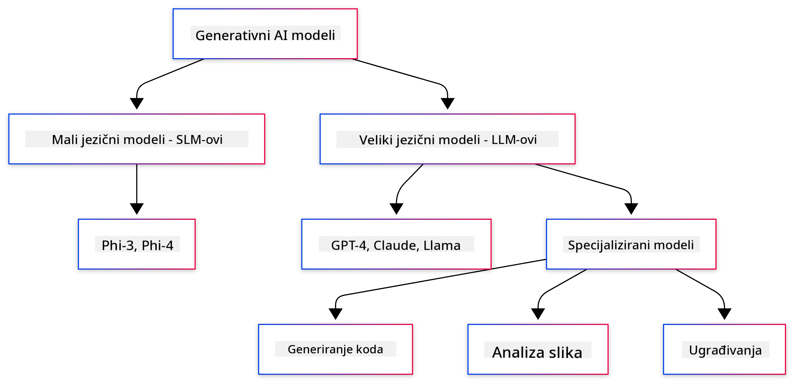
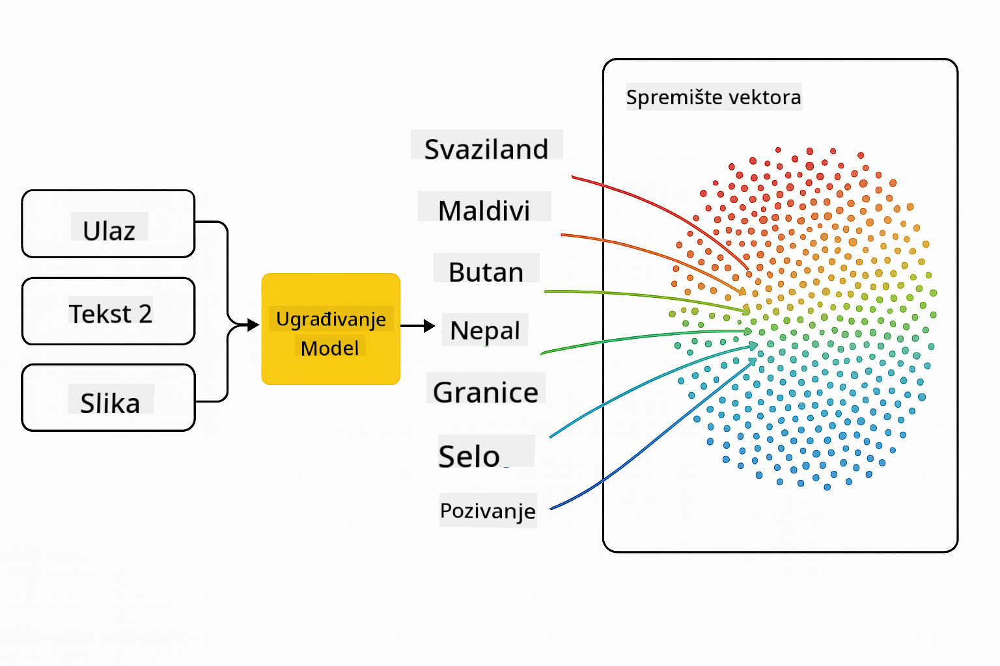

<!--
CO_OP_TRANSLATOR_METADATA:
{
  "original_hash": "6d8b4a0d774dc2a1e97c95859a6d6e4b",
  "translation_date": "2025-07-21T21:49:08+00:00",
  "source_file": "01-IntroToGenAI/README.md",
  "language_code": "hr"
}
-->
# Uvod u Generativnu AI - Java izdanje

## Što ćete naučiti

- **Osnove generativne AI** uključujući LLM-ove, inženjering upita, tokene, ugrađivanja i vektorske baze podataka
- **Usporedba alata za razvoj AI u Javi** uključujući Azure OpenAI SDK, Spring AI i OpenAI Java SDK
- **Otkrijte Model Context Protocol** i njegovu ulogu u komunikaciji AI agenata

## Sadržaj

- [Uvod](../../../01-IntroToGenAI)
- [Brzi pregled koncepata generativne AI](../../../01-IntroToGenAI)
- [Pregled inženjeringa upita](../../../01-IntroToGenAI)
- [Tokeni, ugrađivanja i agenti](../../../01-IntroToGenAI)
- [Alati i knjižnice za razvoj AI u Javi](../../../01-IntroToGenAI)
  - [OpenAI Java SDK](../../../01-IntroToGenAI)
  - [Spring AI](../../../01-IntroToGenAI)
  - [Azure OpenAI Java SDK](../../../01-IntroToGenAI)
- [Sažetak](../../../01-IntroToGenAI)
- [Sljedeći koraci](../../../01-IntroToGenAI)

## Uvod

Dobrodošli u prvo poglavlje Generativne AI za početnike - Java izdanje! Ova osnovna lekcija uvodi vas u ključne koncepte generativne AI i kako raditi s njima koristeći Javu. Naučit ćete o osnovnim građevnim blokovima AI aplikacija, uključujući Velike Jezične Modele (LLM-ove), tokene, ugrađivanja i AI agente. Također ćemo istražiti osnovne Java alate koje ćete koristiti tijekom ovog tečaja.

### Brzi pregled koncepata generativne AI

Generativna AI je vrsta umjetne inteligencije koja stvara novi sadržaj, poput teksta, slika ili koda, na temelju obrazaca i odnosa naučenih iz podataka. Generativni AI modeli mogu generirati odgovore slične ljudskima, razumjeti kontekst i ponekad čak stvoriti sadržaj koji izgleda kao da ga je stvorio čovjek.

Dok razvijate svoje Java AI aplikacije, radit ćete s **generativnim AI modelima** za stvaranje sadržaja. Neke od mogućnosti generativnih AI modela uključuju:

- **Generiranje teksta**: Pisanje teksta sličnog ljudskom za chatbotove, sadržaj i dovršavanje teksta.
- **Generiranje i analiza slika**: Stvaranje realističnih slika, poboljšanje fotografija i prepoznavanje objekata.
- **Generiranje koda**: Pisanje isječaka koda ili skripti.

Postoje specifične vrste modela optimizirane za različite zadatke. Na primjer, i **Mali Jezični Modeli (SLM-ovi)** i **Veliki Jezični Modeli (LLM-ovi)** mogu obraditi generiranje teksta, pri čemu LLM-ovi obično nude bolje performanse za složene zadatke. Za zadatke vezane uz slike koristili biste specijalizirane modele za viziju ili multimodalne modele.

Naravno, odgovori ovih modela nisu uvijek savršeni. Vjerojatno ste čuli za modele koji "haluciniraju" ili generiraju netočne informacije na autoritativan način. No, možete pomoći modelu da generira bolje odgovore pružajući mu jasne upute i kontekst. Ovdje dolazi do izražaja **inženjering upita**.

#### Pregled inženjeringa upita

Inženjering upita je praksa dizajniranja učinkovitih ulaza kako bi se AI modeli usmjerili prema željenim izlazima. To uključuje:

- **Jasnoću**: Činjenje uputa jasnima i nedvosmislenima.
- **Kontekst**: Pružanje potrebnih pozadinskih informacija.
- **Ograničenja**: Navođenje bilo kakvih ograničenja ili formata.

Neke najbolje prakse za inženjering upita uključuju dizajn upita, jasne upute, razlaganje zadataka, učenje iz jednog primjera (one-shot) i nekoliko primjera (few-shot), te fino podešavanje upita. Testiranje različitih upita ključno je za pronalaženje onoga što najbolje funkcionira za vaš specifični slučaj upotrebe.

Prilikom razvoja aplikacija radit ćete s različitim vrstama upita:
- **Sistemski upiti**: Postavljaju osnovna pravila i kontekst za ponašanje modela
- **Korisnički upiti**: Ulazni podaci od korisnika vaše aplikacije
- **Pomoćni upiti**: Odgovori modela temeljeni na sistemskim i korisničkim upitima

> **Saznajte više**: Saznajte više o inženjeringu upita u [Poglavlju o inženjeringu upita tečaja GenAI za početnike](https://github.com/microsoft/generative-ai-for-beginners/tree/main/04-prompt-engineering-fundamentals)

#### Tokeni, ugrađivanja i agenti

Dok radite s generativnim AI modelima, susrest ćete pojmove poput **tokena**, **ugrađivanja**, **agenata** i **Model Context Protocol (MCP)**. Evo detaljnog pregleda ovih koncepata:

- **Tokeni**: Tokeni su najmanje jedinice teksta u modelu. Mogu biti riječi, znakovi ili podriječi. Tokeni se koriste za predstavljanje tekstualnih podataka u formatu koji model može razumjeti. Na primjer, rečenica "The quick brown fox jumped over the lazy dog" može se tokenizirati kao ["The", " quick", " brown", " fox", " jumped", " over", " the", " lazy", " dog"] ili ["The", " qu", "ick", " br", "own", " fox", " jump", "ed", " over", " the", " la", "zy", " dog"] ovisno o strategiji tokenizacije.

Tokenizacija je proces razbijanja teksta na ove manje jedinice. Ovo je ključno jer modeli rade s tokenima, a ne s neobrađenim tekstom. Broj tokena u upitu utječe na duljinu i kvalitetu odgovora modela, jer modeli imaju ograničenja na broj tokena u svom kontekstualnom prozoru (npr. 128K tokena za ukupni kontekst GPT-4o, uključujući ulaz i izlaz).

  U Javi možete koristiti knjižnice poput OpenAI SDK-a za automatsko rukovanje tokenizacijom prilikom slanja zahtjeva AI modelima.

- **Ugrađivanja**: Ugrađivanja su vektorske reprezentacije tokena koje hvataju semantičko značenje. To su numeričke reprezentacije (obično nizovi brojeva s pomičnim zarezom) koje omogućuju modelima razumijevanje odnosa između riječi i generiranje kontekstualno relevantnih odgovora. Slične riječi imaju slična ugrađivanja, omogućujući modelu razumijevanje koncepata poput sinonima i semantičkih odnosa.

  U Javi možete generirati ugrađivanja koristeći OpenAI SDK ili druge knjižnice koje podržavaju generiranje ugrađivanja. Ova ugrađivanja su ključna za zadatke poput semantičke pretrage, gdje želite pronaći sličan sadržaj na temelju značenja, a ne točnih podudaranja teksta.

- **Vektorske baze podataka**: Vektorske baze podataka su specijalizirani sustavi za pohranu optimizirani za ugrađivanja. Omogućuju učinkovitu pretragu sličnosti i ključne su za obrasce generiranja uz pomoć pretraživanja (RAG), gdje trebate pronaći relevantne informacije iz velikih skupova podataka na temelju semantičke sličnosti, a ne točnih podudaranja.

> **Napomena**: U ovom tečaju nećemo pokrivati vektorske baze podataka, ali smatramo da ih vrijedi spomenuti jer se često koriste u stvarnim aplikacijama.

- **Agenti i MCP**: AI komponente koje autonomno komuniciraju s modelima, alatima i vanjskim sustavima. Model Context Protocol (MCP) pruža standardizirani način za agente da sigurno pristupe vanjskim izvorima podataka i alatima. Saznajte više u našem [MCP za početnike](https://github.com/microsoft/mcp-for-beginners) tečaju.

U Java AI aplikacijama koristit ćete tokene za obradu teksta, ugrađivanja za semantičku pretragu i RAG, vektorske baze podataka za dohvaćanje podataka te agente s MCP-om za izgradnju inteligentnih sustava koji koriste alate.

### Alati i knjižnice za razvoj AI u Javi

Java nudi izvrsne alate za razvoj AI. Postoje tri glavne knjižnice koje ćemo istražiti tijekom ovog tečaja - OpenAI Java SDK, Azure OpenAI SDK i Spring AI.

Evo brze referentne tablice koja prikazuje koji se SDK koristi u primjerima svakog poglavlja:

| Poglavlje | Primjer | SDK |
|-----------|---------|-----|
| 02-SetupDevEnvironment | src/github-models/ | OpenAI Java SDK |
| 02-SetupDevEnvironment | src/basic-chat-azure/ | Spring AI Azure OpenAI |
| 03-CoreGenerativeAITechniques | examples/ | Azure OpenAI SDK |
| 04-PracticalSamples | petstory/ | OpenAI Java SDK |
| 04-PracticalSamples | foundrylocal/ | OpenAI Java SDK |
| 04-PracticalSamples | mcp/calculator/ | Spring AI MCP SDK + LangChain4j |

**Poveznice na dokumentaciju SDK-a:**
- [Azure OpenAI Java SDK](https://github.com/Azure/azure-sdk-for-java/tree/azure-ai-openai_1.0.0-beta.16/sdk/openai/azure-ai-openai)
- [Spring AI](https://docs.spring.io/spring-ai/reference/)
- [OpenAI Java SDK](https://github.com/openai/openai-java)
- [LangChain4j](https://docs.langchain4j.dev/)

#### OpenAI Java SDK

OpenAI SDK je službena Java knjižnica za OpenAI API. Pruža jednostavno i dosljedno sučelje za interakciju s OpenAI modelima, čineći integraciju AI mogućnosti u Java aplikacije lakom. Primjeri GitHub modela iz Poglavlja 2, aplikacija Pet Story i primjer Foundry Local iz Poglavlja 4 demonstriraju pristup OpenAI SDK-a.

#### Spring AI

Spring AI je sveobuhvatan okvir koji donosi AI mogućnosti u Spring aplikacije, pružajući dosljedan sloj apstrakcije preko različitih AI pružatelja. Besprijekorno se integrira s Spring ekosustavom, čineći ga idealnim izborom za enterprise Java aplikacije koje trebaju AI mogućnosti.

Snaga Spring AI-a leži u njegovoj besprijekornoj integraciji sa Spring ekosustavom, čineći izgradnju produkcijski spremnih AI aplikacija jednostavnom uz poznate Spring obrasce poput ubrizgavanja ovisnosti, upravljanja konfiguracijom i testnih okvira. Koristit ćete Spring AI u Poglavljima 2 i 4 za izgradnju aplikacija koje koriste i OpenAI i Model Context Protocol (MCP) Spring AI knjižnice.

##### Model Context Protocol (MCP)

[Model Context Protocol (MCP)](https://modelcontextprotocol.io/) je novi standard koji omogućuje AI aplikacijama sigurnu interakciju s vanjskim izvorima podataka i alatima. MCP pruža standardizirani način za AI modele da pristupe kontekstualnim informacijama i izvršavaju radnje u vašim aplikacijama.

U Poglavlju 4 izgradit ćete jednostavnu MCP uslugu kalkulatora koja demonstrira osnove Model Context Protocol-a sa Spring AI-om, pokazujući kako stvoriti osnovne integracije alata i arhitekture usluga.

#### Azure OpenAI Java SDK

Azure OpenAI klijentska knjižnica za Javu je prilagodba OpenAI-jevih REST API-ja koja pruža idiomatsko sučelje i integraciju s ostatkom Azure SDK ekosustava. U Poglavlju 3 izgradit ćete aplikacije koristeći Azure OpenAI SDK, uključujući chat aplikacije, pozivanje funkcija i RAG (Retrieval-Augmented Generation) obrasce.

> Napomena: Azure OpenAI SDK zaostaje za OpenAI Java SDK-om u pogledu značajki, pa za buduće projekte razmotrite korištenje OpenAI Java SDK-a.

## Sažetak

**Čestitamo!** Uspješno ste:

- **Naučili osnove generativne AI** uključujući LLM-ove, inženjering upita, tokene, ugrađivanja i vektorske baze podataka
- **Usporedili alate za razvoj AI u Javi** uključujući Azure OpenAI SDK, Spring AI i OpenAI Java SDK
- **Otkrijte Model Context Protocol** i njegovu ulogu u komunikaciji AI agenata

## Sljedeći koraci

[Poglavlje 2: Postavljanje razvojnog okruženja](../02-SetupDevEnvironment/README.md)

**Odricanje od odgovornosti**:  
Ovaj dokument je preveden pomoću AI usluge za prevođenje [Co-op Translator](https://github.com/Azure/co-op-translator). Iako nastojimo osigurati točnost, imajte na umu da automatski prijevodi mogu sadržavati pogreške ili netočnosti. Izvorni dokument na izvornom jeziku treba smatrati autoritativnim izvorom. Za kritične informacije preporučuje se profesionalni prijevod od strane čovjeka. Ne preuzimamo odgovornost za nesporazume ili pogrešna tumačenja koja mogu proizaći iz korištenja ovog prijevoda.