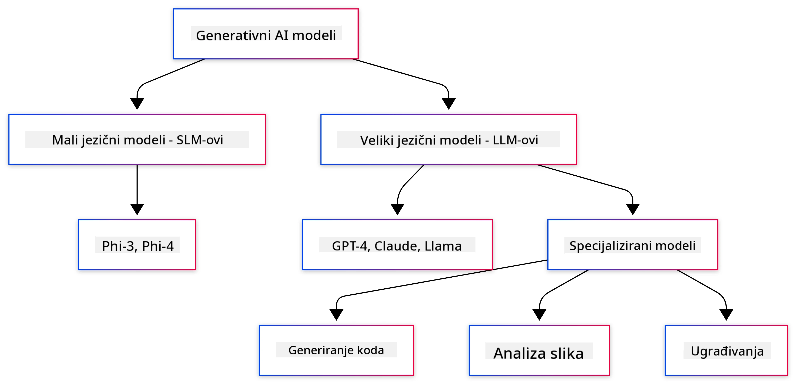
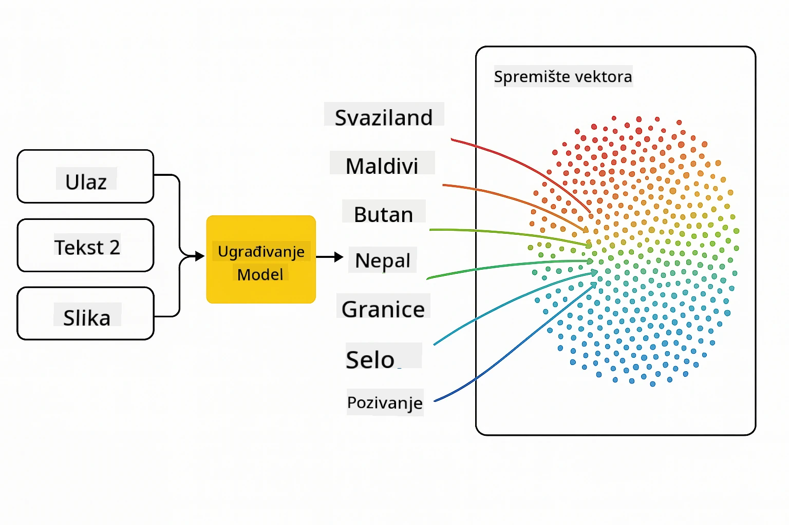
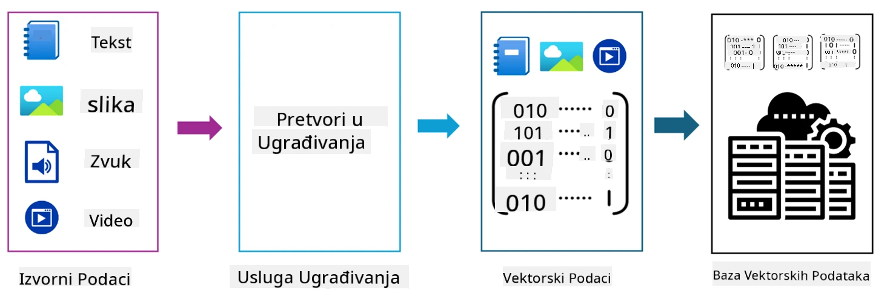
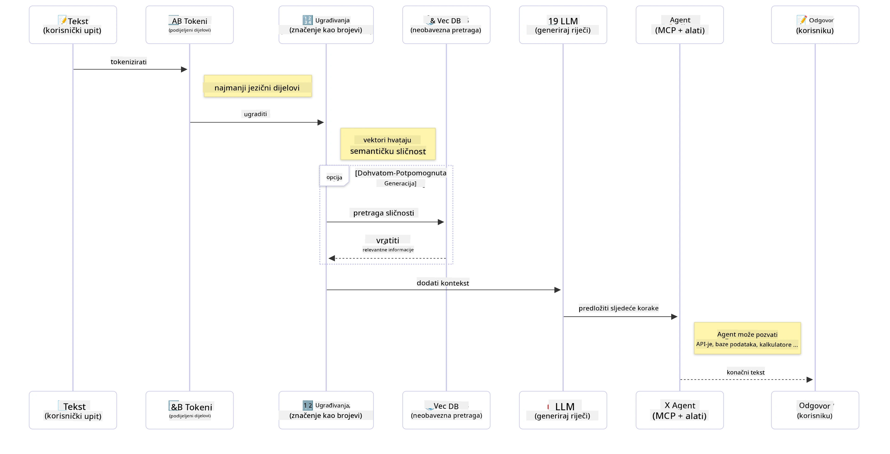

# Uvod u Generativnu AI - Java Izdanje

> **Video**: [Pogledajte video pregled ove lekcije na YouTubeu.](https://www.youtube.com/watch?v=XH46tGp_eSw) Također možete kliknuti na sličicu gore.

## Što ćete naučiti

- **Osnove generativne AI** uključujući LLM-ove, prompt inženjering, tokene, embeddings i vektorske baze podataka
- **Usporedite Java AI razvojne alate** uključujući Azure OpenAI SDK, Spring AI i OpenAI Java SDK
- **Otkrijte Model Context Protocol** i njegovu ulogu u komunikaciji AI agenata

## Sadržaj

- [Uvod](#uvod)
- [Brzi pregled generativnih AI koncepata](#brzi-pregled-generativnih-ai-koncepata)
- [Pregled prompt inženjeringa](#pregled-prompt-inženjeringa)
- [Tokeni, embeddings i agenti](#tokeni-embeddings-i-agenti)
- [Alati i biblioteke za AI razvoj u Javi](#alati-i-biblioteke-za-ai-razvoj-u-javi)
  - [OpenAI Java SDK](#openai-java-sdk)
  - [Spring AI](#spring-ai)
  - [Azure OpenAI Java SDK](#azure-openai-java-sdk)
- [Sažetak](#sažetak)
- [Sljedeći koraci](#sljedeći-koraci)

## Uvod

Dobrodošli u prvo poglavlje Generativne AI za početnike - Java izdanje! Ova temeljna lekcija uvodi vas u osnovne pojmove generativne AI i kako s njima raditi koristeći Javu. Naučit ćete o ključnim sastavnicama AI aplikacija, uključujući Velike Jezične Modele (LLM-ove), tokene, embeddings i AI agente. Također ćemo istražiti primarne Java alate koje ćete koristiti kroz cijeli ovaj tečaj.

### Brzi pregled generativnih AI koncepata

Generativna AI je vrsta umjetne inteligencije koja stvara novi sadržaj, poput teksta, slika ili koda, na temelju uzoraka i odnosa naučenih iz podataka. Generativni AI modeli mogu generirati odgovore nalik ljudskim, razumjeti kontekst i ponekad čak stvarati sadržaj koji djeluje kao da su ljudi stvorili.

Dok razvijate svoje Java AI aplikacije, radit ćete s **generativnim AI modelima** za stvaranje sadržaja. Neke mogućnosti generativnih AI modela uključuju:

- **Generiranje teksta**: Izrada teksta nalik ljudskom za chatbotove, sadržaj i dovršavanje teksta.
- **Generiranje i analiza slika**: Proizvodnja realističnih slika, poboljšavanje fotografija i otkrivanje objekata.
- **Generiranje koda**: Pisanje kodnih isječaka ili skripti.

Postoje posebne vrste modela optimizirane za različite zadatke. Na primjer, i **Mali Jezični Modeli (SLM)** i **Veliki Jezični Modeli (LLM)** mogu obrađivati generiranje teksta, pri čemu LLM-ovi obično pružaju bolje performanse za složenije zadatke. Za zadatke vezane uz slike koristili biste specijalizirane modele za vid ili multimodalne modele.

Naravno, odgovori ovih modela nisu uvijek savršeni. Vjerojatno ste čuli za modele koji "haluciniraju" ili generiraju netočne informacije na autoritativan način. No možete pomoći modelu da generira bolje odgovore dajući mu jasne upute i kontekst. Tu dolazi do izražaja **prompt inženjering**.

#### Pregled prompt inženjeringa

Prompt inženjering je praksa dizajniranja učinkovitih ulaza kako bi AI modeli bili usmjereni prema željenim izlazima. Uključuje:

- **Jasnoću**: Davanje jasnih i nedvosmislenih uputa.
- **Kontekst**: Pružanje potrebnih pozadinskih informacija.
- **Ograničenja**: Navođenje svih posebnih ograničenja ili formata.

Neke najbolje prakse za prompt inženjering uključuju dizajn prompta, jasne upute, razlaganje zadataka, učenje na jednom ili nekoliko primjera te podešavanje prompta. Testiranje različitih prompta ključno je za pronalazak onog koji najbolje funkcionira za vaš specifični slučaj.

Prilikom razvoja aplikacija radit ćete s različitim vrstama prompta:
- **Sistemski prompti**: Postavljaju osnovna pravila i kontekst ponašanja modela
- **Korisnički prompti**: Ulazni podaci od vaših korisnika aplikacije
- **Asistentski prompti**: Odgovori modela bazirani na sistemskim i korisničkim promptima

> **Saznajte više**: Saznajte više o prompt inženjeringu u [Poglavlju o Prompt inženjeringu u tečaju GenAI za početnike](https://github.com/microsoft/generative-ai-for-beginners/tree/main/04-prompt-engineering-fundamentals)

#### Tokeni, embeddings i agenti

Kada radite s generativnim AI modelima, susrest ćete pojmove poput **tokena**, **embeddings**, **agenta** i **Model Context Protocol (MCP)**. Evo detaljnog pregleda tih pojmova:

- **Tokeni**: Tokeni su najmanja jedinica teksta u modelu. Mogu biti riječi, znakovi ili podriječi. Tokeni se koriste za predstavljanje tekstualnih podataka u formatu koji model može razumjeti. Na primjer, rečenica "The quick brown fox jumped over the lazy dog" može biti tokenizirana kao ["The", " quick", " brown", " fox", " jumped", " over", " the", " lazy", " dog"] ili ["The", " qu", "ick", " br", "own", " fox", " jump", "ed", " over", " the", " la", "zy", " dog"] ovisno o strategiji tokenizacije.

Tokenizacija je proces razbijanja teksta na ove male jedinice. To je ključno jer modeli rade s tokenima, a ne s sirovim tekstom. Broj tokena u promptu utječe na duljinu i kvalitetu odgovora modela, jer modeli imaju ograničenje broja tokena u okviru konteksta (npr. 128K tokena za GPT-4o ukupni kontekst, uključujući ulaz i izlaz).

  U Javi možete koristiti biblioteke poput OpenAI SDK-a za automatsku tokenizaciju prilikom slanja zahtjeva AI modelima.

- **Embeddings**: Embeddings su vektorske reprezentacije tokena koje hvataju semantičko značenje. To su numeričke reprezentacije (obično nizovi decimalnih brojeva) koje modelima omogućuju razumijevanje odnosa između riječi i generiranje kontekstualno relevantnih odgovora. Slične riječi imaju slične embeddings, što omogućuje modelu razumijevanje koncepata poput sinonima i semantičkih odnosa.

  U Javi embeddings možete generirati korištenjem OpenAI SDK-a ili drugih biblioteka koje podržavaju generiranje embeddingsa. Ti embeddingsi su ključni za zadatke poput semantičkog pretraživanja, gdje želite pronaći sličan sadržaj na temelju značenja, a ne točnih tekstualnih podudaranja.

- **Vektorske baze podataka**: Vektorske baze podataka su specijalizirani sustavi za pohranu optimizirani za embeddings. Omogućuju učinkovito pretraživanje po sličnosti i ključni su za modele Retrieval-Augmented Generation (RAG) gdje trebate pronaći relevantne informacije iz velikih skupova podataka temeljem semantičke sličnosti, a ne točnih podudaranja.

> **Napomena**: U ovom tečaju nećemo obrađivati vektorske baze podataka, ali smatramo da su vrijedne spomena jer se često koriste u stvarnim aplikacijama.

- **Agenti i MCP**: AI komponente koje samostalno komuniciraju s modelima, alatima i vanjskim sustavima. Model Context Protocol (MCP) pruža standardizirani način za agente da sigurno pristupaju vanjskim izvorima podataka i alatima. Saznajte više u našem [MCP za početnike](https://github.com/microsoft/mcp-for-beginners) tečaju.

U Java AI aplikacijama koristit ćete tokene za obradu teksta, embeddings za semantičko pretraživanje i RAG, vektorske baze podataka za dohvat podataka te agente s MCP-om za izgradnju inteligentnih sustava koji koriste alate.

### Alati i biblioteke za AI razvoj u Javi

Java nudi izvrsne alate za AI razvoj. Postoje tri glavne biblioteke koje ćemo istražiti kroz ovaj tečaj - OpenAI Java SDK, Azure OpenAI SDK i Spring AI.

Evo tablice za brzi pregled koja SDK se koristi u primjerima svakog poglavlja:

| Poglavlje | Primjer | SDK |
|---------|--------|-----|
| 02-SetupDevEnvironment | github-models | OpenAI Java SDK |
| 02-SetupDevEnvironment | basic-chat-azure | Spring AI Azure OpenAI |
| 03-CoreGenerativeAITechniques | examples | Azure OpenAI SDK |
| 04-PracticalSamples | petstory | OpenAI Java SDK |
| 04-PracticalSamples | foundrylocal | OpenAI Java SDK |
| 04-PracticalSamples | calculator | Spring AI MCP SDK + LangChain4j |

**Linkovi na dokumentaciju SDK-a:**
- [Azure OpenAI Java SDK](https://github.com/Azure/azure-sdk-for-java/tree/azure-ai-openai_1.0.0-beta.16/sdk/openai/azure-ai-openai)
- [Spring AI](https://docs.spring.io/spring-ai/reference/)
- [OpenAI Java SDK](https://github.com/openai/openai-java)
- [LangChain4j](https://docs.langchain4j.dev/)

#### OpenAI Java SDK

OpenAI SDK je službena Java biblioteka za OpenAI API. Nudi jednostavno i dosljedno sučelje za interakciju s OpenAI modelima, što olakšava integraciju AI funkcionalnosti u Java aplikacije. Primjeri GitHub modela iz Poglavlja 2, aplikacija Pet Story i Foundry Local iz Poglavlja 4 prikazuju pristup korištenja OpenAI SDK-a.

#### Spring AI

Spring AI je sveobuhvatan okvir koji donosi AI mogućnosti u Spring aplikacije, pružajući ujednačeni sloj apstrakcije preko različitih AI pružatelja usluga. Besprijekorno se integrira sa Spring ekosustavom, što ga čini idealnim za enterprise Java aplikacije koje trebaju AI mogućnosti.

Snaga Spring AI-ja leži u njegovoj glatkoj integraciji sa Spring ekosustavom, što olakšava izgradnju proizvodnih AI aplikacija koristeći poznate Spring obrasce poput dependency injectiona, upravljanja konfiguracijom i testnih okvira. Spring AI koristit ćete u Poglavljima 2 i 4 za izgradnju aplikacija koje koriste i OpenAI i Model Context Protocol (MCP) Spring AI biblioteke.

##### Model Context Protocol (MCP)

[Model Context Protocol (MCP)](https://modelcontextprotocol.io/) je novonastali standard koji omogućuje AI aplikacijama sigurnu interakciju s vanjskim izvorima podataka i alatima. MCP pruža standardizirani način da AI modeli pristupe kontekstualnim informacijama i izvršavaju radnje u vašim aplikacijama.

U Poglavlju 4 izgradit ćete jednostavnu MCP kalkulator uslugu koja demonstrira osnove Model Context Protocola sa Spring AI-jem, pokazujući kako napraviti osnovne integracije alata i uslužne arhitekture.

#### Azure OpenAI Java SDK

Azure OpenAI klijent biblioteka za Javu je adaptacija OpenAI REST API-ja koja pruža idiomatsko sučelje i integraciju s ostatkom Azure SDK ekosustava. U Poglavlju 3 gradit ćete aplikacije koristeći Azure OpenAI SDK, uključujući chat aplikacije, pozivanje funkcija i RAG (Retrieval-Augmented Generation) obrasce.

> Napomena: Azure OpenAI SDK zaostaje za OpenAI Java SDK-em po funkcionalnostima pa za buduće projekte razmotrite korištenje OpenAI Java SDK-a.

## Sažetak

Time smo pokrili osnove! Sada razumijete:

- Temeljne koncepte generativne AI - od LLM-a i prompt inženjeringa do tokena, embeddingsa i vektorskih baza podataka
- Vaše opcije alata za razvoj AI u Javi: Azure OpenAI SDK, Spring AI i OpenAI Java SDK
- Što je Model Context Protocol i kako omogućuje AI agentima rad s vanjskim alatima

## Sljedeći koraci

[Poglavlje 2: Postavljanje razvojno okruženje](../02-SetupDevEnvironment/README.md)

---

<!-- CO-OP TRANSLATOR DISCLAIMER START -->
**Izjava o odricanju od odgovornosti**:  
Ovaj je dokument preveden pomoću AI usluge za prevođenje [Co-op Translator](https://github.com/Azure/co-op-translator). Iako nastojimo postići točnost, imajte na umu da automatizirani prijevodi mogu sadržavati pogreške ili netočnosti. Izvorni dokument na izvornom jeziku smatra se autoritativnim izvorom. Za kritične informacije preporučuje se profesionalni ljudski prijevod. Ne odgovaramo za bilo kakve nesporazume ili pogreške u tumačenju koje proizlaze iz korištenja ovog prijevoda.
<!-- CO-OP TRANSLATOR DISCLAIMER END -->