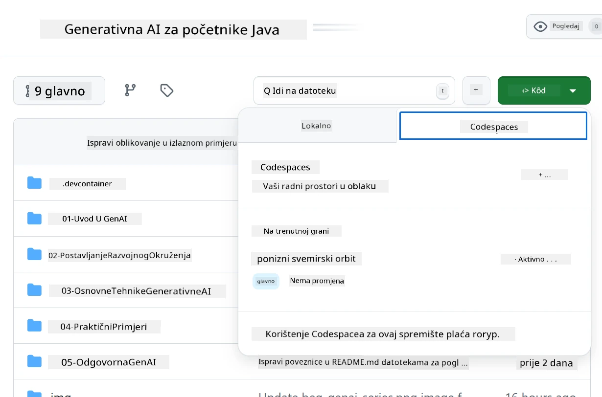
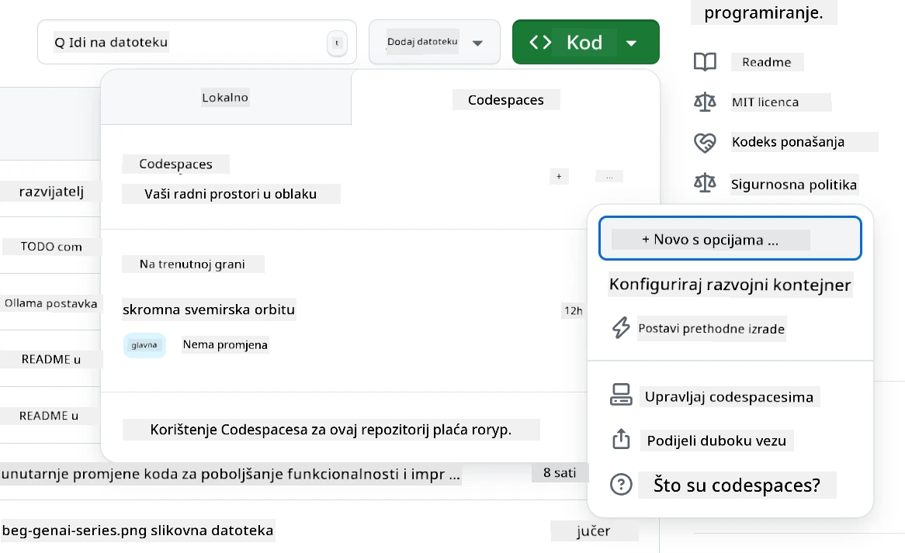
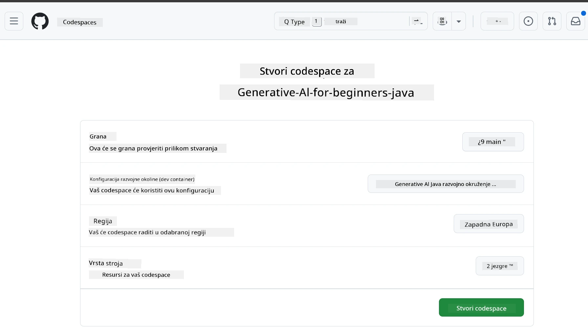
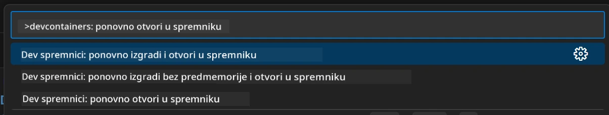
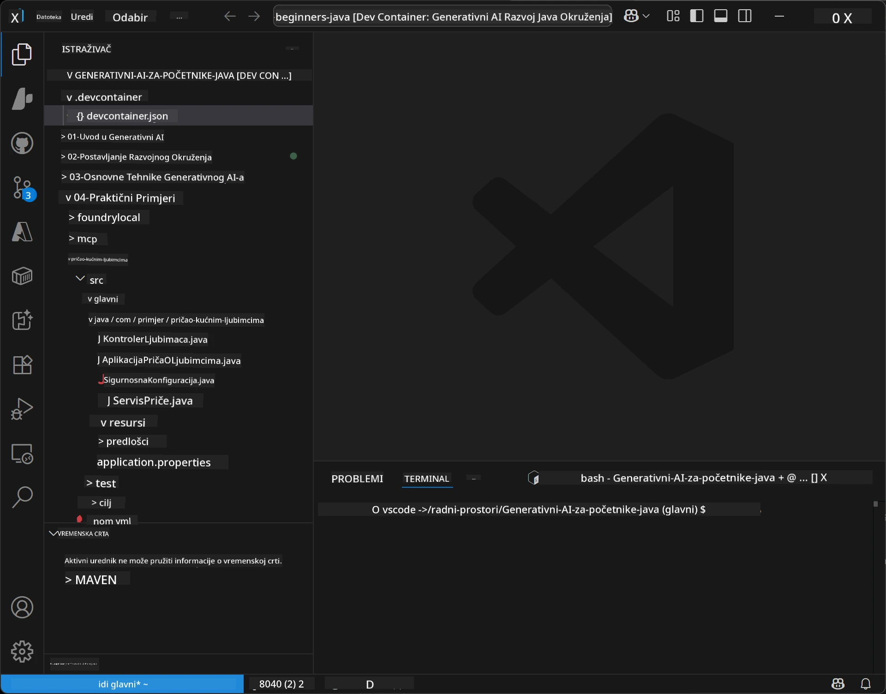
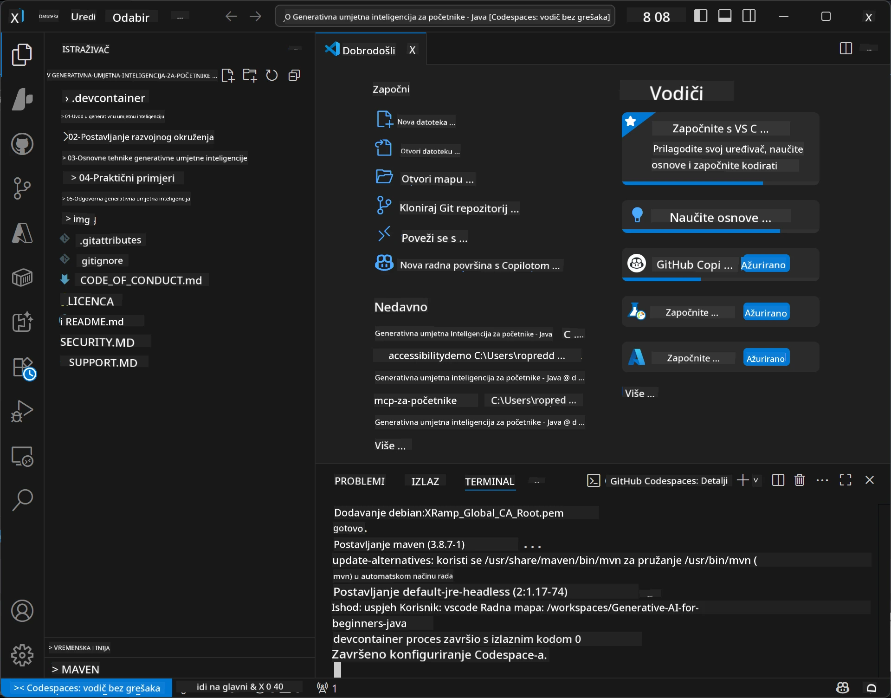

<!--
CO_OP_TRANSLATOR_METADATA:
{
  "original_hash": "96a30d42b9751a3d4e4b20e28d29d459",
  "translation_date": "2026-01-28T05:25:25+00:00",
  "source_file": "02-SetupDevEnvironment/README.md",
  "language_code": "hr"
}
-->
# Postavljanje Razvojnog Okruženja za Generativnu AI za Javu

> **Brzi početak**: Kodirajte u oblaku za 2 minute - skočite na [Postavljanje GitHub Codespaces](../../../02-SetupDevEnvironment) - nije potrebna lokalna instalacija i koristi GitHub modele!

> **Zanima vas Azure OpenAI?**, pogledajte naš [Vodič za postavljanje Azure OpenAI](getting-started-azure-openai.md) sa koracima za kreiranje novog Azure OpenAI resursa.

## Što ćete naučiti

- Postaviti razvojno okruženje za Java AI aplikacije
- Izabrati i konfigurirati željeno razvojno okruženje (cloud-first s Codespaces, lokalni dev container ili potpuna lokalna instalacija)
- Testirati postavke povezivanjem s GitHub modelima

## Sadržaj

- [Što ćete naučiti](../../../02-SetupDevEnvironment)
- [Uvod](../../../02-SetupDevEnvironment)
- [Korak 1: Postavite razvojno okruženje](../../../02-SetupDevEnvironment)
  - [Opcija A: GitHub Codespaces (Preporučeno)](../../../02-SetupDevEnvironment)
  - [Opcija B: Lokalni Dev Container](../../../02-SetupDevEnvironment)
  - [Opcija C: Upotrijebite postojeću lokalnu instalaciju](../../../02-SetupDevEnvironment)
- [Korak 2: Kreirajte GitHub osobni pristupni token](../../../02-SetupDevEnvironment)
- [Korak 3: Testirajte postavke](../../../02-SetupDevEnvironment)
- [Rješavanje problema](../../../02-SetupDevEnvironment)
- [Sažetak](../../../02-SetupDevEnvironment)
- [Sljedeći koraci](../../../02-SetupDevEnvironment)

## Uvod

Ovo poglavlje vodi vas kroz postavljanje razvojnog okruženja. Koristit ćemo **GitHub modele** kao naš primarni primjer jer su besplatni, jednostavni za postavljanje s samo GitHub računom, ne zahtijevaju kreditnu karticu i omogućuju pristup više modela za eksperimentiranje.

**Nije potrebna lokalna instalacija!** Možete odmah početi kodirati koristeći GitHub Codespaces koji pruža potpuno razvojno okruženje u vašem pregledniku.


Preporučujemo korištenje [**GitHub modela**](https://github.com/marketplace?type=models) za ovaj tečaj jer su:
- **Besplatni** za početak
- **Jednostavni** za postavljanje s samo GitHub računom
- **Nije potrebna kreditna kartica**
- Dostupno je **više modela** za eksperimentiranje

> **Napomena**: GitHub modeli korišteni u ovoj obuci imaju ove besplatne limite:
> - 15 zahtjeva u minuti (150 dnevno)
> - ~8,000 riječi ulaza, ~4,000 riječi izlaza po zahtjevu
> - 5 istovremenih zahtjeva
> 
> Za produkcijsku upotrebu nadogradite na Azure AI Foundry modele s vašim Azure računom. Vaš kod ne mora se mijenjati. Pogledajte [Azure AI Foundry dokumentaciju](https://learn.microsoft.com/azure/ai-foundry/foundry-models/how-to/quickstart-github-models).

## Korak 1: Postavite razvojno okruženje

<a name="quick-start-cloud"></a>

Kreirali smo unaprijed konfiguriran razvojni container kako bismo smanjili vrijeme postavljanja i osigurali da imate sve potrebne alate za ovaj Generativni AI tečaj za Javu. Izaberite željeni razvojni pristup:

### Opcije za postavljanje okruženja:

#### Opcija A: GitHub Codespaces (Preporučeno)

**Počnite kodirati za 2 minute - nije potrebna lokalna instalacija!**

1. Forkajte ovaj repozitorij na vaš GitHub račun
   > **Napomena**: Ako želite uređivati osnovnu konfiguraciju, pogledajte [Dev Container Configuration](../../../.devcontainer/devcontainer.json)
2. Kliknite **Code** → karticu **Codespaces** → **...** → **New with options...**
3. Koristite zadane postavke – ovo će odabrati **Dev container konfiguraciju**: **Generative AI Java Development Environment** prilagođeni devcontainer kreiran za ovaj tečaj
4. Kliknite **Create codespace**
5. Pričekajte ~2 minute da se okruženje pripremi
6. Nastavite na [Korak 2: Kreirajte GitHub Token](../../../02-SetupDevEnvironment)








> **Prednosti Codespacesa**:
> - Nije potrebna lokalna instalacija
> - Radi na bilo kojem uređaju s preglednikom
> - Unaprijed konfiguriran sa svim alatima i ovisnostima
> - Besplatnih 60 sati mjesečno za osobne račune
> - Dosljedno okruženje za sve polaznike

#### Opcija B: Lokalni Dev Container

**Za developere koji preferiraju lokalni razvoj s Dockerom**

1. Forkajte i klonirajte ovaj repozitorij na vaše lokalno računalo
   > **Napomena**: Ako želite uređivati osnovnu konfiguraciju, pogledajte [Dev Container Configuration](../../../.devcontainer/devcontainer.json)
2. Instalirajte [Docker Desktop](https://www.docker.com/products/docker-desktop/) i [VS Code](https://code.visualstudio.com/)
3. Instalirajte [Dev Containers proširenje](https://marketplace.visualstudio.com/items?itemName=ms-vscode-remote.remote-containers) u VS Code
4. Otvorite mapu repozitorija u VS Code-u
5. Kada se pojavi upit, kliknite **Reopen in Container** (ili koristite `Ctrl+Shift+P` → "Dev Containers: Reopen in Container")
6. Pričekajte da se container izgradi i pokrene
7. Nastavite na [Korak 2: Kreirajte GitHub Token](../../../02-SetupDevEnvironment)





#### Opcija C: Upotrijebite postojeću lokalnu instalaciju

**Za developere s postojećim Java okruženjem**

Preduvjeti:
- [Java 21+](https://www.oracle.com/java/technologies/javase/jdk21-archive-downloads.html)
- [Maven 3.9+](https://maven.apache.org/download.cgi)
- [VS Code](https://code.visualstudio.com) ili vaš omiljeni IDE

Koraci:
1. Klonirajte ovaj repozitorij na vaše lokalno računalo
2. Otvorite projekt u svom IDE-u
3. Nastavite na [Korak 2: Kreirajte GitHub Token](../../../02-SetupDevEnvironment)

> **Savjet**: Ako imate računalo slabijih specifikacija, ali želite lokalni VS Code, koristite GitHub Codespaces! Možete spojiti lokalni VS Code na cloud-hosted Codespace za najbolje od oba svijeta.




## Korak 2: Kreirajte GitHub osobni pristupni token

1. Idite na [GitHub postavke](https://github.com/settings/profile) i izaberite **Settings** iz izbornika profila.
2. U lijevom bočnom izborniku kliknite **Developer settings** (obično pri dnu).
3. Pod **Personal access tokens**, kliknite **Fine-grained tokens** (ili slijedite ovaj direktni [link](https://github.com/settings/personal-access-tokens)).
4. Kliknite **Generate new token**.
5. Pod "Token name" unesite opisni naziv (npr. `GenAI-Java-Course-Token`).
6. Postavite datum isteka (preporučeno: 7 dana radi sigurnosnih najboljih praksi).
7. Pod "Resource owner", izaberite svoj korisnički račun.
8. Pod "Repository access", izaberite repozitorije koje želite koristiti s GitHub modelima (ili "All repositories" ako je potrebno).
9. Pod "Account permissions", pronađite **Models** i postavite ga na **Read-only**.
10. Kliknite **Generate token**.
11. **Kopirajte i spremite token odmah** – nećete ga moći ponovno vidjeti!

> **Sigurnosni savjet**: Koristite minimalan potrebni opseg i najkraće moguće vrijeme trajanja za vaše pristupne tokene.

## Korak 3: Testirajte postavke s GitHub Models primjerom

Kad je vaše razvojno okruženje spremno, testirajmo integraciju GitHub modela s našom primjer aplikacijom u [`02-SetupDevEnvironment/examples/github-models`](../../../02-SetupDevEnvironment/examples/github-models).

1. Otvorite terminal u vašem razvojnom okruženju.
2. Idite u mapu s primjerom GitHub modela:
   ```bash
   cd 02-SetupDevEnvironment/examples/github-models
   ```
3. Postavite svoj GitHub token kao varijablu okoline:
   ```bash
   # macOS/Linux
   export GITHUB_TOKEN=your_token_here
   
   # Windows (Command Prompt)
   set GITHUB_TOKEN=your_token_here
   
   # Windows (PowerShell)
   $env:GITHUB_TOKEN="your_token_here"
   ```

4. Pokrenite aplikaciju:
   ```bash
   mvn compile exec:java -Dexec.mainClass="com.example.githubmodels.App"
   ```

Trebali biste vidjeti izlaz sličan ovom:
```text
Using model: gpt-4.1-nano
Sending request to GitHub Models...
Response: Hello World!
```

### Razumijevanje Primjera Koda

Prvo, razumimo što smo upravo pokrenuli. Primjer u `examples/github-models` koristi OpenAI Java SDK za povezivanje s GitHub modelima:

**Što ovaj kod radi:**
- **Povezuje se** s GitHub modelima koristeći vaš osobni pristupni token
- **Šalje** jednostavnu poruku "Say Hello World!" AI modelu
- **Prima** i prikazuje odgovor AI-ja
- **Provjerava** da vaša postavka ispravno radi

**Ključna ovisnost** (u `pom.xml`):
```xml
<dependency>
    <groupId>com.openai</groupId>
    <artifactId>openai-java</artifactId>
    <version>2.12.0</version>
</dependency>
```

**Glavni kod** (`App.java`):
```java
// Povežite se s GitHub modelima koristeći OpenAI Java SDK
OpenAIClient client = OpenAIOkHttpClient.builder()
    .apiKey(pat)
    .baseUrl("https://models.inference.ai.azure.com")
    .build();

// Kreirajte zahtjev za dovršetak chata
ChatCompletionCreateParams params = ChatCompletionCreateParams.builder()
    .model(modelId)
    .addSystemMessage("You are a concise assistant.")
    .addUserMessage("Say Hello World!")
    .build();

// Dobijte odgovor AI-ja
ChatCompletion response = client.chat().completions().create(params);
System.out.println("Response: " + response.choices().get(0).message().content().orElse("No response content"));
```

## Sažetak

Odlično! Sada imate sve postavljeno:

- Kreirali ste GitHub osobni pristupni token s pravim dopuštenjima za pristup AI modelima
- Pokrenuli ste Java razvojno okruženje (bilo da koristite Codespaces, dev containere ili lokalno)
- Povezali ste se s GitHub modelima koristeći OpenAI Java SDK za besplatan AI razvoj
- Testirali da sve radi jednostavnim primjerom koji komunicira s AI modelima

## Sljedeći koraci

[Poglavlje 3: Osnovne tehnike generativne AI](../03-CoreGenerativeAITechniques/README.md)

## Rješavanje problema

Imate problema? Evo uobičajenih problema i rješenja:

- **Token ne radi?** 
  - Provjerite jeste li kopirali cijeli token bez dodatnih praznina
  - Provjerite je li token ispravno postavljen kao varijabla okoline
  - Potvrdite da token ima ispravna dopuštenja (Models: Read-only)

- **Maven nije pronađen?** 
  - Ako koristite dev container/ Codespaces, Maven bi trebao biti unaprijed instaliran
  - Za lokalnu instalaciju, osigurajte da je Java 21+ i Maven 3.9+ instaliran
  - Pokušajte izvršiti `mvn --version` za provjeru instalacije

- **Problemi s vezom?** 
  - Provjerite internetsku vezu
  - Provjerite možete li pristupiti GitHubu s vaše mreže
  - Provjerite da niste iza vatrozida koji blokira GitHub Models endpoint

- **Dev container se ne pokreće?** 
  - Provjerite da je Docker Desktop pokrenut (za lokalni razvoj)
  - Pokušajte ponovno izgraditi container: `Ctrl+Shift+P` → "Dev Containers: Rebuild Container"

- **Pogreške pri kompajliranju aplikacije?**
  - Provjerite jeste li u ispravnom direktoriju: `02-SetupDevEnvironment/examples/github-models`
  - Pokušajte očistiti i ponovo izgraditi: `mvn clean compile`

> **Trebate pomoć?**: Još imate problema? Otvorite issue u repozitoriju i pomoći ćemo vam.

---

<!-- CO-OP TRANSLATOR DISCLAIMER START -->
**Odricanje od odgovornosti**:
Ovaj dokument je preveden pomoću AI usluge za prijevod [Co-op Translator](https://github.com/Azure/co-op-translator). Iako nastojimo postići točnost, molimo imajte na umu da automatski prijevodi mogu sadržavati pogreške ili netočnosti. Izvornik dokumenta na izvornom jeziku treba se smatrati autoritativnim izvorom. Za kritične informacije preporučuje se profesionalni ljudski prijevod. Nismo odgovorni za bilo kakva nesporazuma ili pogrešna tumačenja koja proizlaze iz korištenja ovog prijevoda.
<!-- CO-OP TRANSLATOR DISCLAIMER END -->