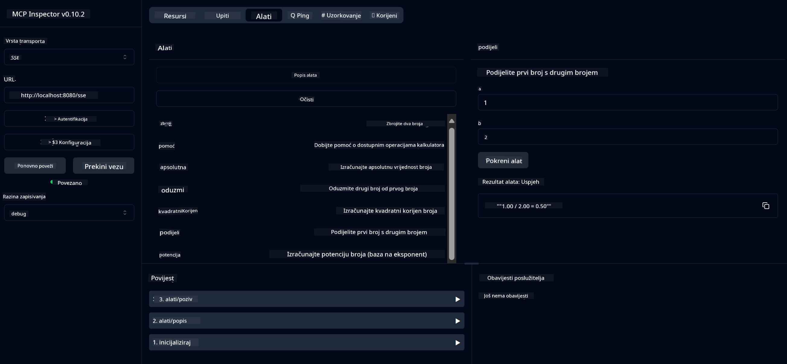

<!--
CO_OP_TRANSLATOR_METADATA:
{
  "original_hash": "5bd7a347d6ed1d706443f9129dd29dd9",
  "translation_date": "2025-07-25T10:13:03+00:00",
  "source_file": "04-PracticalSamples/mcp/calculator/README.md",
  "language_code": "hr"
}
-->
# Osnovna Kalkulator MCP Usluga

>**Napomena**: Ovo poglavlje uključuje [**Vodič**](./TUTORIAL.md) koji vas vodi kroz primjere.

Dobrodošli u vaše prvo praktično iskustvo s **Model Context Protocol (MCP)**! U prethodnim poglavljima naučili ste osnove generativne umjetne inteligencije i postavili razvojno okruženje. Sada je vrijeme da izgradite nešto praktično.

Ova usluga kalkulatora pokazuje kako AI modeli mogu sigurno komunicirati s vanjskim alatima koristeći MCP. Umjesto da se oslanjamo na ponekad nepouzdane matematičke sposobnosti AI modela, pokazat ćemo kako izgraditi robustan sustav gdje AI može pozivati specijalizirane usluge za točne izračune.

## Sadržaj

- [Što ćete naučiti](../../../../../04-PracticalSamples/mcp/calculator)
- [Preduvjeti](../../../../../04-PracticalSamples/mcp/calculator)
- [Ključni pojmovi](../../../../../04-PracticalSamples/mcp/calculator)
- [Brzi početak](../../../../../04-PracticalSamples/mcp/calculator)
- [Dostupne operacije kalkulatora](../../../../../04-PracticalSamples/mcp/calculator)
- [Testni klijenti](../../../../../04-PracticalSamples/mcp/calculator)
  - [1. Direktni MCP klijent (SDKClient)](../../../../../04-PracticalSamples/mcp/calculator)
  - [2. Klijent s AI podrškom (LangChain4jClient)](../../../../../04-PracticalSamples/mcp/calculator)
- [MCP Inspektor (Web sučelje)](../../../../../04-PracticalSamples/mcp/calculator)
  - [Korak-po-korak upute](../../../../../04-PracticalSamples/mcp/calculator)

## Što ćete naučiti

Kroz ovaj primjer, razumjet ćete:
- Kako kreirati usluge kompatibilne s MCP-om koristeći Spring Boot
- Razliku između direktne komunikacije putem protokola i interakcije s AI podrškom
- Kako AI modeli odlučuju kada i kako koristiti vanjske alate
- Najbolje prakse za izgradnju AI aplikacija s podrškom za alate

Savršeno za početnike koji uče MCP koncepte i spremni su izgraditi svoju prvu AI integraciju s alatima!

## Preduvjeti

- Java 21+
- Maven 3.6+
- **GitHub Token**: Potreban za klijenta s AI podrškom. Ako ga još niste postavili, pogledajte [Poglavlje 2: Postavljanje razvojnog okruženja](../../../02-SetupDevEnvironment/README.md) za upute.

## Ključni pojmovi

**Model Context Protocol (MCP)** je standardizirani način za AI aplikacije da sigurno povežu vanjske alate. Zamislite ga kao "most" koji omogućuje AI modelima da koriste vanjske usluge poput našeg kalkulatora. Umjesto da AI model pokušava sam raditi matematiku (što može biti nepouzdano), može pozvati našu uslugu kalkulatora za točne rezultate. MCP osigurava da se ova komunikacija odvija sigurno i dosljedno.

**Server-Sent Events (SSE)** omogućuju komunikaciju u stvarnom vremenu između servera i klijenata. Za razliku od tradicionalnih HTTP zahtjeva gdje pitate i čekate odgovor, SSE omogućuje serveru da kontinuirano šalje ažuriranja klijentu. Ovo je savršeno za AI aplikacije gdje odgovori mogu biti strujani ili zahtijevati vrijeme za obradu.

**AI alati i pozivanje funkcija** omogućuju AI modelima da automatski biraju i koriste vanjske funkcije (poput operacija kalkulatora) na temelju korisničkih zahtjeva. Kada pitate "Koliko je 15 + 27?", AI model razumije da želite zbrajanje, automatski poziva naš alat `add` s odgovarajućim parametrima (15, 27) i vraća rezultat u prirodnom jeziku. AI djeluje kao inteligentni koordinator koji zna kada i kako koristiti svaki alat.

## Brzi početak

### 1. Idite u direktorij aplikacije kalkulatora
```bash
cd Generative-AI-for-beginners-java/04-PracticalSamples/mcp/calculator
```

### 2. Izgradite i pokrenite
```bash
mvn clean install -DskipTests
java -jar target/calculator-server-0.0.1-SNAPSHOT.jar
```

### 2. Testirajte s klijentima
- **SDKClient**: Direktna interakcija putem MCP protokola
- **LangChain4jClient**: Interakcija putem prirodnog jezika s AI podrškom (zahtijeva GitHub token)

## Dostupne operacije kalkulatora

- `add(a, b)`, `subtract(a, b)`, `multiply(a, b)`, `divide(a, b)`
- `power(base, exponent)`, `squareRoot(number)`, `absolute(number)`
- `modulus(a, b)`, `help()`

## Testni klijenti

### 1. Direktni MCP klijent (SDKClient)
Testira sirovu komunikaciju putem MCP protokola. Pokrenite s:
```bash
mvn test-compile exec:java -Dexec.mainClass="com.microsoft.mcp.sample.client.SDKClient" -Dexec.classpathScope=test
```

### 2. Klijent s AI podrškom (LangChain4jClient)
Demonstrira interakciju putem prirodnog jezika s GitHub modelima. Zahtijeva GitHub token (pogledajte [Preduvjeti](../../../../../04-PracticalSamples/mcp/calculator)).

**Pokrenite:**
```bash
mvn test-compile exec:java -Dexec.mainClass="com.microsoft.mcp.sample.client.LangChain4jClient" -Dexec.classpathScope=test
```

## MCP Inspektor (Web sučelje)

MCP Inspektor pruža vizualno web sučelje za testiranje vaše MCP usluge bez pisanja koda. Savršeno za početnike da razumiju kako MCP funkcionira!

### Korak-po-korak upute:

1. **Pokrenite server kalkulatora** (ako već nije pokrenut):
   ```bash
   java -jar target/calculator-server-0.0.1-SNAPSHOT.jar
   ```

2. **Instalirajte i pokrenite MCP Inspektor** u novom terminalu:
   ```bash
   npx @modelcontextprotocol/inspector
   ```

3. **Otvorite web sučelje**:
   - Potražite poruku poput "Inspektor pokrenut na http://localhost:6274"
   - Otvorite tu URL adresu u svom web pregledniku

4. **Povežite se s vašom uslugom kalkulatora**:
   - U web sučelju, postavite tip transporta na "SSE"
   - Postavite URL na: `http://localhost:8080/sse`
   - Kliknite gumb "Connect"

5. **Istražite dostupne alate**:
   - Kliknite "List Tools" da vidite sve operacije kalkulatora
   - Vidjet ćete funkcije poput `add`, `subtract`, `multiply`, itd.

6. **Testirajte operaciju kalkulatora**:
   - Odaberite alat (npr. "add")
   - Unesite parametre (npr. `a: 15`, `b: 27`)
   - Kliknite "Run Tool"
   - Pogledajte rezultat koji vraća vaša MCP usluga!

Ovaj vizualni pristup pomaže vam da točno razumijete kako MCP komunikacija funkcionira prije nego što izgradite vlastite klijente.



---
**Referenca:** [MCP Server Boot Starter Dokumentacija](https://docs.spring.io/spring-ai/reference/api/mcp/mcp-server-boot-starter-docs.html)

**Odricanje od odgovornosti**:  
Ovaj dokument je preveden pomoću AI usluge za prevođenje [Co-op Translator](https://github.com/Azure/co-op-translator). Iako nastojimo osigurati točnost, imajte na umu da automatski prijevodi mogu sadržavati pogreške ili netočnosti. Izvorni dokument na izvornom jeziku treba smatrati autoritativnim izvorom. Za ključne informacije preporučuje se profesionalni prijevod od strane čovjeka. Ne preuzimamo odgovornost za bilo kakve nesporazume ili pogrešne interpretacije koje proizlaze iz korištenja ovog prijevoda.