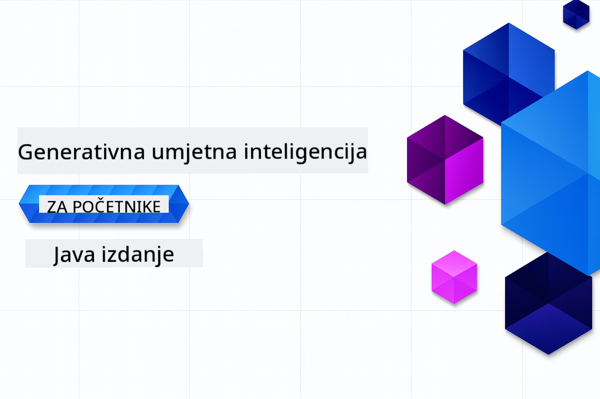

<!--
CO_OP_TRANSLATOR_METADATA:
{
  "original_hash": "459109e7c925f3a7b94440ad61c596a0",
  "translation_date": "2026-01-05T09:54:13+00:00",
  "source_file": "README.md",
  "language_code": "hr"
}
-->
# Generativna AI za Početnike - Java Izdanje
[](https://discord.gg/nTYy5BXMWG)



**Vrijeme Ulaganja**: Cijeli radionicu moguće je dovršiti online bez lokalne instalacije. Postavljanje okruženja traje 2 minute, dok istraživanje primjera zahtijeva 1-3 sata ovisno o dubini istraživanja.

> **Brzi Početak** 

1. Forkajte ovaj repozitorij na svoj GitHub račun
2. Kliknite **Code** → karticu **Codespaces** → **...** → **New with options...**
3. Koristite zadane postavke – ovo će odabrati razvojni kontejner kreiran za ovaj tečaj
4. Kliknite **Create codespace**
5. Pričekajte ~2 minute da se okruženje pripremi
6. Odmah prijeđite na [Prvi primjer](./02-SetupDevEnvironment/README.md#step-2-create-a-github-personal-access-token)

> **Više volite klonirati lokalno?**
>
> Ovaj repozitorij uključuje 50+ prijevoda na različite jezike što značajno povećava veličinu preuzimanja. Za kloniranje bez prijevoda, koristite sparse checkout:
> ```bash
> git clone --filter=blob:none --sparse https://github.com/microsoft/Generative-AI-for-beginners-java.git
> cd Generative-AI-for-beginners-java
> git sparse-checkout set --no-cone '/*' '!translations' '!translated_images'
> ```
> Ovo vam daje sve što vam treba za završetak tečaja uz znatno brže preuzimanje.


## Podrška za Više Jezika

### Podržano putem GitHub Akcije (Automatski & Uvijek ažurno)

<!-- CO-OP TRANSLATOR LANGUAGES TABLE START -->
[Arapski](../ar/README.md) | [Bengalski](../bn/README.md) | [Bugarski](../bg/README.md) | [Burmese (Myanmar)](../my/README.md) | [Kineski (Pojednostavljeni)](../zh/README.md) | [Kineski (Tradicionalni, Hong Kong)](../hk/README.md) | [Kineski (Tradicionalni, Macau)](../mo/README.md) | [Kineski (Tradicionalni, Taiwan)](../tw/README.md) | [Hrvatski](./README.md) | [Češki](../cs/README.md) | [Danski](../da/README.md) | [Nizozemski](../nl/README.md) | [Estonski](../et/README.md) | [Finski](../fi/README.md) | [Francuski](../fr/README.md) | [Njemački](../de/README.md) | [Grčki](../el/README.md) | [Hebrejski](../he/README.md) | [Hindi](../hi/README.md) | [Mađarski](../hu/README.md) | [Indonezijski](../id/README.md) | [Talijanski](../it/README.md) | [Japanski](../ja/README.md) | [Kannada](../kn/README.md) | [Korejski](../ko/README.md) | [Litavski](../lt/README.md) | [Malajski](../ms/README.md) | [Malajalamski](../ml/README.md) | [Marati](../mr/README.md) | [Nepalski](../ne/README.md) | [Nigerijski Pidgin](../pcm/README.md) | [Norveški](../no/README.md) | [Perzijski (Farsi)](../fa/README.md) | [Poljski](../pl/README.md) | [Portugalski (Brazil)](../br/README.md) | [Portugalski (Portugal)](../pt/README.md) | [Punjabi (Gurmukhi)](../pa/README.md) | [Rumunjski](../ro/README.md) | [Ruski](../ru/README.md) | [Srpski (ćirilica)](../sr/README.md) | [Slovački](../sk/README.md) | [Slovenski](../sl/README.md) | [Španjolski](../es/README.md) | [Svahili](../sw/README.md) | [Švedski](../sv/README.md) | [Tagalog (Filipinski)](../tl/README.md) | [Tamilski](../ta/README.md) | [Telugu](../te/README.md) | [Tajlandski](../th/README.md) | [Turski](../tr/README.md) | [Ukrajinski](../uk/README.md) | [Urdu](../ur/README.md) | [Vijetnamski](../vi/README.md)

> **Više volite klonirati lokalno?**

> Ovaj repozitorij uključuje 50+ prijevoda na različite jezike što značajno povećava veličinu preuzimanja. Za kloniranje bez prijevoda, koristite sparse checkout:
> ```bash
> git clone --filter=blob:none --sparse https://github.com/microsoft/Generative-AI-for-beginners-java.git
> cd Generative-AI-for-beginners-java
> git sparse-checkout set --no-cone '/*' '!translations' '!translated_images'
> ```
> Ovo vam daje sve što vam treba za završetak tečaja uz znatno brže preuzimanje.
<!-- CO-OP TRANSLATOR LANGUAGES TABLE END -->

## Struktura Tečaja & Put Učenja

### **Poglavlje 1: Uvod u Generativnu AI**
- **Osnovni Pojmovi**: Razumijevanje Velikih Jezičnih Modela, tokena, ureza i AI sposobnosti
- **Java AI Ekosustav**: Pregled Spring AI i OpenAI SDK-ova
- **Protokol Konteksta Modela**: Uvod u MCP i njegovu ulogu u komunikaciji AI agenata
- **Praktične Primjene**: Stvarni scenariji uključujući chatbotove i generiranje sadržaja
- **[→ Početak Poglavlja 1](./01-IntroToGenAI/README.md)**

### **Poglavlje 2: Postavljanje Razvojnog Okruženja**
- **Konfiguracija Više Pružatelja**: Postavljanje GitHub Models, Azure OpenAI i OpenAI Java SDK integracija
- **Spring Boot + Spring AI**: Najbolje prakse za razvoj poslovnih AI aplikacija
- **GitHub Models**: Besplatan pristup AI modelima za prototipiranje i učenje (nije potrebna kreditna kartica)
- **Razvojni Alati**: Docker kontejneri, VS Code i GitHub Codespaces konfiguracija
- **[→ Početak Poglavlja 2](./02-SetupDevEnvironment/README.md)**

### **Poglavlje 3: Osnovne Tehnike Generativne AI**
- **Inženjerstvo Prompta**: Tehnike za optimalne odgovore AI modela
- **Urezi i Vektorske Operacije**: Implementacija semantičkog pretraživanja i podudaranja sličnosti
- **Generiranje s Pomoći Dohvaćanja (RAG)**: Kombinacija AI-a s vlastitim izvorima podataka
- **Pozivanje Funkcija**: Proširenje AI mogućnosti prilagođenim alatima i dodacima
- **[→ Početak Poglavlja 3](./03-CoreGenerativeAITechniques/README.md)**

### **Poglavlje 4: Praktične Primjene & Projekti**
- **Generator Priča o Kućnim Ljubimcima** (`petstory/`): Kreativno generiranje sadržaja s GitHub Models
- **Foundry Lokalna Demo Verzija** (`foundrylocal/`): Lokalna integracija AI modela s OpenAI Java SDK
- **MCP Kalkulator Servis** (`calculator/`): Osnovna implementacija Protokola Konteksta Modela sa Spring AI
- **[→ Početak Poglavlja 4](./04-PracticalSamples/README.md)**

### **Poglavlje 5: Odgovorni Razvoj AI**
- **Sigurnost GitHub Models**: Testiranje ugrađenih mehanizama filtriranja sadržaja i sigurnosnih mjera (čvrste blokade i mekana odbijanja)
- **Demo Odgovorne AI**: Praktični primjer kako suvremeni sigurnosni sustavi AI-a funkcioniraju
- **Najbolje Prakse**: Osnovne smjernice za etički razvoj i implementaciju AI
- **[→ Početak Poglavlja 5](./05-ResponsibleGenAI/README.md)**

## Dodatni Resursi

<!-- CO-OP TRANSLATOR OTHER COURSES START -->
### LangChain
[](https://aka.ms/langchain4j-for-beginners)
[](https://aka.ms/langchainjs-for-beginners?WT.mc_id=m365-94501-dwahlin)

---

### Azure / Edge / MCP / Agenti
[](https://github.com/microsoft/AZD-for-beginners?WT.mc_id=academic-105485-koreyst)
[](https://github.com/microsoft/edgeai-for-beginners?WT.mc_id=academic-105485-koreyst)
[](https://github.com/microsoft/mcp-for-beginners?WT.mc_id=academic-105485-koreyst)
[](https://github.com/microsoft/ai-agents-for-beginners?WT.mc_id=academic-105485-koreyst)

---
 
### Serija Generativne AI
[](https://github.com/microsoft/generative-ai-for-beginners?WT.mc_id=academic-105485-koreyst)
[-9333EA?style=for-the-badge&labelColor=E5E7EB&color=9333EA)](https://github.com/microsoft/Generative-AI-for-beginners-dotnet?WT.mc_id=academic-105485-koreyst)
[-C084FC?style=for-the-badge&labelColor=E5E7EB&color=C084FC)](https://github.com/microsoft/generative-ai-for-beginners-java?WT.mc_id=academic-105485-koreyst)
[-E879F9?style=for-the-badge&labelColor=E5E7EB&color=E879F9)](https://github.com/microsoft/generative-ai-with-javascript?WT.mc_id=academic-105485-koreyst)

---
 
### Temeljno Učenje
[](https://aka.ms/ml-beginners?WT.mc_id=academic-105485-koreyst)
[](https://aka.ms/datascience-beginners?WT.mc_id=academic-105485-koreyst)
[](https://aka.ms/ai-beginners?WT.mc_id=academic-105485-koreyst)
[](https://github.com/microsoft/Security-101?WT.mc_id=academic-96948-sayoung)
[](https://aka.ms/webdev-beginners?WT.mc_id=academic-105485-koreyst)

[](https://aka.ms/iot-beginners?WT.mc_id=academic-105485-koreyst)
[](https://github.com/microsoft/xr-development-for-beginners?WT.mc_id=academic-105485-koreyst)

---
 
### Serija Copilot
[](https://aka.ms/GitHubCopilotAI?WT.mc_id=academic-105485-koreyst)
[](https://github.com/microsoft/mastering-github-copilot-for-dotnet-csharp-developers?WT.mc_id=academic-105485-koreyst)
[](https://github.com/microsoft/CopilotAdventures?WT.mc_id=academic-105485-koreyst)
<!-- CO-OP TRANSLATOR OTHER COURSES END -->

## Dobivanje pomoći

Ako zapnete ili imate bilo kakvih pitanja oko izgradnje AI aplikacija. Pridružite se kolegama učenicima i iskusnim programerima u raspravama o MCP-u. To je podržavajuća zajednica u kojoj su pitanja dobrodošla i gdje se znanje slobodno dijeli.

[](https://discord.gg/nTYy5BXMWG)

Ako imate povratnu informaciju o proizvodu ili pogreške tijekom izgradnje, posjetite:

[](https://aka.ms/foundry/forum)

---

<!-- CO-OP TRANSLATOR DISCLAIMER START -->
**Odricanje od odgovornosti**:
Ovaj dokument preveden je korištenjem AI prevoditeljske usluge [Co-op Translator](https://github.com/Azure/co-op-translator). Iako činimo napore da prijevod bude točan, imajte na umu da automatizirani prijevodi mogu sadržavati pogreške ili netočnosti. Izvorni dokument na izvornom jeziku treba smatrati autoritativnim izvorom. Za kritične informacije preporučuje se profesionalni ljudski prijevod. Ne snosimo odgovornost za eventualne nesporazume ili kriva tumačenja koja proizlaze iz korištenja ovog prijevoda.
<!-- CO-OP TRANSLATOR DISCLAIMER END -->