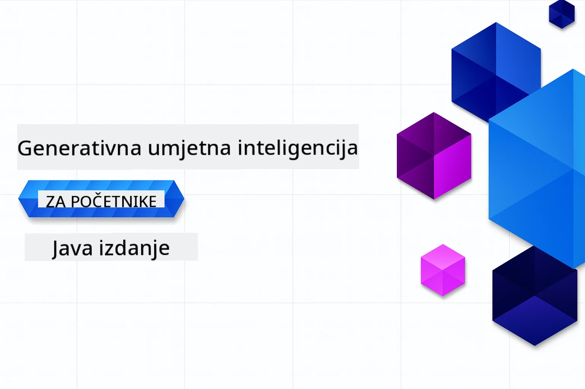

# Generativna umjetna inteligencija za početnike - Java izdanje
[](https://discord.gg/nTYy5BXMWG)



**Vrijeme potrebno**: Cijeli radni je moguće završiti online bez lokalne instalacije. Postavljanje okruženja traje 2 minute, a istraživanje primjera zahtijeva 1-3 sata, ovisno o dubini istraživanja.

> **Brzi početak** 

1. Napravite fork ovog repozitorija na svoj GitHub račun
2. Kliknite **Code** → **Codespaces** tab → **...** → **New with options...**
3. Koristite zadane postavke – ovo će odabrati razvojni kontejner kreiran za ovaj tečaj
4. Kliknite **Create codespace**
5. Pričekajte ~2 minute da se okruženje pripremi
6. Idite direktno na [Prvi primjer](./02-SetupDevEnvironment/README.md#step-2-create-a-github-personal-access-token)

## Podrška za više jezika

### Podržano putem GitHub Actiona (Automatizirano i uvijek ažurirano)

<!-- CO-OP TRANSLATOR LANGUAGES TABLE START -->
[Arabic](../ar/README.md) | [Bengali](../bn/README.md) | [Bulgarian](../bg/README.md) | [Burmese (Myanmar)](../my/README.md) | [Chinese (Simplified)](../zh-CN/README.md) | [Chinese (Traditional, Hong Kong)](../zh-HK/README.md) | [Chinese (Traditional, Macau)](../zh-MO/README.md) | [Chinese (Traditional, Taiwan)](../zh-TW/README.md) | [Croatian](./README.md) | [Czech](../cs/README.md) | [Danish](../da/README.md) | [Dutch](../nl/README.md) | [Estonian](../et/README.md) | [Finnish](../fi/README.md) | [French](../fr/README.md) | [German](../de/README.md) | [Greek](../el/README.md) | [Hebrew](../he/README.md) | [Hindi](../hi/README.md) | [Hungarian](../hu/README.md) | [Indonesian](../id/README.md) | [Italian](../it/README.md) | [Japanese](../ja/README.md) | [Kannada](../kn/README.md) | [Khmer](../km/README.md) | [Korean](../ko/README.md) | [Lithuanian](../lt/README.md) | [Malay](../ms/README.md) | [Malayalam](../ml/README.md) | [Marathi](../mr/README.md) | [Nepali](../ne/README.md) | [Nigerian Pidgin](../pcm/README.md) | [Norwegian](../no/README.md) | [Persian (Farsi)](../fa/README.md) | [Polish](../pl/README.md) | [Portuguese (Brazil)](../pt-BR/README.md) | [Portuguese (Portugal)](../pt-PT/README.md) | [Punjabi (Gurmukhi)](../pa/README.md) | [Romanian](../ro/README.md) | [Russian](../ru/README.md) | [Serbian (Cyrillic)](../sr/README.md) | [Slovak](../sk/README.md) | [Slovenian](../sl/README.md) | [Spanish](../es/README.md) | [Swahili](../sw/README.md) | [Swedish](../sv/README.md) | [Tagalog (Filipino)](../tl/README.md) | [Tamil](../ta/README.md) | [Telugu](../te/README.md) | [Thai](../th/README.md) | [Turkish](../tr/README.md) | [Ukrainian](../uk/README.md) | [Urdu](../ur/README.md) | [Vietnamese](../vi/README.md)

> **Preferirate li klonirati lokalno?**
>
> Ovaj repozitorij uključuje prijevode na više od 50 jezika što značajno povećava veličinu preuzimanja. Za kloniranje bez prijevoda, koristite sparse checkout:
>
> **Bash / macOS / Linux:**
> ```bash
> git clone --filter=blob:none --sparse https://github.com/microsoft/Generative-AI-for-beginners-java.git
> cd Generative-AI-for-beginners-java
> git sparse-checkout set --no-cone '/*' '!translations' '!translated_images'
> ```
>
> **CMD (Windows):**
> ```cmd
> git clone --filter=blob:none --sparse https://github.com/microsoft/Generative-AI-for-beginners-java.git
> cd Generative-AI-for-beginners-java
> git sparse-checkout set --no-cone "/*" "!translations" "!translated_images"
> ```
>
> Ovo vam daje sve potrebno za dovršetak tečaja uz znatno brže preuzimanje.
<!-- CO-OP TRANSLATOR LANGUAGES TABLE END -->

## Struktura tečaja i put učenja

### **Poglavlje 1: Uvod u generativnu umjetnu inteligenciju**
- **Osnovni pojmovi**: Razumijevanje velikih jezičnih modela, tokena, ugradnji i mogućnosti umjetne inteligencije
- **Java AI ekosustav**: Pregled Spring AI i OpenAI SDK-ova
- **Protokol konteksta modela**: Uvod u MCP i njegovu ulogu u komunikaciji AI agenata
- **Praktične primjene**: Stvarni scenariji uključujući chatbotove i generiranje sadržaja
- **[→ Započni poglavlje 1](./01-IntroToGenAI/README.md)**

### **Poglavlje 2: Postavljanje razvojnog okruženja**
- **Konfiguracija više pružatelja**: Postavljanje integracija s GitHub Models, Azure OpenAI i OpenAI Java SDK-om
- **Spring Boot + Spring AI**: Najbolje prakse za razvoj AI aplikacija u poduzeću
- **GitHub Models**: Besplatan pristup AI modelima za prototipiziranje i učenje (nije potrebna kreditna kartica)
- **Razvojni alati**: Docker kontejneri, VS Code i konfiguracija GitHub Codespaces
- **[→ Započni poglavlje 2](./02-SetupDevEnvironment/README.md)**

### **Poglavlje 3: Temeljne tehnike generativne umjetne inteligencije**
- **Prompt inženjering**: Tehnike za optimalne odgovore AI modela
- **Ugradnje i vektorske operacije**: Implementacija semantičkog pretraživanja i pronalaženja sličnosti
- **Generiranje uz nadopunu pretraživanjem (RAG)**: Kombinirajte AI s vlastitim izvorima podataka
- **Pozivanje funkcija**: Proširite AI funkcionalnosti prilagođenim alatima i dodacima
- **[→ Započni poglavlje 3](./03-CoreGenerativeAITechniques/README.md)**

### **Poglavlje 4: Praktične primjene i projekti**
- **Generator priča o kućnim ljubimcima** (`petstory/`): Kreativno generiranje sadržaja s GitHub Models
- **Localna Foundry demonstracija** (`foundrylocal/`): Lokalna integracija AI modela s OpenAI Java SDK
- **MCP kalkulator usluga** (`calculator/`): Osnovna implementacija Model Context Protocola sa Spring AI
- **[→ Započni poglavlje 4](./04-PracticalSamples/README.md)**

### **Poglavlje 5: Odgovorni razvoj umjetne inteligencije**
- **Sigurnost GitHub Models**: Testiranje ugrađenog filtriranja sadržaja i sigurnosnih mehanizama (čvrste blokade i mekani odbijanja)
- **Demonstracija odgovorne AI**: Praktični primjer kako moderni sigurnosni sustavi umjetne inteligencije funkcioniraju
- **Najbolje prakse**: Ključne smjernice za etički razvoj i implementaciju AI
- **[→ Započni poglavlje 5](./05-ResponsibleGenAI/README.md)**

## Dodatni resursi

<!-- CO-OP TRANSLATOR OTHER COURSES START -->
### LangChain
[](https://aka.ms/langchain4j-for-beginners)
[](https://aka.ms/langchainjs-for-beginners?WT.mc_id=m365-94501-dwahlin)
[](https://github.com/microsoft/langchain-for-beginners?WT.mc_id=m365-94501-dwahlin)
---

### Azure / Edge / MCP / Agenti
[](https://github.com/microsoft/AZD-for-beginners?WT.mc_id=academic-105485-koreyst)
[](https://github.com/microsoft/edgeai-for-beginners?WT.mc_id=academic-105485-koreyst)
[](https://github.com/microsoft/mcp-for-beginners?WT.mc_id=academic-105485-koreyst)
[](https://github.com/microsoft/ai-agents-for-beginners?WT.mc_id=academic-105485-koreyst)

---
 
### Serija generativne AI
[](https://github.com/microsoft/generative-ai-for-beginners?WT.mc_id=academic-105485-koreyst)
[-9333EA?style=for-the-badge&labelColor=E5E7EB&color=9333EA)](https://github.com/microsoft/Generative-AI-for-beginners-dotnet?WT.mc_id=academic-105485-koreyst)
[-C084FC?style=for-the-badge&labelColor=E5E7EB&color=C084FC)](https://github.com/microsoft/generative-ai-for-beginners-java?WT.mc_id=academic-105485-koreyst)
[-E879F9?style=for-the-badge&labelColor=E5E7EB&color=E879F9)](https://github.com/microsoft/generative-ai-with-javascript?WT.mc_id=academic-105485-koreyst)

---
 
### Temeljno učenje
[](https://aka.ms/ml-beginners?WT.mc_id=academic-105485-koreyst)
[](https://aka.ms/datascience-beginners?WT.mc_id=academic-105485-koreyst)
[](https://aka.ms/ai-beginners?WT.mc_id=academic-105485-koreyst)
[](https://github.com/microsoft/Security-101?WT.mc_id=academic-96948-sayoung)

[](https://aka.ms/webdev-beginners?WT.mc_id=academic-105485-koreyst)
[](https://aka.ms/iot-beginners?WT.mc_id=academic-105485-koreyst)
[](https://github.com/microsoft/xr-development-for-beginners?WT.mc_id=academic-105485-koreyst)

---
 
### Serija Copilot
[](https://aka.ms/GitHubCopilotAI?WT.mc_id=academic-105485-koreyst)
[](https://github.com/microsoft/mastering-github-copilot-for-dotnet-csharp-developers?WT.mc_id=academic-105485-koreyst)
[](https://github.com/microsoft/CopilotAdventures?WT.mc_id=academic-105485-koreyst)
<!-- CO-OP TRANSLATOR OTHER COURSES END -->

## Dobivanje pomoći

Ako zapnete ili imate bilo kakvih pitanja o izradi AI aplikacija. Pridružite se kolegama učenicima i iskusnim programerima u raspravama o MCP-u. To je poticajna zajednica u kojoj su pitanja dobrodošla i znanje se slobodno dijeli.

[](https://discord.gg/nTYy5BXMWG)

Ako imate povratne informacije o proizvodu ili prijavite pogreške tijekom izrade, posjetite:

[](https://aka.ms/foundry/forum)

---

<!-- CO-OP TRANSLATOR DISCLAIMER START -->
**Odricanje od odgovornosti**:  
Ovaj dokument preveden je pomoću AI usluge prevođenja [Co-op Translator](https://github.com/Azure/co-op-translator). Iako težimo točnosti, imajte na umu da automatski prijevodi mogu sadržavati pogreške ili netočnosti. Izvorni dokument na izvornom jeziku treba smatrati autoritativnim izvorom. Za kritične informacije preporučuje se profesionalni ljudski prijevod. Nismo odgovorni za bilo kakva nesporazuma ili kriva tumačenja nastala korištenjem ovog prijevoda.
<!-- CO-OP TRANSLATOR DISCLAIMER END -->