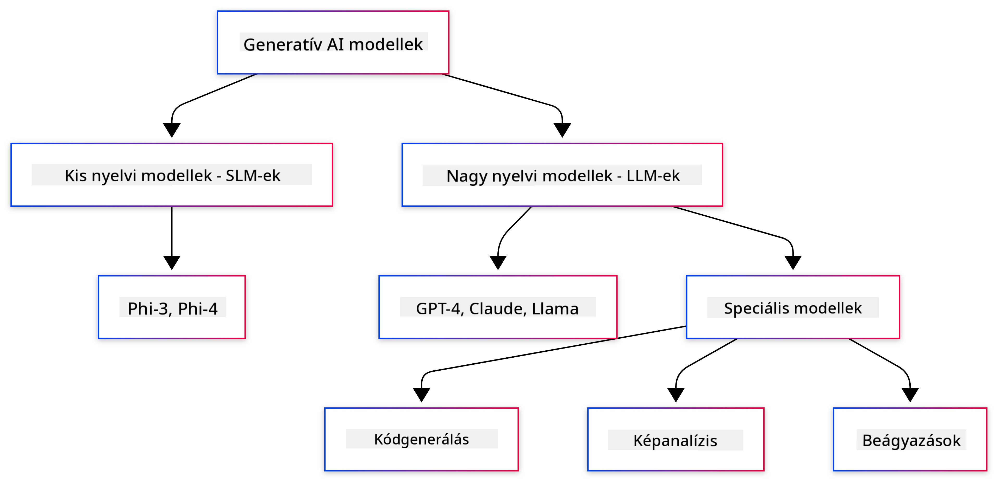
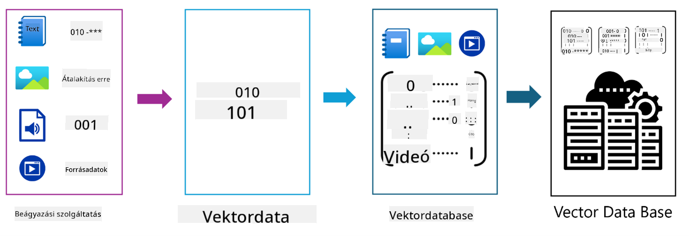

<!--
CO_OP_TRANSLATOR_METADATA:
{
  "original_hash": "006866db93a268a8769bb55f2e324291",
  "translation_date": "2025-07-28T11:06:38+00:00",
  "source_file": "01-IntroToGenAI/README.md",
  "language_code": "hu"
}
-->
# Bevezetés a Generatív MI-be - Java kiadás

## Amit megtanulsz

- **Generatív MI alapok**, beleértve az LLM-eket, prompt tervezést, tokeneket, beágyazásokat és vektoralapú adatbázisokat
- **Java MI fejlesztői eszközök összehasonlítása**, mint az Azure OpenAI SDK, Spring AI és OpenAI Java SDK
- **Fedezd fel a Model Context Protocol-t**, és annak szerepét az MI ügynökök kommunikációjában

## Tartalomjegyzék

- [Bevezetés](../../../01-IntroToGenAI)
- [Gyors áttekintés a generatív MI fogalmakról](../../../01-IntroToGenAI)
- [Prompt tervezés áttekintése](../../../01-IntroToGenAI)
- [Tokenek, beágyazások és ügynökök](../../../01-IntroToGenAI)
- [MI fejlesztői eszközök és könyvtárak Java-hoz](../../../01-IntroToGenAI)
  - [OpenAI Java SDK](../../../01-IntroToGenAI)
  - [Spring AI](../../../01-IntroToGenAI)
  - [Azure OpenAI Java SDK](../../../01-IntroToGenAI)
- [Összefoglalás](../../../01-IntroToGenAI)
- [Következő lépések](../../../01-IntroToGenAI)

## Bevezetés

Üdvözlünk a Generatív MI kezdőknek - Java kiadás első fejezetében! Ez az alapozó lecke bemutatja a generatív MI alapfogalmait, és azt, hogyan dolgozhatsz velük Java segítségével. Megismered az MI alkalmazások alapvető építőelemeit, mint például a Nagy Nyelvi Modellek (LLM-ek), tokenek, beágyazások és MI ügynökök. Emellett felfedezzük azokat a Java eszközöket, amelyeket a kurzus során használni fogsz.

### Gyors áttekintés a generatív MI fogalmakról

A generatív MI olyan mesterséges intelligencia, amely új tartalmat hoz létre, például szöveget, képeket vagy kódot, az adatokból tanult minták és kapcsolatok alapján. A generatív MI modellek képesek emberi-szerű válaszokat generálni, megérteni a kontextust, és néha olyan tartalmat létrehozni, amely emberi-szerűnek tűnik.

Java MI alkalmazások fejlesztése során generatív MI modellekkel fogsz dolgozni, hogy tartalmat hozz létre. A generatív MI modellek néhány képessége:

- **Szöveg generálás**: Emberi-szerű szövegek készítése chatbotokhoz, tartalomhoz és szövegkiegészítéshez.
- **Kép generálás és elemzés**: Valósághű képek létrehozása, fotók javítása és objektumok felismerése.
- **Kód generálás**: Kódrészletek vagy szkriptek írása.

Vannak olyan modellek, amelyek különböző feladatokra optimalizáltak. Például a **Kis Nyelvi Modellek (SLM-ek)** és a **Nagy Nyelvi Modellek (LLM-ek)** is képesek szöveg generálására, de az LLM-ek általában jobb teljesítményt nyújtanak összetett feladatok esetén. Képhez kapcsolódó feladatokhoz pedig speciális látásmodelleket vagy multimodális modelleket használnál.

Természetesen ezeknek a modelleknek a válaszai nem mindig tökéletesek. Valószínűleg hallottál már arról, hogy a modellek "hallucinálnak", vagyis helytelen információt generálnak meggyőző módon. Azonban segíthetsz a modellnek jobb válaszokat generálni, ha világos utasításokat és kontextust adsz neki. Itt jön képbe a **prompt tervezés**.

#### Prompt tervezés áttekintése

A prompt tervezés az a gyakorlat, amely során hatékony bemeneteket tervezünk, hogy az MI modelleket a kívánt kimenetek felé irányítsuk. Ez magában foglalja:

- **Világosság**: Az utasítások egyértelművé és félreérthetetlenné tétele.
- **Kontextus**: Szükséges háttérinformációk biztosítása.
- **Korlátok**: Bármilyen korlátozás vagy formátum megadása.

A prompt tervezés legjobb gyakorlatai közé tartozik a prompt kialakítása, világos utasítások, feladatok lebontása, egy-shot és néhány-shot tanulás, valamint prompt finomhangolás. Különböző promtokat tesztelni elengedhetetlen, hogy megtaláld, mi működik a legjobban az adott felhasználási esetben.

Alkalmazások fejlesztésekor különböző prompt típusokkal fogsz dolgozni:
- **Rendszer promtok**: Meghatározzák a modell viselkedésének alapvető szabályait és kontextusát.
- **Felhasználói promtok**: Az alkalmazás felhasználóitól származó bemeneti adatok.
- **Asszisztens promtok**: A modell válaszai a rendszer és felhasználói promtok alapján.

> **További információ**: Tudj meg többet a prompt tervezésről a [Generatív MI kezdőknek kurzus Prompt Tervezés fejezetében](https://github.com/microsoft/generative-ai-for-beginners/tree/main/04-prompt-engineering-fundamentals)

#### Tokenek, beágyazások és ügynökök

Generatív MI modellekkel dolgozva olyan fogalmakkal találkozol, mint **tokenek**, **beágyazások**, **ügynökök** és **Model Context Protocol (MCP)**. Íme ezek részletes áttekintése:

- **Tokenek**: A tokenek a szöveg legkisebb egységei a modellben. Lehetnek szavak, karakterek vagy szóelemek. A tokenek a szövegadatokat olyan formátumba alakítják, amelyet a modell megérthet. Például a "The quick brown fox jumped over the lazy dog" mondat tokenizálva lehet ["The", " quick", " brown", " fox", " jumped", " over", " the", " lazy", " dog"] vagy ["The", " qu", "ick", " br", "own", " fox", " jump", "ed", " over", " the", " la", "zy", " dog"] a tokenizálási stratégiától függően.

A tokenizálás az a folyamat, amely során a szöveget ezekre a kisebb egységekre bontják. Ez kulcsfontosságú, mivel a modellek tokenekkel dolgoznak, nem nyers szöveggel. A promptban lévő tokenek száma befolyásolja a modell válaszának hosszát és minőségét, mivel a modelleknek tokenkorlátja van a kontextusablakukban (pl. 128K token a GPT-4o teljes kontextusában, beleértve a bemenetet és a kimenetet).

  Java-ban az OpenAI SDK-t használhatod a tokenizálás automatikus kezelésére, amikor kéréseket küldesz az MI modelleknek.

- **Beágyazások**: A beágyazások a tokenek vektoros reprezentációi, amelyek szemantikai jelentést hordoznak. Ezek numerikus reprezentációk (általában lebegőpontos számok tömbjei), amelyek lehetővé teszik a modellek számára, hogy megértsék a szavak közötti kapcsolatokat, és kontextuálisan releváns válaszokat generáljanak. Hasonló szavak hasonló beágyazásokkal rendelkeznek, lehetővé téve a modell számára, hogy megértse például a szinonimákat és szemantikai kapcsolatokat.

  Java-ban beágyazásokat generálhatsz az OpenAI SDK vagy más könyvtárak segítségével, amelyek támogatják a beágyazás generálását. Ezek a beágyazások elengedhetetlenek olyan feladatokhoz, mint a szemantikai keresés, ahol a jelentés alapján szeretnél hasonló tartalmat találni, nem pedig pontos szöveg egyezések alapján.

- **Vektoralapú adatbázisok**: A vektoralapú adatbázisok olyan speciális tárolórendszerek, amelyek optimalizáltak a beágyazások számára. Hatékony hasonlósági keresést tesznek lehetővé, és kulcsfontosságúak a Retrieval-Augmented Generation (RAG) mintákhoz, ahol nagy adathalmazokból szemantikai hasonlóság alapján kell releváns információt találni, nem pedig pontos egyezések alapján.

> **Megjegyzés**: Ebben a kurzusban nem térünk ki a vektoralapú adatbázisokra, de érdemes megemlíteni őket, mivel gyakran használják őket valós alkalmazásokban.

- **Ügynökök és MCP**: MI komponensek, amelyek önállóan lépnek kapcsolatba modellekkel, eszközökkel és külső rendszerekkel. A Model Context Protocol (MCP) szabványosított módot biztosít az ügynökök számára, hogy biztonságosan hozzáférjenek külső adatforrásokhoz és eszközökhöz. Tudj meg többet a [MCP kezdőknek](https://github.com/microsoft/mcp-for-beginners) kurzusban.

Java MI alkalmazásokban tokeneket használsz szövegfeldolgozáshoz, beágyazásokat szemantikai kereséshez és RAG-hoz, vektoralapú adatbázisokat adatlekérdezéshez, valamint ügynököket MCP-vel intelligens, eszközhasználó rendszerek építéséhez.

### MI fejlesztői eszközök és könyvtárak Java-hoz

Java kiváló eszközöket kínál az MI fejlesztéshez. Három fő könyvtárat fogunk felfedezni a kurzus során - OpenAI Java SDK, Azure OpenAI SDK és Spring AI.

Íme egy gyors referencia táblázat, amely megmutatja, melyik SDK-t használjuk az egyes fejezetek példáiban:

| Fejezet | Példa | SDK |
|---------|-------|-----|
| 02-SetupDevEnvironment | github-models | OpenAI Java SDK |
| 02-SetupDevEnvironment | basic-chat-azure | Spring AI Azure OpenAI |
| 03-CoreGenerativeAITechniques | példák | Azure OpenAI SDK |
| 04-PracticalSamples | petstory | OpenAI Java SDK |
| 04-PracticalSamples | foundrylocal | OpenAI Java SDK |
| 04-PracticalSamples | calculator | Spring AI MCP SDK + LangChain4j |

**SDK dokumentációs linkek:**
- [Azure OpenAI Java SDK](https://github.com/Azure/azure-sdk-for-java/tree/azure-ai-openai_1.0.0-beta.16/sdk/openai/azure-ai-openai)
- [Spring AI](https://docs.spring.io/spring-ai/reference/)
- [OpenAI Java SDK](https://github.com/openai/openai-java)
- [LangChain4j](https://docs.langchain4j.dev/)

#### OpenAI Java SDK

Az OpenAI SDK az OpenAI API hivatalos Java könyvtára. Egyszerű és következetes interfészt biztosít az OpenAI modellekkel való interakcióhoz, megkönnyítve az MI képességek integrálását Java alkalmazásokba. A 2. fejezet GitHub Models példája, a 4. fejezet Pet Story alkalmazása és Foundry Local példája bemutatja az OpenAI SDK megközelítést.

#### Spring AI

A Spring AI egy átfogó keretrendszer, amely MI képességeket hoz a Spring alkalmazásokba, következetes absztrakciós réteget biztosítva különböző MI szolgáltatók között. Zökkenőmentesen integrálódik a Spring ökoszisztémába, így ideális választás vállalati Java alkalmazásokhoz, amelyek MI képességeket igényelnek.

A Spring AI erőssége a Spring ökoszisztémával való zökkenőmentes integrációban rejlik, megkönnyítve a gyártásra kész MI alkalmazások építését a Spring minták, például függőség injektálás, konfigurációkezelés és tesztelési keretrendszerek segítségével. A 2. és 4. fejezetben a Spring AI-t fogod használni olyan alkalmazások építéséhez, amelyek az OpenAI-t és a Model Context Protocol (MCP) Spring AI könyvtárakat használják.

##### Model Context Protocol (MCP)

A [Model Context Protocol (MCP)](https://modelcontextprotocol.io/) egy feltörekvő szabvány, amely lehetővé teszi az MI alkalmazások számára, hogy biztonságosan lépjenek kapcsolatba külső adatforrásokkal és eszközökkel. Az MCP szabványosított módot biztosít az MI modellek számára, hogy hozzáférjenek kontextuális információkhoz és végrehajtsanak műveleteket az alkalmazásokban.

A 4. fejezetben egy egyszerű MCP kalkulátor szolgáltatást fogsz építeni, amely bemutatja a Model Context Protocol alapjait a Spring AI segítségével, megmutatva, hogyan hozhatsz létre alapvető eszközintegrációkat és szolgáltatásarchitektúrákat.

#### Azure OpenAI Java SDK

Az Azure OpenAI Java kliens könyvtár az OpenAI REST API-k adaptációja, amely idiomatikus interfészt és integrációt biztosít az Azure SDK ökoszisztémával. A 3. fejezetben olyan alkalmazásokat fogsz építeni, amelyek az Azure OpenAI SDK-t használják, beleértve chat alkalmazásokat, funkcióhívásokat és RAG (Retrieval-Augmented Generation) mintákat.

> Megjegyzés: Az Azure OpenAI SDK elmarad az OpenAI Java SDK mögött funkciók tekintetében, így jövőbeli projektekhez érdemes az OpenAI Java SDK-t használni.

## Összefoglalás

**Gratulálunk!** Sikeresen:

- **Megtanultad a generatív MI alapjait**, beleértve az LLM-eket, prompt tervezést, tokeneket, beágyazásokat és vektoralapú adatbázisokat
- **Összehasonlítottad a Java MI fejlesztői eszközöket**, mint az Azure OpenAI SDK, Spring AI és OpenAI Java SDK
- **Felfedezted a Model Context Protocol-t**, és annak szerepét az MI ügynökök kommunikációjában

## Következő lépések

[2. fejezet: Fejlesztői környezet beállítása](../02-SetupDevEnvironment/README.md)

**Felelősség kizárása**:  
Ez a dokumentum az [Co-op Translator](https://github.com/Azure/co-op-translator) AI fordítási szolgáltatás segítségével lett lefordítva. Bár törekszünk a pontosságra, kérjük, vegye figyelembe, hogy az automatikus fordítások hibákat vagy pontatlanságokat tartalmazhatnak. Az eredeti dokumentum az eredeti nyelvén tekintendő hiteles forrásnak. Kritikus információk esetén javasolt professzionális emberi fordítást igénybe venni. Nem vállalunk felelősséget semmilyen félreértésért vagy téves értelmezésért, amely a fordítás használatából eredhet.