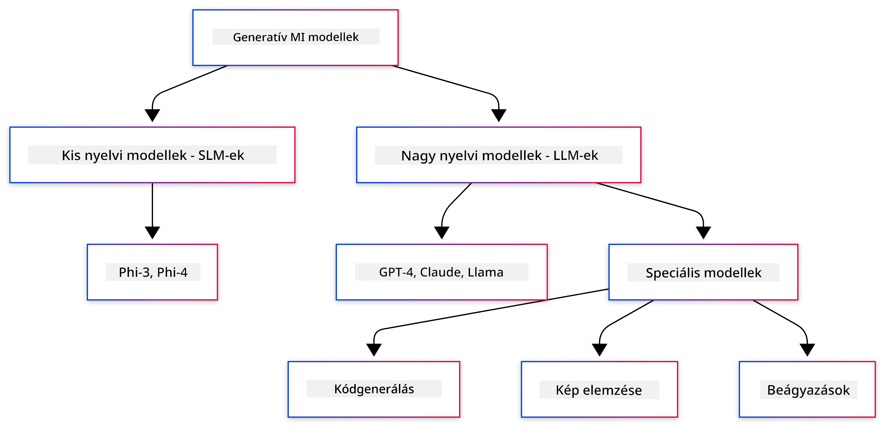
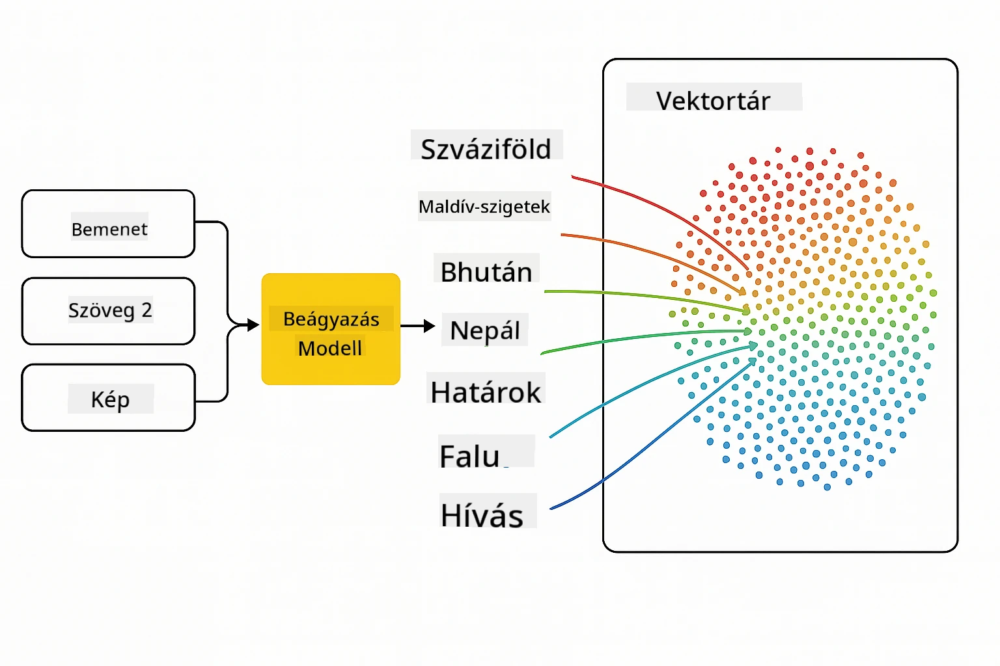
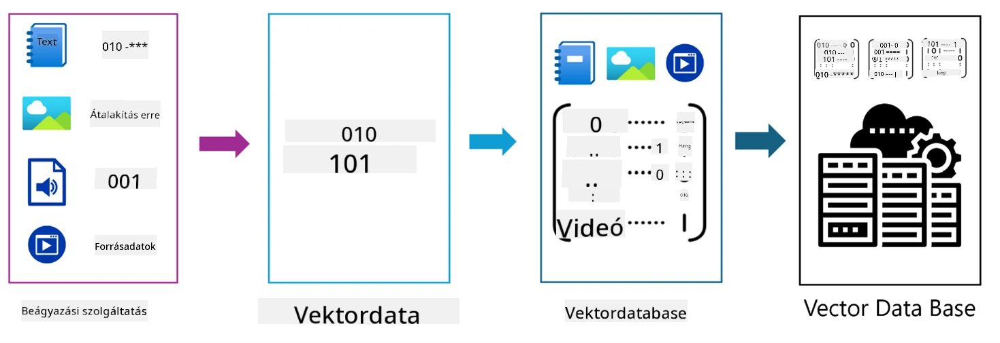
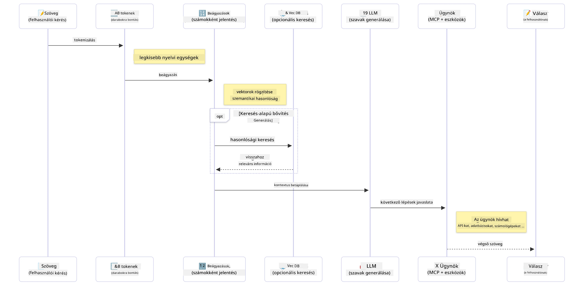

# Generatív mesterséges intelligencia bevezetése – Java kiadás

> **Videó**: [Nézze meg ennek az leckének az áttekintő videóját a YouTube-on.](https://www.youtube.com/watch?v=XH46tGp_eSw) A fenti bélyegképre kattintva is elindítható.

## Amit megtanul

- **Generatív MI alapjai**, beleértve az LLM-eket, prompttervezést, tokeneket, beágyazásokat és vektoralapú adatbázisokat
- **Java MI fejlesztőeszközök összehasonlítása**, beleértve az Azure OpenAI SDK-t, a Spring AI-t és az OpenAI Java SDK-t
- **Ismerkedés a Model Context Protocol-lal** és annak szerepével az MI-ügynökök közötti kommunikációban

## Tartalomjegyzék

- [Bevezetés](#bevezetés)
- [Gyors ismétlés a generatív MI fogalmakról](#gyors-ismétlés-a-generatív-mi-fogalmakról)
- [Prompttervezés áttekintése](#prompttervezés-áttekintése)
- [Tokenek, beágyazások és ügynökök](#tokenek-beágyazások-és-ügynökök)
- [MI Fejlesztőeszközök és könyvtárak Jávához](#mi-fejlesztőeszközök-és-könyvtárak-jávához)
  - [OpenAI Java SDK](#openai-java-sdk)
  - [Spring AI](#spring-ai)
  - [Azure OpenAI Java SDK](#azure-openai-java-sdk)
- [Összefoglaló](#összefoglaló)
- [Következő lépések](#következő-lépések)

## Bevezetés

Üdvözöljük a Generatív MI kezdőknek - Java kiadás első fejezetében! Ez az alapozó lecke bevezeti Önt a generatív MI alapkoncepcióiba és abba, hogyan dolgozhat velük Java nyelven. Megismeri az MI-alkalmazások esszenciális építőelemeit, beleértve a Nagy Nyelvi Modelleket (LLM-ek), tokeneket, beágyazásokat és MI-ügynököket. Emellett áttekintjük a fő Java eszközöket, amelyeket a tanfolyam során használni fog.

### Gyors ismétlés a generatív MI fogalmakról

A generatív MI olyan mesterséges intelligencia, amely új tartalmakat hoz létre, például szöveget, képeket vagy kódot, az adatokból tanult minták és összefüggések alapján. A generatív MI modellek képesek emberihez hasonló válaszokat generálni, megérteni a kontextust, és néha olyan tartalmakat alkotni, amelyek emberinek tűnnek.

Java MI alkalmazásait fejlesztve **generatív MI modellekkel** fog dolgozni a tartalom előállítására. A generatív MI modellek néhány képessége a következő:

- **Szöveg generálása**: Emberihez hasonló chatüzenetek, tartalomkészítés és szöveg kiegészítése.
- **Kép generálás és elemzés**: Realisztikus képek előállítása, fotók javítása és tárgyfelismerés.
- **Kód generálás**: Kódrészletek vagy szkriptek írása.

Vannak kifejezetten meghatározott feladatokra optimalizált modellek. Például mind a **Kis Nyelvi Modellek (SLM-ek)**, mind a **Nagy Nyelvi Modellek (LLM-ek)** kezelhetik a szöveggenerálást, ahol az LLM-ek legtöbbször jobb teljesítményt nyújtanak bonyolultabb feladatoknál. Kép alapú feladatokhoz speciális látásmodelleket vagy multimodális modelleket használunk.

Természetesen ezek a modellek nem mindig adnak tökéletes válaszokat. Valószínűleg hallott már arról, hogy a modellek "hallucinálnak", vagy félrevezető információt generálnak magabiztos hangnemben. Azonban segíthet a modellnek jobb válaszokat adni, ha világos utasításokat és kontextust biztosít számára. Ebben segít a **prompttervezés**.

#### Prompttervezés áttekintése

A prompttervezés az a gyakorlat, amely hatékony bemenetek kialakításából áll, hogy az MI modelleket a kívánt kimenetek felé irányítsa. Ez magában foglalja:

- **Világosság**: Az utasítások egyértelművé és félreérthetetlenné tétele.
- **Kontextus**: Szükséges háttérinformációk megadása.
- **Korlátozások**: Bármilyen megszorítás vagy formátum megadása.

Néhány bevált gyakorlat a prompttervezés során: prompt kialakítása, világos utasítások, feladatfelosztás, egyetlen vagy néhány példás tanulás (one-shot, few-shot learning), valamint prompt finomhangolás. Fontos a különböző promptok tesztelése, hogy megtalálja a legjobban működő megoldást adott feladatánál.

Alkalmazásfejlesztés során többféle prompttal fog dolgozni:
- **Rendszer promptok**: Az alapvető szabályokat és a modell viselkedésének kontextusát állítják be.
- **Felhasználói promptok**: Az alkalmazás használóinak bemeneti adatai.
- **Asszisztens promptok**: A modell válaszai, amelyek a rendszer- és felhasználói promptokra épülnek.

> **További információk**: További részletek a prompttervezésről a [GenAI kezdőknek tanfolyam Prompttervezés fejezetében](https://github.com/microsoft/generative-ai-for-beginners/tree/main/04-prompt-engineering-fundamentals)

#### Tokenek, beágyazások és ügynökök

Generatív MI modellekkel dolgozva találkozni fog az olyan kifejezésekkel, mint **tokenek**, **beágyazások**, **ügynökök** és a **Model Context Protocol (MCP)**. Íme részletes áttekintés ezekről a fogalmakról:

- **Tokenek**: A tokenek a legkisebb szövegegységek egy modell számára. Lehetnek szavak, karakterek vagy szóelemek. A tokeneket arra használják, hogy a szöveget olyan formátumban képviseljék, amelyet a modell képes értelmezni. Például a „The quick brown fox jumped over the lazy dog” mondatot tokenizálhatjuk úgy, hogy ["The", " quick", " brown", " fox", " jumped", " over", " the", " lazy", " dog"] vagy ["The", " qu", "ick", " br", "own", " fox", " jump", "ed", " over", " the", " la", "zy", " dog"] a tokenizálási stratégiától függően.

A tokenizálás a szöveg ilyen kisebb egységekre bontásának folyamata. Ez kulcsfontosságú, mert a modellek tokeneken dolgoznak, nem nyers szövegen. Egy prompt tokenekben mért hossza befolyásolja a modell válaszának hosszát és minőségét, ugyanis a modelleknek van tokenkorlátjuk a kontextusablakban (például GPT-4o összes kontextusára 128K token, beleértve a bemenetet és a kimenetet is).

  Java nyelvben könyvtárakat, például az OpenAI SDK-t használhat a tokenizálás automatikus kezelésére az MI modellek felé történő lekérések során.

- **Beágyazások**: A beágyazások tokenek vektoriális ábrázolásai, amelyek a szemantikai jelentést ragadják meg. Ezek numerikus, tipikusan lebegőpontos számokból álló tömbök, amelyek lehetővé teszik a modellek számára a szavak közti kapcsolatok megértését és releváns válaszok generálását a kontextus alapján. Hasonló szavak hasonló beágyazással rendelkeznek, így a modell képes felismerni a szinonimák és a szemantikai összefüggések fogalmát.

Java környezetben generálhat beágyazásokat az OpenAI SDK vagy más támogatott könyvtárak segítségével. Ezek a beágyazások elengedhetetlenek olyan feladatokhoz, mint a szemantikus keresés, ahol a hasonló jelentésű tartalmakat akarjuk megtalálni, nem pedig a teljes szövegegyezést.

- **Vektoralapú adatbázisok**: A vektoralapú adatbázisok speciális tároló rendszerek, amelyek beágyazások kezelésére optimalizáltak. Ezek hatékony hasonlóságkeresési lehetőséget biztosítanak, és kulcsfontosságúak a RAG (Retrieval-Augmented Generation) mintákban, ahol nagy adathalmazból kell releváns információt találni szemantikus hasonlóság alapján, nem pusztán szövegegyezésre.

> **Megjegyzés**: Ebben a tanfolyamban nem tárgyaljuk részletesen a vektoralapú adatbázisokat, de megérdemlik a megemlítést, mert a valós alkalmazásokban gyakran használják őket.

- **Ügynökök és MCP**: Olyan MI komponensek, amelyek autonóm módon kommunikálnak modellekkel, eszközökkel és külső rendszerekkel. A Model Context Protocol (MCP) szabványosított módot biztosít az ügynököknek külső adatforrásokhoz és eszközökhöz való biztonságos hozzáféréshez. Bővebben a [MCP kezdőknek tanfolyamunkban](https://github.com/microsoft/mcp-for-beginners) olvashat.

Java MI alkalmazásokban tokeneket használ szövegfeldolgozásra, beágyazásokat szemantikus kereséshez és RAG-hez, vektoralapú adatbázisokat az adatok előkereséséhez, illetve ügynököket MCP-vel az intelligens, eszközhasználó rendszerek építéséhez.

### MI Fejlesztőeszközök és könyvtárak Jávához

A Java kiváló eszközöket kínál az MI fejlesztéshez. Három fő könyvtárat fogunk végigvenni a tanfolyam során – az OpenAI Java SDK-t, az Azure OpenAI SDK-t és a Spring AI-t.

Az alábbi gyors összefoglaló táblázat megmutatja, hogy melyik SDK-t használjuk az egyes fejezetek példáiban:

| Fejezet | Minta | SDK |
|---------|--------|-----|
| 02-SetupDevEnvironment | github-models | OpenAI Java SDK |
| 02-SetupDevEnvironment | basic-chat-azure | Spring AI Azure OpenAI |
| 03-CoreGenerativeAITechniques | examples | Azure OpenAI SDK |
| 04-PracticalSamples | petstory | OpenAI Java SDK |
| 04-PracticalSamples | foundrylocal | OpenAI Java SDK |
| 04-PracticalSamples | calculator | Spring AI MCP SDK + LangChain4j |

**SDK dokumentációs hivatkozások:**
- [Azure OpenAI Java SDK](https://github.com/Azure/azure-sdk-for-java/tree/azure-ai-openai_1.0.0-beta.16/sdk/openai/azure-ai-openai)
- [Spring AI](https://docs.spring.io/spring-ai/reference/)
- [OpenAI Java SDK](https://github.com/openai/openai-java)
- [LangChain4j](https://docs.langchain4j.dev/)

#### OpenAI Java SDK

Az OpenAI SDK az OpenAI API hivatalos Java nyelvű könyvtára. Egyszerű és egységes felületet kínál az OpenAI modellekkel való interakcióhoz, megkönnyítve az MI-képességek beépítését Java alkalmazásokba. A 2. fejezet GitHub Models példája, a 4. fejezet Pet Story alkalmazása és a Foundry Local példája az OpenAI SDK megközelítését mutatja be.

#### Spring AI

A Spring AI egy átfogó keretrendszer, amely MI-képességeket hoz a Spring alkalmazásokba, egységes absztrakciós réteget biztosítva különböző MI szolgáltatók között. Zökkenőmentesen integrálódik a Spring ökoszisztémába, ezért ideális vállalati Java alkalmazásokhoz, amelyeknek nagy MI kapacitásra van szükségük.

A Spring AI erőssége a Spring ökoszisztémába való gördülékeny integráció, így könnyű gyártásra kész MI alkalmazásokat építeni a jól ismert Spring minták, mint például a függőség-injektálás, konfigurációkezelés és tesztelési keretrendszerek használatával. A 2. és 4. fejezetekben a Spring AI-t használja majd olyan alkalmazások készítéséhez, amelyek az OpenAI mellett a Model Context Protocol (MCP) Spring AI könyvtárakat is kihasználják.

##### Model Context Protocol (MCP)

A [Model Context Protocol (MCP)](https://modelcontextprotocol.io/) egy új szabvány, amely lehetővé teszi az MI alkalmazások számára, hogy biztonságosan kommunikáljanak külső adatforrásokkal és eszközökkel. Az MCP szabványos módot ad a MI modelleknek a kontextuális információk lekérésére és az alkalmazásban végrehajtandó műveletekre.

A 4. fejezetben egy egyszerű MCP számológép szolgáltatást épít, amely bemutatja a Model Context Protocol alapjait Spring AI-val, demonstrálva az alap vetőeszköz integrációkat és szolgáltatás architektúrákat.

#### Azure OpenAI Java SDK

Az Azure OpenAI Java klienskönyvtára az OpenAI REST API-jainak adaptációja, amely idiomatikus felületet biztosít az Azure SDK ökoszisztéma többi részéhez való integrációval együtt. A 3. fejezetben Azure OpenAI SDK-val fejleszt MI alkalmazásokat, beleértve chatalkalmazásokat, függvényhívást és RAG mintákat (Retrieval-Augmented Generation).

> Megjegyzés: Az Azure OpenAI SDK funkcióiban elmarad az OpenAI Java SDK mögött, ezért jövőbeli projektekhez használja inkább az OpenAI Java SDK-t.

## Összefoglaló

Ezzel az alapokkal készen áll! Most már érti:

- A generatív MI alapvető fogalmait – az LLM-eket és prompttervezést, tokeneket, beágyazásokat és vektoralapú adatbázisokat
- A Java MI fejlesztőeszközei közötti választási lehetőségeket: Azure OpenAI SDK, Spring AI és OpenAI Java SDK
- Mi az a Model Context Protocol és hogyan teszi lehetővé az MI ügynökök számára a külső eszközökkel való együttműködést

## Következő lépések

[2. fejezet: Fejlesztői környezet beállítása](../02-SetupDevEnvironment/README.md)

---

<!-- CO-OP TRANSLATOR DISCLAIMER START -->
**Jogi nyilatkozat**:  
Ez a dokumentum az [Co-op Translator](https://github.com/Azure/co-op-translator) AI fordító szolgáltatás használatával készült. Bár igyekszünk a pontosságra, kérjük, vegye figyelembe, hogy az automatikus fordítások tartalmazhatnak hibákat vagy pontatlanságokat. Az eredeti dokumentum a saját nyelvén tekintendő hivatalos forrásnak. Kritikus információk esetén professzionális emberi fordítás ajánlott. Nem vállalunk felelősséget az ebből a fordításból eredő félreértésekért vagy félreértelmezésekért.
<!-- CO-OP TRANSLATOR DISCLAIMER END -->