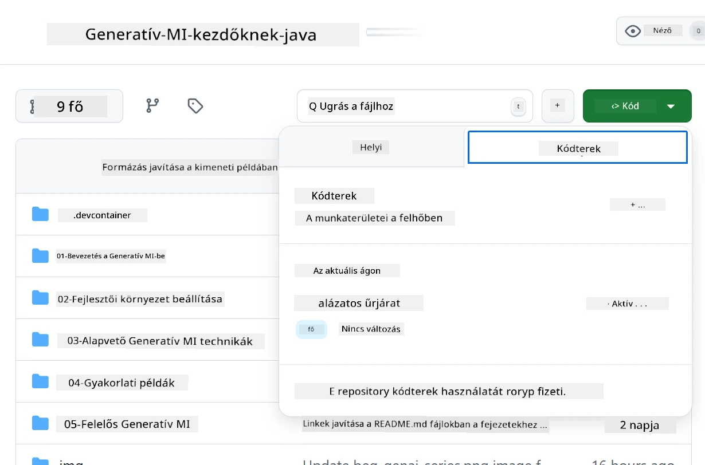
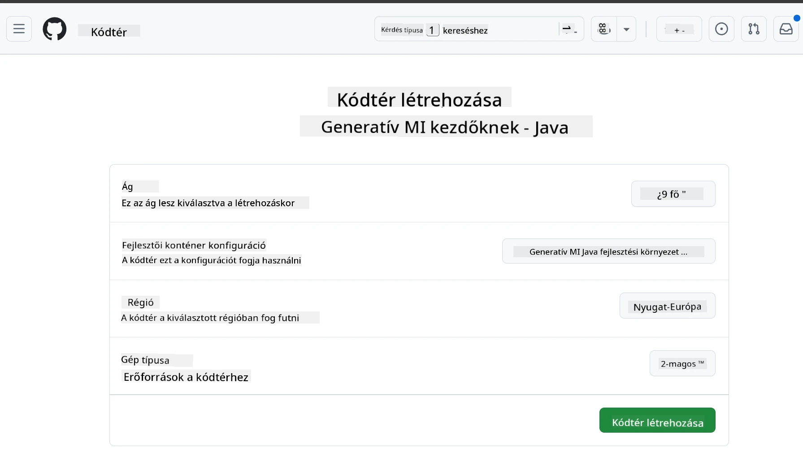
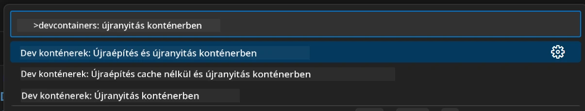
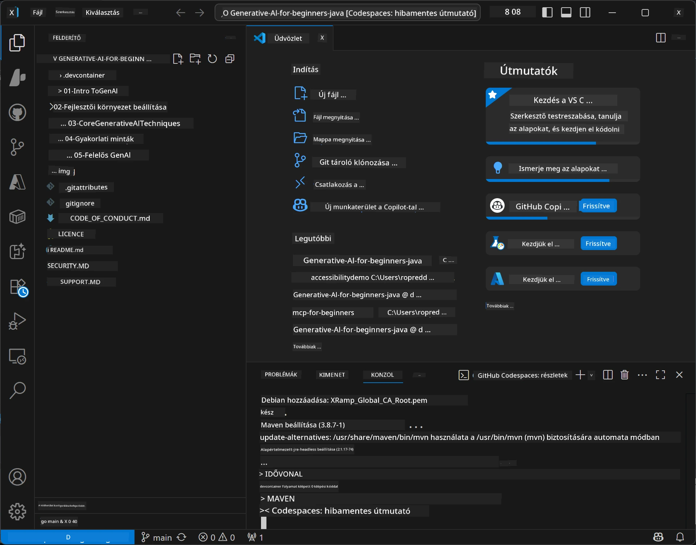

<!--
CO_OP_TRANSLATOR_METADATA:
{
  "original_hash": "96a30d42b9751a3d4e4b20e28d29d459",
  "translation_date": "2026-01-28T05:17:40+00:00",
  "source_file": "02-SetupDevEnvironment/README.md",
  "language_code": "hu"
}
-->
# Fejlesztői környezet beállítása Generatív Mesterséges Intelligencia Java-hoz

> **Gyors kezdés**: Kódolj a felhőben 2 perc alatt – ugorj a [GitHub Codespaces beállítás](../../../02-SetupDevEnvironment) részhez – nincs szükség helyi telepítésre, és GitHub modelleket használ!

> **Érdekel az Azure OpenAI?**, tekintsd meg az [Azure OpenAI beállítási útmutatót](getting-started-azure-openai.md), amely lépéseket tartalmaz egy új Azure OpenAI erőforrás létrehozásához.

## Amit megtanulsz

- Java fejlesztői környezet beállítása MI alkalmazásokhoz
- Fejlesztői környezet kiválasztása és konfigurálása (felhő-alapú Codespaces, helyi fejlesztői konténer vagy teljes helyi beállítás)
- A beállítás tesztelése a GitHub modellekhez való kapcsolódással

## Tartalomjegyzék

- [Amit megtanulsz](../../../02-SetupDevEnvironment)
- [Bevezetés](../../../02-SetupDevEnvironment)
- [1. lépés: Fejlesztői környezet beállítása](../../../02-SetupDevEnvironment)
  - [A opció: GitHub Codespaces (ajánlott)](../../../02-SetupDevEnvironment)
  - [B opció: Helyi fejlesztői konténer](../../../02-SetupDevEnvironment)
  - [C opció: Használd a meglévő helyi telepítésedet](../../../02-SetupDevEnvironment)
- [2. lépés: GitHub személyes hozzáférési token létrehozása](../../../02-SetupDevEnvironment)
- [3. lépés: Beállítás tesztelése](../../../02-SetupDevEnvironment)
- [Hibaelhárítás](../../../02-SetupDevEnvironment)
- [Összefoglalás](../../../02-SetupDevEnvironment)
- [Következő lépések](../../../02-SetupDevEnvironment)

## Bevezetés

Ez a fejezet végigvezet a fejlesztői környezet beállításán. Elsődleges példánk a **GitHub modellek**, mert ingyenes, könnyen beállítható csak egy GitHub fiókkal, nem kell bankkártya, és több modell elérését kínálja kísérletezéshez.

**Nem szükséges helyi beállítás!** Azonnal kezdhetsz kódolni a GitHub Codespaces használatával, amely teljes fejlesztői környezetet biztosít a böngésződben.


Azért ajánljuk a [**GitHub modelleket**](https://github.com/marketplace?type=models) ehhez a tanfolyamhoz, mert:
- **Ingyenes** a kezdés
- **Könnyen beállítható** egy GitHub fiókkal
- **Nincs szükség bankkártyára**
- **Több modell** elérhető kísérletezésre

> **Megjegyzés**: A képzésben használt GitHub modelleknél ezek az ingyenes korlátok vannak:
> - 15 kérés percenként (150 naponta)
> - kb. 8,000 szó be- és kb. 4,000 szó kimenet kérésenként
> - 5 párhuzamos kérés
> 
> Termelési használathoz válts át Azure AI Foundry modellekre az Azure fiókoddal. A kódodon nem kell változtatni. Lásd az [Azure AI Foundry dokumentációját](https://learn.microsoft.com/azure/ai-foundry/foundry-models/how-to/quickstart-github-models).

## 1. lépés: Fejlesztői környezet beállítása

<a name="quick-start-cloud"></a>

Elkészítettünk egy előre konfigurált fejlesztői konténert, hogy minimalizáljuk a beállítási időt, és biztosítsuk a szükséges eszközöket ehhez a Generatív AI Java kurzushoz. Válaszd ki a preferált fejlesztési módot:

### Környezetbeállítási lehetőségek:

#### A opció: GitHub Codespaces (ajánlott)

**Kezdj kódolni 2 perc alatt – nincs helyi telepítés!**

1. Forkold ezt a repót a GitHub fiókodba
   > **Megjegyzés**: Ha a konfigurációt szerkesztenéd, nézd meg a [Dev Container konfigurációt](../../../.devcontainer/devcontainer.json)
2. Kattints a **Code** → **Codespaces** fülre → **...** → **Új opciókkal...**
3. Használd az alapértelmezetteket – ez a **Generative AI Java Development Environment** devcontainer konfigurációt választja, amely a kurzushoz készült
4. Kattints a **Codespace létrehozása** gombra
5. Várj kb. 2 percet, amíg a környezet elkészül
6. Folytasd a [2. lépéssel: GitHub token létrehozása](../../../02-SetupDevEnvironment)






> **A Codespaces előnyei**:
> - Nem szükséges helyi telepítés
> - Bármilyen böngészőt használó eszközön működik
> - Előre konfigurált az összes eszközzel és függőséggel
> - Személyes fiókoknak havi 60 ingyenes óra
> - Egységes környezet minden tanulónak

#### B opció: Helyi fejlesztői konténer

**Fejlesztőknek, akik helyi Docker alapú fejlesztést kedvelnek**

1. Forkold és klónozd a repót a helyi gépedre
   > **Megjegyzés**: Ha a konfigurációt szerkesztenéd, nézd meg a [Dev Container konfigurációt](../../../.devcontainer/devcontainer.json)
2. Telepítsd a [Docker Desktopot](https://www.docker.com/products/docker-desktop/) és a [VS Code-ot](https://code.visualstudio.com/)
3. Telepítsd a [Dev Containers kiterjesztést](https://marketplace.visualstudio.com/items?itemName=ms-vscode-remote.remote-containers) a VS Code-ban
4. Nyisd meg a repó mappáját VS Code-ban
5. Amikor felajánlja, kattints a **Megnyitás konténerben** opcióra (vagy használd a `Ctrl+Shift+P` → "Dev Containers: Reopen in Container" parancsot)
6. Várj, amíg a konténer felépül és elindul
7. Folytasd a [2. lépéssel: GitHub token létrehozása](../../../02-SetupDevEnvironment)




#### C opció: Használd a meglévő helyi telepítésedet

**Fejlesztőknek meglévő Java környezettel**

Előfeltételek:
- [Java 21+](https://www.oracle.com/java/technologies/javase/jdk21-archive-downloads.html)
- [Maven 3.9+](https://maven.apache.org/download.cgi)
- [VS Code](https://code.visualstudio.com) vagy kedvenc IDE-d

Lépések:
1. Klónozd a repót a helyi gépedre
2. Nyisd meg a projektet az IDE-ben
3. Folytasd a [2. lépéssel: GitHub token létrehozása](../../../02-SetupDevEnvironment)

> **Tipp**: Ha gyenge géped van, de szeretnéd a helyi VS Code-ot használni, inkább használj GitHub Codespaces-t! Kapcsolódhatsz helyi VS Code-dal egy felhőben futó Codespace-hez, így mindkét világ előnyeit élvezheted.



## 2. lépés: GitHub személyes hozzáférési token létrehozása

1. Nyisd meg a [GitHub beállításokat](https://github.com/settings/profile) és válaszd a profilod menüjében a **Settings** (Beállítások) lehetőséget.
2. A bal oldali sávban kattints a **Developer settings** (Fejlesztői beállítások) menüpontra (általában alul).
3. A **Personal access tokens** alatt válaszd a **Fine-grained tokens** opciót (vagy használd ezt a közvetlen [linket](https://github.com/settings/personal-access-tokens)).
4. Kattints a **Generate new token** (Új token generálása) gombra.
5. Adj a tokennek egy leíró nevet (pl. `GenAI-Java-Course-Token`).
6. Állíts be lejárati dátumot (javasolt: 7 nap a biztonságos használathoz).
7. A "Resource owner" alatt válaszd ki a saját felhasználódat.
8. A "Repository access" alatt válaszd ki azokat a repókat, amelyeket GitHub Modellekhez használni szeretnél (vagy ha szükséges, "All repositories").
9. Az "Account permissions" alatt keresd meg a **Models** jogosultságot, és állítsd **Read-only**-ra.
10. Kattints a **Generate token** gombra.
11. **Másold ki és mentsd el a tokent most** – többé nem látod újra!

> **Biztonsági tipp**: Használd a lehető legkisebb jogosultsági kört és a legrövidebb praktikus lejárati időt a tokeneknél.

## 3. lépés: Beállítás tesztelése a GitHub modellek példával

Ha a fejlesztői környezet készen áll, teszteljük a GitHub Modellek integrációt az alábbi példaalkalmazással a [`02-SetupDevEnvironment/examples/github-models`](../../../02-SetupDevEnvironment/examples/github-models) mappában.

1. Nyisd meg a terminált a fejlesztői környezetedben.
2. Navigálj a GitHub Modellek példához:
   ```bash
   cd 02-SetupDevEnvironment/examples/github-models
   ```
3. Állítsd be a GitHub tokent környezeti változóként:
   ```bash
   # macOS/Linux
   export GITHUB_TOKEN=your_token_here
   
   # Windows (Parancssor)
   set GITHUB_TOKEN=your_token_here
   
   # Windows (PowerShell)
   $env:GITHUB_TOKEN="your_token_here"
   ```

4. Futtasd az alkalmazást:
   ```bash
   mvn compile exec:java -Dexec.mainClass="com.example.githubmodels.App"
   ```

Az alábbihoz hasonló kimenetet kell látnod:
```text
Using model: gpt-4.1-nano
Sending request to GitHub Models...
Response: Hello World!
```

### A példa kód megértése

Először is nézzük meg, mit futtattunk. A `examples/github-models` mappában lévő példa az OpenAI Java SDK-t használja a GitHub Modellekhez való kapcsolódáshoz:

**Ez a kód mit csinál:**
- **Csatlakozik** a GitHub Modellekhez a személyes tokened segítségével
- **Elküld** az MI modellnek egy egyszerű "Say Hello World!" üzenetet
- **Megkapja** és megjeleníti az MI válaszát
- **Ellenőrzi**, hogy a környezeted helyesen működik-e

**Fő függőség** (a `pom.xml`-ben):
```xml
<dependency>
    <groupId>com.openai</groupId>
    <artifactId>openai-java</artifactId>
    <version>2.12.0</version>
</dependency>
```

**Fő kód** (`App.java`):
```java
// Csatlakozás GitHub modellekhez OpenAI Java SDK használatával
OpenAIClient client = OpenAIOkHttpClient.builder()
    .apiKey(pat)
    .baseUrl("https://models.inference.ai.azure.com")
    .build();

// Csevegési befejezési kérés létrehozása
ChatCompletionCreateParams params = ChatCompletionCreateParams.builder()
    .model(modelId)
    .addSystemMessage("You are a concise assistant.")
    .addUserMessage("Say Hello World!")
    .build();

// AI válasz lekérése
ChatCompletion response = client.chat().completions().create(params);
System.out.println("Response: " + response.choices().get(0).message().content().orElse("No response content"));
```

## Összefoglalás

Remek! Most mindent beállítottál:

- Létrehoztál egy GitHub Személyes Hozzáférési Tokent az AI modellekhez szükséges jogosultságokkal
- Fut a Java fejlesztői környezeted (akár Codespaces, fejlesztői konténer vagy helyi)
- Csatlakozol a GitHub Modellekhez az OpenAI Java SDK-val ingyenes AI fejlesztéshez
- Tesztelted az egészet egy egyszerű példával, amely AI modellekkel kommunikál

## Következő lépések

[3. fejezet: Alapvető generatív mesterséges intelligencia technikák](../03-CoreGenerativeAITechniques/README.md)

## Hibaelhárítás

Problémáid vannak? Íme a gyakori gondok és megoldások:

- **Token nem működik?**
  - Győződj meg róla, hogy az egész tokent másoltad, szóközök nélkül
  - Ellenőrizd, hogy a token helyesen van-e beállítva környezeti változóként
  - Nézd meg, hogy a tokennek megvan-e a megfelelő jogosultsága (Models: Read-only)

- **Maven nem található?**
  - Ha dev konténert vagy Codespaces-t használsz, a Maven telepítve kell legyen
  - Helyi környezetben győződj meg róla, hogy Java 21+ és Maven 3.9+ telepítve van
  - Használd a `mvn --version` parancsot az ellenőrzéshez

- **Kapcsolódási problémák?**
  - Ellenőrizd az internetkapcsolatodat
  - Győződj meg arról, hogy elérhető a GitHub a hálózatodról
  - Ellenőrizd, hogy nem vagy-e tűzfal mögött, amely blokkolja a GitHub Modellek végpontját

- **Dev konténer nem indul?**
  - Győződj meg róla, hogy a Docker Desktop fut (helyi fejlesztéshez)
  - Próbáld újraépíteni a konténert: `Ctrl+Shift+P` → "Dev Containers: Rebuild Container"

- **Alkalmazás fordítási hibák?**
  - Győződj meg, hogy a megfelelő könyvtárban vagy: `02-SetupDevEnvironment/examples/github-models`
  - Próbáld meg tisztítani és újrafordítani: `mvn clean compile`

> **Segítségre van szükséged?**: Ha továbbra is gondod van, nyiss egy issue-t a repóban, és segítünk.

---

<!-- CO-OP TRANSLATOR DISCLAIMER START -->
**Kizáró nyilatkozat**:  
Ez a dokumentum az AI fordító szolgáltatás, a [Co-op Translator](https://github.com/Azure/co-op-translator) segítségével készült. Bár igyekszünk a pontosságra, kérjük, vegye figyelembe, hogy az automatikus fordítások tartalmazhatnak hibákat vagy pontatlanságokat. Az eredeti dokumentum az anyanyelvén tekintendő hiteles forrásnak. Kritikus információk esetén javasolt a profi, emberi fordítás igénybevétele. Nem vállalunk felelősséget a fordítás használatából eredő félreértésekért vagy félreértelmezésekért.
<!-- CO-OP TRANSLATOR DISCLAIMER END -->