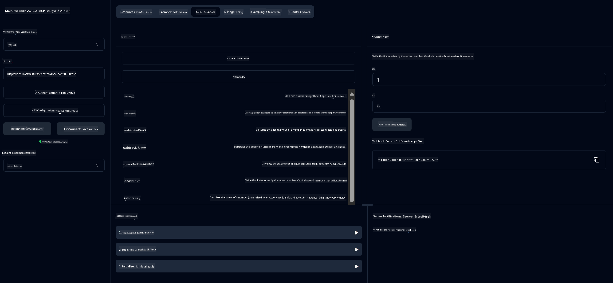

<!--
CO_OP_TRANSLATOR_METADATA:
{
  "original_hash": "5bd7a347d6ed1d706443f9129dd29dd9",
  "translation_date": "2025-07-25T09:59:45+00:00",
  "source_file": "04-PracticalSamples/mcp/calculator/README.md",
  "language_code": "hu"
}
-->
# Alapvető Számológép MCP Szolgáltatás

>**Megjegyzés**: Ez a fejezet tartalmaz egy [**Útmutatót**](./TUTORIAL.md), amely végigvezet a példákon.

Üdvözlünk az első gyakorlati tapasztalatodban a **Model Context Protocol (MCP)** használatával! Az előző fejezetekben megismerkedtél a generatív AI alapjaival, és beállítottad a fejlesztési környezetedet. Most itt az ideje, hogy valami gyakorlati dolgot építsünk.

Ez a számológép szolgáltatás bemutatja, hogyan tudnak az AI modellek biztonságosan kommunikálni külső eszközökkel az MCP segítségével. Ahelyett, hogy az AI modell néha megbízhatatlan matematikai képességeire támaszkodnánk, megmutatjuk, hogyan lehet egy olyan robusztus rendszert építeni, amelyben az AI speciális szolgáltatásokat hívhat meg a pontos számítások érdekében.

## Tartalomjegyzék

- [Mit fogsz megtanulni](../../../../../04-PracticalSamples/mcp/calculator)
- [Előfeltételek](../../../../../04-PracticalSamples/mcp/calculator)
- [Kulcsfogalmak](../../../../../04-PracticalSamples/mcp/calculator)
- [Gyors kezdés](../../../../../04-PracticalSamples/mcp/calculator)
- [Elérhető számológép műveletek](../../../../../04-PracticalSamples/mcp/calculator)
- [Teszt kliens](../../../../../04-PracticalSamples/mcp/calculator)
  - [1. Közvetlen MCP kliens (SDKClient)](../../../../../04-PracticalSamples/mcp/calculator)
  - [2. AI-alapú kliens (LangChain4jClient)](../../../../../04-PracticalSamples/mcp/calculator)
- [MCP Inspector (Webes felület)](../../../../../04-PracticalSamples/mcp/calculator)
  - [Lépésről lépésre útmutató](../../../../../04-PracticalSamples/mcp/calculator)

## Mit fogsz megtanulni

Ezen példa végigvitelével megérted:
- Hogyan hozz létre MCP-kompatibilis szolgáltatásokat Spring Boot segítségével
- A közvetlen protokollkommunikáció és az AI-alapú interakció közötti különbséget
- Hogyan dönti el az AI modell, mikor és hogyan használjon külső eszközöket
- Legjobb gyakorlatokat az eszközökkel bővített AI alkalmazások építéséhez

Tökéletes kezdők számára, akik szeretnék megérteni az MCP fogalmait, és készen állnak az első AI eszköz integrációjuk megépítésére!

## Előfeltételek

- Java 21+
- Maven 3.6+
- **GitHub Token**: Szükséges az AI-alapú klienshez. Ha még nem állítottad be, lásd: [2. fejezet: Fejlesztési környezet beállítása](../../../02-SetupDevEnvironment/README.md).

## Kulcsfogalmak

**Model Context Protocol (MCP)** egy szabványosított módja annak, hogy az AI alkalmazások biztonságosan csatlakozzanak külső eszközökhöz. Gondolj rá úgy, mint egy "hídra", amely lehetővé teszi az AI modellek számára, hogy külső szolgáltatásokat, például a számológépünket használják. Ahelyett, hogy az AI modell maga próbálna számolni (ami megbízhatatlan lehet), a számológép szolgáltatásunkat hívja meg a pontos eredmények érdekében. Az MCP biztosítja, hogy ez a kommunikáció biztonságosan és következetesen történjen.

**Server-Sent Events (SSE)** valós idejű kommunikációt tesz lehetővé a szerver és a kliens között. Ellentétben a hagyományos HTTP kérésekkel, ahol kérsz és vársz a válaszra, az SSE lehetővé teszi, hogy a szerver folyamatosan küldjön frissítéseket a kliensnek. Ez tökéletes AI alkalmazásokhoz, ahol a válaszok folyamatosan érkezhetnek, vagy időbe telhet a feldolgozásuk.

**AI Eszközök és Funkcióhívások** lehetővé teszik az AI modellek számára, hogy automatikusan kiválasszák és használják a külső funkciókat (például számológép műveleteket) a felhasználói kérések alapján. Ha például azt kérdezed: "Mennyi 15 + 27?", az AI modell megérti, hogy összeadást szeretnél, automatikusan meghívja az `add` eszközt a megfelelő paraméterekkel (15, 27), és természetes nyelven adja vissza az eredményt. Az AI intelligens koordinátorként működik, amely tudja, mikor és hogyan kell használni az egyes eszközöket.

## Gyors kezdés

### 1. Navigálj a számológép alkalmazás könyvtárába
```bash
cd Generative-AI-for-beginners-java/04-PracticalSamples/mcp/calculator
```

### 2. Építsd meg és futtasd
```bash
mvn clean install -DskipTests
java -jar target/calculator-server-0.0.1-SNAPSHOT.jar
```

### 3. Teszteld a kliensekkel
- **SDKClient**: Közvetlen MCP protokoll interakció
- **LangChain4jClient**: AI-alapú természetes nyelvi interakció (GitHub token szükséges)

## Elérhető számológép műveletek

- `add(a, b)`, `subtract(a, b)`, `multiply(a, b)`, `divide(a, b)`
- `power(base, exponent)`, `squareRoot(number)`, `absolute(number)`
- `modulus(a, b)`, `help()`

## Teszt kliens

### 1. Közvetlen MCP kliens (SDKClient)
Teszteli a nyers MCP protokoll kommunikációt. Futtasd:
```bash
mvn test-compile exec:java -Dexec.mainClass="com.microsoft.mcp.sample.client.SDKClient" -Dexec.classpathScope=test
```

### 2. AI-alapú kliens (LangChain4jClient)
Bemutatja a természetes nyelvi interakciót GitHub modellekkel. GitHub token szükséges (lásd: [Előfeltételek](../../../../../04-PracticalSamples/mcp/calculator)).

**Futtatás:**
```bash
mvn test-compile exec:java -Dexec.mainClass="com.microsoft.mcp.sample.client.LangChain4jClient" -Dexec.classpathScope=test
```

## MCP Inspector (Webes felület)

Az MCP Inspector egy vizuális webes felületet biztosít az MCP szolgáltatás teszteléséhez kódírás nélkül. Tökéletes kezdők számára, hogy megértsék, hogyan működik az MCP!

### Lépésről lépésre útmutató:

1. **Indítsd el a számológép szervert** (ha még nem fut):
   ```bash
   java -jar target/calculator-server-0.0.1-SNAPSHOT.jar
   ```

2. **Telepítsd és futtasd az MCP Inspectort** egy új terminálban:
   ```bash
   npx @modelcontextprotocol/inspector
   ```

3. **Nyisd meg a webes felületet**:
   - Keresd meg az üzenetet, például: "Inspector running at http://localhost:6274"
   - Nyisd meg ezt az URL-t a böngésződben

4. **Csatlakozz a számológép szolgáltatáshoz**:
   - A webes felületen állítsd be a szállítási típust "SSE"-re
   - Állítsd be az URL-t: `http://localhost:8080/sse`
   - Kattints a "Connect" gombra

5. **Fedezd fel az elérhető eszközöket**:
   - Kattints a "List Tools" gombra, hogy lásd az összes számológép műveletet
   - Olyan funkciókat fogsz látni, mint `add`, `subtract`, `multiply`, stb.

6. **Tesztelj egy számológép műveletet**:
   - Válassz ki egy eszközt (pl. "add")
   - Add meg a paramétereket (pl. `a: 15`, `b: 27`)
   - Kattints a "Run Tool" gombra
   - Nézd meg az eredményt, amit az MCP szolgáltatás visszaad!

Ez a vizuális megközelítés segít megérteni, hogyan működik pontosan az MCP kommunikáció, mielőtt saját klienseket építenél.



---
**Hivatkozás:** [MCP Server Boot Starter Dokumentáció](https://docs.spring.io/spring-ai/reference/api/mcp/mcp-server-boot-starter-docs.html)

**Felelősség kizárása**:  
Ez a dokumentum az AI fordítási szolgáltatás [Co-op Translator](https://github.com/Azure/co-op-translator) segítségével került lefordításra. Bár törekszünk a pontosságra, kérjük, vegye figyelembe, hogy az automatikus fordítások hibákat vagy pontatlanságokat tartalmazhatnak. Az eredeti dokumentum az eredeti nyelvén tekintendő hiteles forrásnak. Kritikus információk esetén javasolt professzionális emberi fordítást igénybe venni. Nem vállalunk felelősséget semmilyen félreértésért vagy téves értelmezésért, amely a fordítás használatából eredhet.