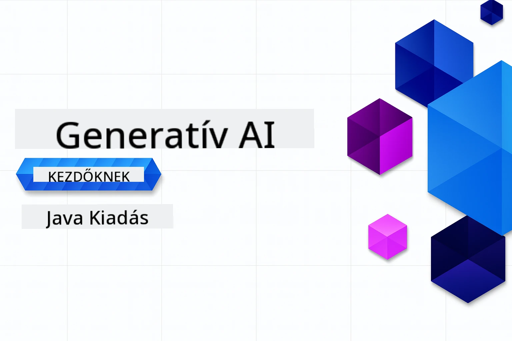

# Generatív mesterséges intelligencia kezdőknek - Java kiadás
[](https://discord.gg/nTYy5BXMWG)



**Időráfordítás**: Az egész műhely online elvégezhető helyi beállítás nélkül. A környezet beállítása 2 percet vesz igénybe, a minták felfedezése pedig 1-3 órát, a felfedezés mélységétől függően.

> **Gyors kezdés**

1. Forkold ezt a tárolót a GitHub fiókodba
2. Kattints a **Kód** → **Codespaces** fülre → **...** → **Új opciókkal...**
3. Használd az alapértelmezetteket – ez kiválasztja a kurzushoz készült fejlesztői konténert
4. Kattints a **Codespace létrehozása** gombra
5. Várj kb. 2 percet, amíg a környezet készen áll
6. Ugorj közvetlenül az [Első példára](./02-SetupDevEnvironment/README.md#step-2-create-a-github-personal-access-token)

> **Inkább helyben klónoznál?**
>
> Ez a tároló 50+ nyelvi fordítást tartalmaz, ami jelentősen növeli a letöltés méretét. Ha fordítások nélkül szeretnéd klónozni, használd a sparse checkout-ot:
>
> **Linux / macOS (Bash)**
> ```bash
> git clone --filter=blob:none --sparse https://github.com/microsoft/Generative-AI-for-beginners-java.git
> cd Generative-AI-for-beginners-java
> git sparse-checkout set --no-cone '/*' '!translations' '!translated_images'
> ```
>
> **Windows (PowerShell)**
> ```powershell
> git clone --filter=blob:none --sparse https://github.com/microsoft/Generative-AI-for-beginners-java.git
> cd Generative-AI-for-beginners-java
> git sparse-checkout set --no-cone "/*" "!translations" "!translated_images"
> ```
> Ez mindent megad, amire szükséged van a kurzus teljesítéséhez, lényegesen gyorsabb letöltéssel.


## Többnyelvű támogatás

### GitHub Action által támogatott (Automatizált és mindig naprakész)

<!-- CO-OP TRANSLATOR LANGUAGES TABLE START -->
[Arab](../ar/README.md) | [Bengáli](../bn/README.md) | [Bolgár](../bg/README.md) | [Burmese (Myanmar)](../my/README.md) | [Kínai (egyszerűsített)](../zh-CN/README.md) | [Kínai (hagyományos, Hongkong)](../zh-HK/README.md) | [Kínai (hagyományos, Makaó)](../zh-MO/README.md) | [Kínai (hagyományos, Tajvan)](../zh-TW/README.md) | [Horvát](../hr/README.md) | [Cseh](../cs/README.md) | [Dán](../da/README.md) | [Holland](../nl/README.md) | [Észt](../et/README.md) | [Finn](../fi/README.md) | [Francia](../fr/README.md) | [Német](../de/README.md) | [Görög](../el/README.md) | [Hebrew](../he/README.md) | [Hindi](../hi/README.md) | [Magyar](./README.md) | [Indonéz](../id/README.md) | [Olasz](../it/README.md) | [Japán](../ja/README.md) | [Kannada](../kn/README.md) | [Koreai](../ko/README.md) | [Litván](../lt/README.md) | [Maláj](../ms/README.md) | [Malayalam](../ml/README.md) | [Marathi](../mr/README.md) | [Nepáli](../ne/README.md) | [Nigeriai pidgin](../pcm/README.md) | [Norvég](../no/README.md) | [Perzsa (Farsi)](../fa/README.md) | [Lengyel](../pl/README.md) | [Portugál (Brazília)](../pt-BR/README.md) | [Portugál (Portugália)](../pt-PT/README.md) | [Pandzsábi (Gurmukhi)](../pa/README.md) | [Román](../ro/README.md) | [Orosz](../ru/README.md) | [Szerb (cirill)](../sr/README.md) | [Szlovák](../sk/README.md) | [Szlovén](../sl/README.md) | [Spanyol](../es/README.md) | [Szvahili](../sw/README.md) | [Svéd](../sv/README.md) | [Tagalog (filippínó)](../tl/README.md) | [Tamil](../ta/README.md) | [Telugu](../te/README.md) | [Thai](../th/README.md) | [Török](../tr/README.md) | [Ukrán](../uk/README.md) | [Urdu](../ur/README.md) | [Vietnami](../vi/README.md)

## Tanfolyam felépítése és tanulási útvonal

### **1. fejezet: Bevezetés a generatív mesterséges intelligenciába**
- **Alapfogalmak**: Nagy nyelvi modellek, tokenek, beágyazások és az MI képességek megértése
- **Java MI ökoszisztéma**: A Spring AI és OpenAI SDK-k áttekintése
- **Model Context Protocol**: Bevezetés az MCP-be és szerepe az MI ügynökök közötti kommunikációban
- **Gyakorlati alkalmazások**: Valós példák, mint chatbotok és tartalomgenerálás
- **[→ 1. fejezet indítása](./01-IntroToGenAI/README.md)**

### **2. fejezet: Fejlesztői környezet beállítása**
- **Több szolgáltató konfigurálása**: GitHub modellek, Azure OpenAI és OpenAI Java SDK integrációk beállítása
- **Spring Boot + Spring AI**: Legjobb gyakorlatok vállalati MI alkalmazások fejlesztéséhez
- **GitHub modellek**: Ingyenes MI modell elérés prototípushoz és tanuláshoz (nem szükséges bankkártya)
- **Fejlesztő eszközök**: Docker konténerek, VS Code és GitHub Codespaces konfigurációk
- **[→ 2. fejezet indítása](./02-SetupDevEnvironment/README.md)**

### **3. fejezet: Alapvető generatív MI technikák**
- **Prompt mérnökség**: Módszerek az optimális MI válaszokhoz
- **Beágyazások és vektorműveletek**: Szemantikus keresés és hasonlóság illesztés megvalósítása
- **Retrieval-Augmented Generation (RAG)**: MI kombinálása saját adatforrásokkal
- **Függvényhívás**: MI képességek bővítése egyedi eszközökkel és bővítményekkel
- **[→ 3. fejezet indítása](./03-CoreGenerativeAITechniques/README.md)**

### **4. fejezet: Gyakorlati alkalmazások és projektek**
- **Kedvenc történet generátor** (`petstory/`): Kreatív tartalomgenerálás GitHub modellekkel
- **Foundry helyi demó** (`foundrylocal/`): Helyi MI modell integráció OpenAI Java SDK-val
- **MCP kalkulátor szolgáltatás** (`calculator/`): Alap Model Context Protocol megvalósítás Spring AI-val
- **[→ 4. fejezet indítása](./04-PracticalSamples/README.md)**

### **5. fejezet: Felelős MI fejlesztés**
- **GitHub modellek biztonsága**: Beépített tartalomszűrés és biztonsági mechanizmusok tesztelése (kemény blokkok és lágy elutasítások)
- **Felelős MI demó**: Gyakorlati példa a modern MI biztonsági rendszerek működésére
- **Legjobb gyakorlatok**: Alapvető irányelvek az etikus MI fejlesztéshez és üzemeltetéshez
- **[→ 5. fejezet indítása](./05-ResponsibleGenAI/README.md)**

## További források

<!-- CO-OP TRANSLATOR OTHER COURSES START -->
### LangChain
[](https://aka.ms/langchain4j-for-beginners)
[](https://aka.ms/langchainjs-for-beginners?WT.mc_id=m365-94501-dwahlin)
[](https://github.com/microsoft/langchain-for-beginners?WT.mc_id=m365-94501-dwahlin)
---

### Azure / Edge / MCP / Ügynökök
[](https://github.com/microsoft/AZD-for-beginners?WT.mc_id=academic-105485-koreyst)
[](https://github.com/microsoft/edgeai-for-beginners?WT.mc_id=academic-105485-koreyst)
[](https://github.com/microsoft/mcp-for-beginners?WT.mc_id=academic-105485-koreyst)
[](https://github.com/microsoft/ai-agents-for-beginners?WT.mc_id=academic-105485-koreyst)

---
 
### Generatív MI sorozat
[](https://github.com/microsoft/generative-ai-for-beginners?WT.mc_id=academic-105485-koreyst)
[-9333EA?style=for-the-badge&labelColor=E5E7EB&color=9333EA)](https://github.com/microsoft/Generative-AI-for-beginners-dotnet?WT.mc_id=academic-105485-koreyst)
[-C084FC?style=for-the-badge&labelColor=E5E7EB&color=C084FC)](https://github.com/microsoft/generative-ai-for-beginners-java?WT.mc_id=academic-105485-koreyst)
[-E879F9?style=for-the-badge&labelColor=E5E7EB&color=E879F9)](https://github.com/microsoft/generative-ai-with-javascript?WT.mc_id=academic-105485-koreyst)

---
 
### Alapvető tanulás
[](https://aka.ms/ml-beginners?WT.mc_id=academic-105485-koreyst)
[](https://aka.ms/datascience-beginners?WT.mc_id=academic-105485-koreyst)
[](https://aka.ms/ai-beginners?WT.mc_id=academic-105485-koreyst)
[](https://github.com/microsoft/Security-101?WT.mc_id=academic-96948-sayoung)
[](https://aka.ms/webdev-beginners?WT.mc_id=academic-105485-koreyst)
[](https://aka.ms/iot-beginners?WT.mc_id=academic-105485-koreyst)
[](https://github.com/microsoft/xr-development-for-beginners?WT.mc_id=academic-105485-koreyst)

---
 
### Copilot sorozat
[](https://aka.ms/GitHubCopilotAI?WT.mc_id=academic-105485-koreyst)
[](https://github.com/microsoft/mastering-github-copilot-for-dotnet-csharp-developers?WT.mc_id=academic-105485-koreyst)
[](https://github.com/microsoft/CopilotAdventures?WT.mc_id=academic-105485-koreyst)
<!-- CO-OP TRANSLATOR OTHER COURSES END -->

## Segítségkérés

Ha elakadsz vagy kérdéseid vannak az AI alkalmazások fejlesztésével kapcsolatban, csatlakozz a tanulótársaidhoz és tapasztalt fejlesztőkhöz az MCP-vel kapcsolatos beszélgetésekben. Ez egy támogató közösség, ahol a kérdések szívesen látottak és a tudás szabadon megosztott.

[](https://discord.gg/nTYy5BXMWG)

Ha termékvisszajelzésed vagy hibajelentésed van a fejlesztés során, látogasd meg:

[](https://aka.ms/foundry/forum)

---

<!-- CO-OP TRANSLATOR DISCLAIMER START -->
**Jogi nyilatkozat**:  
Ezt a dokumentumot az AI fordító szolgáltatás [Co-op Translator](https://github.com/Azure/co-op-translator) segítségével fordítottuk. Bár a pontosságra törekszünk, kérjük vegye figyelembe, hogy az automatikus fordítások hibákat vagy pontatlanságokat tartalmazhatnak. Az eredeti dokumentum az anyanyelvén tekintendő hiteles forrásnak. Fontos információk esetén professzionális emberi fordítást javaslunk. Nem vállalunk felelősséget semmilyen félreértésért vagy félreértelmezésért, amely az ezen fordítás használatából adódik.
<!-- CO-OP TRANSLATOR DISCLAIMER END -->