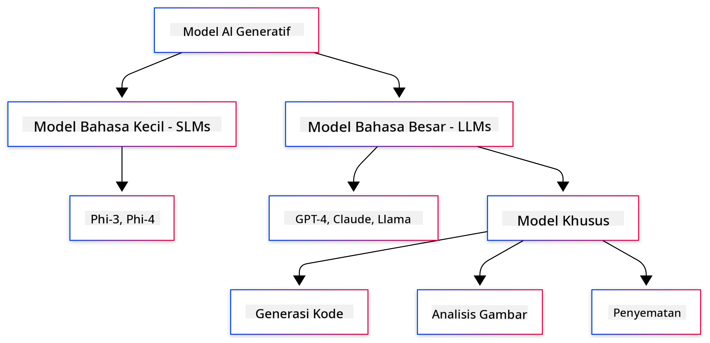
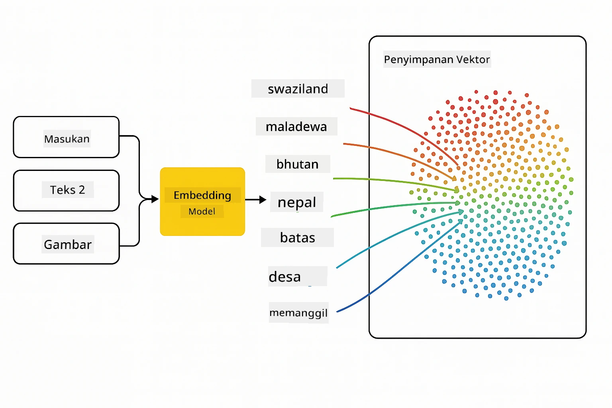
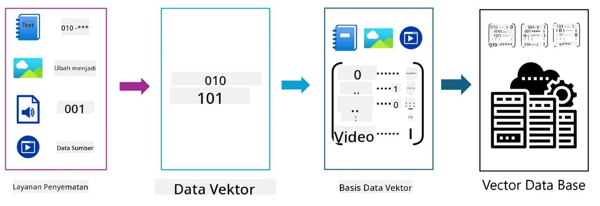
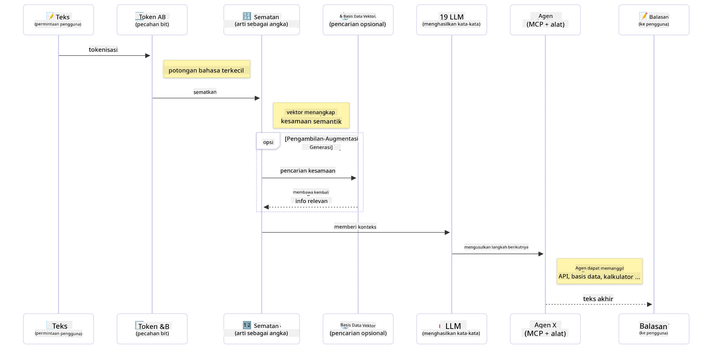

# Pengantar Generative AI - Edisi Java

## Apa yang Akan Anda Pelajari

- **Dasar-dasar Generative AI** termasuk LLM, rekayasa prompt, token, embedding, dan basis data vektor
- **Membandingkan alat pengembangan AI Java** termasuk Azure OpenAI SDK, Spring AI, dan OpenAI Java SDK
- **Mengenal Model Context Protocol** dan perannya dalam komunikasi agen AI

## Daftar Isi

- [Pengantar](../../../01-IntroToGenAI)
- [Penyegaran singkat tentang konsep Generative AI](../../../01-IntroToGenAI)
- [Tinjauan rekayasa prompt](../../../01-IntroToGenAI)
- [Token, embedding, dan agen](../../../01-IntroToGenAI)
- [Alat dan Perpustakaan Pengembangan AI untuk Java](../../../01-IntroToGenAI)
  - [OpenAI Java SDK](../../../01-IntroToGenAI)
  - [Spring AI](../../../01-IntroToGenAI)
  - [Azure OpenAI Java SDK](../../../01-IntroToGenAI)
- [Ringkasan](../../../01-IntroToGenAI)
- [Langkah Selanjutnya](../../../01-IntroToGenAI)

## Pengantar

Selamat datang di bab pertama Generative AI untuk Pemula - Edisi Java! Pelajaran dasar ini memperkenalkan Anda pada konsep inti generative AI dan cara menggunakannya dengan Java. Anda akan mempelajari elemen-elemen penting dalam aplikasi AI, termasuk Large Language Models (LLMs), token, embedding, dan agen AI. Kami juga akan menjelajahi alat-alat utama Java yang akan Anda gunakan sepanjang kursus ini.

### Penyegaran singkat tentang konsep Generative AI

Generative AI adalah jenis kecerdasan buatan yang menciptakan konten baru, seperti teks, gambar, atau kode, berdasarkan pola dan hubungan yang dipelajari dari data. Model generative AI dapat menghasilkan respons yang mirip manusia, memahami konteks, dan kadang-kadang bahkan menciptakan konten yang tampak seperti buatan manusia.

Saat Anda mengembangkan aplikasi AI Java, Anda akan bekerja dengan **model generative AI** untuk menciptakan konten. Beberapa kemampuan model generative AI meliputi:

- **Pembuatan Teks**: Menulis teks yang mirip manusia untuk chatbot, konten, dan penyelesaian teks.
- **Pembuatan dan Analisis Gambar**: Menghasilkan gambar realistis, meningkatkan foto, dan mendeteksi objek.
- **Pembuatan Kode**: Menulis potongan kode atau skrip.

Ada jenis model tertentu yang dioptimalkan untuk tugas-tugas berbeda. Misalnya, baik **Small Language Models (SLMs)** maupun **Large Language Models (LLMs)** dapat menangani pembuatan teks, dengan LLM biasanya memberikan kinerja yang lebih baik untuk tugas-tugas kompleks. Untuk tugas terkait gambar, Anda akan menggunakan model visi khusus atau model multi-modal.

Tentu saja, respons dari model ini tidak selalu sempurna. Anda mungkin pernah mendengar tentang model yang "berhalusinasi" atau menghasilkan informasi yang salah dengan cara yang meyakinkan. Namun, Anda dapat membantu membimbing model untuk menghasilkan respons yang lebih baik dengan memberikan instruksi dan konteks yang jelas. Di sinilah **rekayasa prompt** berperan.

#### Tinjauan rekayasa prompt

Rekayasa prompt adalah praktik merancang input yang efektif untuk membimbing model AI menuju output yang diinginkan. Ini melibatkan:

- **Kejelasan**: Membuat instruksi yang jelas dan tidak ambigu.
- **Konteks**: Memberikan informasi latar belakang yang diperlukan.
- **Keterbatasan**: Menentukan batasan atau format tertentu.

Beberapa praktik terbaik untuk rekayasa prompt meliputi desain prompt, instruksi yang jelas, pemecahan tugas, pembelajaran satu kali dan beberapa kali, serta penyetelan prompt. Menguji berbagai prompt sangat penting untuk menemukan apa yang paling cocok untuk kasus penggunaan spesifik Anda.

Saat mengembangkan aplikasi, Anda akan bekerja dengan berbagai jenis prompt:
- **Prompt sistem**: Menetapkan aturan dasar dan konteks untuk perilaku model
- **Prompt pengguna**: Data input dari pengguna aplikasi Anda
- **Prompt asisten**: Respons model berdasarkan prompt sistem dan pengguna

> **Pelajari lebih lanjut**: Pelajari lebih lanjut tentang rekayasa prompt di [Bab Rekayasa Prompt dari kursus GenAI untuk Pemula](https://github.com/microsoft/generative-ai-for-beginners/tree/main/04-prompt-engineering-fundamentals)

#### Token, embedding, dan agen

Saat bekerja dengan model generative AI, Anda akan menemui istilah seperti **token**, **embedding**, **agen**, dan **Model Context Protocol (MCP)**. Berikut adalah penjelasan rinci tentang konsep-konsep ini:

- **Token**: Token adalah unit teks terkecil dalam model. Token dapat berupa kata, karakter, atau subkata. Token digunakan untuk merepresentasikan data teks dalam format yang dapat dipahami oleh model. Misalnya, kalimat "The quick brown fox jumped over the lazy dog" dapat diubah menjadi token seperti ["The", " quick", " brown", " fox", " jumped", " over", " the", " lazy", " dog"] atau ["The", " qu", "ick", " br", "own", " fox", " jump", "ed", " over", " the", " la", "zy", " dog"] tergantung pada strategi tokenisasi.

Tokenisasi adalah proses memecah teks menjadi unit-unit kecil ini. Ini penting karena model beroperasi pada token daripada teks mentah. Jumlah token dalam prompt memengaruhi panjang dan kualitas respons model, karena model memiliki batas token untuk jendela konteksnya (misalnya, 128K token untuk total konteks GPT-4o, termasuk input dan output).

  Dalam Java, Anda dapat menggunakan pustaka seperti OpenAI SDK untuk menangani tokenisasi secara otomatis saat mengirim permintaan ke model AI.

- **Embedding**: Embedding adalah representasi vektor dari token yang menangkap makna semantik. Mereka adalah representasi numerik (biasanya array angka floating-point) yang memungkinkan model memahami hubungan antar kata dan menghasilkan respons yang relevan secara kontekstual. Kata-kata yang serupa memiliki embedding yang serupa, memungkinkan model memahami konsep seperti sinonim dan hubungan semantik.

  Dalam Java, Anda dapat menghasilkan embedding menggunakan OpenAI SDK atau pustaka lain yang mendukung pembuatan embedding. Embedding ini penting untuk tugas seperti pencarian semantik, di mana Anda ingin menemukan konten serupa berdasarkan makna daripada kecocokan teks yang persis.

- **Basis data vektor**: Basis data vektor adalah sistem penyimpanan khusus yang dioptimalkan untuk embedding. Mereka memungkinkan pencarian kesamaan yang efisien dan sangat penting untuk pola Retrieval-Augmented Generation (RAG) di mana Anda perlu menemukan informasi yang relevan dari kumpulan data besar berdasarkan kesamaan semantik daripada kecocokan yang persis.

> **Catatan**: Dalam kursus ini, kami tidak akan membahas basis data vektor tetapi menganggapnya layak disebutkan karena sering digunakan dalam aplikasi dunia nyata.

- **Agen & MCP**: Komponen AI yang secara otonom berinteraksi dengan model, alat, dan sistem eksternal. Model Context Protocol (MCP) menyediakan cara standar bagi agen untuk mengakses sumber data eksternal dan alat secara aman. Pelajari lebih lanjut di kursus [MCP untuk Pemula](https://github.com/microsoft/mcp-for-beginners).

Dalam aplikasi AI Java, Anda akan menggunakan token untuk pemrosesan teks, embedding untuk pencarian semantik dan RAG, basis data vektor untuk pengambilan data, dan agen dengan MCP untuk membangun sistem cerdas yang menggunakan alat.

### Alat dan Perpustakaan Pengembangan AI untuk Java

Java menawarkan alat yang sangat baik untuk pengembangan AI. Ada tiga pustaka utama yang akan kita eksplorasi sepanjang kursus ini - OpenAI Java SDK, Azure OpenAI SDK, dan Spring AI.

Berikut adalah tabel referensi cepat yang menunjukkan SDK mana yang digunakan dalam contoh setiap bab:

| Bab | Contoh | SDK |
|-----|--------|-----|
| 02-SetupDevEnvironment | github-models | OpenAI Java SDK |
| 02-SetupDevEnvironment | basic-chat-azure | Spring AI Azure OpenAI |
| 03-CoreGenerativeAITechniques | examples | Azure OpenAI SDK |
| 04-PracticalSamples | petstory | OpenAI Java SDK |
| 04-PracticalSamples | foundrylocal | OpenAI Java SDK |
| 04-PracticalSamples | calculator | Spring AI MCP SDK + LangChain4j |

**Tautan Dokumentasi SDK:**
- [Azure OpenAI Java SDK](https://github.com/Azure/azure-sdk-for-java/tree/azure-ai-openai_1.0.0-beta.16/sdk/openai/azure-ai-openai)
- [Spring AI](https://docs.spring.io/spring-ai/reference/)
- [OpenAI Java SDK](https://github.com/openai/openai-java)
- [LangChain4j](https://docs.langchain4j.dev/)

#### OpenAI Java SDK

OpenAI SDK adalah pustaka Java resmi untuk API OpenAI. Ini menyediakan antarmuka yang sederhana dan konsisten untuk berinteraksi dengan model OpenAI, membuatnya mudah untuk mengintegrasikan kemampuan AI ke dalam aplikasi Java. Contoh GitHub Models di Bab 2, aplikasi Pet Story di Bab 4, dan contoh Foundry Local menunjukkan pendekatan OpenAI SDK.

#### Spring AI

Spring AI adalah kerangka kerja komprehensif yang menghadirkan kemampuan AI ke aplikasi Spring, menyediakan lapisan abstraksi yang konsisten di berbagai penyedia AI. Ini terintegrasi dengan mulus ke dalam ekosistem Spring, menjadikannya pilihan ideal untuk aplikasi Java perusahaan yang membutuhkan kemampuan AI.

Kekuatan Spring AI terletak pada integrasinya yang mulus dengan ekosistem Spring, membuatnya mudah untuk membangun aplikasi AI yang siap produksi dengan pola Spring yang sudah dikenal seperti injeksi ketergantungan, manajemen konfigurasi, dan kerangka pengujian. Anda akan menggunakan Spring AI di Bab 2 dan 4 untuk membangun aplikasi yang memanfaatkan pustaka OpenAI dan Model Context Protocol (MCP) Spring AI.

##### Model Context Protocol (MCP)

[Model Context Protocol (MCP)](https://modelcontextprotocol.io/) adalah standar yang sedang berkembang yang memungkinkan aplikasi AI berinteraksi dengan aman dengan sumber data eksternal dan alat. MCP menyediakan cara standar bagi model AI untuk mengakses informasi kontekstual dan menjalankan tindakan dalam aplikasi Anda.

Di Bab 4, Anda akan membangun layanan kalkulator MCP sederhana yang menunjukkan dasar-dasar Model Context Protocol dengan Spring AI, menunjukkan cara membuat integrasi alat dasar dan arsitektur layanan.

#### Azure OpenAI Java SDK

Pustaka klien Azure OpenAI untuk Java adalah adaptasi dari API REST OpenAI yang menyediakan antarmuka idiomatik dan integrasi dengan ekosistem SDK Azure lainnya. Di Bab 3, Anda akan membangun aplikasi menggunakan Azure OpenAI SDK, termasuk aplikasi obrolan, pemanggilan fungsi, dan pola RAG (Retrieval-Augmented Generation).

> Catatan: Azure OpenAI SDK tertinggal dibandingkan OpenAI Java SDK dalam hal fitur, jadi untuk proyek mendatang, pertimbangkan menggunakan OpenAI Java SDK.

## Ringkasan

Itu merangkum dasar-dasarnya! Anda sekarang memahami:

- Konsep inti di balik generative AI - dari LLM dan rekayasa prompt hingga token, embedding, dan basis data vektor
- Pilihan alat Anda untuk pengembangan AI Java: Azure OpenAI SDK, Spring AI, dan OpenAI Java SDK
- Apa itu Model Context Protocol dan bagaimana ia memungkinkan agen AI bekerja dengan alat eksternal

## Langkah Selanjutnya

[Bab 2: Menyiapkan Lingkungan Pengembangan](../02-SetupDevEnvironment/README.md)

**Penafian**:  
Dokumen ini telah diterjemahkan menggunakan layanan penerjemahan AI [Co-op Translator](https://github.com/Azure/co-op-translator). Meskipun kami berupaya untuk memberikan hasil yang akurat, harap diperhatikan bahwa terjemahan otomatis mungkin mengandung kesalahan atau ketidakakuratan. Dokumen asli dalam bahasa aslinya harus dianggap sebagai sumber yang berwenang. Untuk informasi yang bersifat kritis, disarankan menggunakan jasa penerjemahan manusia profesional. Kami tidak bertanggung jawab atas kesalahpahaman atau penafsiran yang keliru yang timbul dari penggunaan terjemahan ini.