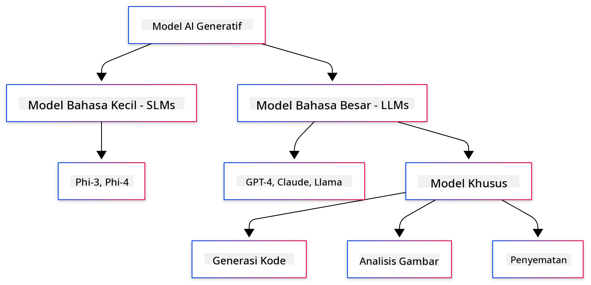
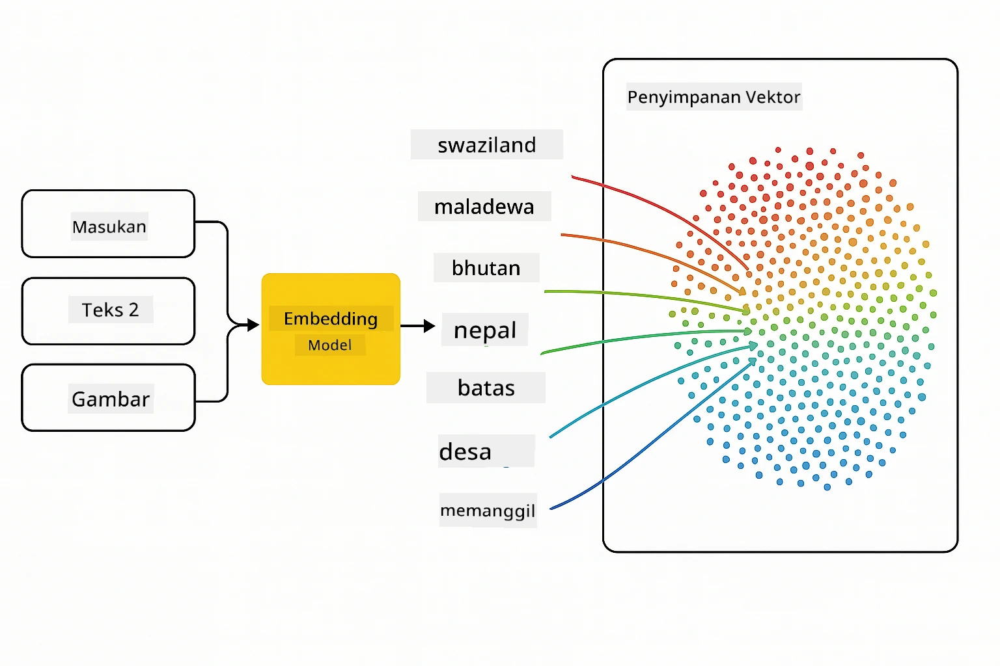
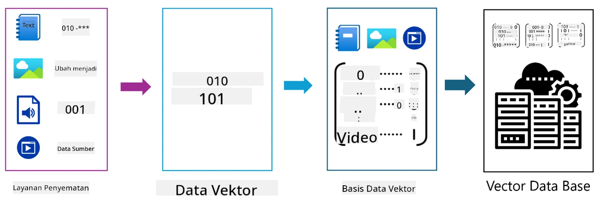
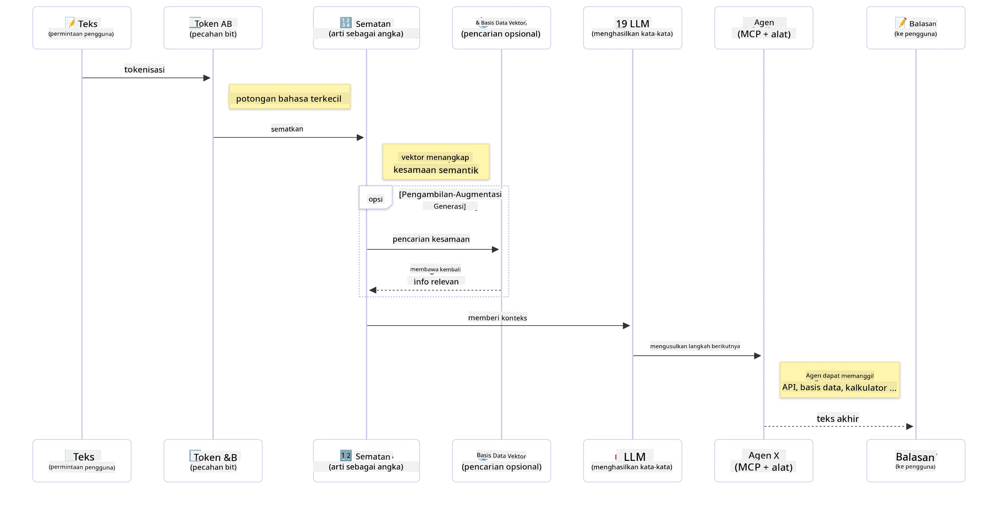

# Pengenalan ke Generative AI - Edisi Java

> **Video**: [Tonton video gambaran pelajaran ini di YouTube.](https://www.youtube.com/watch?v=XH46tGp_eSw) Anda juga dapat mengklik gambar thumbnail di atas.

## Apa yang Akan Anda Pelajari

- **Dasar-dasar Generative AI** termasuk LLM, rekayasa prompt, token, embeddings, dan database vektor
- **Membandingkan alat pengembangan AI Java** termasuk Azure OpenAI SDK, Spring AI, dan OpenAI Java SDK
- **Menemukan Model Context Protocol** dan perannya dalam komunikasi agen AI

## Daftar Isi

- [Pengenalan](#pengenalan)
- [Penyegaran cepat tentang konsep Generative AI](#penyegaran-cepat-tentang-konsep-generative-ai)
- [Ulasan rekayasa prompt](#ulasan-rekayasa-prompt)
- [Token, embeddings, dan agen](#token-embeddings-dan-agen)
- [Alat dan Perpustakaan Pengembangan AI untuk Java](#alat-dan-perpustakaan-pengembangan-ai-untuk-java)
  - [OpenAI Java SDK](#openai-java-sdk)
  - [Spring AI](#spring-ai)
  - [Azure OpenAI Java SDK](#azure-openai-java-sdk)
- [Ringkasan](#ringkasan)
- [Langkah Berikutnya](#langkah-berikutnya)

## Pengenalan

Selamat datang di bab pertama Generative AI untuk Pemula - Edisi Java! Pelajaran dasar ini memperkenalkan Anda pada konsep inti generative AI dan cara bekerja dengannya menggunakan Java. Anda akan mempelajari blok bangunan penting aplikasi AI, termasuk Large Language Models (LLM), token, embeddings, dan agen AI. Kami juga akan menjelajahi alat Java utama yang akan Anda gunakan sepanjang kursus ini.

### Penyegaran cepat tentang konsep Generative AI

Generative AI adalah jenis kecerdasan buatan yang membuat konten baru, seperti teks, gambar, atau kode, berdasarkan pola dan hubungan yang dipelajari dari data. Model generative AI dapat menghasilkan respons seperti manusia, memahami konteks, dan terkadang bahkan membuat konten yang tampak seperti dibuat manusia.

Saat Anda mengembangkan aplikasi AI Java, Anda akan bekerja dengan **model generative AI** untuk membuat konten. Beberapa kemampuan model generative AI meliputi:

- **Generasi Teks**: Membuat teks seperti manusia untuk chatbot, konten, dan pelengkapan teks.
- **Generasi dan Analisis Gambar**: Menghasilkan gambar realistis, meningkatkan foto, dan mendeteksi objek.
- **Generasi Kode**: Menulis potongan kode atau skrip.

Ada jenis model khusus yang dioptimalkan untuk tugas berbeda. Misalnya, baik **Small Language Models (SLM)** maupun **Large Language Models (LLM)** dapat menangani generasi teks, dengan LLM biasanya menawarkan kinerja lebih baik untuk tugas yang kompleks. Untuk tugas yang terkait dengan gambar, Anda akan menggunakan model visi khusus atau model multimodal.

Tentu saja, respons dari model ini tidak selalu sempurna. Anda mungkin sudah pernah mendengar tentang model yang "berhalusinasi" atau menghasilkan informasi yang salah dengan cara yang meyakinkan. Namun Anda dapat membantu membimbing model untuk menghasilkan respons yang lebih baik dengan memberikan instruksi dan konteks yang jelas. Di sinilah **rekayasa prompt** berperan.

#### Ulasan rekayasa prompt

Rekayasa prompt adalah praktik merancang input yang efektif untuk mengarahkan model AI menuju output yang diinginkan. Ini melibatkan:

- **Kejelasan**: Membuat instruksi yang jelas dan tidak ambigu.
- **Konteks**: Memberikan informasi latar belakang yang diperlukan.
- **Keterbatasan**: Menentukan batasan atau format tertentu.

Beberapa praktik terbaik untuk rekayasa prompt termasuk desain prompt, instruksi yang jelas, pemecahan tugas, pembelajaran satu tembakan dan beberapa tembakan, serta tuning prompt. Menguji berbagai prompt sangat penting untuk menemukan yang paling cocok untuk kasus penggunaan Anda.

Saat mengembangkan aplikasi, Anda akan bekerja dengan berbagai tipe prompt:
- **System prompts**: Mengatur aturan dasar dan konteks perilaku model
- **User prompts**: Data input dari pengguna aplikasi Anda
- **Assistant prompts**: Respons model berdasarkan system dan user prompts

> **Pelajari lebih lanjut**: Pelajari lebih lanjut tentang rekayasa prompt di [bab Prompt Engineering dari kursus GenAI for Beginners](https://github.com/microsoft/generative-ai-for-beginners/tree/main/04-prompt-engineering-fundamentals)

#### Token, embeddings, dan agen

Saat bekerja dengan model generative AI, Anda akan menemui istilah seperti **token**, **embeddings**, **agen**, dan **Model Context Protocol (MCP)**. Berikut adalah gambaran rinci tentang konsep-konsep ini:

- **Token**: Token adalah unit terkecil teks dalam model. Mereka bisa berupa kata, karakter, atau subkata. Token digunakan untuk merepresentasikan data teks dalam format yang dapat dipahami oleh model. Misalnya, kalimat "The quick brown fox jumped over the lazy dog" mungkin di-tokenisasi menjadi ["The", " quick", " brown", " fox", " jumped", " over", " the", " lazy", " dog"] atau ["The", " qu", "ick", " br", "own", " fox", " jump", "ed", " over", " the", " la", "zy", " dog"] tergantung pada strategi tokenisasi.

Tokenisasi adalah proses memecah teks menjadi unit yang lebih kecil ini. Ini penting karena model beroperasi pada token daripada teks mentah. Jumlah token dalam prompt memengaruhi panjang dan kualitas respons model, karena model memiliki batas token untuk jendela konteksnya (misalnya, 128K token untuk konteks total GPT-4o, termasuk input dan output).

  Dalam Java, Anda dapat menggunakan perpustakaan seperti OpenAI SDK untuk menangani tokenisasi secara otomatis saat mengirim permintaan ke model AI.

- **Embeddings**: Embeddings adalah representasi vektor dari token yang menangkap makna semantis. Mereka adalah representasi numerik (biasanya array angka floating-point) yang memungkinkan model memahami hubungan antar kata dan menghasilkan respons yang relevan secara kontekstual. Kata-kata serupa memiliki embeddings serupa, sehingga model dapat memahami konsep seperti sinonim dan hubungan semantik.

  Dalam Java, Anda dapat menghasilkan embeddings menggunakan OpenAI SDK atau perpustakaan lain yang mendukung pembuatan embedding. Embeddings ini penting untuk tugas seperti pencarian semantik, di mana Anda ingin menemukan konten serupa berdasarkan makna daripada kecocokan teks secara tepat.

- **Database vektor**: Database vektor adalah sistem penyimpanan khusus yang dioptimalkan untuk embeddings. Mereka memungkinkan pencarian kesamaan yang efisien dan sangat penting untuk pola Retrieval-Augmented Generation (RAG) di mana Anda perlu menemukan informasi relevan dari dataset besar berdasarkan kesamaan semantik, bukan kecocokan persis.

> **Catatan**: Dalam kursus ini, kami tidak akan membahas database vektor tetapi kami rasa layak disebut karena sering digunakan dalam aplikasi dunia nyata.

- **Agen & MCP**: Komponen AI yang berinteraksi secara otonom dengan model, alat, dan sistem eksternal. Model Context Protocol (MCP) menyediakan cara standar bagi agen untuk mengakses sumber data dan alat eksternal secara aman. Pelajari lebih lanjut di kursus kami [MCP for Beginners](https://github.com/microsoft/mcp-for-beginners).

Dalam aplikasi AI Java, Anda akan menggunakan token untuk pemrosesan teks, embeddings untuk pencarian semantik dan RAG, database vektor untuk pengambilan data, dan agen dengan MCP untuk membangun sistem cerdas yang menggunakan alat.

### Alat dan Perpustakaan Pengembangan AI untuk Java

Java menawarkan alat yang sangat baik untuk pengembangan AI. Ada tiga perpustakaan utama yang akan kita jelajahi sepanjang kursus ini - OpenAI Java SDK, Azure OpenAI SDK, dan Spring AI.

Berikut tabel referensi cepat yang menunjukkan SDK mana yang digunakan dalam contoh setiap bab:

| Bab | Contoh | SDK |
|---------|--------|-----|
| 02-SetupDevEnvironment | github-models | OpenAI Java SDK |
| 02-SetupDevEnvironment | basic-chat-azure | Spring AI Azure OpenAI |
| 03-CoreGenerativeAITechniques | examples | Azure OpenAI SDK |
| 04-PracticalSamples | petstory | OpenAI Java SDK |
| 04-PracticalSamples | foundrylocal | OpenAI Java SDK |
| 04-PracticalSamples | calculator | Spring AI MCP SDK + LangChain4j |

**Tautan Dokumentasi SDK:**
- [Azure OpenAI Java SDK](https://github.com/Azure/azure-sdk-for-java/tree/azure-ai-openai_1.0.0-beta.16/sdk/openai/azure-ai-openai)
- [Spring AI](https://docs.spring.io/spring-ai/reference/)
- [OpenAI Java SDK](https://github.com/openai/openai-java)
- [LangChain4j](https://docs.langchain4j.dev/)

#### OpenAI Java SDK

OpenAI SDK adalah perpustakaan Java resmi untuk API OpenAI. Ini menyediakan antarmuka yang sederhana dan konsisten untuk berinteraksi dengan model OpenAI, sehingga mudah untuk mengintegrasikan kemampuan AI ke dalam aplikasi Java. Contoh GitHub Models dari Bab 2, aplikasi Pet Story Bab 4, dan contoh Foundry Local menunjukkan pendekatan OpenAI SDK.

#### Spring AI

Spring AI adalah kerangka kerja komprehensif yang membawa kemampuan AI ke aplikasi Spring, menyediakan lapisan abstraksi konsisten di berbagai penyedia AI. Ini terintegrasi secara mulus dengan ekosistem Spring, menjadikannya pilihan ideal untuk aplikasi Java perusahaan yang membutuhkan kemampuan AI.

Kekuatan Spring AI terletak pada integrasi mulusnya dengan ekosistem Spring, membuatnya mudah membangun aplikasi AI siap produksi dengan pola Spring yang sudah dikenal seperti dependency injection, manajemen konfigurasi, dan kerangka pengujian. Anda akan menggunakan Spring AI di Bab 2 dan 4 untuk membangun aplikasi yang memanfaatkan baik OpenAI maupun protokol Model Context Protocol (MCP) pada perpustakaan Spring AI.

##### Model Context Protocol (MCP)

[Model Context Protocol (MCP)](https://modelcontextprotocol.io/) adalah standar yang sedang berkembang yang memungkinkan aplikasi AI berinteraksi secara aman dengan sumber data dan alat eksternal. MCP menyediakan cara standar bagi model AI untuk mengakses informasi kontekstual dan mengeksekusi tindakan dalam aplikasi Anda.

Di Bab 4, Anda akan membangun layanan kalkulator MCP sederhana yang menunjukkan dasar-dasar Model Context Protocol dengan Spring AI, menampilkan cara membuat integrasi alat dasar dan arsitektur layanan.

#### Azure OpenAI Java SDK

Perpustakaan klien Azure OpenAI untuk Java adalah adaptasi dari API REST OpenAI yang menyediakan antarmuka idiomatik dan integrasi dengan ekosistem SDK Azure lainnya. Di Bab 3, Anda akan membangun aplikasi menggunakan Azure OpenAI SDK, termasuk aplikasi chat, pemanggilan fungsi, dan pola RAG (Retrieval-Augmented Generation).

> Catatan: Azure OpenAI SDK tertinggal dari OpenAI Java SDK dalam hal fitur jadi untuk proyek masa depan, pertimbangkan menggunakan OpenAI Java SDK.

## Ringkasan

Itu melengkapi dasar-dasarnya! Anda sekarang memahami:

- Konsep inti di balik generative AI - dari LLM dan rekayasa prompt hingga token, embeddings, dan database vektor
- Pilihan alat Anda untuk pengembangan AI Java: Azure OpenAI SDK, Spring AI, dan OpenAI Java SDK
- Apa itu Model Context Protocol dan bagaimana memungkinkan agen AI bekerja dengan alat eksternal

## Langkah Berikutnya

[Bab 2: Menyiapkan Lingkungan Pengembangan](../02-SetupDevEnvironment/README.md)

---

<!-- CO-OP TRANSLATOR DISCLAIMER START -->
**Penafian**:  
Dokumen ini telah diterjemahkan menggunakan layanan terjemahan AI [Co-op Translator](https://github.com/Azure/co-op-translator). Meskipun kami berupaya untuk akurasi, harap diketahui bahwa terjemahan otomatis dapat mengandung kesalahan atau ketidakakuratan. Dokumen asli dalam bahasa aslinya harus dianggap sebagai sumber yang otoritatif. Untuk informasi penting, disarankan menggunakan terjemahan profesional oleh manusia. Kami tidak bertanggung jawab atas kesalahpahaman atau interpretasi yang keliru yang timbul dari penggunaan terjemahan ini.
<!-- CO-OP TRANSLATOR DISCLAIMER END -->