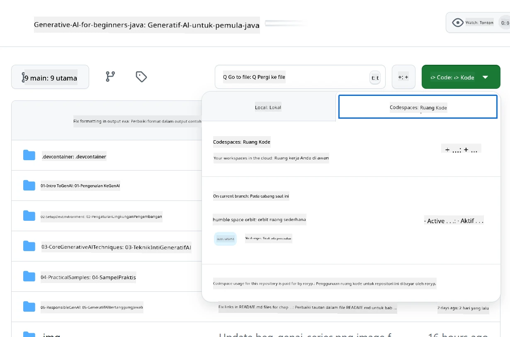
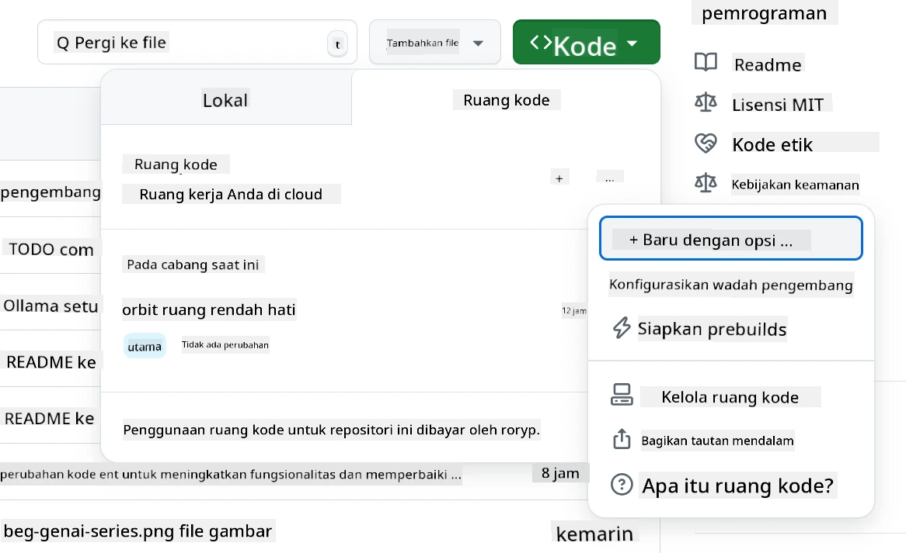
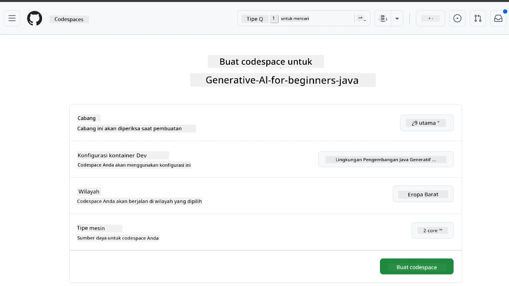
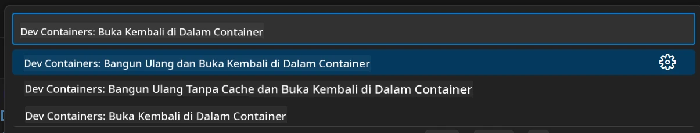
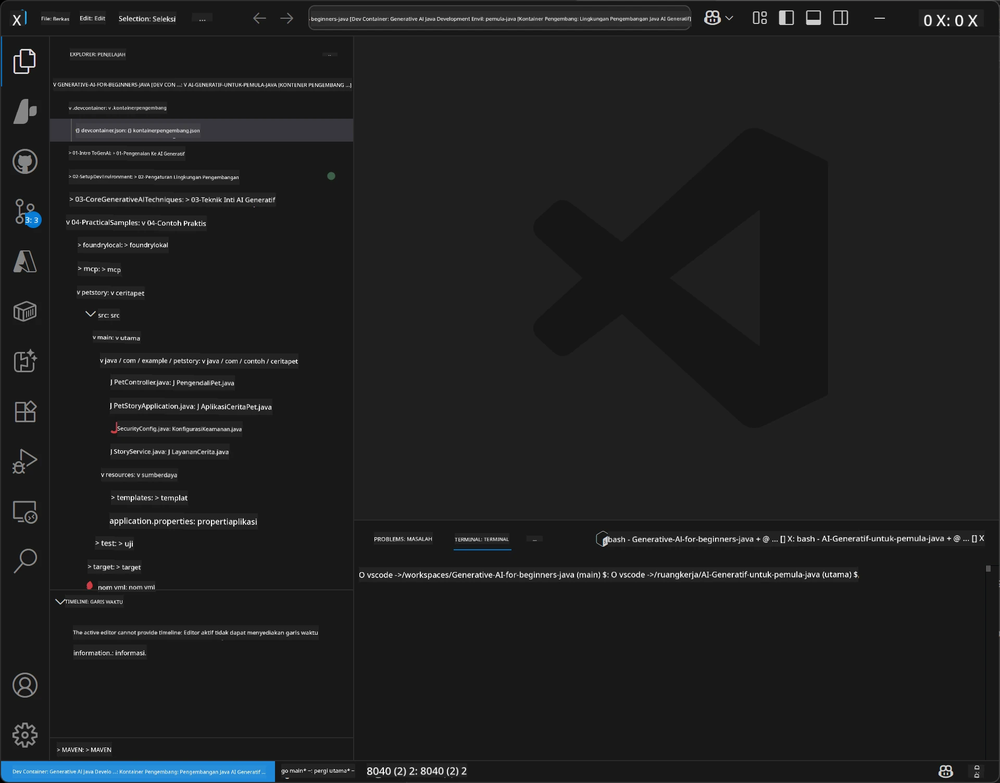
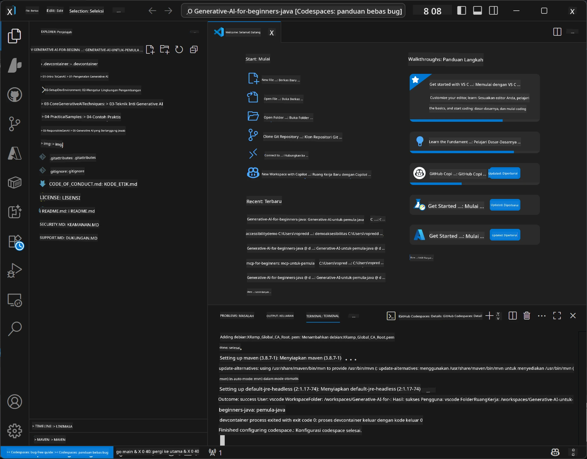

# Menyiapkan Lingkungan Pengembangan untuk Generative AI untuk Java

> **Mulai Cepat**: Kode di Cloud dalam 2 menit - Langsung ke [Pengaturan GitHub Codespaces](../../../02-SetupDevEnvironment) - tidak perlu instalasi lokal dan menggunakan model github!

> **Tertarik dengan Azure OpenAI?**, lihat [Panduan Pengaturan Azure OpenAI](getting-started-azure-openai.md) kami dengan langkah-langkah membuat sumber daya Azure OpenAI baru.

## Apa yang Akan Anda Pelajari

- Menyiapkan lingkungan pengembangan Java untuk aplikasi AI
- Memilih dan mengonfigurasi lingkungan pengembangan favorit Anda (cloud-first dengan Codespaces, kontainer dev lokal, atau pengaturan lokal penuh)
- Menguji pengaturan Anda dengan menghubungkan ke GitHub Models

## Daftar Isi

- [Apa yang Akan Anda Pelajari](../../../02-SetupDevEnvironment)
- [Pendahuluan](../../../02-SetupDevEnvironment)
- [Langkah 1: Siapkan Lingkungan Pengembangan Anda](../../../02-SetupDevEnvironment)
  - [Opsi A: GitHub Codespaces (Direkomendasikan)](../../../02-SetupDevEnvironment)
  - [Opsi B: Kontainer Dev Lokal](../../../02-SetupDevEnvironment)
  - [Opsi C: Gunakan Instalasi Lokal Anda yang Ada](../../../02-SetupDevEnvironment)
- [Langkah 2: Buat Token Akses Pribadi GitHub](../../../02-SetupDevEnvironment)
- [Langkah 3: Uji Pengaturan Anda](../../../02-SetupDevEnvironment)
- [Pemecahan Masalah](../../../02-SetupDevEnvironment)
- [Ringkasan](../../../02-SetupDevEnvironment)
- [Langkah Selanjutnya](../../../02-SetupDevEnvironment)

## Pendahuluan

Bab ini akan membimbing Anda melalui penyiapan lingkungan pengembangan. Kita akan menggunakan **GitHub Models** sebagai contoh utama karena gratis, mudah disiapkan hanya dengan akun GitHub, tidak memerlukan kartu kredit, dan memberikan akses ke beberapa model untuk eksperimen.

**Tidak perlu pengaturan lokal!** Anda dapat mulai coding langsung menggunakan GitHub Codespaces, yang menyediakan lingkungan pengembangan lengkap di browser Anda.


Kami merekomendasikan menggunakan [**GitHub Models**](https://github.com/marketplace?type=models) untuk kursus ini karena:
- **Gratis** untuk memulai
- **Mudah** disiapkan hanya dengan akun GitHub
- **Tidak memerlukan kartu kredit**
- **Beberapa model** tersedia untuk eksperimen

> **Catatan**: GitHub Models yang digunakan dalam pelatihan ini memiliki batasan gratis berikut:
> - 15 permintaan per menit (150 per hari)
> - ~8.000 kata masuk, ~4.000 kata keluar per permintaan
> - 5 permintaan bersamaan
> 
> Untuk penggunaan produksi, tingkatkan ke Azure AI Foundry Models dengan akun Azure Anda. Kode Anda tidak perlu diubah. Lihat [dokumentasi Azure AI Foundry](https://learn.microsoft.com/azure/ai-foundry/foundry-models/how-to/quickstart-github-models).


## Langkah 1: Siapkan Lingkungan Pengembangan Anda

<a name="quick-start-cloud"></a>

Kami telah membuat kontainer pengembangan yang sudah dikonfigurasi sebelumnya untuk meminimalkan waktu pengaturan dan memastikan Anda memiliki semua alat yang diperlukan untuk kursus Generative AI untuk Java ini. Pilih pendekatan pengembangan yang Anda sukai:

### Opsi Pengaturan Lingkungan:

#### Opsi A: GitHub Codespaces (Direkomendasikan)

**Mulai coding dalam 2 menit - tidak perlu pengaturan lokal!**

1. Fork repositori ini ke akun GitHub Anda
   > **Catatan**: Jika Anda ingin mengedit konfigurasi dasar, silakan lihat [Konfigurasi Dev Container](../../../.devcontainer/devcontainer.json)
2. Klik **Code** → tab **Codespaces** → **...** → **New with options...**
3. Gunakan default – ini akan memilih **Konfigurasi kontainer dev**: **Generative AI Java Development Environment** kontainer dev khusus yang dibuat untuk kursus ini
4. Klik **Create codespace**
5. Tunggu sekitar 2 menit supaya lingkungan siap
6. Lanjut ke [Langkah 2: Buat Token GitHub](../../../02-SetupDevEnvironment)








> **Manfaat Codespaces**:
> - Tidak perlu instalasi lokal
> - Bisa digunakan di perangkat apa saja yang memiliki browser
> - Sudah pra-konfigurasi dengan semua alat dan dependensi
> - Gratis 60 jam per bulan untuk akun pribadi
> - Lingkungan yang konsisten untuk semua pelajar

#### Opsi B: Kontainer Dev Lokal

**Untuk pengembang yang lebih suka pengembangan lokal dengan Docker**

1. Fork dan clone repositori ini ke mesin lokal Anda
   > **Catatan**: Jika Anda ingin mengedit konfigurasi dasar, silakan lihat [Konfigurasi Dev Container](../../../.devcontainer/devcontainer.json)
2. Instal [Docker Desktop](https://www.docker.com/products/docker-desktop/) dan [VS Code](https://code.visualstudio.com/)
3. Instal [ekstensi Dev Containers](https://marketplace.visualstudio.com/items?itemName=ms-vscode-remote.remote-containers) di VS Code
4. Buka folder repositori di VS Code
5. Ketika diminta, klik **Reopen in Container** (atau gunakan `Ctrl+Shift+P` → "Dev Containers: Reopen in Container")
6. Tunggu kontainer selesai build dan mulai
7. Lanjut ke [Langkah 2: Buat Token GitHub](../../../02-SetupDevEnvironment)





#### Opsi C: Gunakan Instalasi Lokal Anda yang Ada

**Untuk pengembang dengan lingkungan Java yang sudah ada**

Prasyarat:
- [Java 21+](https://www.oracle.com/java/technologies/javase/jdk21-archive-downloads.html) 
- [Maven 3.9+](https://maven.apache.org/download.cgi)
- [VS Code](https://code.visualstudio.com) atau IDE favorit Anda

Langkah-langkah:
1. Clone repositori ini ke mesin lokal Anda
2. Buka proyek di IDE Anda
3. Lanjut ke [Langkah 2: Buat Token GitHub](../../../02-SetupDevEnvironment)

> **Tips Profesional**: Jika Anda memiliki mesin spek rendah tapi ingin menggunakan VS Code secara lokal, gunakan GitHub Codespaces! Anda dapat menghubungkan VS Code lokal ke Codespace yang dihosting cloud untuk mendapatkan manfaat keduanya.




## Langkah 2: Buat Token Akses Pribadi GitHub

1. Buka [Pengaturan GitHub](https://github.com/settings/profile) dan pilih **Settings** dari menu profil Anda.
2. Di sidebar kiri, klik **Developer settings** (biasanya di bagian bawah).
3. Di bawah **Personal access tokens**, klik **Fine-grained tokens** (atau ikuti tautan langsung ini [link](https://github.com/settings/personal-access-tokens)).
4. Klik **Generate new token**.
5. Di bawah "Token name", berikan nama yang deskriptif (misalnya, `GenAI-Java-Course-Token`).
6. Tetapkan tanggal kadaluarsa (disarankan: 7 hari untuk praktik keamanan terbaik).
7. Di bawah "Resource owner", pilih akun pengguna Anda.
8. Di bawah "Repository access", pilih repositori yang akan Anda gunakan dengan GitHub Models (atau "All repositories" jika perlu).
9. Di bawah "Account permissions", cari **Models** dan setel ke **Read-only**.
10. Klik **Generate token**.
11. **Salin dan simpan token Anda sekarang** – Anda tidak akan melihatnya lagi!

> **Tips Keamanan**: Gunakan cakupan minimum yang diperlukan dan waktu kadaluarsa sesingkat mungkin untuk token akses Anda.

## Langkah 3: Uji Pengaturan Anda dengan Contoh GitHub Models

Setelah lingkungan pengembangan Anda siap, mari uji integrasi GitHub Models dengan aplikasi contoh di [`02-SetupDevEnvironment/examples/github-models`](../../../02-SetupDevEnvironment/examples/github-models).

1. Buka terminal di lingkungan pengembangan Anda.
2. Arahkan ke contoh GitHub Models:
   ```bash
   cd 02-SetupDevEnvironment/examples/github-models
   ```
3. Tetapkan token GitHub Anda sebagai variabel lingkungan:
   ```bash
   # macOS/Linux
   export GITHUB_TOKEN=your_token_here
   
   # Windows (Command Prompt)
   set GITHUB_TOKEN=your_token_here
   
   # Windows (PowerShell)
   $env:GITHUB_TOKEN="your_token_here"
   ```

4. Jalankan aplikasinya:
   ```bash
   mvn compile exec:java -Dexec.mainClass="com.example.githubmodels.App"
   ```

Anda harus melihat keluaran serupa:
```text
Using model: gpt-4.1-nano
Sending request to GitHub Models...
Response: Hello World!
```

### Memahami Kode Contoh

Pertama, mari kita pahami apa yang baru saja kita jalankan. Contoh dalam `examples/github-models` menggunakan OpenAI Java SDK untuk menghubungkan ke GitHub Models:

**Apa yang dilakukan kode ini:**
- **Menghubungkan** ke GitHub Models menggunakan token akses pribadi Anda
- **Mengirim** pesan sederhana "Say Hello World!" ke model AI
- **Menerima** dan menampilkan respons dari AI
- **Memvalidasi** bahwa pengaturan Anda berfungsi dengan benar

**Dependensi Utama** (dalam `pom.xml`):
```xml
<dependency>
    <groupId>com.openai</groupId>
    <artifactId>openai-java</artifactId>
    <version>2.12.0</version>
</dependency>
```

**Kode Utama** (`App.java`):
```java
// Terhubung ke Model GitHub menggunakan OpenAI Java SDK
OpenAIClient client = OpenAIOkHttpClient.builder()
    .apiKey(pat)
    .baseUrl("https://models.inference.ai.azure.com")
    .build();

// Buat permintaan penyelesaian obrolan
ChatCompletionCreateParams params = ChatCompletionCreateParams.builder()
    .model(modelId)
    .addSystemMessage("You are a concise assistant.")
    .addUserMessage("Say Hello World!")
    .build();

// Dapatkan respons AI
ChatCompletion response = client.chat().completions().create(params);
System.out.println("Response: " + response.choices().get(0).message().content().orElse("No response content"));
```

## Ringkasan

Bagus! Sekarang Anda telah menyiapkan semuanya:

- Membuat Token Akses Pribadi GitHub dengan izin yang tepat untuk akses model AI
- Menjalankan lingkungan pengembangan Java Anda (baik itu Codespaces, kontainer dev, atau lokal)
- Terhubung ke GitHub Models menggunakan OpenAI Java SDK untuk pengembangan AI gratis
- Menguji semuanya bekerja dengan contoh sederhana yang berbicara dengan model AI

## Langkah Selanjutnya

[Bab 3: Teknik Generative AI Inti](../03-CoreGenerativeAITechniques/README.md)

## Pemecahan Masalah

Mengalami masalah? Berikut masalah dan solusi umum:

- **Token tidak bekerja?** 
  - Pastikan Anda menyalin seluruh token tanpa spasi tambahan
  - Verifikasi token sudah diatur dengan benar sebagai variabel lingkungan
  - Periksa bahwa token Anda memiliki izin yang tepat (Models: Read-only)

- **Maven tidak ditemukan?** 
  - Jika menggunakan dev container/Codespaces, Maven sudah terpasang
  - Untuk pengaturan lokal, pastikan Java 21+ dan Maven 3.9+ sudah terpasang
  - Coba jalankan `mvn --version` untuk verifikasi instalasi

- **Masalah koneksi?** 
  - Periksa koneksi internet Anda
  - Pastikan GitHub dapat diakses dari jaringan Anda
  - Pastikan Anda tidak berada di balik firewall yang memblokir endpoint GitHub Models

- **Kontainer dev tidak mulai?** 
  - Pastikan Docker Desktop berjalan (untuk pengembangan lokal)
  - Coba bangun ulang kontainer: `Ctrl+Shift+P` → "Dev Containers: Rebuild Container"

- **Kesalahan kompilasi aplikasi?**
  - Pastikan Anda berada di direktori yang benar: `02-SetupDevEnvironment/examples/github-models`
  - Coba bersihkan dan bangun ulang: `mvn clean compile`

> **Butuh bantuan?**: Masih mengalami masalah? Buka issue di repositori dan kami akan membantu Anda.

---

<!-- CO-OP TRANSLATOR DISCLAIMER START -->
**Penafian**:  
Dokumen ini telah diterjemahkan menggunakan layanan terjemahan AI [Co-op Translator](https://github.com/Azure/co-op-translator). Meskipun kami berusaha untuk akurasi, harap diingat bahwa terjemahan otomatis mungkin mengandung kesalahan atau ketidakakuratan. Dokumen asli dalam bahasa aslinya harus dianggap sebagai sumber yang sahih. Untuk informasi penting, disarankan menggunakan terjemahan profesional oleh manusia. Kami tidak bertanggung jawab atas kesalahpahaman atau salah tafsir yang timbul dari penggunaan terjemahan ini.
<!-- CO-OP TRANSLATOR DISCLAIMER END -->