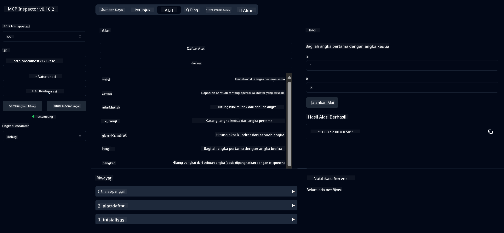

<!--
CO_OP_TRANSLATOR_METADATA:
{
  "original_hash": "7bf9a4a832911269a8bd0decb97ff36c",
  "translation_date": "2025-07-21T20:00:06+00:00",
  "source_file": "04-PracticalSamples/mcp/calculator/README.md",
  "language_code": "id"
}
-->
# Layanan Kalkulator Dasar MCP

>**Catatan**: Bab ini mencakup [**Tutorial**](./TUTORIAL.md) yang membimbing Anda menjalankan sampel yang telah selesai.

Selamat datang di pengalaman langsung pertama Anda dengan **Model Context Protocol (MCP)**! Di bab sebelumnya, Anda telah mempelajari dasar-dasar AI generatif dan menyiapkan lingkungan pengembangan Anda. Sekarang saatnya membangun sesuatu yang praktis.

Layanan kalkulator ini menunjukkan bagaimana model AI dapat berinteraksi dengan alat eksternal secara aman menggunakan MCP. Alih-alih mengandalkan kemampuan matematika model AI yang terkadang tidak dapat diandalkan, kami akan menunjukkan cara membangun sistem yang kuat di mana AI dapat memanggil layanan khusus untuk perhitungan yang akurat.

## Daftar Isi

- [Apa yang Akan Anda Pelajari](../../../../../04-PracticalSamples/mcp/calculator)
- [Prasyarat](../../../../../04-PracticalSamples/mcp/calculator)
- [Konsep Utama](../../../../../04-PracticalSamples/mcp/calculator)
- [Panduan Cepat](../../../../../04-PracticalSamples/mcp/calculator)
- [Operasi Kalkulator yang Tersedia](../../../../../04-PracticalSamples/mcp/calculator)
- [Klien Pengujian](../../../../../04-PracticalSamples/mcp/calculator)
  - [1. Klien MCP Langsung (SDKClient)](../../../../../04-PracticalSamples/mcp/calculator)
  - [2. Klien Berbasis AI (LangChain4jClient)](../../../../../04-PracticalSamples/mcp/calculator)
- [MCP Inspector (Web UI)](../../../../../04-PracticalSamples/mcp/calculator)
  - [Instruksi Langkah-demi-Langkah](../../../../../04-PracticalSamples/mcp/calculator)

## Apa yang Akan Anda Pelajari

Dengan menyelesaikan contoh ini, Anda akan memahami:
- Cara membuat layanan yang kompatibel dengan MCP menggunakan Spring Boot
- Perbedaan antara komunikasi protokol langsung dan interaksi berbasis AI
- Bagaimana model AI memutuskan kapan dan bagaimana menggunakan alat eksternal
- Praktik terbaik untuk membangun aplikasi AI yang mendukung alat

Sangat cocok untuk pemula yang mempelajari konsep MCP dan siap membangun integrasi alat AI pertama mereka!

## Prasyarat

- Java 21+
- Maven 3.6+
- **GitHub Token**: Diperlukan untuk klien berbasis AI. Jika Anda belum menyiapkannya, lihat [Bab 2: Menyiapkan lingkungan pengembangan Anda](../../../02-SetupDevEnvironment/README.md) untuk instruksi.

## Konsep Utama

**Model Context Protocol (MCP)** adalah cara standar bagi aplikasi AI untuk terhubung dengan alat eksternal secara aman. Anggap saja sebagai "jembatan" yang memungkinkan model AI menggunakan layanan eksternal seperti kalkulator kita. Alih-alih model AI mencoba melakukan perhitungan sendiri (yang bisa tidak akurat), ia dapat memanggil layanan kalkulator kita untuk mendapatkan hasil yang akurat. MCP memastikan komunikasi ini terjadi dengan aman dan konsisten.

**Server-Sent Events (SSE)** memungkinkan komunikasi waktu nyata antara server dan klien. Berbeda dengan permintaan HTTP tradisional di mana Anda meminta dan menunggu respons, SSE memungkinkan server terus mengirim pembaruan ke klien. Ini sangat cocok untuk aplikasi AI di mana respons mungkin dialirkan atau membutuhkan waktu untuk diproses.

**AI Tools & Function Calling** memungkinkan model AI secara otomatis memilih dan menggunakan fungsi eksternal (seperti operasi kalkulator) berdasarkan permintaan pengguna. Ketika Anda bertanya "Berapa 15 + 27?", model AI memahami bahwa Anda ingin melakukan penjumlahan, secara otomatis memanggil alat `add` dengan parameter yang benar (15, 27), dan mengembalikan hasilnya dalam bahasa alami. AI bertindak sebagai koordinator cerdas yang tahu kapan dan bagaimana menggunakan setiap alat.

## Panduan Cepat

### 1. Arahkan ke direktori aplikasi kalkulator
```bash
cd Generative-AI-for-beginners-java/04-PracticalSamples/mcp/calculator
```

### 2. Bangun & Jalankan
```bash
mvn clean install -DskipTests
java -jar target/calculator-server-0.0.1-SNAPSHOT.jar
```

### 3. Uji dengan Klien
- **SDKClient**: Interaksi protokol MCP langsung
- **LangChain4jClient**: Interaksi bahasa alami berbasis AI (memerlukan token GitHub)

## Operasi Kalkulator yang Tersedia

- `add(a, b)`, `subtract(a, b)`, `multiply(a, b)`, `divide(a, b)`
- `power(base, exponent)`, `squareRoot(number)`, `absolute(number)`
- `modulus(a, b)`, `help()`

## Klien Pengujian

### 1. Klien MCP Langsung (SDKClient)
Menguji komunikasi protokol MCP mentah. Jalankan dengan:
```bash
mvn test-compile exec:java -Dexec.mainClass="com.microsoft.mcp.sample.client.SDKClient" -Dexec.classpathScope=test
```

### 2. Klien Berbasis AI (LangChain4jClient)
Menunjukkan interaksi bahasa alami dengan Model GitHub. Memerlukan token GitHub (lihat [Prasyarat](../../../../../04-PracticalSamples/mcp/calculator)).

**Jalankan:**
```bash
mvn test-compile exec:java -Dexec.mainClass="com.microsoft.mcp.sample.client.LangChain4jClient" -Dexec.classpathScope=test
```

## MCP Inspector (Web UI)

MCP Inspector menyediakan antarmuka web visual untuk menguji layanan MCP Anda tanpa menulis kode. Sangat cocok untuk pemula yang ingin memahami cara kerja MCP!

### Instruksi Langkah-demi-Langkah:

1. **Jalankan server kalkulator** (jika belum berjalan):
   ```bash
   java -jar target/calculator-server-0.0.1-SNAPSHOT.jar
   ```

2. **Instal dan jalankan MCP Inspector** di terminal baru:
   ```bash
   npx @modelcontextprotocol/inspector
   ```

3. **Buka antarmuka web**:
   - Cari pesan seperti "Inspector running at http://localhost:6274"
   - Buka URL tersebut di browser Anda

4. **Hubungkan ke layanan kalkulator Anda**:
   - Di antarmuka web, atur jenis transportasi ke "SSE"
   - Atur URL ke: `http://localhost:8080/sse`
   - Klik tombol "Connect"

5. **Jelajahi alat yang tersedia**:
   - Klik "List Tools" untuk melihat semua operasi kalkulator
   - Anda akan melihat fungsi seperti `add`, `subtract`, `multiply`, dll.

6. **Uji operasi kalkulator**:
   - Pilih alat (misalnya, "add")
   - Masukkan parameter (misalnya, `a: 15`, `b: 27`)
   - Klik "Run Tool"
   - Lihat hasil yang dikembalikan oleh layanan MCP Anda!

Pendekatan visual ini membantu Anda memahami dengan tepat bagaimana komunikasi MCP bekerja sebelum membangun klien Anda sendiri.



---
**Referensi:** [Dokumentasi MCP Server Boot Starter](https://docs.spring.io/spring-ai/reference/api/mcp/mcp-server-boot-starter-docs.html)

**Penafian**:  
Dokumen ini telah diterjemahkan menggunakan layanan penerjemahan AI [Co-op Translator](https://github.com/Azure/co-op-translator). Meskipun kami berusaha untuk memberikan hasil yang akurat, harap diingat bahwa terjemahan otomatis mungkin mengandung kesalahan atau ketidakakuratan. Dokumen asli dalam bahasa aslinya harus dianggap sebagai sumber yang otoritatif. Untuk informasi yang bersifat kritis, disarankan menggunakan jasa penerjemahan profesional oleh manusia. Kami tidak bertanggung jawab atas kesalahpahaman atau penafsiran yang keliru yang timbul dari penggunaan terjemahan ini.