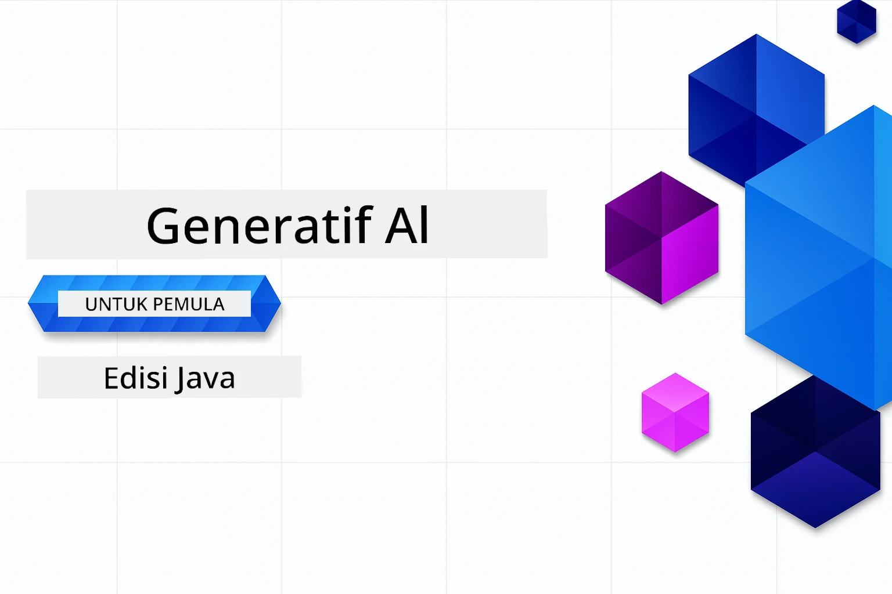

# Generative AI untuk Pemula - Edisi Java
[](https://discord.gg/nTYy5BXMWG)



**Komitmen Waktu**: Seluruh workshop dapat diselesaikan secara online tanpa pengaturan lokal. Pengaturan lingkungan memakan waktu 2 menit, dengan eksplorasi sampel memerlukan 1-3 jam tergantung kedalaman eksplorasi.

> **Mulai Cepat**

1. Fork repositori ini ke akun GitHub Anda
2. Klik **Code** → tab **Codespaces** → **...** → **New with options...**
3. Gunakan default – ini akan memilih Development container yang dibuat untuk kursus ini
4. Klik **Create codespace**
5. Tunggu sekitar 2 menit untuk lingkungan siap
6. Langsung menuju ke [Contoh pertama](./02-SetupDevEnvironment/README.md#step-2-create-a-github-personal-access-token)

> **Lebih suka Clone Lokal?**
>
> Repositori ini termasuk lebih dari 50 terjemahan bahasa yang secara signifikan meningkatkan ukuran unduhan. Untuk clone tanpa terjemahan, gunakan sparse checkout:
> ```bash
> git clone --filter=blob:none --sparse https://github.com/microsoft/Generative-AI-for-beginners-java.git
> cd Generative-AI-for-beginners-java
> git sparse-checkout set --no-cone '/*' '!translations' '!translated_images'
> ```
> Ini memberikan semua yang Anda butuhkan untuk menyelesaikan kursus dengan unduhan yang jauh lebih cepat.


## Dukungan Multi-Bahasa

### Didukung melalui GitHub Action (Otomatis & Selalu Terbaru)

<!-- CO-OP TRANSLATOR LANGUAGES TABLE START -->
[Arab](../ar/README.md) | [Bengali](../bn/README.md) | [Bulgaria](../bg/README.md) | [Burma (Myanmar)](../my/README.md) | [Cina (Sederhana)](../zh-CN/README.md) | [Cina (Tradisional, Hong Kong)](../zh-HK/README.md) | [Cina (Tradisional, Macau)](../zh-MO/README.md) | [Cina (Tradisional, Taiwan)](../zh-TW/README.md) | [Kroasia](../hr/README.md) | [Ceko](../cs/README.md) | [Denmark](../da/README.md) | [Belanda](../nl/README.md) | [Estonia](../et/README.md) | [Finlandia](../fi/README.md) | [Perancis](../fr/README.md) | [Jerman](../de/README.md) | [Yunani](../el/README.md) | [Ibrani](../he/README.md) | [Hindi](../hi/README.md) | [Hongaria](../hu/README.md) | [Indonesia](./README.md) | [Italia](../it/README.md) | [Jepang](../ja/README.md) | [Kannada](../kn/README.md) | [Korea](../ko/README.md) | [Lituania](../lt/README.md) | [Melayu](../ms/README.md) | [Malayalam](../ml/README.md) | [Marathi](../mr/README.md) | [Nepali](../ne/README.md) | [Pidgin Nigeria](../pcm/README.md) | [Norwegia](../no/README.md) | [Persia (Farsi)](../fa/README.md) | [Polandia](../pl/README.md) | [Portugis (Brasil)](../pt-BR/README.md) | [Portugis (Portugal)](../pt-PT/README.md) | [Punjabi (Gurmukhi)](../pa/README.md) | [Rumania](../ro/README.md) | [Rusia](../ru/README.md) | [Serbia (Sirilik)](../sr/README.md) | [Slovakia](../sk/README.md) | [Slovenia](../sl/README.md) | [Spanyol](../es/README.md) | [Swahili](../sw/README.md) | [Swedia](../sv/README.md) | [Tagalog (Filipina)](../tl/README.md) | [Tamil](../ta/README.md) | [Telugu](../te/README.md) | [Thai](../th/README.md) | [Turki](../tr/README.md) | [Ukraina](../uk/README.md) | [Urdu](../ur/README.md) | [Vietnam](../vi/README.md)

## Struktur Kursus & Jalur Pembelajaran

### **Bab 1: Pengenalan ke Generative AI**
- **Konsep Inti**: Memahami Large Language Models, token, embeddings, dan kemampuan AI
- **Ekosistem AI Java**: Gambaran umum Spring AI dan OpenAI SDK
- **Protokol Konteks Model**: Pengenalan MCP dan perannya dalam komunikasi agen AI
- **Aplikasi Praktis**: Skenario dunia nyata termasuk chatbot dan pembuatan konten
- **[→ Mulai Bab 1](./01-IntroToGenAI/README.md)**

### **Bab 2: Pengaturan Lingkungan Pengembangan**
- **Konfigurasi Multi-Penyedia**: Mengatur GitHub Models, Azure OpenAI, dan integrasi OpenAI Java SDK
- **Spring Boot + Spring AI**: Praktik terbaik untuk pengembangan aplikasi AI enterprise
- **GitHub Models**: Akses model AI gratis untuk prototipe dan pembelajaran (tidak perlu kartu kredit)
- **Peralatan Pengembangan**: Docker containers, VS Code, dan konfigurasi GitHub Codespaces
- **[→ Mulai Bab 2](./02-SetupDevEnvironment/README.md)**

### **Bab 3: Teknik Inti Generative AI**
- **Prompt Engineering**: Teknik untuk respons optimal model AI
- **Embeddings & Operasi Vektor**: Menerapkan pencarian semantik dan pencocokan kesamaan
- **Retrieval-Augmented Generation (RAG)**: Menggabungkan AI dengan sumber data Anda sendiri
- **Function Calling**: Memperluas kemampuan AI dengan alat dan plugin kustom
- **[→ Mulai Bab 3](./03-CoreGenerativeAITechniques/README.md)**

### **Bab 4: Aplikasi Praktis & Proyek**
- **Generator Cerita Hewan Peliharaan** (`petstory/`): Pembuatan konten kreatif dengan GitHub Models
- **Demo Foundry Lokal** (`foundrylocal/`): Integrasi model AI lokal dengan OpenAI Java SDK
- **Layanan Kalkulator MCP** (`calculator/`): Implementasi dasar Model Context Protocol dengan Spring AI
- **[→ Mulai Bab 4](./04-PracticalSamples/README.md)**

### **Bab 5: Pengembangan AI yang Bertanggung Jawab**
- **Keamanan GitHub Models**: Uji penyaringan konten dan mekanisme keamanan bawaan (blok keras dan penolakan lunak)
- **Demo AI Bertanggung Jawab**: Contoh langsung menunjukkan cara kerja sistem keamanan AI modern
- **Praktik Terbaik**: Pedoman penting untuk pengembangan dan penerapan AI yang etis
- **[→ Mulai Bab 5](./05-ResponsibleGenAI/README.md)**

## Sumber Daya Tambahan

<!-- CO-OP TRANSLATOR OTHER COURSES START -->
### LangChain
[](https://aka.ms/langchain4j-for-beginners)
[](https://aka.ms/langchainjs-for-beginners?WT.mc_id=m365-94501-dwahlin)

---

### Azure / Edge / MCP / Agen
[](https://github.com/microsoft/AZD-for-beginners?WT.mc_id=academic-105485-koreyst)
[](https://github.com/microsoft/edgeai-for-beginners?WT.mc_id=academic-105485-koreyst)
[](https://github.com/microsoft/mcp-for-beginners?WT.mc_id=academic-105485-koreyst)
[](https://github.com/microsoft/ai-agents-for-beginners?WT.mc_id=academic-105485-koreyst)

---
 
### Seri Generative AI
[](https://github.com/microsoft/generative-ai-for-beginners?WT.mc_id=academic-105485-koreyst)
[-9333EA?style=for-the-badge&labelColor=E5E7EB&color=9333EA)](https://github.com/microsoft/Generative-AI-for-beginners-dotnet?WT.mc_id=academic-105485-koreyst)
[-C084FC?style=for-the-badge&labelColor=E5E7EB&color=C084FC)](https://github.com/microsoft/generative-ai-for-beginners-java?WT.mc_id=academic-105485-koreyst)
[-E879F9?style=for-the-badge&labelColor=E5E7EB&color=E879F9)](https://github.com/microsoft/generative-ai-with-javascript?WT.mc_id=academic-105485-koreyst)

---
 
### Pembelajaran Inti
[](https://aka.ms/ml-beginners?WT.mc_id=academic-105485-koreyst)
[](https://aka.ms/datascience-beginners?WT.mc_id=academic-105485-koreyst)
[](https://aka.ms/ai-beginners?WT.mc_id=academic-105485-koreyst)
[](https://github.com/microsoft/Security-101?WT.mc_id=academic-96948-sayoung)
[](https://aka.ms/webdev-beginners?WT.mc_id=academic-105485-koreyst)
[](https://aka.ms/iot-beginners?WT.mc_id=academic-105485-koreyst)
[](https://github.com/microsoft/xr-development-for-beginners?WT.mc_id=academic-105485-koreyst)

---
 
### Seri Copilot
[](https://aka.ms/GitHubCopilotAI?WT.mc_id=academic-105485-koreyst)
[](https://github.com/microsoft/mastering-github-copilot-for-dotnet-csharp-developers?WT.mc_id=academic-105485-koreyst)
[](https://github.com/microsoft/CopilotAdventures?WT.mc_id=academic-105485-koreyst)
<!-- CO-OP TRANSLATOR OTHER COURSES END -->

## Mendapatkan Bantuan

Jika Anda mengalami kebingungan atau memiliki pertanyaan tentang membangun aplikasi AI. Bergabunglah dengan sesama pembelajar dan pengembang berpengalaman dalam diskusi tentang MCP. Ini adalah komunitas yang mendukung di mana pertanyaan diterima dan pengetahuan dibagikan dengan bebas.

[](https://discord.gg/nTYy5BXMWG)

Jika Anda memiliki masukan produk atau menemukan kesalahan saat membangun, kunjungi:

[](https://aka.ms/foundry/forum)

---

<!-- CO-OP TRANSLATOR DISCLAIMER START -->
**Penafian**:  
Dokumen ini telah diterjemahkan menggunakan layanan terjemahan AI [Co-op Translator](https://github.com/Azure/co-op-translator). Meskipun kami berusaha untuk akurasi, harap diketahui bahwa terjemahan otomatis mungkin mengandung kesalahan atau ketidakakuratan. Dokumen asli dalam bahasa aslinya harus dianggap sebagai sumber yang sahih. Untuk informasi penting, disarankan menggunakan terjemahan profesional oleh manusia. Kami tidak bertanggung jawab atas kesalahpahaman atau salah tafsir yang timbul dari penggunaan terjemahan ini.
<!-- CO-OP TRANSLATOR DISCLAIMER END -->