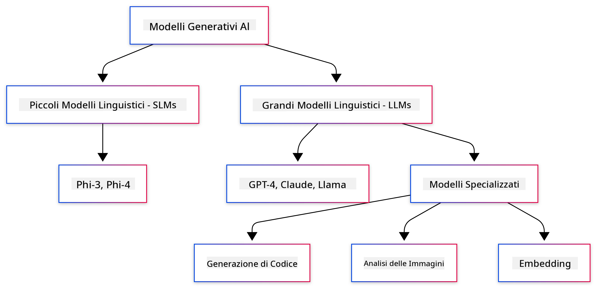
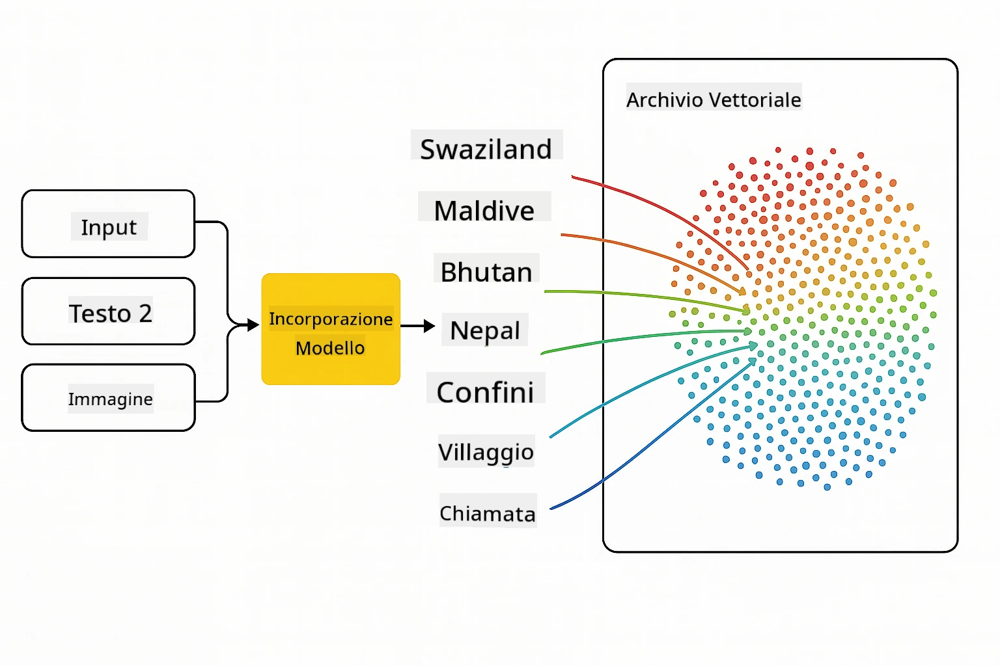
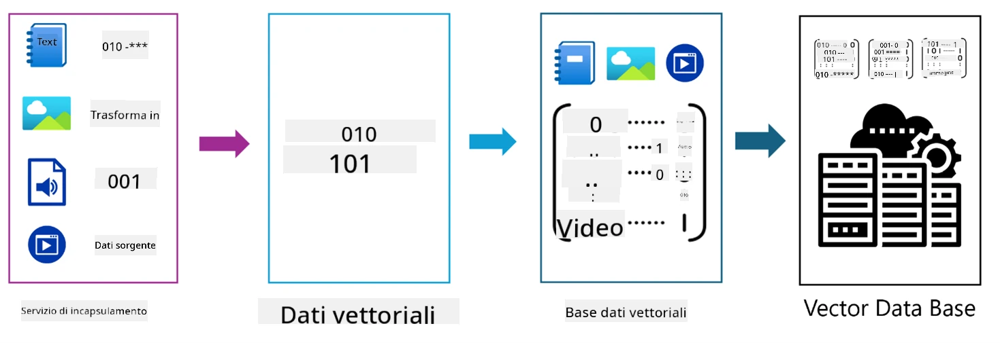
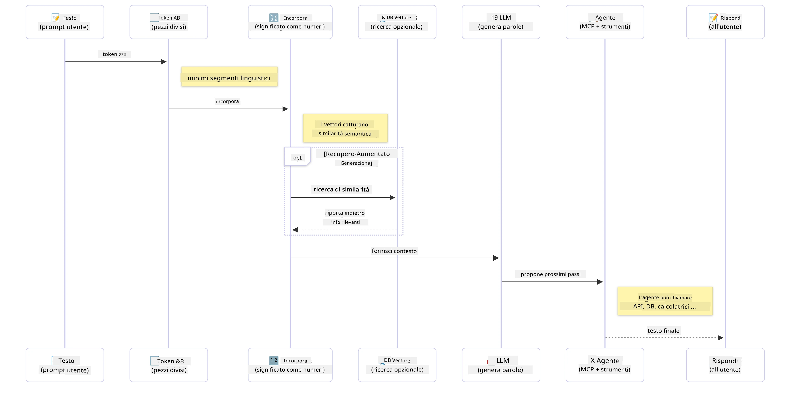

# Introduzione all'IA Generativa - Edizione Java

> **Video**: [Guarda il video di panoramica per questa lezione su YouTube.](https://www.youtube.com/watch?v=XH46tGp_eSw) Puoi anche cliccare sull'immagine in miniatura sopra.

## Cosa Imparerai

- **Fondamenti di IA generativa** inclusi LLM, ingegneria dei prompt, token, embeddings e database vettoriali
- **Confronta gli strumenti di sviluppo AI per Java** inclusi Azure OpenAI SDK, Spring AI e OpenAI Java SDK
- **Scopri il Protocollo del Contesto Modello** e il suo ruolo nella comunicazione degli agenti AI

## Sommario

- [Introduzione](#introduzione)
- [Un rapido ripasso sui concetti di IA Generativa](#un-rapido-ripasso-sui-concetti-di-ia-generativa)
- [Revisione dell'ingegneria dei prompt](#revisione-dellingegneria-dei-prompt)
- [Token, embeddings e agenti](#token-embeddings-e-agenti)
- [Strumenti e librerie di sviluppo AI per Java](#strumenti-e-librerie-di-sviluppo-ai-per-java)
  - [OpenAI Java SDK](#openai-java-sdk)
  - [Spring AI](#spring-ai)
  - [Azure OpenAI Java SDK](#azure-openai-java-sdk)
- [Riepilogo](#riepilogo)
- [Prossimi Passi](#prossimi-passi)

## Introduzione

Benvenuto al primo capitolo di IA Generativa per Principianti - Edizione Java! Questa lezione fondamentale ti introduce ai concetti base dell'IA generativa e a come lavorarci usando Java. Imparerai i blocchi essenziali delle applicazioni AI, inclusi i Modelli di Linguaggio di Grandi Dimensioni (LLM), token, embeddings e agenti AI. Esploreremo anche gli strumenti principali per Java che utilizzerai durante questo corso.

### Un rapido ripasso sui concetti di IA Generativa

L'IA generativa è un tipo di intelligenza artificiale che crea nuovi contenuti, come testo, immagini o codice, basandosi su schemi e relazioni apprese dai dati. I modelli di IA generativa possono generare risposte simili a quelle umane, comprendere il contesto e talvolta anche creare contenuti che sembrano umani.

Quando sviluppi le tue applicazioni IA in Java, lavorerai con **modelli di IA generativa** per creare contenuti. Alcune capacità dei modelli di IA generativa includono:

- **Generazione di testo**: creare testo simile a quello umano per chatbot, contenuti e completamento di testo.
- **Generazione e analisi di immagini**: produrre immagini realistiche, migliorare foto e rilevare oggetti.
- **Generazione di codice**: scrivere frammenti di codice o script.

Esistono tipi specifici di modelli ottimizzati per differenti compiti. Per esempio, sia i **Modelli Linguistici Piccoli (SLM)** che i **Modelli Linguistici Grandi (LLM)** possono gestire generazione di testo, con gli LLM che tipicamente offrono performance migliori per compiti complessi. Per compiti legati alle immagini, useresti modelli specializzati per la visione o modelli multimodali.

Naturalmente, le risposte di questi modelli non sono sempre perfette. Probabilmente hai sentito parlare di modelli che "allucinano" o generano informazioni errate in maniera autorevole. Ma puoi aiutare il modello a generare risposte migliori fornendo istruzioni e contesto chiari. Qui entra in gioco **l'ingegneria dei prompt**.

#### Revisione dell'ingegneria dei prompt

L'ingegneria dei prompt è la pratica di progettare input efficaci per indirizzare i modelli AI verso output desiderati. Comporta:

- **Chiarezza**: rendere le istruzioni chiare e univoche.
- **Contesto**: fornire informazioni di base necessarie.
- **Vincoli**: specificare eventuali limitazioni o formati.

Alcune best practice per l'ingegneria dei prompt includono la progettazione dei prompt, istruzioni chiare, suddivisione dei compiti, apprendimento one-shot e few-shot, e ottimizzazione dei prompt. Testare diversi prompt è essenziale per trovare ciò che funziona meglio per il tuo caso d'uso specifico.

Quando sviluppi applicazioni, lavorerai con diversi tipi di prompt:
- **Prompt di sistema**: impostano le regole base e il contesto per il comportamento del modello
- **Prompt utente**: i dati di input dagli utenti della tua applicazione
- **Prompt assistente**: le risposte del modello basate su prompt di sistema e utente

> **Scopri di più**: Scopri di più sull'ingegneria dei prompt nel [capitolo sull'ingegneria dei prompt del corso GenAI per principianti](https://github.com/microsoft/generative-ai-for-beginners/tree/main/04-prompt-engineering-fundamentals)

#### Token, embeddings e agenti

Lavorando con i modelli di IA generativa, incontrerai termini come **token**, **embeddings**, **agenti** e **Model Context Protocol (MCP)**. Ecco una panoramica dettagliata di questi concetti:

- **Token**: I token sono la più piccola unità di testo in un modello. Possono essere parole, caratteri o sottoparole. I token rappresentano i dati testuali in un formato che il modello può comprendere. Per esempio, la frase "The quick brown fox jumped over the lazy dog" potrebbe essere tokenizzata come ["The", " quick", " brown", " fox", " jumped", " over", " the", " lazy", " dog"] oppure ["The", " qu", "ick", " br", "own", " fox", " jump", "ed", " over", " the", " la", "zy", " dog"] a seconda della strategia di tokenizzazione.

La tokenizzazione è il processo di suddivisione del testo in queste unità più piccole. È cruciale perché i modelli operano sui token piuttosto che sul testo grezzo. Il numero di token in un prompt influisce sulla lunghezza e qualità della risposta del modello, poiché i modelli hanno limiti di token per la loro finestra contestuale (ad esempio, 128K token per il contesto totale di GPT-4o, includendo input e output).

  In Java, puoi usare librerie come l'OpenAI SDK per gestire automaticamente la tokenizzazione quando invii richieste ai modelli AI.

- **Embeddings**: Gli embeddings sono rappresentazioni vettoriali dei token che catturano il significato semantico. Sono rappresentazioni numeriche (tipicamente array di numeri a virgola mobile) che permettono ai modelli di capire le relazioni tra le parole e generare risposte contestualmente rilevanti. Parole simili hanno embeddings simili, permettendo al modello di comprendere concetti come sinonimi e relazioni semantiche.

  In Java, puoi generare embeddings usando l'OpenAI SDK o altre librerie che supportano la generazione di embeddings. Questi embeddings sono fondamentali per compiti come la ricerca semantica, dove vuoi trovare contenuti simili basati sul significato piuttosto che sulle corrispondenze testuali esatte.

- **Database vettoriali**: I database vettoriali sono sistemi di archiviazione specializzati ottimizzati per gli embeddings. Permettono ricerche di similarità efficienti e sono cruciali per i pattern Retrieval-Augmented Generation (RAG), dove devi trovare informazioni rilevanti da grandi dataset basandoti sulla similarità semantica piuttosto che su corrispondenze esatte.

> **Nota**: In questo corso non tratteremo i database vettoriali, ma li menzioniamo perché sono comunemente usati nelle applicazioni del mondo reale.

- **Agenti & MCP**: Componenti AI che interagiscono autonomamente con modelli, strumenti e sistemi esterni. Il Protocollo del Contesto Modello (MCP) fornisce un modo standardizzato per gli agenti di accedere in modo sicuro a fonti di dati esterne e strumenti. Scopri di più nel nostro corso [MCP for Beginners](https://github.com/microsoft/mcp-for-beginners).

Nelle applicazioni AI Java, utilizzerai token per l'elaborazione del testo, embeddings per la ricerca semantica e RAG, database vettoriali per il recupero dati e agenti con MCP per costruire sistemi intelligenti che usano strumenti.

### Strumenti e librerie di sviluppo AI per Java

Java offre ottimi strumenti per lo sviluppo AI. Ci sono tre librerie principali che esploreremo in questo corso - OpenAI Java SDK, Azure OpenAI SDK e Spring AI.

Ecco una tabella di riferimento rapido che mostra quale SDK è usato negli esempi di ogni capitolo:

| Capitolo | Esempio | SDK |
|---------|--------|-----|
| 02-SetupDevEnvironment | github-models | OpenAI Java SDK |
| 02-SetupDevEnvironment | basic-chat-azure | Spring AI Azure OpenAI |
| 03-CoreGenerativeAITechniques | examples | Azure OpenAI SDK |
| 04-PracticalSamples | petstory | OpenAI Java SDK |
| 04-PracticalSamples | foundrylocal | OpenAI Java SDK |
| 04-PracticalSamples | calculator | Spring AI MCP SDK + LangChain4j |

**Link alla documentazione SDK:**
- [Azure OpenAI Java SDK](https://github.com/Azure/azure-sdk-for-java/tree/azure-ai-openai_1.0.0-beta.16/sdk/openai/azure-ai-openai)
- [Spring AI](https://docs.spring.io/spring-ai/reference/)
- [OpenAI Java SDK](https://github.com/openai/openai-java)
- [LangChain4j](https://docs.langchain4j.dev/)

#### OpenAI Java SDK

L'SDK OpenAI è la libreria ufficiale Java per l'API OpenAI. Fornisce un'interfaccia semplice e coerente per interagire con i modelli OpenAI, facilitando l'integrazione delle capacità AI nelle applicazioni Java. L'esempio GitHub Models del Capitolo 2, l'applicazione Pet Story e l'esempio Foundry Local del Capitolo 4 dimostrano l'approccio OpenAI SDK.

#### Spring AI

Spring AI è un framework completo che introduce capacità AI nelle applicazioni Spring, fornendo uno strato di astrazione coerente tra diversi provider AI. Si integra perfettamente con l'ecosistema Spring, rendendolo la scelta ideale per applicazioni Java enterprise che necessitano di capacità AI.

Il punto di forza di Spring AI è la sua integrazione fluida con l'ecosistema Spring, facilitando la costruzione di applicazioni AI pronte per la produzione con pattern Spring familiari come l'iniezione delle dipendenze, la gestione della configurazione e i framework di testing. Userai Spring AI nei Capitoli 2 e 4 per costruire applicazioni che sfruttano sia OpenAI che il Protocollo del Contesto Modello (MCP) tramite le librerie Spring AI.

##### Protocollo del Contesto Modello (MCP)

Il [Protocollo del Contesto Modello (MCP)](https://modelcontextprotocol.io/) è uno standard emergente che consente alle applicazioni AI di interagire in modo sicuro con fonti di dati esterne e strumenti. MCP fornisce un modo standardizzato per i modelli AI di accedere a informazioni contestuali ed eseguire azioni nelle tue applicazioni.

Nel Capitolo 4 costruirai un semplice servizio calcolatore MCP che dimostra i fondamenti del Protocollo del Contesto Modello con Spring AI, mostrando come creare integrazioni di base con strumenti e architetture di servizi.

#### Azure OpenAI Java SDK

La libreria client Azure OpenAI per Java è un adattamento delle API REST di OpenAI che fornisce un'interfaccia idiomatica e l'integrazione con il resto dell'ecosistema SDK Azure. Nel Capitolo 3 costruirai applicazioni usando l'Azure OpenAI SDK, incluse applicazioni chat, chiamate di funzione e pattern RAG (Retrieval-Augmented Generation).

> Nota: L'Azure OpenAI SDK è meno aggiornato rispetto all'OpenAI Java SDK in termini di funzionalità, quindi per progetti futuri considera di usare l'OpenAI Java SDK.

## Riepilogo

Questo conclude le fondamenta! Ora capisci:

- I concetti base dietro l'IA generativa - da LLM e ingegneria dei prompt a token, embeddings e database vettoriali
- Le opzioni del tuo toolkit per lo sviluppo AI Java: Azure OpenAI SDK, Spring AI e OpenAI Java SDK
- Cos'è il Protocollo del Contesto Modello e come permette agli agenti AI di lavorare con strumenti esterni

## Prossimi Passi

[Capitolo 2: Configurare l'ambiente di sviluppo](../02-SetupDevEnvironment/README.md)

---

<!-- CO-OP TRANSLATOR DISCLAIMER START -->
**Disclaimer**:  
Questo documento è stato tradotto utilizzando il servizio di traduzione AI [Co-op Translator](https://github.com/Azure/co-op-translator). Pur impegnandoci per l’accuratezza, si prega di notare che le traduzioni automatiche possono contenere errori o imprecisioni. Il documento originale nella sua lingua nativa deve essere considerato la fonte autorevole. Per informazioni critiche, si raccomanda una traduzione professionale effettuata da un umano. Non siamo responsabili per eventuali malintesi o interpretazioni errate derivanti dall’uso di questa traduzione.
<!-- CO-OP TRANSLATOR DISCLAIMER END -->