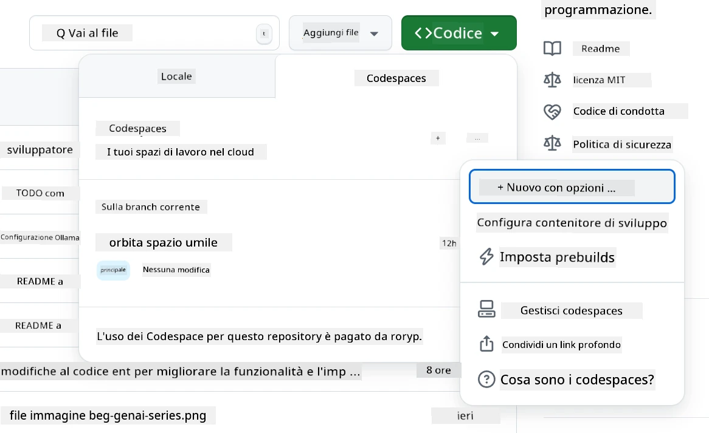
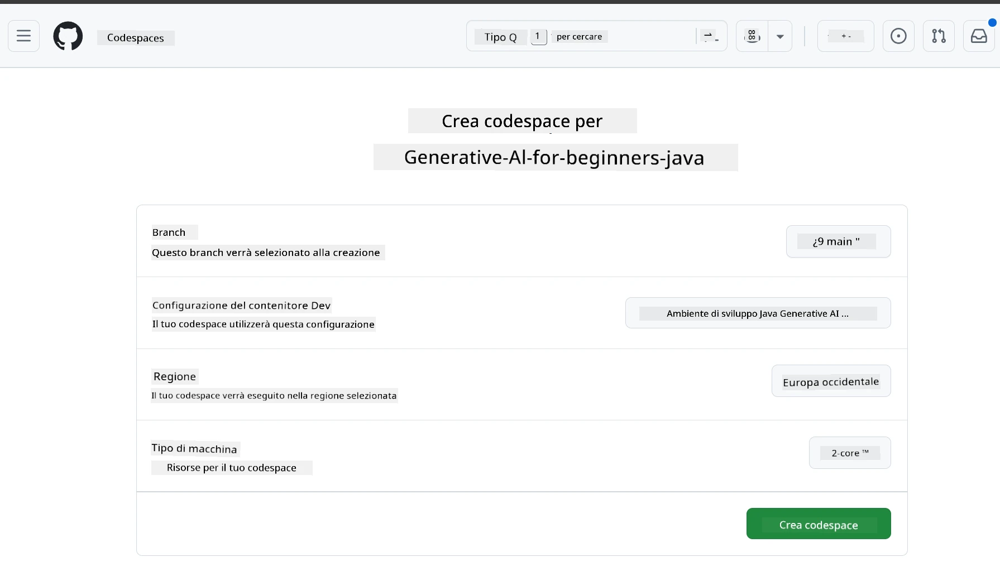
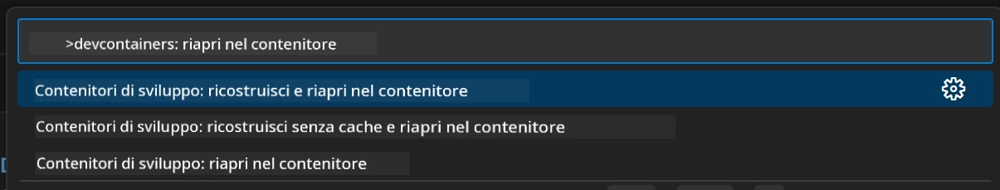
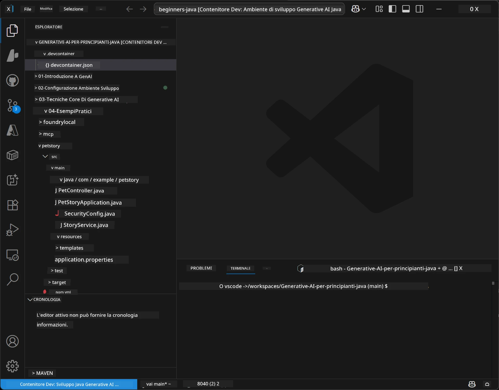
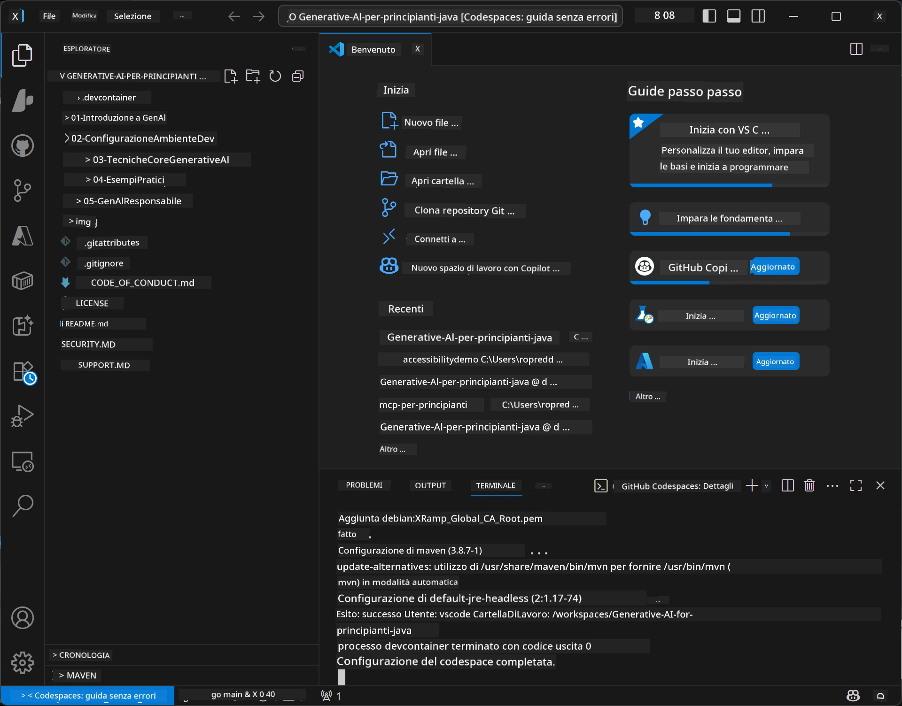

# Configurazione dell'ambiente di sviluppo per Generative AI per Java

> **Avvio rapido**: Codifica nel cloud in 2 minuti - Vai a [Configurazione di GitHub Codespaces](../../../02-SetupDevEnvironment) - nessuna installazione locale necessaria e utilizza i modelli github!

> **Interessato a Azure OpenAI?**, consulta la nostra [Guida di configurazione di Azure OpenAI](getting-started-azure-openai.md) con i passaggi per creare una nuova risorsa Azure OpenAI.

## Cosa imparerai

- Configurare un ambiente di sviluppo Java per applicazioni AI
- Scegliere e configurare il tuo ambiente di sviluppo preferito (cloud-first con Codespaces, contenitore di sviluppo locale o configurazione locale completa)
- Testare la configurazione connettendosi ai modelli GitHub

## Indice

- [Cosa imparerai](../../../02-SetupDevEnvironment)
- [Introduzione](../../../02-SetupDevEnvironment)
- [Passo 1: Configura il tuo ambiente di sviluppo](../../../02-SetupDevEnvironment)
  - [Opzione A: GitHub Codespaces (Consigliato)](../../../02-SetupDevEnvironment)
  - [Opzione B: Contenitore di sviluppo locale](../../../02-SetupDevEnvironment)
  - [Opzione C: Usa la tua installazione locale esistente](../../../02-SetupDevEnvironment)
- [Passo 2: Crea un token di accesso personale GitHub](../../../02-SetupDevEnvironment)
- [Passo 3: Testa la tua configurazione](../../../02-SetupDevEnvironment)
- [Risoluzione problemi](../../../02-SetupDevEnvironment)
- [Sommario](../../../02-SetupDevEnvironment)
- [Passi successivi](../../../02-SetupDevEnvironment)

## Introduzione

Questo capitolo ti guiderà nella configurazione di un ambiente di sviluppo. Utilizzeremo **GitHub Models** come esempio principale perché è gratuito, facile da configurare con solo un account GitHub, non richiede carta di credito e offre accesso a più modelli per la sperimentazione.

**Nessuna configurazione locale richiesta!** Puoi iniziare a programmare immediatamente usando GitHub Codespaces, che fornisce un ambiente di sviluppo completo nel tuo browser.


Raccomandiamo di utilizzare [**GitHub Models**](https://github.com/marketplace?type=models) per questo corso perché è:
- **Gratuito** per iniziare
- **Facile** da configurare con solo un account GitHub
- **Nessuna carta di credito** richiesta
- **Più modelli** disponibili per la sperimentazione

> **Nota**: I modelli GitHub usati in questa formazione hanno questi limiti gratuiti:
> - 15 richieste al minuto (150 al giorno)
> - ~8.000 parole in ingresso, ~4.000 parole in uscita per richiesta
> - 5 richieste concorrenti
> 
> Per uso in produzione, esegui l'upgrade ai modelli Azure AI Foundry con il tuo account Azure. Il codice non deve cambiare. Vedi la [documentazione Azure AI Foundry](https://learn.microsoft.com/azure/ai-foundry/foundry-models/how-to/quickstart-github-models).

## Passo 1: Configura il tuo ambiente di sviluppo

<a name="quick-start-cloud"></a>

Abbiamo creato un contenitore di sviluppo preconfigurato per minimizzare il tempo di configurazione e garantirti tutti gli strumenti necessari per questo corso Generative AI per Java. Scegli il tuo approccio di sviluppo preferito:

### Opzioni per configurare l'ambiente:

#### Opzione A: GitHub Codespaces (Consigliato)

**Inizia a programmare in 2 minuti - nessuna configurazione locale richiesta!**

1. Fai un fork di questo repository nel tuo account GitHub
   > **Nota**: Se vuoi modificare la configurazione base, dai un'occhiata a [Dev Container Configuration](../../../.devcontainer/devcontainer.json)
2. Clicca su **Code** → scheda **Codespaces** → **...** → **New with options...**
3. Usa i valori predefiniti – questo selezionerà la **configurazione del contenitore di sviluppo**: **Generative AI Java Development Environment** contenitore dev personalizzato creato per questo corso
4. Clicca su **Create codespace**
5. Attendi ~2 minuti che l'ambiente sia pronto
6. Prosegui a [Passo 2: Crea token GitHub](../../../02-SetupDevEnvironment)






> **Benefici di Codespaces**:
> - Nessuna installazione locale richiesta
> - Funziona su qualsiasi dispositivo con un browser
> - Preconfigurato con tutti gli strumenti e dipendenze
> - 60 ore gratuite al mese per account personali
> - Ambiente coerente per tutti gli studenti

#### Opzione B: Contenitore di sviluppo locale

**Per sviluppatori che preferiscono sviluppo locale con Docker**

1. Fai un fork e clona questo repository sulla tua macchina locale
   > **Nota**: Se vuoi modificare la configurazione base, dai un'occhiata a [Dev Container Configuration](../../../.devcontainer/devcontainer.json)
2. Installa [Docker Desktop](https://www.docker.com/products/docker-desktop/) e [VS Code](https://code.visualstudio.com/)
3. Installa l'[estensione Dev Containers](https://marketplace.visualstudio.com/items?itemName=ms-vscode-remote.remote-containers) in VS Code
4. Apri la cartella del repository in VS Code
5. Quando richiesto, clicca su **Reopen in Container** (o usa `Ctrl+Shift+P` → "Dev Containers: Reopen in Container")
6. Attendi che il contenitore venga buildato e avviato
7. Prosegui a [Passo 2: Crea token GitHub](../../../02-SetupDevEnvironment)





#### Opzione C: Usa la tua installazione locale esistente

**Per sviluppatori con ambienti Java esistenti**

Prerequisiti:
- [Java 21+](https://www.oracle.com/java/technologies/javase/jdk21-archive-downloads.html) 
- [Maven 3.9+](https://maven.apache.org/download.cgi)
- [VS Code](https://code.visualstudio.com) o il tuo IDE preferito

Passaggi:
1. Clona questo repository sulla tua macchina locale
2. Apri il progetto nel tuo IDE
3. Prosegui a [Passo 2: Crea token GitHub](../../../02-SetupDevEnvironment)

> **Consiglio professionale**: Se hai un computer con specifiche basse ma vuoi VS Code localmente, usa GitHub Codespaces! Puoi connettere il tuo VS Code locale a un Codespace ospitato nel cloud per il meglio di entrambi i mondi.



## Passo 2: Crea un token di accesso personale GitHub

1. Vai su [Impostazioni GitHub](https://github.com/settings/profile) e seleziona **Settings** dal menu del profilo.
2. Nella barra laterale sinistra, clicca su **Developer settings** (di solito in fondo).
3. Sotto **Personal access tokens**, clicca su **Fine-grained tokens** (o segui questo [link](https://github.com/settings/personal-access-tokens)).
4. Clicca su **Generate new token**.
5. Sotto "Token name", fornisci un nome descrittivo (es. `GenAI-Java-Course-Token`).
6. Imposta una data di scadenza (consigliato: 7 giorni per le migliori pratiche di sicurezza).
7. Sotto "Resource owner", seleziona il tuo account utente.
8. Sotto "Repository access", seleziona i repository che vuoi usare con GitHub Models (o "All repositories" se necessario).
9. Sotto "Account permissions", trova **Models** e impostalo su **Read-only**.
10. Clicca su **Generate token**.
11. **Copia e salva il tuo token ora** – non lo vedrai più!

> **Suggerimento di sicurezza**: Usa il minimo ambito necessario e la più breve durata pratica per i token di accesso.

## Passo 3: Testa la tua configurazione con l'esempio GitHub Models

Quando il tuo ambiente di sviluppo è pronto, testiamo l'integrazione con GitHub Models con la nostra applicazione di esempio in [`02-SetupDevEnvironment/examples/github-models`](../../../02-SetupDevEnvironment/examples/github-models).

1. Apri il terminale nel tuo ambiente di sviluppo.
2. Vai nella cartella dell'esempio GitHub Models:
   ```bash
   cd 02-SetupDevEnvironment/examples/github-models
   ```
3. Imposta il tuo token GitHub come variabile d'ambiente:
   ```bash
   # macOS/Linux
   export GITHUB_TOKEN=your_token_here
   
   # Windows (Prompt dei comandi)
   set GITHUB_TOKEN=your_token_here
   
   # Windows (PowerShell)
   $env:GITHUB_TOKEN="your_token_here"
   ```

4. Esegui l'applicazione:
   ```bash
   mvn compile exec:java -Dexec.mainClass="com.example.githubmodels.App"
   ```

Dovresti vedere un output simile a:
```text
Using model: gpt-4.1-nano
Sending request to GitHub Models...
Response: Hello World!
```

### Comprendere il codice di esempio

Prima, capiamo cosa abbiamo appena eseguito. L'esempio sotto `examples/github-models` usa l'SDK Java OpenAI per connettersi a GitHub Models:

**Cosa fa questo codice:**
- **Si connette** a GitHub Models usando il tuo token di accesso personale
- **Invia** un semplice messaggio "Say Hello World!" al modello AI
- **Riceve** e mostra la risposta dell'AI
- **Valida** che la tua configurazione funzioni correttamente

**Dipendenza chiave** (in `pom.xml`):
```xml
<dependency>
    <groupId>com.openai</groupId>
    <artifactId>openai-java</artifactId>
    <version>2.12.0</version>
</dependency>
```

**Codice principale** (`App.java`):
```java
// Connettersi a GitHub Models usando OpenAI Java SDK
OpenAIClient client = OpenAIOkHttpClient.builder()
    .apiKey(pat)
    .baseUrl("https://models.inference.ai.azure.com")
    .build();

// Creare richiesta completamento chat
ChatCompletionCreateParams params = ChatCompletionCreateParams.builder()
    .model(modelId)
    .addSystemMessage("You are a concise assistant.")
    .addUserMessage("Say Hello World!")
    .build();

// Ottenere risposta AI
ChatCompletion response = client.chat().completions().create(params);
System.out.println("Response: " + response.choices().get(0).message().content().orElse("No response content"));
```

## Sommario

Ottimo! Ora hai tutto configurato:

- Creato un token di accesso personale GitHub con i permessi corretti per l'accesso ai modelli AI
- Fatto partire il tuo ambiente di sviluppo Java (sia Codespaces, contenitori dev o locale)
- Collegato a GitHub Models usando l'SDK Java OpenAI per sviluppo AI gratuito
- Testato che tutto funzioni con un semplice esempio che comunica con i modelli AI

## Passi successivi

[Capitolo 3: Tecniche principali di Generative AI](../03-CoreGenerativeAITechniques/README.md)

## Risoluzione problemi

Hai problemi? Ecco problemi comuni e soluzioni:

- **Token non funziona?** 
  - Assicurati di aver copiato l'intero token senza spazi extra
  - Verifica che il token sia impostato correttamente come variabile d'ambiente
  - Controlla che il token abbia i permessi corretti (Models: Read-only)

- **Maven non trovato?** 
  - Se usi dev container/Codespaces, Maven dovrebbe essere preinstallato
  - Per configurazione locale, assicurati che Java 21+ e Maven 3.9+ siano installati
  - Prova `mvn --version` per verificare l'installazione

- **Problemi di connessione?** 
  - Controlla la tua connessione internet
  - Verifica che GitHub sia accessibile dalla tua rete
  - Assicurati di non essere dietro a un firewall che blocca l'endpoint GitHub Models

- **Contenitore dev non parte?** 
  - Verifica che Docker Desktop sia in esecuzione (per sviluppo locale)
  - Prova a ricostruire il contenitore: `Ctrl+Shift+P` → "Dev Containers: Rebuild Container"

- **Errori di compilazione applicazione?**
  - Assicurati di essere nella directory corretta: `02-SetupDevEnvironment/examples/github-models`
  - Prova a pulire e ricostruire: `mvn clean compile`

> **Hai bisogno di aiuto?**: Ancora problemi? Apri un issue nel repository e ti aiuteremo.

---

<!-- CO-OP TRANSLATOR DISCLAIMER START -->
**Avvertenza**:
Questo documento è stato tradotto utilizzando il servizio di traduzione automatica [Co-op Translator](https://github.com/Azure/co-op-translator). Pur impegnandoci per garantire l’accuratezza, si prega di considerare che le traduzioni automatiche possono contenere errori o inesattezze. Il documento originale nella sua lingua nativa deve essere considerato la fonte autorevole. Per informazioni critiche, si raccomanda una traduzione professionale effettuata da un traduttore umano. Non ci assumiamo alcuna responsabilità per eventuali fraintendimenti o interpretazioni errate derivanti dall’uso di questa traduzione.
<!-- CO-OP TRANSLATOR DISCLAIMER END -->