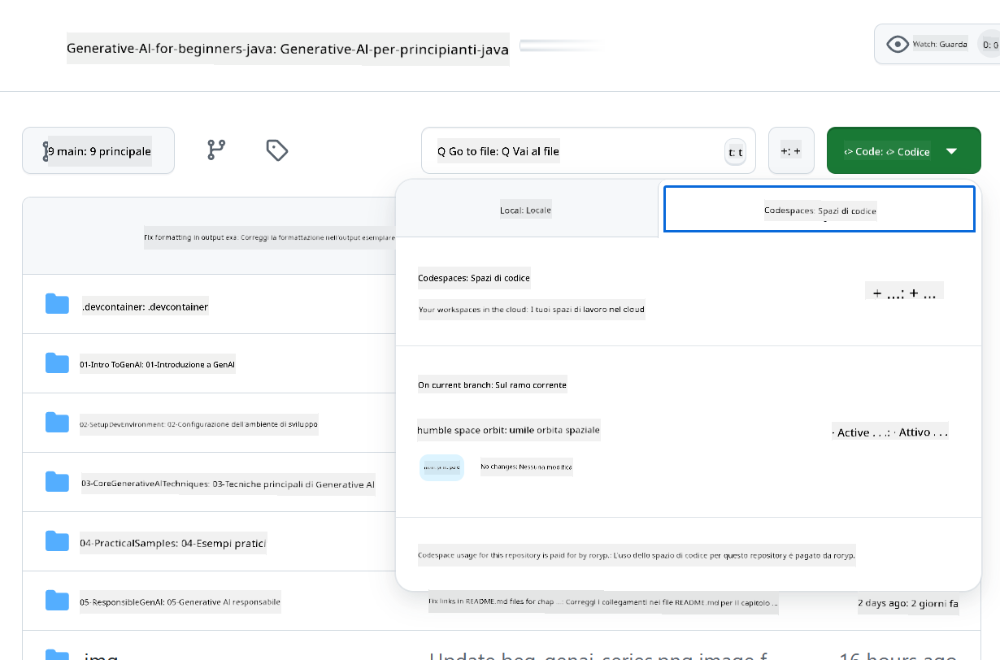

<!--
CO_OP_TRANSLATOR_METADATA:
{
  "original_hash": "bfdb4b4eadbee3a59ef742439f58326a",
  "translation_date": "2025-07-27T13:07:31+00:00",
  "source_file": "02-SetupDevEnvironment/getting-started-azure-openai.md",
  "language_code": "it"
}
-->
# Configurazione dell'Ambiente di Sviluppo per Azure OpenAI

> **Avvio Rapido**: Questa guida è per la configurazione di Azure OpenAI. Per iniziare subito con modelli gratuiti, utilizza [GitHub Models con Codespaces](./README.md#quick-start-cloud).

Questa guida ti aiuterà a configurare i modelli di Azure AI Foundry per le tue applicazioni Java AI in questo corso.

## Indice

- [Panoramica della Configurazione Rapida](../../../02-SetupDevEnvironment)
- [Passo 1: Crea Risorse Azure AI Foundry](../../../02-SetupDevEnvironment)
  - [Crea un Hub e un Progetto](../../../02-SetupDevEnvironment)
  - [Distribuisci il Modello GPT-4o-mini](../../../02-SetupDevEnvironment)
- [Passo 2: Crea il tuo Codespace](../../../02-SetupDevEnvironment)
- [Passo 3: Configura il tuo Ambiente](../../../02-SetupDevEnvironment)
- [Passo 4: Testa la tua Configurazione](../../../02-SetupDevEnvironment)
- [E poi?](../../../02-SetupDevEnvironment)
- [Risorse](../../../02-SetupDevEnvironment)
- [Risorse Aggiuntive](../../../02-SetupDevEnvironment)

## Panoramica della Configurazione Rapida

1. Crea risorse Azure AI Foundry (Hub, Progetto, Modello)
2. Crea un Codespace con un container di sviluppo Java
3. Configura il file .env con le credenziali di Azure OpenAI
4. Testa la configurazione con il progetto di esempio

## Passo 1: Crea Risorse Azure AI Foundry

### Crea un Hub e un Progetto

1. Vai al [Portale Azure AI Foundry](https://ai.azure.com/) e accedi
2. Clicca su **+ Crea** → **Nuovo hub** (o naviga su **Gestione** → **Tutti gli hub** → **+ Nuovo hub**)
3. Configura il tuo hub:
   - **Nome hub**: ad esempio, "MyAIHub"
   - **Sottoscrizione**: Seleziona la tua sottoscrizione Azure
   - **Gruppo di risorse**: Crea nuovo o seleziona uno esistente
   - **Località**: Scegli quella più vicina a te
   - **Account di archiviazione**: Usa quello predefinito o configura uno personalizzato
   - **Key vault**: Usa quello predefinito o configura uno personalizzato
   - Clicca su **Avanti** → **Rivedi + crea** → **Crea**
4. Una volta creato, clicca su **+ Nuovo progetto** (o **Crea progetto** dalla panoramica dell'hub)
   - **Nome progetto**: ad esempio, "GenAIJava"
   - Clicca su **Crea**

### Distribuisci il Modello GPT-4o-mini

1. Nel tuo progetto, vai su **Catalogo modelli** e cerca **gpt-4o-mini**
   - *Alternativa: Vai su **Distribuzioni** → **+ Crea distribuzione***
2. Clicca su **Distribuisci** sulla scheda del modello gpt-4o-mini
3. Configura la distribuzione:
   - **Nome distribuzione**: "gpt-4o-mini"
   - **Versione modello**: Usa l'ultima disponibile
   - **Tipo di distribuzione**: Standard
4. Clicca su **Distribuisci**
5. Una volta distribuito, vai alla scheda **Distribuzioni** e copia questi valori:
   - **Nome distribuzione** (ad esempio, "gpt-4o-mini")
   - **URI di destinazione** (ad esempio, `https://your-hub-name.openai.azure.com/`) 
      > **Importante**: Copia solo l'URL base (ad esempio, `https://myhub.openai.azure.com/`) e non l'intero percorso dell'endpoint.
   - **Chiave** (dalla sezione Chiavi e Endpoint)

> **Hai ancora problemi?** Visita la documentazione ufficiale [Azure AI Foundry Documentation](https://learn.microsoft.com/azure/ai-foundry/how-to/create-projects?tabs=ai-foundry&pivots=hub-project)

## Passo 2: Crea il tuo Codespace

1. Fai un fork di questo repository sul tuo account GitHub
   > **Nota**: Se vuoi modificare la configurazione di base, consulta la [Configurazione del Container di Sviluppo](../../../.devcontainer/devcontainer.json)
2. Nel tuo repository forkato, clicca su **Code** → scheda **Codespaces**
3. Clicca su **...** → **Nuovo con opzioni...**

4. Seleziona **Configurazione del container di sviluppo**: 
   - **Ambiente di Sviluppo Java Generative AI**
5. Clicca su **Crea codespace**

## Passo 3: Configura il tuo Ambiente

Una volta che il tuo Codespace è pronto, configura le credenziali di Azure OpenAI:

1. **Naviga al progetto di esempio dalla radice del repository:**
   ```bash
   cd 02-SetupDevEnvironment/examples/basic-chat-azure
   ```

2. **Crea il file .env:**
   ```bash
   cp .env.example .env
   ```

3. **Modifica il file .env con le credenziali di Azure OpenAI:**
   ```bash
   # Your Azure OpenAI API key (from Azure AI Foundry portal)
   AZURE_AI_KEY=your-actual-api-key-here
   
   # Your Azure OpenAI endpoint URL (e.g., https://myhub.openai.azure.com/)
   AZURE_AI_ENDPOINT=https://your-hub-name.openai.azure.com/
   ```

   > **Nota di Sicurezza**: 
   > - Non commettere mai il file `.env` nel controllo di versione
   > - Il file `.env` è già incluso in `.gitignore`
   > - Mantieni le tue chiavi API sicure e ruotale regolarmente

## Passo 4: Testa la tua Configurazione

Esegui l'applicazione di esempio per testare la connessione ad Azure OpenAI:

```bash
mvn clean spring-boot:run
```

Dovresti vedere una risposta dal modello GPT-4o-mini!

> **Utenti di VS Code**: Puoi anche premere `F5` in VS Code per eseguire l'applicazione. La configurazione di avvio è già impostata per caricare automaticamente il file `.env`.

> **Esempio completo**: Consulta [Esempio End-to-End Azure OpenAI](./examples/basic-chat-azure/README.md) per istruzioni dettagliate e risoluzione dei problemi.

## E poi?

**Configurazione completata!** Ora hai:
- Azure OpenAI con gpt-4o-mini distribuito
- Configurazione locale del file .env
- Ambiente di sviluppo Java pronto

**Continua con** [Capitolo 3: Tecniche Core di Generative AI](../03-CoreGenerativeAITechniques/README.md) per iniziare a costruire applicazioni AI!

## Risorse

- [Documentazione Azure AI Foundry](https://learn.microsoft.com/azure/ai-services/)
- [Documentazione Spring AI Azure OpenAI](https://docs.spring.io/spring-ai/reference/api/clients/azure-openai-chat.html)
- [SDK Java Azure OpenAI](https://learn.microsoft.com/java/api/overview/azure/ai-openai-readme)

## Risorse Aggiuntive

- [Scarica VS Code](https://code.visualstudio.com/Download)
- [Ottieni Docker Desktop](https://www.docker.com/products/docker-desktop)
- [Configurazione del Container di Sviluppo](../../../.devcontainer/devcontainer.json)

**Disclaimer (Avvertenza)**:  
Questo documento è stato tradotto utilizzando il servizio di traduzione automatica [Co-op Translator](https://github.com/Azure/co-op-translator). Sebbene ci impegniamo per garantire l'accuratezza, si prega di tenere presente che le traduzioni automatiche possono contenere errori o imprecisioni. Il documento originale nella sua lingua nativa dovrebbe essere considerato la fonte autorevole. Per informazioni critiche, si raccomanda una traduzione professionale effettuata da un traduttore umano. Non siamo responsabili per eventuali incomprensioni o interpretazioni errate derivanti dall'uso di questa traduzione.