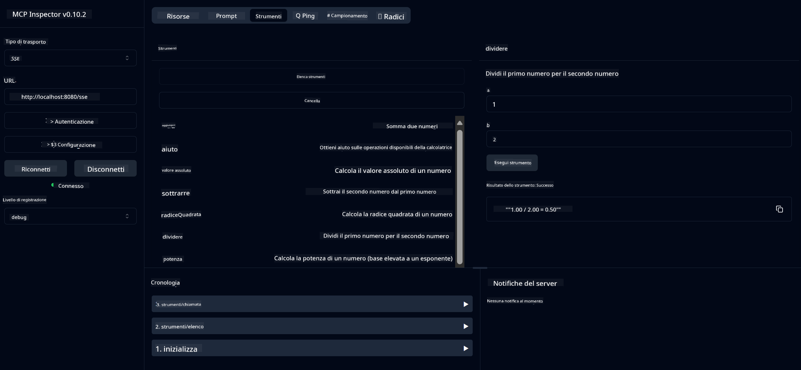

<!--
CO_OP_TRANSLATOR_METADATA:
{
  "original_hash": "5bd7a347d6ed1d706443f9129dd29dd9",
  "translation_date": "2025-07-25T09:25:06+00:00",
  "source_file": "04-PracticalSamples/mcp/calculator/README.md",
  "language_code": "it"
}
-->
# Servizio MCP Calcolatrice Base

>**Nota**: Questo capitolo include un [**Tutorial**](./TUTORIAL.md) che ti guida attraverso gli esempi.

Benvenuto alla tua prima esperienza pratica con il **Model Context Protocol (MCP)**! Nei capitoli precedenti, hai appreso i fondamenti dell'AI generativa e hai configurato il tuo ambiente di sviluppo. Ora è il momento di costruire qualcosa di pratico.

Questo servizio calcolatrice dimostra come i modelli AI possano interagire in modo sicuro con strumenti esterni utilizzando MCP. Invece di affidarsi alle capacità matematiche a volte inaffidabili del modello AI, ti mostreremo come costruire un sistema robusto in cui l'AI può chiamare servizi specializzati per calcoli accurati.

## Indice

- [Cosa Imparerai](../../../../../04-PracticalSamples/mcp/calculator)
- [Prerequisiti](../../../../../04-PracticalSamples/mcp/calculator)
- [Concetti Chiave](../../../../../04-PracticalSamples/mcp/calculator)
- [Avvio Rapido](../../../../../04-PracticalSamples/mcp/calculator)
- [Operazioni Disponibili della Calcolatrice](../../../../../04-PracticalSamples/mcp/calculator)
- [Client di Test](../../../../../04-PracticalSamples/mcp/calculator)
  - [1. Client MCP Diretto (SDKClient)](../../../../../04-PracticalSamples/mcp/calculator)
  - [2. Client Potenziato dall'AI (LangChain4jClient)](../../../../../04-PracticalSamples/mcp/calculator)
- [MCP Inspector (Interfaccia Web)](../../../../../04-PracticalSamples/mcp/calculator)
  - [Istruzioni Passo-Passo](../../../../../04-PracticalSamples/mcp/calculator)

## Cosa Imparerai

Lavorando su questo esempio, comprenderai:
- Come creare servizi compatibili con MCP utilizzando Spring Boot
- La differenza tra comunicazione diretta tramite protocollo e interazione potenziata dall'AI
- Come i modelli AI decidono quando e come utilizzare strumenti esterni
- Le migliori pratiche per costruire applicazioni AI abilitate agli strumenti

Perfetto per principianti che vogliono apprendere i concetti di MCP e sono pronti a costruire la loro prima integrazione di strumenti AI!

## Prerequisiti

- Java 21+
- Maven 3.6+
- **Token GitHub**: Necessario per il client potenziato dall'AI. Se non lo hai ancora configurato, consulta [Capitolo 2: Configurazione dell'ambiente di sviluppo](../../../02-SetupDevEnvironment/README.md) per le istruzioni.

## Concetti Chiave

**Model Context Protocol (MCP)** è un modo standardizzato per le applicazioni AI di connettersi in modo sicuro a strumenti esterni. Pensalo come un "ponte" che permette ai modelli AI di utilizzare servizi esterni come la nostra calcolatrice. Invece di far eseguire i calcoli direttamente al modello AI (che può essere inaffidabile), esso può chiamare il nostro servizio calcolatrice per ottenere risultati accurati. MCP garantisce che questa comunicazione avvenga in modo sicuro e coerente.

**Eventi Inviati dal Server (SSE)** abilitano la comunicazione in tempo reale tra il server e i client. A differenza delle richieste HTTP tradizionali, dove si invia una richiesta e si attende una risposta, SSE permette al server di inviare aggiornamenti continui al client. Questo è perfetto per applicazioni AI dove le risposte potrebbero essere trasmesse o richiedere tempo per essere elaborate.

**Strumenti AI e Chiamata di Funzioni** permettono ai modelli AI di scegliere automaticamente e utilizzare funzioni esterne (come le operazioni della calcolatrice) basandosi sulle richieste degli utenti. Quando chiedi "Quanto fa 15 + 27?", il modello AI capisce che vuoi eseguire un'addizione, chiama automaticamente il nostro strumento `add` con i parametri corretti (15, 27) e restituisce il risultato in linguaggio naturale. L'AI agisce come un coordinatore intelligente che sa quando e come utilizzare ogni strumento.

## Avvio Rapido

### 1. Vai alla directory dell'applicazione calcolatrice
```bash
cd Generative-AI-for-beginners-java/04-PracticalSamples/mcp/calculator
```

### 2. Compila ed Esegui
```bash
mvn clean install -DskipTests
java -jar target/calculator-server-0.0.1-SNAPSHOT.jar
```

### 3. Testa con i Client
- **SDKClient**: Interazione diretta con il protocollo MCP
- **LangChain4jClient**: Interazione in linguaggio naturale potenziata dall'AI (richiede token GitHub)

## Operazioni Disponibili della Calcolatrice

- `add(a, b)`, `subtract(a, b)`, `multiply(a, b)`, `divide(a, b)`
- `power(base, exponent)`, `squareRoot(number)`, `absolute(number)`
- `modulus(a, b)`, `help()`

## Client di Test

### 1. Client MCP Diretto (SDKClient)
Testa la comunicazione grezza tramite protocollo MCP. Esegui con:
```bash
mvn test-compile exec:java -Dexec.mainClass="com.microsoft.mcp.sample.client.SDKClient" -Dexec.classpathScope=test
```

### 2. Client Potenziato dall'AI (LangChain4jClient)
Dimostra l'interazione in linguaggio naturale con i modelli GitHub. Richiede il token GitHub (vedi [Prerequisiti](../../../../../04-PracticalSamples/mcp/calculator)).

**Esegui:**
```bash
mvn test-compile exec:java -Dexec.mainClass="com.microsoft.mcp.sample.client.LangChain4jClient" -Dexec.classpathScope=test
```

## MCP Inspector (Interfaccia Web)

MCP Inspector fornisce un'interfaccia web visiva per testare il tuo servizio MCP senza scrivere codice. Perfetto per principianti che vogliono capire come funziona MCP!

### Istruzioni Passo-Passo:

1. **Avvia il server della calcolatrice** (se non è già in esecuzione):
   ```bash
   java -jar target/calculator-server-0.0.1-SNAPSHOT.jar
   ```

2. **Installa ed esegui MCP Inspector** in un nuovo terminale:
   ```bash
   npx @modelcontextprotocol/inspector
   ```

3. **Apri l'interfaccia web**:
   - Cerca un messaggio come "Inspector running at http://localhost:6274"
   - Apri quell'URL nel tuo browser web

4. **Connettiti al tuo servizio calcolatrice**:
   - Nell'interfaccia web, imposta il tipo di trasporto su "SSE"
   - Imposta l'URL su: `http://localhost:8080/sse`
   - Clicca sul pulsante "Connect"

5. **Esplora gli strumenti disponibili**:
   - Clicca su "List Tools" per vedere tutte le operazioni della calcolatrice
   - Vedrai funzioni come `add`, `subtract`, `multiply`, ecc.

6. **Testa un'operazione della calcolatrice**:
   - Seleziona uno strumento (es. "add")
   - Inserisci i parametri (es. `a: 15`, `b: 27`)
   - Clicca su "Run Tool"
   - Visualizza il risultato restituito dal tuo servizio MCP!

Questo approccio visivo ti aiuta a comprendere esattamente come funziona la comunicazione MCP prima di costruire i tuoi client.



---
**Riferimento:** [Documentazione MCP Server Boot Starter](https://docs.spring.io/spring-ai/reference/api/mcp/mcp-server-boot-starter-docs.html)

**Disclaimer**:  
Questo documento è stato tradotto utilizzando il servizio di traduzione automatica [Co-op Translator](https://github.com/Azure/co-op-translator). Sebbene ci impegniamo per garantire l'accuratezza, si prega di notare che le traduzioni automatiche possono contenere errori o imprecisioni. Il documento originale nella sua lingua nativa dovrebbe essere considerato la fonte autorevole. Per informazioni critiche, si raccomanda una traduzione professionale effettuata da un traduttore umano. Non siamo responsabili per eventuali fraintendimenti o interpretazioni errate derivanti dall'uso di questa traduzione.