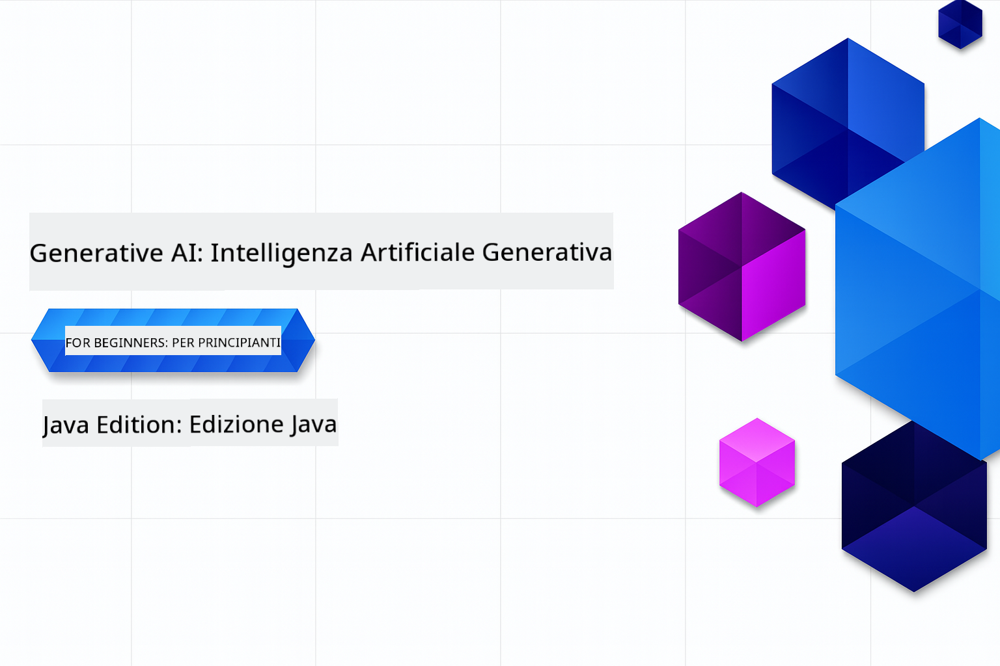

<!--
CO_OP_TRANSLATOR_METADATA:
{
  "original_hash": "a49b35508745c032a0033d914df7901b",
  "translation_date": "2025-07-25T09:23:44+00:00",
  "source_file": "README.md",
  "language_code": "it"
}
-->
# Intelligenza Artificiale Generativa per Principianti - Edizione Java

**Tempo Richiesto**: L'intero workshop può essere completato online senza configurazione locale. Se desideri eseguire gli esempi, l'impostazione dell'ambiente richiede 2 minuti, mentre l'esplorazione degli esempi richiede da 1 a 3 ore a seconda della profondità di esplorazione.

> **Avvio Rapido**

1. Fai un fork di questo repository sul tuo account GitHub
2. Clicca su **Code** → scheda **Codespaces** → **...** → **New with options...**
3. Usa le impostazioni predefinite – questo selezionerà il container di sviluppo creato per questo corso
4. Clicca su **Create codespace**
5. Aspetta circa 2 minuti affinché l'ambiente sia pronto
6. Vai direttamente a [Creare il tuo Token Modelli GitHub](./02-SetupDevEnvironment/README.md#step-2-create-a-github-personal-access-token)

## Supporto Multilingue

### Supportato tramite GitHub Action (Automatizzato e Sempre Aggiornato)

[Francese](../fr/README.md) | [Spagnolo](../es/README.md) | [Tedesco](../de/README.md) | [Russo](../ru/README.md) | [Arabo](../ar/README.md) | [Persiano (Farsi)](../fa/README.md) | [Urdu](../ur/README.md) | [Cinese (Semplificato)](../zh/README.md) | [Cinese (Tradizionale, Macao)](../mo/README.md) | [Cinese (Tradizionale, Hong Kong)](../hk/README.md) | [Cinese (Tradizionale, Taiwan)](../tw/README.md) | [Giapponese](../ja/README.md) | [Coreano](../ko/README.md) | [Hindi](../hi/README.md) | [Bengalese](../bn/README.md) | [Marathi](../mr/README.md) | [Nepalese](../ne/README.md) | [Punjabi (Gurmukhi)](../pa/README.md) | [Portoghese (Portogallo)](../pt/README.md) | [Portoghese (Brasile)](../br/README.md) | [Italiano](./README.md) | [Polacco](../pl/README.md) | [Turco](../tr/README.md) | [Greco](../el/README.md) | [Thailandese](../th/README.md) | [Svedese](../sv/README.md) | [Danese](../da/README.md) | [Norvegese](../no/README.md) | [Finlandese](../fi/README.md) | [Olandese](../nl/README.md) | [Ebraico](../he/README.md) | [Vietnamita](../vi/README.md) | [Indonesiano](../id/README.md) | [Malese](../ms/README.md) | [Tagalog (Filippino)](../tl/README.md) | [Swahili](../sw/README.md) | [Ungherese](../hu/README.md) | [Ceco](../cs/README.md) | [Slovacco](../sk/README.md) | [Rumeno](../ro/README.md) | [Bulgaro](../bg/README.md) | [Serbo (Cirillico)](../sr/README.md) | [Croato](../hr/README.md) | [Sloveno](../sl/README.md) | [Ucraino](../uk/README.md) | [Birmano (Myanmar)](../my/README.md)

## Struttura del Corso e Percorso di Apprendimento

### **Capitolo 1: Introduzione all'Intelligenza Artificiale Generativa**
- **Concetti Fondamentali**: Comprendere i Modelli Linguistici di Grandi Dimensioni, i token, gli embedding e le capacità dell'IA
- **Ecosistema Java per l'IA**: Panoramica su Spring AI e OpenAI SDK
- **Protocollo del Contesto del Modello**: Introduzione a MCP e al suo ruolo nella comunicazione degli agenti IA
- **Applicazioni Pratiche**: Scenari reali, inclusi chatbot e generazione di contenuti
- **[→ Inizia il Capitolo 1](./01-IntroToGenAI/README.md)**

### **Capitolo 2: Configurazione dell'Ambiente di Sviluppo**
- **Configurazione Multi-Provider**: Configura GitHub Models, Azure OpenAI e le integrazioni con OpenAI Java SDK
- **Spring Boot + Spring AI**: Best practice per lo sviluppo di applicazioni IA aziendali
- **GitHub Models**: Accesso gratuito ai modelli IA per prototipazione e apprendimento (senza necessità di carta di credito)
- **Strumenti di Sviluppo**: Configurazione di container Docker, VS Code e GitHub Codespaces
- **[→ Inizia il Capitolo 2](./02-SetupDevEnvironment/README.md)**

### **Capitolo 3: Tecniche Fondamentali di Intelligenza Artificiale Generativa**
- **Prompt Engineering**: Tecniche per ottenere risposte ottimali dai modelli IA
- **Embedding e Operazioni sui Vettori**: Implementa ricerca semantica e corrispondenza di similarità
- **Generazione Aumentata dal Recupero (RAG)**: Combina l'IA con le tue fonti di dati
- **Chiamata di Funzioni**: Estendi le capacità dell'IA con strumenti e plugin personalizzati
- **[→ Inizia il Capitolo 3](./03-CoreGenerativeAITechniques/README.md)**

### **Capitolo 4: Applicazioni Pratiche e Progetti**
- **Generatore di Storie per Animali Domestici** (`petstory/`): Generazione creativa di contenuti con GitHub Models
- **Demo Locale Foundry** (`foundrylocal/`): Integrazione di modelli IA locali con OpenAI Java SDK
- **Servizio Calcolatrice MCP** (`mcp/calculator/`): Implementazione base del Protocollo del Contesto del Modello con Spring AI
- **[→ Inizia il Capitolo 4](./04-PracticalSamples/README.md)**

### **Capitolo 5: Sviluppo Responsabile dell'IA**
- **Sicurezza di GitHub Models**: Testa i filtri di contenuto integrati e i meccanismi di sicurezza
- **Demo di IA Responsabile**: Esempio pratico che mostra come funzionano i filtri di sicurezza dell'IA
- **Best Practice**: Linee guida essenziali per uno sviluppo e una distribuzione etica dell'IA
- **[→ Inizia il Capitolo 5](./05-ResponsibleGenAI/README.md)**

## Risorse Aggiuntive

- [AI Agents For Beginners](https://github.com/microsoft/ai-agents-for-beginners)
- [Intelligenza Artificiale Generativa per Principianti con .NET](https://github.com/microsoft/Generative-AI-for-beginners-dotnet)
- [Intelligenza Artificiale Generativa per Principianti con JavaScript](https://github.com/microsoft/generative-ai-with-javascript)
- [Intelligenza Artificiale Generativa per Principianti](https://github.com/microsoft/generative-ai-for-beginners)
- [ML per Principianti](https://aka.ms/ml-beginners)
- [Data Science per Principianti](https://aka.ms/datascience-beginners)
- [IA per Principianti](https://aka.ms/ai-beginners)
- [Cybersecurity per Principianti](https://github.com/microsoft/Security-101)
- [Sviluppo Web per Principianti](https://aka.ms/webdev-beginners)
- [IoT per Principianti](https://aka.ms/iot-beginners)
- [Sviluppo XR per Principianti](https://github.com/microsoft/xr-development-for-beginners)
- [Mastering GitHub Copilot per la Programmazione Assistita dall'IA](https://aka.ms/GitHubCopilotAI)
- [Mastering GitHub Copilot per Sviluppatori C#/.NET](https://github.com/microsoft/mastering-github-copilot-for-dotnet-csharp-developers)
- [Scegli la Tua Avventura con Copilot](https://github.com/microsoft/CopilotAdventures)
- [App Chat RAG con Servizi Azure AI](https://github.com/Azure-Samples/azure-search-openai-demo-java)

**Disclaimer**:  
Questo documento è stato tradotto utilizzando il servizio di traduzione automatica [Co-op Translator](https://github.com/Azure/co-op-translator). Sebbene ci impegniamo per garantire l'accuratezza, si prega di notare che le traduzioni automatiche possono contenere errori o imprecisioni. Il documento originale nella sua lingua nativa dovrebbe essere considerato la fonte autorevole. Per informazioni critiche, si raccomanda una traduzione professionale effettuata da un traduttore umano. Non siamo responsabili per eventuali incomprensioni o interpretazioni errate derivanti dall'uso di questa traduzione.