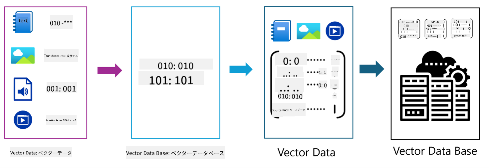

<!--
CO_OP_TRANSLATOR_METADATA:
{
  "original_hash": "75bfb080ca725e8a9aa9c80cae25fba1",
  "translation_date": "2025-07-29T08:32:15+00:00",
  "source_file": "01-IntroToGenAI/README.md",
  "language_code": "ja"
}
-->
# ジェネレーティブAI入門 - Java版

## 学べること

- **ジェネレーティブAIの基礎**：LLM、プロンプトエンジニアリング、トークン、埋め込み、ベクターデータベースなど
- **Java向けAI開発ツールの比較**：Azure OpenAI SDK、Spring AI、OpenAI Java SDK
- **モデルコンテキストプロトコル**とAIエージェント間の通信における役割

## 目次

- [はじめに](../../../01-IntroToGenAI)
- [ジェネレーティブAIの基本概念の復習](../../../01-IntroToGenAI)
- [プロンプトエンジニアリングのレビュー](../../../01-IntroToGenAI)
- [トークン、埋め込み、エージェント](../../../01-IntroToGenAI)
- [Java向けAI開発ツールとライブラリ](../../../01-IntroToGenAI)
  - [OpenAI Java SDK](../../../01-IntroToGenAI)
  - [Spring AI](../../../01-IntroToGenAI)
  - [Azure OpenAI Java SDK](../../../01-IntroToGenAI)
- [まとめ](../../../01-IntroToGenAI)
- [次のステップ](../../../01-IntroToGenAI)

## はじめに

「ジェネレーティブAI入門 - Java版」の第1章へようこそ！この基礎的なレッスンでは、ジェネレーティブAIのコアコンセプトと、それをJavaで活用する方法を紹介します。LLM（大規模言語モデル）、トークン、埋め込み、AIエージェントなど、AIアプリケーションの基本的な構成要素について学びます。また、このコースを通じて使用する主要なJavaツールについても探ります。

### ジェネレーティブAIの基本概念の復習

ジェネレーティブAIは、データから学習したパターンや関係性に基づいて、新しいテキスト、画像、コードなどのコンテンツを生成する人工知能の一種です。ジェネレーティブAIモデルは、人間のような応答を生成したり、文脈を理解したり、時には人間らしいコンテンツを作成することもできます。

JavaでAIアプリケーションを開発する際には、**ジェネレーティブAIモデル**を活用してコンテンツを生成します。ジェネレーティブAIモデルの主な機能には以下のようなものがあります：

- **テキスト生成**：チャットボット、コンテンツ作成、テキスト補完のための人間らしいテキストの作成
- **画像生成と分析**：リアルな画像の生成、写真の強化、物体検出
- **コード生成**：コードスニペットやスクリプトの作成

特定のタスクに最適化されたモデルも存在します。例えば、**小規模言語モデル（SLM）**や**大規模言語モデル（LLM）**はテキスト生成を扱うことができ、LLMは通常、複雑なタスクにおいてより優れたパフォーマンスを発揮します。画像関連のタスクには、専門のビジョンモデルやマルチモーダルモデルを使用します。

もちろん、これらのモデルの応答が常に完璧であるとは限りません。モデルが「幻覚」を起こし、誤った情報を権威あるように生成することがあるという話を聞いたことがあるかもしれません。しかし、明確な指示や文脈を提供することで、モデルがより良い応答を生成するのを助けることができます。これが**プロンプトエンジニアリング**の役割です。

#### プロンプトエンジニアリングのレビュー

プロンプトエンジニアリングとは、AIモデルを望ましい出力に導くための効果的な入力を設計する技術です。これには以下が含まれます：

- **明確さ**：指示を明確かつ曖昧さのないものにする
- **文脈**：必要な背景情報を提供する
- **制約**：制限やフォーマットを指定する

プロンプトエンジニアリングのベストプラクティスには、プロンプト設計、明確な指示、タスクの分解、ワンショット学習と少数ショット学習、プロンプトチューニングが含まれます。特定のユースケースに最適なプロンプトを見つけるためには、さまざまなプロンプトをテストすることが重要です。

アプリケーションを開発する際には、以下の異なるプロンプトタイプを使用します：
- **システムプロンプト**：モデルの動作の基本ルールと文脈を設定
- **ユーザープロンプト**：アプリケーションユーザーからの入力データ
- **アシスタントプロンプト**：システムプロンプトとユーザープロンプトに基づくモデルの応答

> **詳細を学ぶ**：[ジェネレーティブAI入門コースのプロンプトエンジニアリング章](https://github.com/microsoft/generative-ai-for-beginners/tree/main/04-prompt-engineering-fundamentals)でさらに学べます。

#### トークン、埋め込み、エージェント

ジェネレーティブAIモデルを扱う際には、**トークン**、**埋め込み**、**エージェント**、**モデルコンテキストプロトコル（MCP）**といった用語に出会います。これらの概念について詳しく見ていきましょう：

- **トークン**：トークンは、モデル内でのテキストの最小単位です。単語、文字、またはサブワードで構成されることがあります。トークンは、モデルが理解できる形式でテキストデータを表現するために使用されます。例えば、「The quick brown fox jumped over the lazy dog」という文は、トークン化戦略によって["The", " quick", " brown", " fox", " jumped", " over", " the", " lazy", " dog"]や["The", " qu", "ick", " br", "own", " fox", " jump", "ed", " over", " the", " la", "zy", " dog"]のようにトークン化されることがあります。

トークン化は、テキストをこれらの小さな単位に分割するプロセスです。これは、モデルが生のテキストではなくトークンを操作するため、非常に重要です。プロンプト内のトークン数は、モデルの応答の長さや品質に影響を与えます。モデルにはコンテキストウィンドウのトークン制限があり（例：GPT-4では128Kトークンが最大）、入力と出力の両方が含まれます。

  Javaでは、OpenAI SDKなどのライブラリを使用して、AIモデルへのリクエスト送信時にトークン化を自動的に処理できます。

- **埋め込み**：埋め込みは、トークンの意味を捉えたベクトル表現です。数値表現（通常は浮動小数点数の配列）であり、モデルが単語間の関係を理解し、文脈的に関連性のある応答を生成できるようにします。類似した単語は類似した埋め込みを持ち、モデルが同義語や意味的な関係を理解するのを可能にします。

  Javaでは、OpenAI SDKや他の埋め込み生成をサポートするライブラリを使用して埋め込みを生成できます。これらの埋め込みは、意味検索のようなタスクに不可欠であり、正確なテキストの一致ではなく意味に基づいて類似したコンテンツを見つけることができます。

- **ベクターデータベース**：ベクターデータベースは、埋め込みに最適化された特殊なストレージシステムです。効率的な類似性検索を可能にし、意味的な類似性に基づいて大規模なデータセットから関連情報を見つける必要があるRAG（Retrieval-Augmented Generation）パターンにおいて重要です。

> **注**：このコースではベクターデータベースを扱いませんが、実際のアプリケーションでよく使用されるため、言及する価値があります。

- **エージェントとMCP**：モデル、ツール、外部システムと自律的にやり取りするAIコンポーネントです。モデルコンテキストプロトコル（MCP）は、エージェントが外部データソースやツールに安全にアクセスするための標準化された方法を提供します。詳細は[初心者向けMCPコース](https://github.com/microsoft/mcp-for-beginners)で学べます。

JavaのAIアプリケーションでは、トークンをテキスト処理に、埋め込みを意味検索やRAGに、ベクターデータベースをデータ検索に、MCPを使用したエージェントをインテリジェントなツール利用システムの構築に活用します。

### Java向けAI開発ツールとライブラリ

JavaはAI開発に優れたツールを提供します。このコースを通じて、OpenAI Java SDK、Azure OpenAI SDK、Spring AIの3つの主要なライブラリを探ります。

以下は、各章の例で使用されるSDKを示した参考表です：

| 章 | サンプル | SDK |
|----|---------|-----|
| 02-SetupDevEnvironment | github-models | OpenAI Java SDK |
| 02-SetupDevEnvironment | basic-chat-azure | Spring AI Azure OpenAI |
| 03-CoreGenerativeAITechniques | examples | Azure OpenAI SDK |
| 04-PracticalSamples | petstory | OpenAI Java SDK |
| 04-PracticalSamples | foundrylocal | OpenAI Java SDK |
| 04-PracticalSamples | calculator | Spring AI MCP SDK + LangChain4j |

**SDKドキュメントリンク：**
- [Azure OpenAI Java SDK](https://github.com/Azure/azure-sdk-for-java/tree/azure-ai-openai_1.0.0-beta.16/sdk/openai/azure-ai-openai)
- [Spring AI](https://docs.spring.io/spring-ai/reference/)
- [OpenAI Java SDK](https://github.com/openai/openai-java)
- [LangChain4j](https://docs.langchain4j.dev/)

#### OpenAI Java SDK

OpenAI SDKは、OpenAI APIの公式Javaライブラリです。OpenAIのモデルとやり取りするためのシンプルで一貫性のあるインターフェースを提供し、JavaアプリケーションにAI機能を簡単に統合できます。第2章のGitHub Modelsの例、第4章のPet StoryアプリケーションとFoundry Localの例では、OpenAI SDKのアプローチを示しています。

#### Spring AI

Spring AIは、SpringアプリケーションにAI機能をもたらす包括的なフレームワークで、さまざまなAIプロバイダーにわたる一貫した抽象化レイヤーを提供します。Springエコシステムとシームレスに統合されており、AI機能を必要とするエンタープライズJavaアプリケーションに最適です。

Spring AIの強みは、Springエコシステムとのシームレスな統合にあり、依存性注入、構成管理、テストフレームワークなどの馴染みのあるSpringパターンを使用して、実運用向けのAIアプリケーションを簡単に構築できます。第2章と第4章では、Spring AIを使用して、OpenAIとモデルコンテキストプロトコル（MCP）の両方を活用するアプリケーションを構築します。

##### モデルコンテキストプロトコル（MCP）

[モデルコンテキストプロトコル（MCP）](https://modelcontextprotocol.io/)は、AIアプリケーションが外部データソースやツールと安全にやり取りすることを可能にする新しい標準です。MCPは、AIモデルが文脈情報にアクセスし、アプリケーション内でアクションを実行するための標準化された方法を提供します。

第4章では、Spring AIを使用して、モデルコンテキストプロトコルの基本を示すシンプルなMCP電卓サービスを構築し、基本的なツール統合とサービスアーキテクチャの作成方法を学びます。

#### Azure OpenAI Java SDK

Azure OpenAIクライアントライブラリ for Javaは、OpenAIのREST APIをAzure SDKエコシステムと統合したものです。第3章では、Azure OpenAI SDKを使用して、チャットアプリケーション、関数呼び出し、RAG（Retrieval-Augmented Generation）パターンを含むアプリケーションを構築します。

> 注：Azure OpenAI SDKは、機能面でOpenAI Java SDKに遅れをとっています。そのため、将来のプロジェクトではOpenAI Java SDKの使用を検討してください。

## まとめ

これで基礎は終了です！以下の内容を理解しました：

- ジェネレーティブAIのコアコンセプト：LLM、プロンプトエンジニアリング、トークン、埋め込み、ベクターデータベース
- Java向けAI開発ツールキットの選択肢：Azure OpenAI SDK、Spring AI、OpenAI Java SDK
- モデルコンテキストプロトコルとは何か、そしてAIエージェントが外部ツールと連携する方法

## 次のステップ

[第2章：開発環境のセットアップ](../02-SetupDevEnvironment/README.md)

**免責事項**:  
この文書は、AI翻訳サービス [Co-op Translator](https://github.com/Azure/co-op-translator) を使用して翻訳されています。正確性を追求しておりますが、自動翻訳には誤りや不正確な部分が含まれる可能性があります。元の言語で記載された原文が正式な情報源と見なされるべきです。重要な情報については、専門の人間による翻訳を推奨します。この翻訳の利用に起因する誤解や誤認について、当方は一切の責任を負いません。