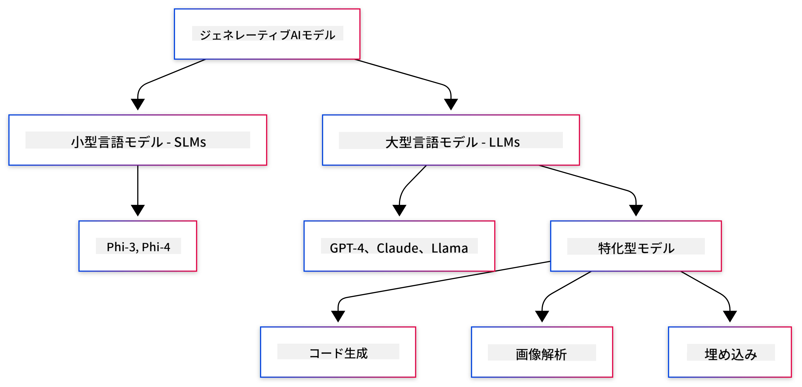
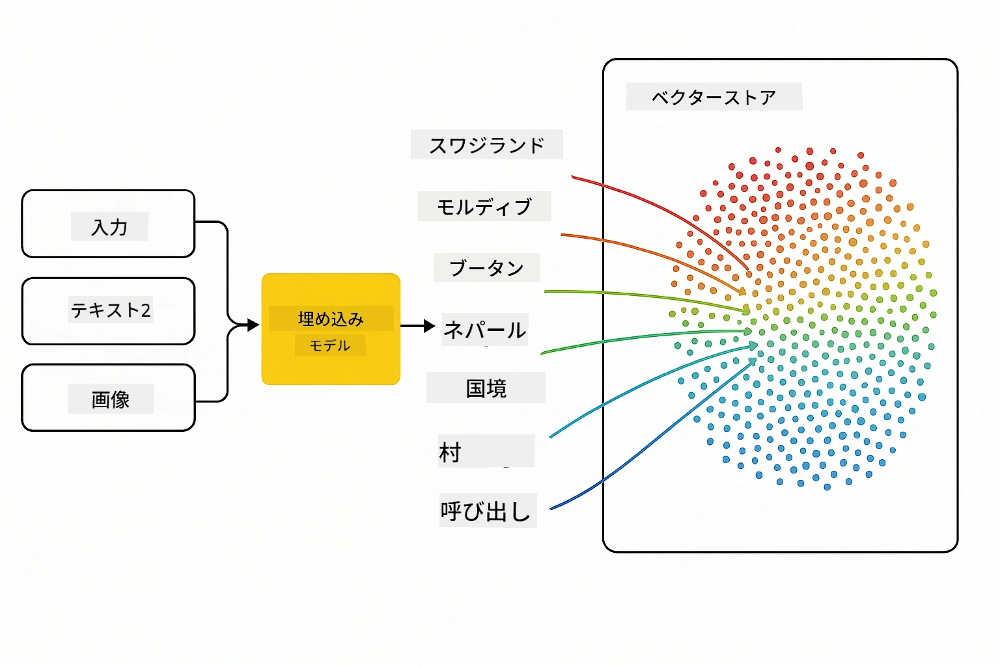
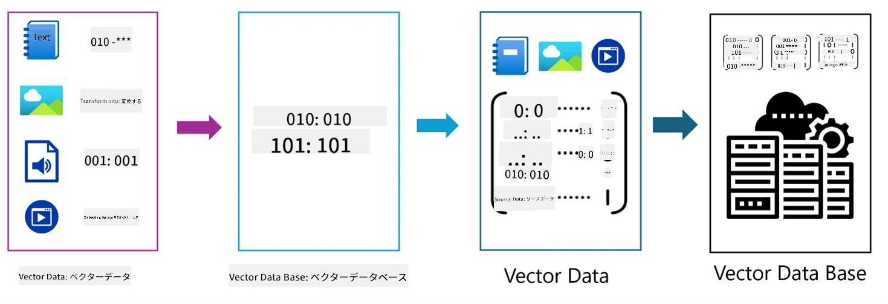
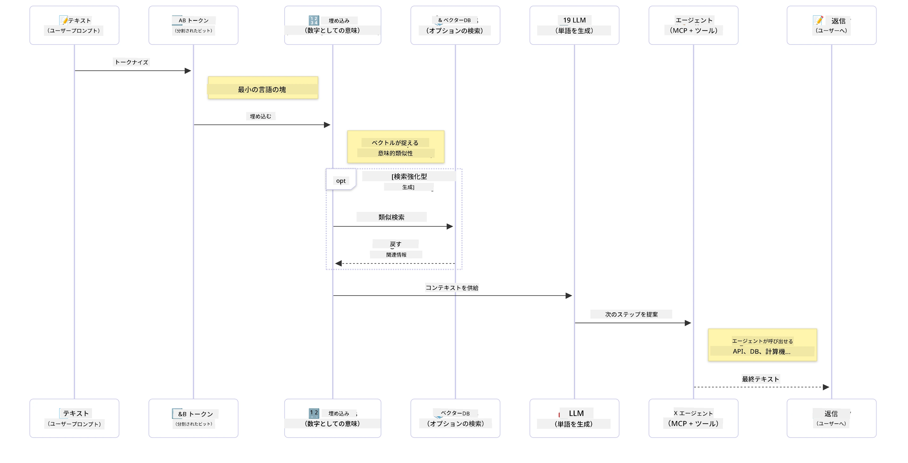

# ジェネレーティブAI入門 - Javaエディション

> <strong>動画</strong>: [このレッスンの動画概要をYouTubeで視聴する](https://www.youtube.com/watch?v=XH46tGp_eSw)。上のサムネイル画像をクリックしても視聴できます。

## 本章で学ぶこと

- LLM、プロンプトエンジニアリング、トークン、埋め込み、ベクターデータベースなどの<strong>ジェネレーティブAIの基本</strong>
- Azure OpenAI SDK、Spring AI、OpenAI Java SDKなど<strong>Java向けAI開発ツールの比較</strong>
- AIエージェント間通信に関わる<strong>Model Context Protocolの理解</strong>

## 目次

- [はじめに](#はじめに)
- [ジェネレーティブAIの基本概念を素早く復習](#ジェネレーティブaiの基本概念を素早く復習)
- [プロンプトエンジニアリングの復習](#プロンプトエンジニアリングの復習)
- [トークン、埋め込み、エージェント](#トークン、埋め込み、エージェント)
- [Java向けAI開発ツールとライブラリ](#java向けai開発ツールとライブラリ)
  - [OpenAI Java SDK](#openai-java-sdk)
  - [Spring AI](#spring-ai)
  - [Azure OpenAI Java SDK](#azure-openai-java-sdk)
- [まとめ](#まとめ)
- [次のステップ](#次のステップ)

## はじめに

ジェネレーティブAI初心者向け - Javaエディションの第一章へようこそ！この基本編のレッスンでは、ジェネレーティブAIの核心となる概念をJavaでどう扱うかを紹介します。大規模言語モデル（LLM）、トークン、埋め込み、AIエージェントといったAIアプリケーションの基本要素を学びます。また、このコースを通じて使用する主要なJava向けツール類も見ていきます。

### ジェネレーティブAIの基本概念を素早く復習

ジェネレーティブAIは、テキストや画像、コードなどの新しいコンテンツを、データから学んだパターンや関係性に基づいて生成する人工知能の一種です。ジェネレーティブAIモデルは、人間らしい応答を生成し、文脈を理解し、ときには人間が作ったかのようなコンテンツを作り出します。

JavaでAIアプリケーションを開発するときは、<strong>ジェネレーティブAIモデル</strong>を使ってコンテンツを生成します。ジェネレーティブAIモデルの主な能力には次のようなものがあります：

- <strong>テキスト生成</strong>：チャットボットの応答やコンテンツ、文章補完を人間らしく作成
- <strong>画像生成・解析</strong>：リアルな画像の生成、写真の強化、物体検出
- <strong>コード生成</strong>：コードスニペットやスクリプトの作成

モデルにはそれぞれ得意分野があり、たとえば<strong>小規模言語モデル（SLM）</strong>も<strong>大規模言語モデル（LLM）</strong>もテキスト生成が可能ですが、LLMの方が複雑なタスクをより得意とします。画像タスクには専用のビジョンモデルやマルチモーダルモデルが使われます。

もちろん、モデルの応答が常に完璧なわけではありません。モデルが誤った情報を正確そうに生成してしまう「幻覚（hallucination）」という現象も聞いたことがあるかもしれません。しかし、モデルに明確な指示や文脈を与えることで、より良い応答を生み出すように導けます。これが<strong>プロンプトエンジニアリング</strong>の役割です。

#### プロンプトエンジニアリングの復習

プロンプトエンジニアリングは、AIモデルが望ましい出力を生成するように効果的な入力設計を行う技術です。具体的には：

- <strong>明瞭さ</strong>：指示を分かりやすく、曖昧さなく伝える
- <strong>文脈</strong>：必要な背景情報を含める
- <strong>制約</strong>：フォーマットや制限事項を指定する

プロンプト設計、明確な指示、タスクの分解、ワンショット・フューショット学習、プロンプトチューニングなど、さまざまなベストプラクティスがあります。異なるプロンプトを試し、用途に最適なものを見つけることが重要です。

アプリケーション開発では、次のようなプロンプトタイプを扱います：

- <strong>システムプロンプト</strong>：モデルの振る舞いの基本ルールや文脈を設定
- <strong>ユーザープロンプト</strong>：アプリケーションの利用者からの入力データ
- <strong>アシスタントプロンプト</strong>：システムとユーザーのプロンプトに基づくモデルの応答

> <strong>詳細はこちら</strong>：[Prompt Engineering chapter of GenAI for Beginners course](https://github.com/microsoft/generative-ai-for-beginners/tree/main/04-prompt-engineering-fundamentals)

#### トークン、埋め込み、エージェント

ジェネレーティブAIモデルを扱う際には、<strong>トークン</strong>、<strong>埋め込み</strong>、<strong>エージェント</strong>、そして<strong>Model Context Protocol (MCP)</strong>といった用語が出てきます。これらの概念を詳しく説明します：

- <strong>トークン</strong>：モデルが理解するテキストの最小単位です。単語、文字、サブワードのいずれかになります。トークンはテキストデータをモデルが扱える形式に変換したものです。例えば、「The quick brown fox jumped over the lazy dog」という文は、トークン化戦略により["The", " quick", " brown", " fox", " jumped", " over", " the", " lazy", " dog"]や["The", " qu", "ick", " br", "own", " fox", " jump", "ed", " over", " the", " la", "zy", " dog"]に分解されます。

トークン化は、このようにテキストを細かい単位に分割するプロセスです。モデルは生のテキストではなくトークン単位で動作するため、重要な処理です。プロンプト内のトークン数はモデルの応答長や質に影響を与え、モデルには処理可能なトークンの上限があります（例：GPT-4oの最大128Kトークンは入出力合計）。

  JavaではOpenAI SDKなどのライブラリを使って、AIモデルへのリクエスト時に自動でトークン化を行えます。

- **埋め込み (Embeddings)**：トークンを意味的に表現したベクトルです。通常は浮動小数点数の配列で、単語間の関係性を捉え、モデルが文脈から関連する応答を生成できるようにします。意味が似た単語は類似した埋め込みになります。

  JavaではOpenAI SDKや埋め込み生成対応のライブラリで埋め込みを作成できます。埋め込みは意味検索など、「正確な文言」ではなく「意味に基づいた」類似コンテンツ発見に役立ちます。

- <strong>ベクターデータベース</strong>：埋め込みの保管と類似検索に特化したストレージです。大規模データセットから意味的に関連する情報を検索するRetrieval-Augmented Generation（RAG）パターンで重要です。

> <strong>注意</strong>: 本コースではベクターデータベースの詳細は扱いませんが、実務でよく利用されるため言及しました。

- **エージェント＆MCP**：モデルやツール、外部システムを自律的に利用するAIコンポーネントです。Model Context Protocol (MCP)は、エージェントが安全に外部データやツールへアクセスする標準的な方法を提供します。詳しくは[Model Context Protocol初心者向けコース](https://github.com/microsoft/mcp-for-beginners)をご覧ください。

JavaのAIアプリケーションでは、テキスト処理にトークン、意味検索やRAGに埋め込み、データ検索にベクターデータベース、知的振る舞いを実現するエージェントにMCPを活用します。

### Java向けAI開発ツールとライブラリ

JavaはAI開発のための優れたツールを提供しています。本コースで扱う主要なライブラリはOpenAI Java SDK、Azure OpenAI SDK、Spring AIの3つです。

各章でどのSDKを使うかの早見表は以下の通りです：

| 章 | サンプル | SDK |
|---------|--------|-----|
| 02-SetupDevEnvironment | github-models | OpenAI Java SDK |
| 02-SetupDevEnvironment | basic-chat-azure | Spring AI Azure OpenAI |
| 03-CoreGenerativeAITechniques | examples | Azure OpenAI SDK |
| 04-PracticalSamples | petstory | OpenAI Java SDK |
| 04-PracticalSamples | foundrylocal | OpenAI Java SDK |
| 04-PracticalSamples | calculator | Spring AI MCP SDK + LangChain4j |

**SDKドキュメントのリンク：**
- [Azure OpenAI Java SDK](https://github.com/Azure/azure-sdk-for-java/tree/azure-ai-openai_1.0.0-beta.16/sdk/openai/azure-ai-openai)
- [Spring AI](https://docs.spring.io/spring-ai/reference/)
- [OpenAI Java SDK](https://github.com/openai/openai-java)
- [LangChain4j](https://docs.langchain4j.dev/)

#### OpenAI Java SDK

OpenAI SDKはOpenAI APIのための公式Javaライブラリです。OpenAIのモデルと簡単かつ一貫したインターフェースでやり取りでき、JavaアプリへのAI機能組み込みを容易にします。第2章のGitHubモデル例、第4章のペットストーリーやFoundry LocalアプリがOpenAI SDK活用例です。

#### Spring AI

Spring AIはSpringアプリにAIを統合するための包括的フレームワークで、異なるAIプロバイダー間で共通の抽象化レイヤーを提供します。Springエコシステムに自然に組み込めるため、エンタープライズのJavaアプリに適した選択肢です。

Spring AIは依存性注入、設定管理、テストなど馴染みのあるSpringパターンを活かしつつ、実用的かつ生産性の高いAIアプリを構築しやすいのが特徴です。第2章と第4章ではOpenAIとMCPを利用するSpring AIライブラリを使います。

##### Model Context Protocol (MCP)

[Model Context Protocol (MCP)](https://modelcontextprotocol.io/)は、AIアプリケーションが外部データソースやツールと安全に連携するための新しい標準です。MCPを使うことで、AIモデルが文脈情報を得たりアクションを実行したりできます。

第4章ではSpring AIでMCPを使ったシンプルな計算機サービスを作り、基本的なツール連携やサービス設計の考え方を示します。

#### Azure OpenAI Java SDK

Azure OpenAIクライアントライブラリはOpenAIのREST APIをAzure SDKスマートな形にしたもので、Java向けに馴染みやすく統合されています。第3章ではAzure OpenAI SDKを使い、チャットアプリ、関数呼び出し、RAGパターンを含むアプリケーションを作成します。

> 注意：Azure OpenAI SDKは機能面でOpenAI Java SDKに遅れをとっているため、今後のプロジェクトではOpenAI Java SDKの活用を検討してください。

## まとめ

基礎の説明は以上です。以下のことが分かりました：

- ジェネレーティブAIの重要コンセプト（LLM、プロンプトエンジニアリング、トークン、埋め込み、ベクターデータベース）
- Java向けAI開発のためのツール選択肢（Azure OpenAI SDK、Spring AI、OpenAI Java SDK）
- Model Context Protocolの仕組みと、AIエージェントが外部ツールと連携する流れ

## 次のステップ

[第2章: 開発環境のセットアップ](../02-SetupDevEnvironment/README.md)

---

<!-- CO-OP TRANSLATOR DISCLAIMER START -->
**免責事項**:  
本書類はAI翻訳サービス [Co-op Translator](https://github.com/Azure/co-op-translator) を使用して翻訳されています。正確性を期していますが、自動翻訳には誤りや不正確な部分が含まれる可能性があることをご承知おきください。原文のオリジナル言語のドキュメントが正式な情報源とみなされます。重要な情報については、専門の人間翻訳を推奨します。本翻訳の利用によって生じた誤解や誤訳について、当方は責任を負いかねます。
<!-- CO-OP TRANSLATOR DISCLAIMER END -->